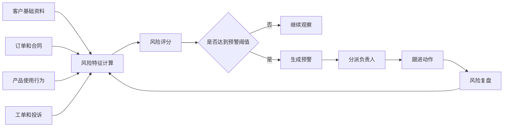
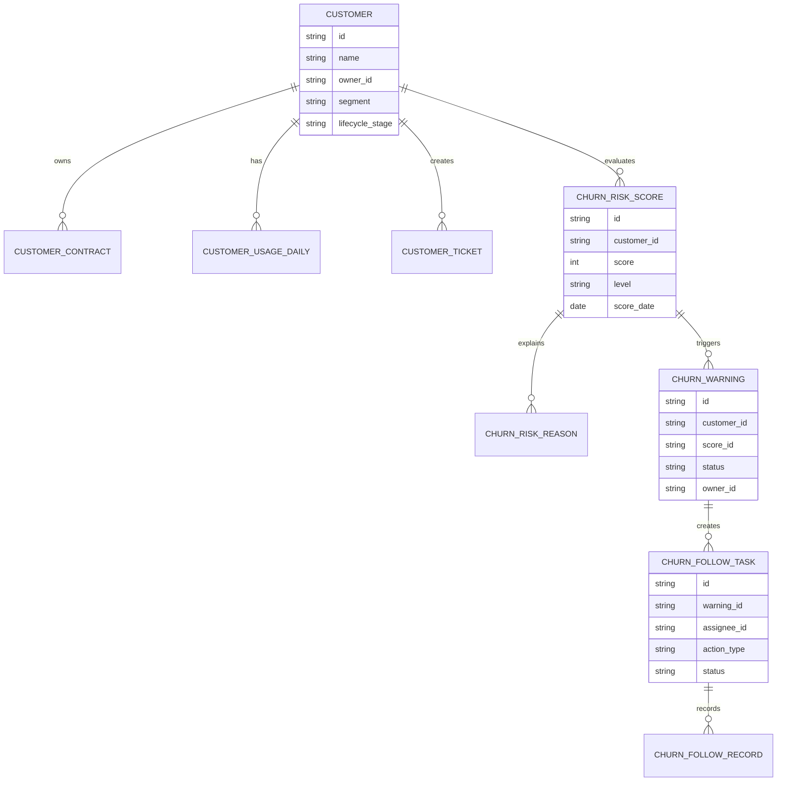
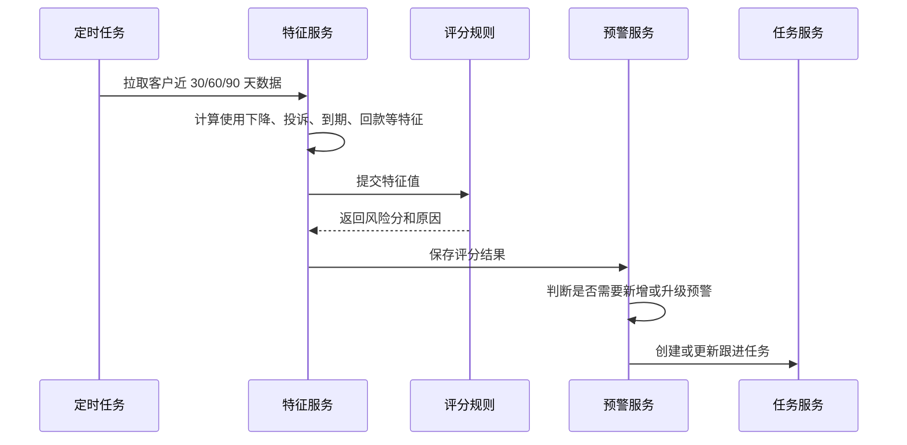
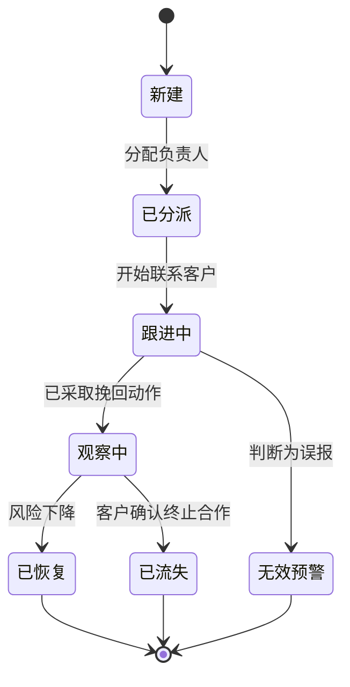
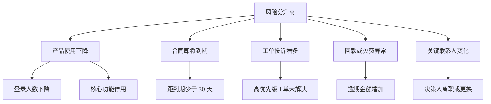

# 客户流失预警项目案例

## 适合谁看

如果你已经做过客户列表、CRM、客户成功平台或经营看板，但不清楚“客户快要流失”应该怎么判断、怎么提醒、怎么跟进，可以从这个案例开始。

这个项目的重点不是做一个漂亮的分数，而是把分散在订单、合同、使用、工单、拜访和回款里的信号合在一起，让业务人员能提前发现风险，并把风险处理过程沉淀下来。

## 业务目标

客户流失预警要回答四个问题：

1. 哪些客户正在变危险？
2. 为什么危险？
3. 谁应该处理？
4. 处理后有没有变好？

实际项目中，预警系统最怕两件事：一是规则太粗，导致每天一堆误报；二是只展示风险，不推动任何跟进行动。一个可落地的流失预警系统，必须同时包含风险识别、原因解释、任务派发、跟进记录和效果复盘。

## 客户流失预警链路

这张图说明了一个关键点：流失预警不是单次计算，而是一个不断回写的闭环。跟进后的结果会反过来修正规则、分数和阈值。

## 核心概念

| 概念 | 含义 | 初学者理解 |
| --- | --- | --- |
| 客户流失 | 客户不再续费、不再下单、不再使用或主动解约 | 客户从“还在合作”变成“不想继续合作” |
| 风险信号 | 能说明客户可能流失的行为或事实 | 比如登录变少、投诉变多、合同快到期 |
| 风险评分 | 把多个风险信号换算成一个分数 | 分数越高，越需要关注 |
| 预警阈值 | 触发提醒的分数线 | 超过这条线就创建预警 |
| 风险原因 | 系统认为客户危险的具体原因 | 业务人员不能只看分数，必须知道为什么 |
| 挽回任务 | 给客户成功、销售或客服的处理动作 | 预警最终要变成可执行任务 |

## 数据模型

这套模型的核心是把“评分”和“预警”分开。评分可以每天算一次，预警只在满足条件时生成，避免同一个客户每天产生重复任务。

## 推荐表结构

| 表 | 作用 | 关键字段 |
| --- | --- | --- |
| `customer` | 客户主档 | 客户名称、负责人、客户分层、生命周期阶段 |
| `customer_usage_daily` | 产品使用快照 | 登录次数、核心功能使用次数、活跃用户数 |
| `customer_ticket` | 工单投诉数据 | 工单类型、严重程度、是否超时、满意度 |
| `churn_risk_score` | 每次风险计算结果 | 客户、分数、等级、计算日期、模型版本 |
| `churn_risk_reason` | 风险原因明细 | 原因类型、原因值、贡献分、解释文案 |
| `churn_warning` | 预警主记录 | 客户、状态、负责人、触发时间、关闭原因 |
| `churn_follow_task` | 跟进任务 | 处理人、动作类型、截止时间、处理状态 |
| `churn_follow_record` | 跟进记录 | 沟通内容、客户反馈、下一步动作 |

## 风险评分流程

这个流程建议用定时任务实现。初期不用上复杂机器学习模型，先用可解释规则做 MVP，更容易让业务方接受。

## 预警状态设计

状态不要只设计“处理中”和“已关闭”。流失预警通常需要观察期，否则业务人员刚打完电话就关闭预警，系统无法判断挽回是否真正有效。

## 风险原因拆解

原因拆解要能直接展示给业务人员。不要只输出“模型判断风险高”，而要告诉他“使用下降 62%、合同 20 天后到期、近 7 天有 3 个未解决投诉”。

## 前端页面拆分

| 页面 | 核心内容 | 设计建议 |
| --- | --- | --- |
| 流失风险看板 | 高风险客户数、风险等级分布、行业/区域分布 | 用趋势和分布帮助主管看整体风险 |
| 预警列表 | 客户、分数、等级、原因、负责人、状态 | 默认按风险等级和更新时间排序 |
| 预警详情 | 客户画像、风险原因、历史评分、跟进记录 | 详情页要让处理人不用跳多个系统 |
| 跟进任务 | 待处理、即将超时、已完成、需复盘 | 任务要有明确截止时间 |
| 规则配置 | 风险因子、权重、阈值、适用客户范围 | 初期只开放给运营或管理员 |
| 复盘报表 | 挽回率、误报率、平均处理时长 | 用来优化规则，不只是展示结果 |

## 接口拆分建议

| 接口 | 说明 |
| --- | --- |
| `GET /api/churn/dashboard` | 获取流失风险总览 |
| `GET /api/churn/warnings` | 查询预警列表，支持等级、状态、负责人筛选 |
| `GET /api/churn/warnings/:id` | 获取预警详情 |
| `POST /api/churn/warnings/:id/assign` | 分派或转派负责人 |
| `POST /api/churn/warnings/:id/follow-records` | 新增跟进记录 |
| `POST /api/churn/warnings/:id/close` | 关闭预警并填写原因 |
| `GET /api/churn/rules` | 查询风险规则 |
| `PUT /api/churn/rules/:id` | 修改风险因子权重或阈值 |

## 实际项目常见问题

### 1. 风险分很高，但业务说客户根本不会流失

通常是规则没有区分客户类型。例如大客户有固定采购周期，短期不登录不代表流失；小客户如果连续两周不登录，风险可能很高。

解决方式：

- 按客户分层设置不同阈值。
- 按行业、合同类型、产品版本区分规则。
- 在预警详情里展示原因，允许业务标记“误报”。
- 定期统计误报原因，用来调整规则。

### 2. 每天重复生成同一批预警

这是没有做预警去重。评分可以每天计算，但预警应该按客户和风险类型合并。

解决方式：

- 同一客户存在未关闭预警时，只更新分数和原因，不新建预警。
- 风险等级升高时记录升级事件。
- 风险等级降低时进入观察期，不要立即关闭。
- 只有已关闭后再次达到阈值，才生成新一轮预警。

### 3. 业务只看列表，不处理任务

说明系统只做了“发现问题”，没有把问题变成工作流。

解决方式：

- 给预警设置负责人和截止时间。
- 高风险预警自动升级给主管。
- 处理动作必须结构化，例如电话沟通、方案调整、续费优惠、产品培训。
- 报表统计每个团队的处理率、超时率和挽回率。

### 4. 风险原因太多，页面看不懂

风险原因不是越多越好。一个客户可能命中几十个指标，但页面只应该展示最重要的几个。

解决方式：

- 原因按贡献分排序。
- 只展示 Top 3 到 Top 5。
- 把相近原因合并成一类，例如“使用下降”下面再展开明细。
- 提供“查看全部证据”，但默认收起。

### 5. 规则调整后历史数据对不上

如果覆盖旧评分，会导致业务复盘时不知道当时为什么预警。

解决方式：

- 每次计算记录规则版本。
- 风险原因保存当时的文案和贡献分。
- 规则变更后只影响新评分。
- 如果需要重算历史评分，单独标记为“回放结果”。

## 权限与审计

| 权限点 | 控制原因 |
| --- | --- |
| 查看全部预警 | 主管或运营可以看全局风险 |
| 查看本人客户预警 | 销售、客户成功只能看自己负责的客户 |
| 分派预警 | 防止普通成员随意转移责任 |
| 修改风险规则 | 规则影响业务优先级，必须限制 |
| 关闭预警 | 关闭原因要保留审计 |
| 导出客户风险 | 涉及客户敏感经营数据 |

审计日志要记录规则修改、负责人变更、状态变更、关闭原因和导出操作。客户流失数据通常会影响团队考核，不能只保存在前端状态里。

## 验收清单

- 能按客户维度生成风险评分。
- 每个风险分都能看到可解释原因。
- 同一客户不会每天重复生成相同预警。
- 高风险客户能自动创建跟进任务。
- 预警状态能完整表达新建、分派、跟进、观察、恢复、流失和误报。
- 能统计误报率、挽回率、处理时长和超时率。
- 规则变更有版本记录和审计日志。

## 下一步学习

- [客户成功平台项目案例](/projects/customer-success-case)
- [客户生命周期价值分析项目案例](/projects/customer-lifetime-value-analysis-case)
- [CRM 销售管理项目案例](/projects/crm-sales-management-case)
- [真实项目问题库](/projects/real-world-issues)
