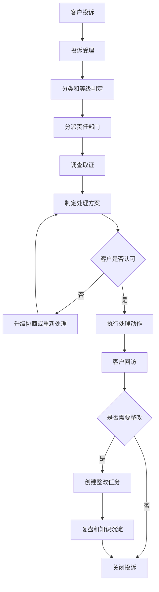
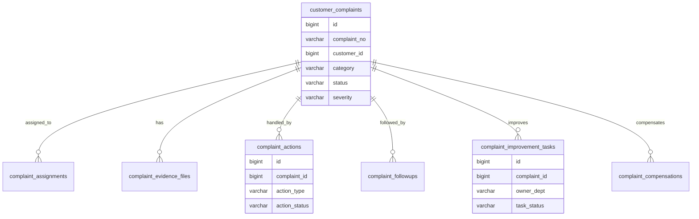
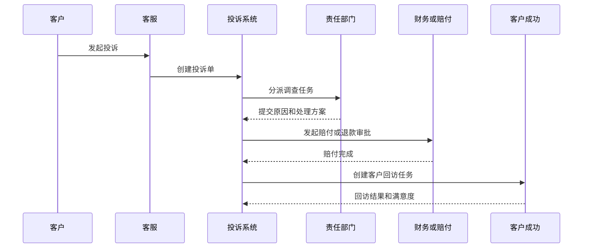

# 客户投诉闭环项目案例

## 适合谁看

适合需要做客户投诉受理、投诉分级、责任判定、处理协同、客户回访、赔付补偿、整改复盘和满意度分析的开发者。

客户投诉闭环不是“新建一条投诉记录”。真实项目里，投诉会连接客服工单、售后服务、订单、合同、质检、仓储物流、财务赔付和客户成功。系统要能回答：客户为什么投诉、谁负责处理、是否超时、处理结果客户是否认可、问题是否复发、是否沉淀为整改动作。

## 业务目标

第一版客户投诉闭环支持：

- 多渠道创建投诉，包括客服、客户门户、销售代录入和售后回访。
- 投诉分类、等级、紧急程度和影响范围识别。
- 自动分派责任部门和处理人。
- 支持调查、协同、处理方案、客户确认和回访。
- 支持补偿、退款、重发、维修、服务升级等处理动作。
- 支持投诉升级、超时预警和领导督办。
- 支持整改任务、复盘、知识库沉淀和重复投诉识别。
- 支持投诉看板、满意度分析和责任归因。

## 客户投诉闭环链路

客户投诉的关键是“闭环”。受理、处理、回访、整改、复盘缺一环，投诉就会停留在客服记录层，无法真正改善产品和服务。

## 核心概念

| 概念 | 说明 | 示例 |
| --- | --- | --- |
| 投诉单 | 客户对产品、服务或流程提出的不满 | 配送延误投诉 |
| 投诉分类 | 投诉问题所属领域 | 产品质量、服务态度、账单 |
| 投诉等级 | 投诉严重程度 | 一般、重要、重大 |
| 责任部门 | 需要调查或处理的部门 | 仓储、售后、财务 |
| 处理方案 | 面向客户的解决方式 | 退款、补发、赔付 |
| 客户确认 | 客户对处理结果的认可 | 回访满意 |
| 整改任务 | 面向内部流程的改进动作 | 修改质检规则 |
| 重复投诉 | 同类问题再次出现 | 同客户多次投诉发票错误 |

投诉单和客服工单可以关联，但不要完全等同。客服工单偏沟通，投诉闭环偏责任、结果和改进。

## 数据模型

## 推荐表结构

| 表 | 作用 | 关键字段 |
| --- | --- | --- |
| `customer_complaints` | 投诉主表 | `complaint_no`、`customer_id`、`source_channel`、`category`、`severity`、`status` |
| `complaint_assignments` | 分派记录 | `complaint_id`、`owner_dept`、`owner_id`、`assigned_at`、`due_at` |
| `complaint_evidence_files` | 投诉证据 | `complaint_id`、`file_id`、`evidence_type`、`uploaded_by` |
| `complaint_action_plans` | 处理方案 | `complaint_id`、`plan_type`、`expected_cost`、`approval_status` |
| `complaint_actions` | 处理动作 | `complaint_id`、`action_type`、`source_order_id`、`action_status` |
| `complaint_compensations` | 赔付补偿 | `complaint_id`、`compensation_type`、`amount`、`payment_status` |
| `complaint_followups` | 客户回访 | `complaint_id`、`satisfaction_level`、`feedback`、`followed_at` |
| `complaint_improvement_tasks` | 整改任务 | `complaint_id`、`root_cause`、`owner_dept`、`due_date`、`status` |
| `complaint_sla_logs` | SLA 记录 | `complaint_id`、`sla_type`、`deadline_at`、`breached` |

投诉单要保存分类和等级快照。后续分类规则变化时，历史投诉仍要能解释当时为什么这样分级。

## 投诉处理流程

投诉处理不应只依赖客服。客服负责沟通，责任部门负责调查和整改，财务负责金额类动作，客户成功负责高价值客户的关系恢复。

## 投诉状态设计

| 状态 | 含义 | 注意点 |
| --- | --- | --- |
| 待受理 | 投诉已进入系统 | 需要确认客户和问题 |
| 待分派 | 分类完成等待责任人 | 超时要提醒 |
| 处理中 | 责任部门调查和处理 | 记录过程 |
| 待客户确认 | 方案已执行等待客户反馈 | 支持多次回访 |
| 升级中 | 客户不认可或影响重大 | 升级管理层 |
| 整改中 | 内部改进任务未完成 | 不影响客户处理关闭 |
| 已关闭 | 客户处理和内部记录完成 | 保存关闭原因 |
| 已复发 | 同类问题再次出现 | 触发复盘 |

客户侧闭环和内部整改闭环可以分开。客户已满意不代表内部流程已经改完。

## 前端页面拆分

| 页面或组件 | 作用 | 注意点 |
| --- | --- | --- |
| 投诉工作台 | 查看待受理、超时、升级投诉 | 按等级和 SLA 排序 |
| 投诉登记 | 创建投诉并关联客户、订单、工单 | 支持多渠道来源 |
| 投诉详情 | 展示客户、证据、处理、赔付、回访 | 形成完整证据链 |
| 分派处理 | 责任部门接单和反馈原因 | 支持协同部门 |
| 处理方案 | 制定退款、补发、维修、赔付方案 | 金额类动作走审批 |
| 客户回访 | 记录满意度和未解决点 | 可重新打开 |
| 整改任务 | 跟踪根因、责任人和截止时间 | 支持复盘 |
| 投诉看板 | 分析分类、等级、超时、满意度 | 支持部门归因 |

投诉详情页要避免把所有信息塞成流水列表。建议按“客户问题、处理进度、证据材料、责任调查、赔付动作、整改复盘”分区。

## 接口拆分建议

| 接口 | 作用 | 注意点 |
| --- | --- | --- |
| `POST /customer-complaints` | 创建投诉 | 校验客户、来源和重复投诉 |
| `POST /customer-complaints/{id}/assign` | 分派投诉 | 保存责任部门和 SLA |
| `POST /customer-complaints/{id}/evidence` | 上传证据 | 支持图片、录音、附件 |
| `POST /customer-complaints/{id}/plans` | 提交处理方案 | 金额类方案触发审批 |
| `POST /customer-complaints/{id}/actions` | 执行处理动作 | 关联退款、补发、维修等单据 |
| `POST /customer-complaints/{id}/followups` | 客户回访 | 保存满意度 |
| `POST /customer-complaints/{id}/improvements` | 创建整改任务 | 关联根因和责任部门 |
| `POST /customer-complaints/{id}/close` | 关闭投诉 | 检查客户确认和必填项 |

## 实际项目常见问题

### 问题 1：投诉关闭了，但客户又打电话说没解决

关闭前必须有客户确认或明确的关闭规则。无人接听、联系不上、客户拒绝配合等情况也要有可追溯原因。

### 问题 2：责任部门互相推诿

投诉分派要支持主责和协同。SLA 应绑定主责部门，但协同部门的响应也要记录。

### 问题 3：赔付金额无法和财务对上

投诉赔付应生成独立赔付记录，并关联退款单、优惠券、补发订单或财务付款。不要只在备注里写“赔 100 元”。

### 问题 4：同类投诉反复发生

要做重复投诉识别和整改任务。按照客户、商品、服务网点、责任部门、原因分类组合识别复发。

## 权限与审计

客户投诉闭环权限至少要区分：

- 创建投诉。
- 查看客户敏感信息。
- 分派投诉。
- 提交责任调查。
- 制定处理方案。
- 审批赔付或退款。
- 执行客户回访。
- 创建和关闭整改任务。
- 导出投诉报表。

投诉等级、责任部门、处理方案、赔付金额、客户确认和关闭动作都要审计。投诉数据会影响客户关系和责任归因。

## 验收清单

- 投诉能从多渠道创建。
- 投诉分类、等级和 SLA 清晰。
- 责任部门和协同部门可追踪。
- 证据、调查、处理方案和处理动作完整。
- 支持退款、补发、维修、赔付等动作关联。
- 客户回访和满意度可记录。
- 投诉升级和超时提醒可用。
- 整改任务和投诉单关联。
- 重复投诉可识别。
- 投诉看板能按分类、部门、等级和满意度分析。

## 下一步学习

继续学习 [客服工单项目案例](/projects/support-ticket-case)、[客户成功平台项目案例](/projects/customer-success-case)、[售后服务项目案例](/projects/after-sales-service-case) 和 [数据看板项目案例](/projects/analytics-dashboard-case)。
