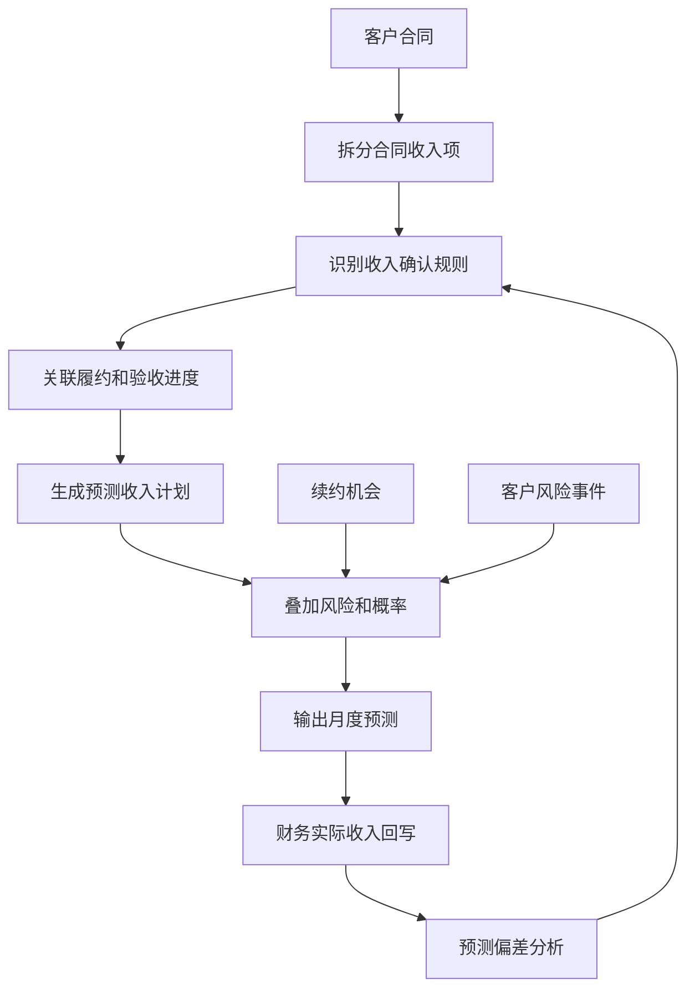
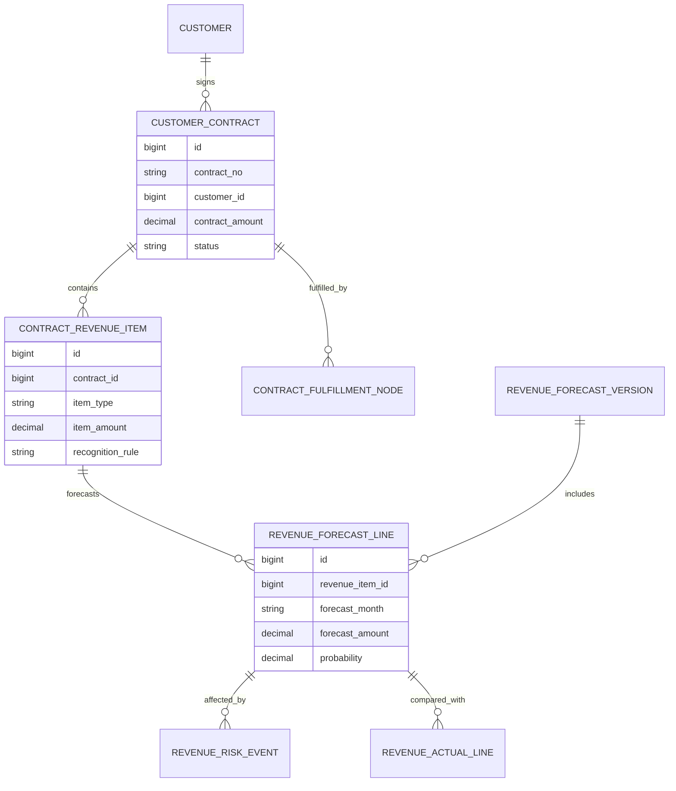
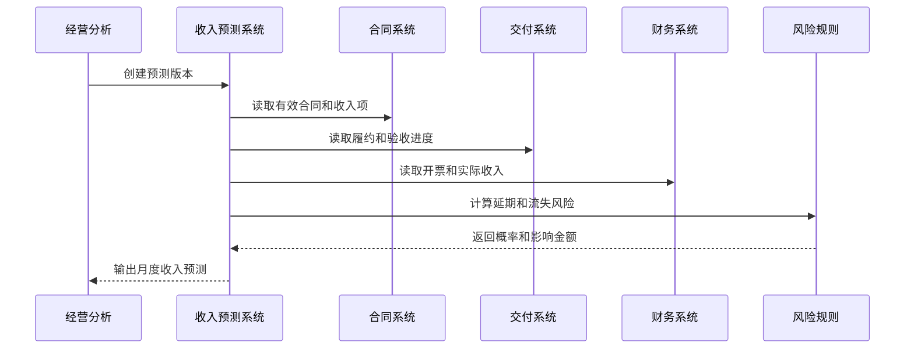
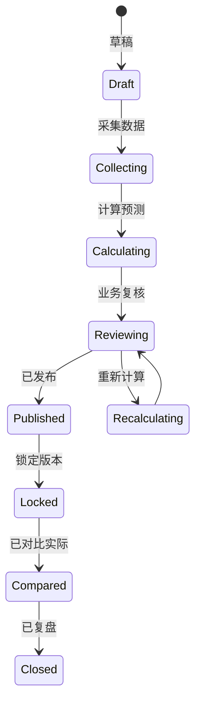
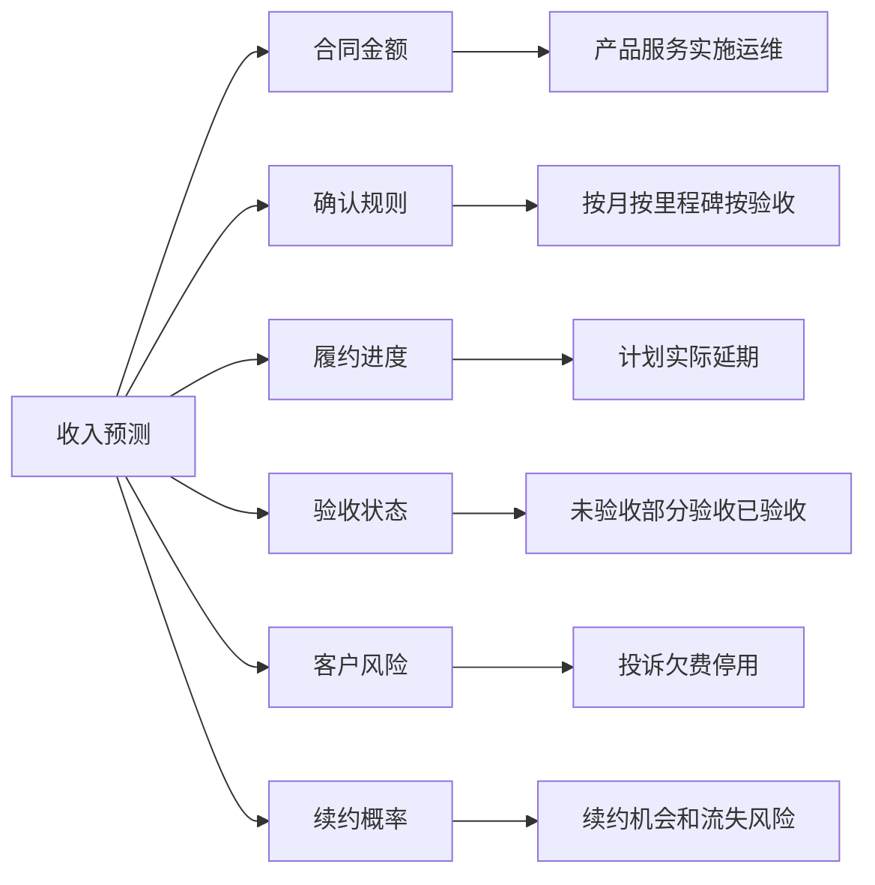

# 客户合同收入预测项目案例

## 适合谁看

如果你做过合同管理、合同履约、合同付款、客户账期、销售回款计划或客户成功平台，但还不清楚“未来几个月到底能确认多少收入、会延迟多少收入、哪些客户有收入风险”，可以学习这个案例。

客户合同收入预测关注的是从合同、履约、账单、发票、回款、续约和风险事件中推算未来收入。它不是简单把合同金额平均分到每个月，而是根据交付进度、服务周期、验收状态、开票条件、回款概率和客户风险生成可解释的收入预测。

## 业务目标

客户合同收入预测要回答 6 个问题：

- 已签合同未来每个月预计能确认多少收入。
- 哪些收入依赖验收、交付、开票、回款或续约。
- 哪些合同存在延期、变更、取消、坏账或客户流失风险。
- 预测收入和财务实际确认收入之间的偏差来自哪里。
- 销售、交付、财务和客户成功看到的预测口径是否一致。
- 预测结果如何帮助现金流、预算、销售目标和经营复盘。

真实项目里，收入预测最容易被低估：销售只看合同金额，交付只看项目进度，财务只看确认规则，客户成功只看续费风险。系统要把这些信号合并成一条可追踪的预测链路。

## 客户合同收入预测链路

这条链路说明，收入预测不是财务报表的静态字段，而是合同执行过程中的动态判断。

## 核心概念

| 概念 | 说明 | 新手理解 |
| --- | --- | --- |
| 合同收入项 | 合同中可单独确认收入的服务或产品 | 软件授权、实施、运维服务 |
| 确认规则 | 什么时候能算收入 | 按月、按里程碑、按验收 |
| 预测收入 | 系统估算未来可确认的收入 | 还不是最终财务收入 |
| 预测概率 | 这笔收入能按期确认的可能性 | 风险越高概率越低 |
| 收入风险 | 导致收入延迟或减少的事件 | 验收延期、客户投诉、变更 |
| 偏差分析 | 预测和实际差了多少以及原因 | 用来改进预测规则 |
| 预测版本 | 某一次预测快照 | 防止历史预测被覆盖 |

收入预测最重要的是“口径一致”。销售看预计签约，财务看收入确认，经营看预测收入，如果口径混乱，会议上就很难对齐。

## 数据模型

合同金额不要直接作为预测收入。合同要先拆成收入项，再根据不同规则生成预测行。

## 推荐表结构

| 表 | 用途 | 关键字段 |
| --- | --- | --- |
| `customer_contract` | 客户合同主表 | contract_no、customer_id、amount、start_date、end_date、status |
| `contract_revenue_item` | 合同收入项 | contract_id、item_type、amount、recognition_rule、service_period |
| `contract_fulfillment_node` | 履约节点 | contract_id、node_type、plan_date、actual_date、acceptance_status |
| `revenue_forecast_version` | 预测版本 | version_no、forecast_scope、created_by、created_at、baseline_flag |
| `revenue_forecast_line` | 预测明细 | version_id、revenue_item_id、forecast_month、amount、probability |
| `revenue_risk_event` | 收入风险 | forecast_line_id、risk_type、risk_level、impact_amount |
| `revenue_actual_line` | 实际收入 | contract_id、revenue_month、actual_amount、source_doc_no |
| `revenue_forecast_deviation` | 预测偏差 | forecast_line_id、actual_line_id、deviation_amount、reason_code |

收入预测必须有版本。否则每次重新计算都会覆盖旧结果，经营复盘时无法知道当时为什么预测错。

## 预测生成流程

预测系统应该拉取数据生成结果，而不是让用户手工填表。手工填表很快会变成 Excel，难以追踪来源。

## 预测状态设计

发布后的预测版本不应该随意修改。需要调整时创建新版本，旧版本用于追踪预测准确率。

## 预测因素拆解

预测因素越清晰，偏差复盘越容易。系统要能告诉用户“少预测了多少、为什么少、责任在哪个环节”。

## 前端页面拆分

| 页面 | 核心内容 | 设计建议 |
| --- | --- | --- |
| 收入预测工作台 | 本月、本季度、年度预测收入 | 默认看差异最大的月份 |
| 合同收入项页 | 合同拆分、确认规则、服务周期 | 用表格展示收入项来源 |
| 预测版本页 | 版本列表、创建时间、范围、状态 | 已锁定版本只读 |
| 月度预测明细 | 月份、客户、合同、收入项、概率 | 支持按客户和风险筛选 |
| 风险解释页 | 延期、欠费、投诉、续约风险 | 每个风险要有证据 |
| 偏差复盘页 | 预测金额、实际金额、偏差原因 | 支持按规则和负责人聚合 |
| 经营看板 | 预测趋势、收入缺口、风险金额 | 适合管理层快速看结论 |

新手做页面时容易只做一个大表格。更合理的方式是先给经营摘要，再允许下钻到合同、收入项和风险证据。

## 接口拆分建议

| 接口 | 方法 | 说明 |
| --- | --- | --- |
| `/api/revenue-forecast/versions` | GET/POST | 查询和创建预测版本 |
| `/api/revenue-forecast/versions/:id/calculate` | POST | 计算预测结果 |
| `/api/revenue-forecast/lines` | GET | 查询预测明细 |
| `/api/revenue-forecast/contracts/:id/items` | GET | 查询合同收入项 |
| `/api/revenue-forecast/lines/:id/risks` | GET | 查询预测风险 |
| `/api/revenue-forecast/versions/:id/publish` | POST | 发布预测版本 |
| `/api/revenue-forecast/deviations` | GET | 查询预测偏差 |

预测接口要返回金额来源、确认规则、概率和风险原因。只返回一个汇总金额，前端就无法解释。

## 实际项目常见问题

### 1. 合同金额等于预测收入

合同签了 100 万，但实施、验收、服务期和收入确认节奏不同。

解决方式：

- 合同先拆成收入项。
- 每个收入项配置确认规则。
- 按服务期或里程碑生成月度预测。
- 实际确认收入回写后做偏差复盘。

### 2. 预测被人工反复覆盖

管理层问为什么上周预测和今天不一样，系统无法解释。

解决方式：

- 每次预测生成版本号。
- 发布版本锁定，不允许覆盖。
- 人工调整必须写原因和影响金额。
- 预测对比按版本做，而不是按当前值做。

### 3. 忽略履约和验收延期

合同看起来能确认收入，但交付实际还没完成。

解决方式：

- 预测时读取履约节点和验收状态。
- 延期节点自动降低确认概率。
- 高金额延期生成风险事件。
- 交付负责人需要维护延期原因。

### 4. 财务实际收入和业务预测对不上

财务按收入准则确认，业务按合同计划预测。

解决方式：

- 定义预测口径和财务口径映射。
- 保存财务实际收入来源单据。
- 偏差原因结构化。
- 定期校准确认规则。

### 5. 续约收入被遗漏

客户即将续约，但合同还没签，预测里没有未来收入。

解决方式：

- 续约机会按概率进入预测。
- 区分已签合同收入和机会收入。
- 续约失败后自动调整预测。
- 续约概率来自客户健康度和销售阶段。

## 权限与审计

| 权限点 | 控制原因 |
| --- | --- |
| 查看收入预测 | 涉及客户收入和经营数据 |
| 创建预测版本 | 会影响经营会议和目标判断 |
| 调整预测金额 | 可能改变管理层决策 |
| 发布预测版本 | 发布后成为经营口径 |
| 查看风险明细 | 包含客户投诉、欠费和续约风险 |
| 导出预测数据 | 需要记录导出人、时间和范围 |

收入预测属于高敏感经营数据。导出和人工调整都要进入审计日志。

## 验收清单

- 合同能拆分为多个收入项。
- 不同确认规则能生成不同月度预测。
- 预测结果包含金额、概率、规则和来源。
- 延期、欠费、投诉、续约风险能影响预测。
- 预测版本可以发布、锁定和对比实际。
- 偏差原因可以按客户、合同、规则和月份分析。
- 关键操作有审计记录。

## 下一步学习

学完这个案例后，可以继续看：

- [合同履约项目案例](/projects/contract-fulfillment-case)
- [销售回款计划项目案例](/projects/sales-collection-plan-case)
- [客户续约定价策略项目案例](/projects/customer-renewal-pricing-strategy-case)
- [资金计划项目案例](/projects/cash-flow-planning-case)

