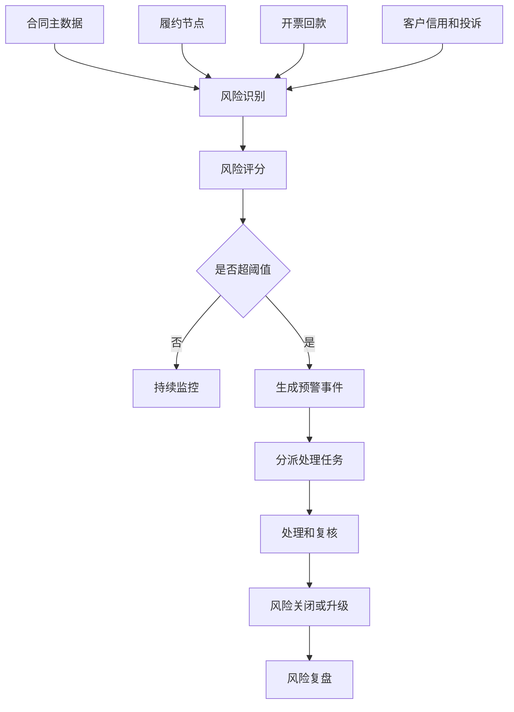
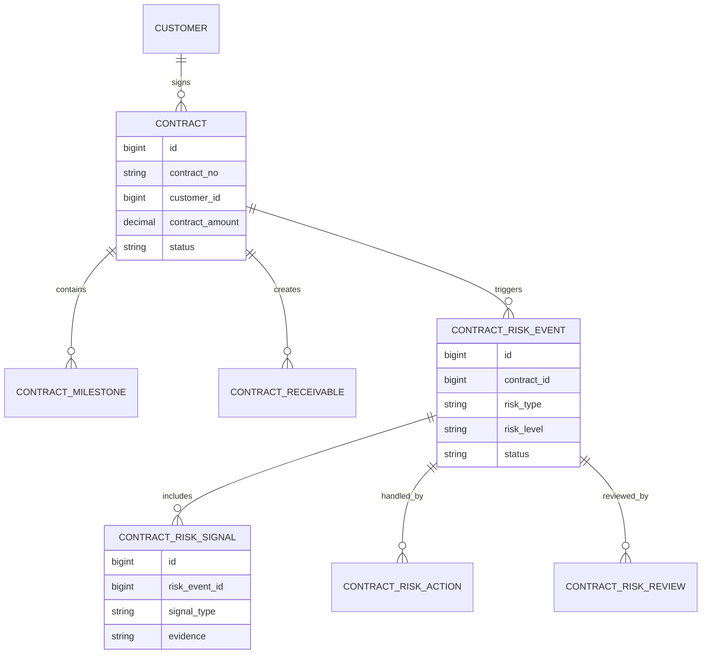
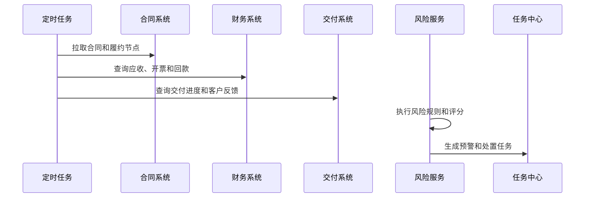
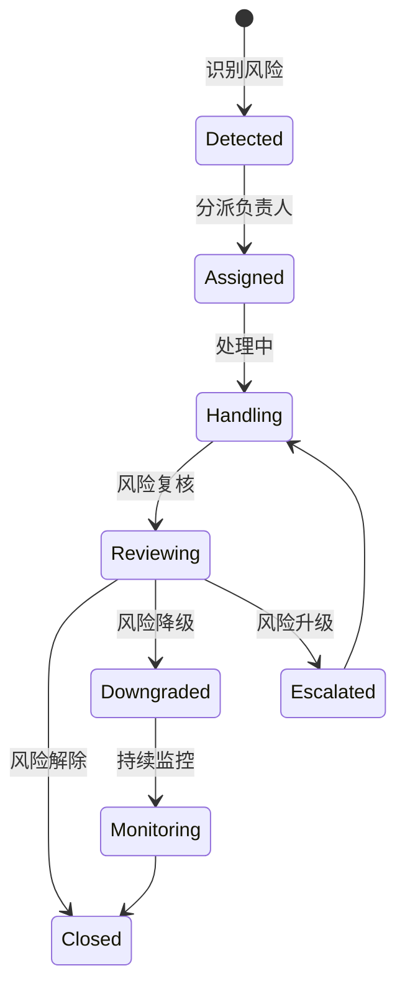
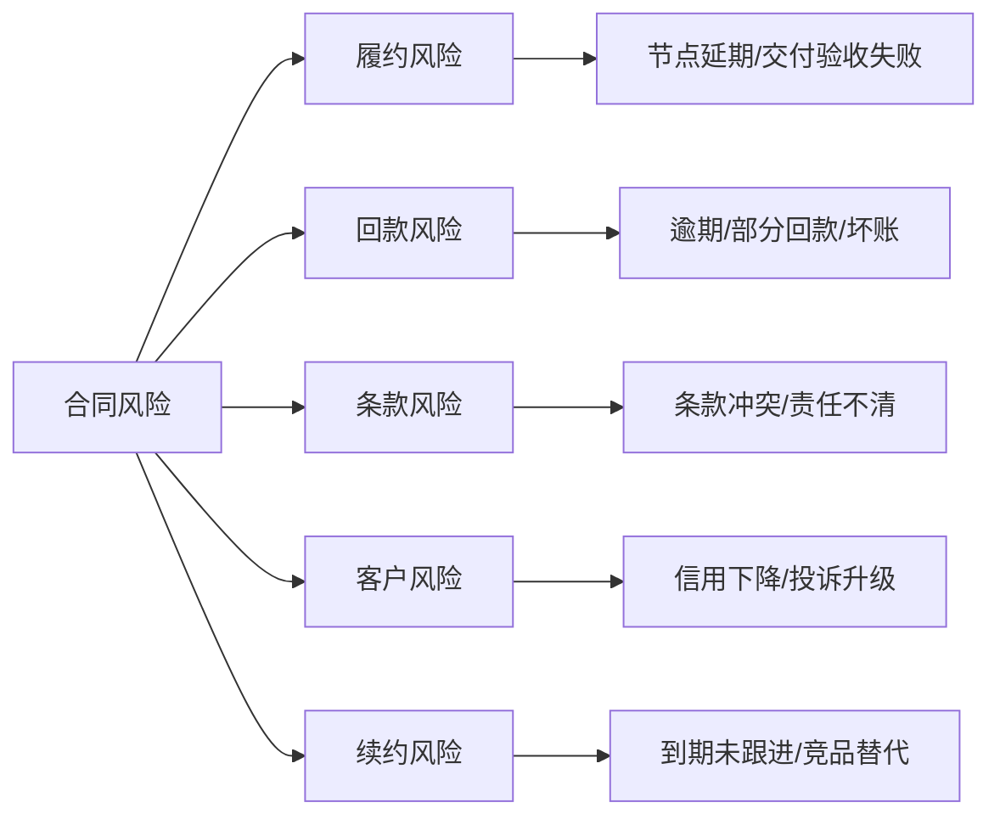

# 客户合同风险预警项目案例

## 适合谁看

如果你做过合同管理、合同履约、合同续签、客户账期或客户续费挽回，但还不清楚如何在合同出问题前提前预警，可以学习这个案例。

客户合同风险预警关注的是合同从签署、履约、交付、开票、回款、变更到续签过程中的风险。它不是合同到期提醒，而是提前发现延期交付、付款逾期、条款冲突、客户信用下降、履约偏差和续约风险。

## 业务目标

客户合同风险预警要回答 6 个问题：

- 哪些合同存在延期、逾期、争议、违约或续约风险。
- 风险来自客户、条款、履约、交付、开票、回款还是内部审批。
- 风险影响金额、客户关系、项目交付、收入确认和法律责任有多大。
- 谁应该处理风险，销售、法务、财务、交付还是客户成功。
- 预警后采取了什么动作，是否降低了风险。
- 风险结论如何反哺客户评级、续费挽回和合同模板治理。

真实项目中，合同风险经常在回款失败、客户投诉或项目延期后才暴露。一个好的预警系统要把风险信号提前变成任务。

## 客户合同风险预警链路

这条链路说明，合同风险预警要跨合同、财务、交付、客户成功多个系统。只看合同到期日是不够的。

## 核心概念

| 概念 | 说明 | 新手理解 |
| --- | --- | --- |
| 合同风险 | 合同执行中可能造成损失的问题 | 延期、逾期、违约、争议 |
| 风险信号 | 触发风险判断的数据 | 回款逾期、节点延期、投诉 |
| 风险评分 | 风险严重程度量化结果 | 分数越高越需要处理 |
| 预警事件 | 系统生成的风险单 | 需要负责人处理 |
| 处置任务 | 针对风险的处理动作 | 催收、补充协议、升级会议 |
| 复核结论 | 风险是否解除 | 关闭、降级、升级 |
| 风险复盘 | 事后总结原因和规则 | 优化模板和流程 |

合同风险预警不是审批流。审批发生在合同签署前，预警发生在合同履约过程中。

## 数据模型

风险事件和风险信号要分开。一个风险事件可能由多个信号共同触发，例如交付延期加回款逾期。

## 推荐表结构

| 表 | 用途 | 关键字段 |
| --- | --- | --- |
| `contract` | 合同主表 | contract_no、customer_id、amount、start_date、end_date、status |
| `contract_milestone` | 履约节点 | contract_id、milestone_type、planned_date、actual_date、status |
| `contract_receivable` | 应收计划 | contract_id、receivable_amount、due_date、paid_amount、overdue_days |
| `contract_risk_rule` | 风险规则 | rule_code、risk_type、threshold_json、risk_level |
| `contract_risk_event` | 风险事件 | contract_id、risk_type、risk_score、risk_level、status |
| `contract_risk_signal` | 风险信号 | risk_event_id、signal_type、evidence、detected_at |
| `contract_risk_action` | 处置动作 | risk_event_id、owner_id、action_type、due_date、result |
| `contract_risk_review` | 复核记录 | risk_event_id、review_result、risk_after、comment |

合同风险规则要有版本。规则调整后，历史预警仍然要能解释当时为什么触发。

## 风险识别流程

风险识别建议定时执行，也可以对关键事件实时触发，例如回款逾期、节点延期、合同变更被驳回。

## 风险事件状态设计

预警关闭前必须有证据，例如客户完成付款、补充协议签署、交付节点恢复或风险被业务负责人接受。

## 风险类型拆解

风险类型要对应责任团队。履约风险给交付，回款风险给财务和销售，条款风险给法务。

## 前端页面拆分

| 页面 | 核心内容 | 设计建议 |
| --- | --- | --- |
| 风险总览 | 风险合同数、风险金额、风险等级、Top 原因 | 先展示金额影响 |
| 合同风险列表 | 合同、客户、风险类型、负责人、状态 | 支持按到期、金额、等级排序 |
| 风险详情 | 风险信号、证据、规则版本、时间线 | 让用户知道为什么预警 |
| 处置任务 | 负责人、动作、截止时间、处理结果 | 逾期任务要可升级 |
| 风险复核 | 复核结论、风险变化、关闭证据 | 防止随意关闭 |
| 客户风险画像 | 合同风险、回款、投诉、续约状态 | 反哺客户成功 |
| 风险复盘 | 风险来源、处理时长、损失避免 | 优化合同模板和规则 |

风险页面的重点是“证据”和“动作”。没有证据，预警会被业务当成噪音。

## 接口拆分建议

| 接口 | 方法 | 说明 |
| --- | --- | --- |
| `/api/contract-risks/overview` | GET | 查询合同风险总览 |
| `/api/contract-risks/events` | GET | 查询风险事件 |
| `/api/contract-risks/events/:id` | GET | 查询风险详情 |
| `/api/contract-risks/events/:id/actions` | POST | 提交处置动作 |
| `/api/contract-risks/events/:id/review` | POST | 提交风险复核 |
| `/api/contract-risks/rules` | GET/POST | 查询和维护风险规则 |
| `/api/customers/:id/contract-risk-profile` | GET | 查询客户合同风险画像 |

风险规则接口要谨慎开放。规则调整会影响预警数量和业务处理压力。

## 实际项目常见问题

### 1. 预警太多，业务不处理

规则过于敏感，导致低价值风险堆积。

解决方式：

- 按金额、客户等级、风险类型设置阈值。
- 区分提醒、预警、严重风险。
- 低风险只展示，高风险才生成任务。
- 定期复盘规则命中率和关闭率。

### 2. 风险原因无法解释

只有一个风险等级，没有信号证据。

解决方式：

- 每个风险事件保存触发信号。
- 页面展示规则版本和命中字段。
- 支持查看原始合同、回款和履约记录。
- 人工调整风险要写原因。

### 3. 合同到期才发现续约风险

只按合同结束日期提醒，没有看使用和服务信号。

解决方式：

- 提前 90/60/30 天生成续约风险。
- 结合客户健康度、投诉、使用下降和回款。
- 高风险客户进入续费挽回流程。
- 续约结果回写风险复盘。

### 4. 风险处理没有闭环

负责人写了备注，但风险没有实际变化。

解决方式：

- 处置动作必须有下一步和截止时间。
- 关闭风险必须上传证据。
- 逾期未处理自动升级。
- 风险关闭后持续监控一段时间。

### 5. 法务、财务、交付口径不一致

同一合同风险不同团队判断不同。

解决方式：

- 风险类型绑定责任团队。
- 高风险事件支持多团队会签。
- 复核结论记录不同团队意见。
- 规则和字段口径写入治理文档。

## 权限与审计

| 权限点 | 控制原因 |
| --- | --- |
| 查看合同风险 | 涉及客户和合同敏感信息 |
| 维护风险规则 | 会影响预警结果 |
| 分派处置任务 | 影响团队职责 |
| 关闭风险事件 | 代表风险被接受或解除 |
| 导出风险报表 | 涉及经营和法务风险 |
| 查看客户风险画像 | 涉及客户信用和续约判断 |

审计日志要记录规则变更、风险生成、人工调整、任务分派、处置动作、复核结论和风险关闭。

## 验收清单

- 能识别合同履约、回款、条款、客户和续约风险。
- 风险事件能展示触发信号和证据。
- 风险支持评分、分级、分派、处置和复核。
- 风险关闭需要证据。
- 风险结果能反哺客户画像和续费挽回。
- 能按金额、客户、类型、负责人和状态复盘风险。

## 下一步学习

建议继续阅读：

- [合同管理项目案例](/projects/contract-management-case)
- [合同履约项目案例](/projects/contract-fulfillment-case)
- [客户续费挽回项目案例](/projects/customer-renewal-recovery-case)
- [客户账期项目案例](/projects/customer-credit-term-case)
