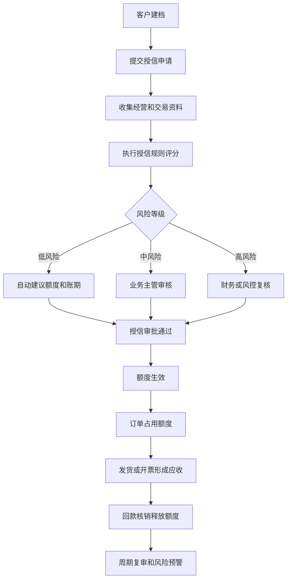
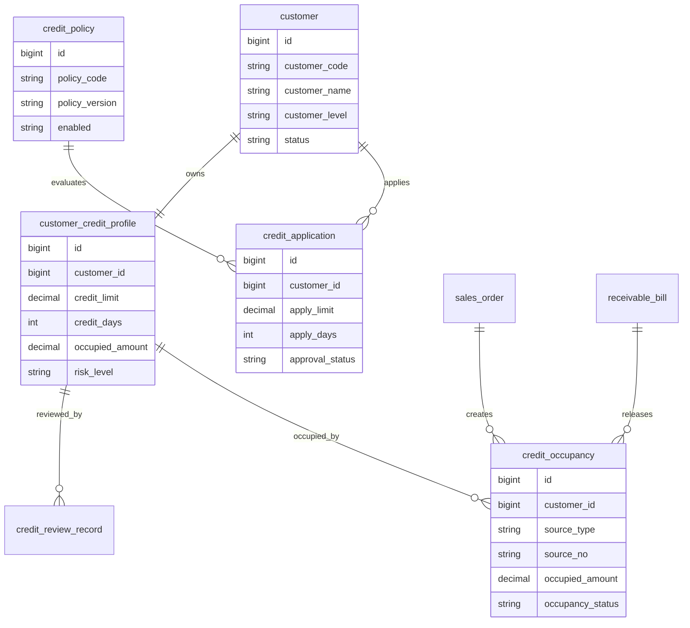
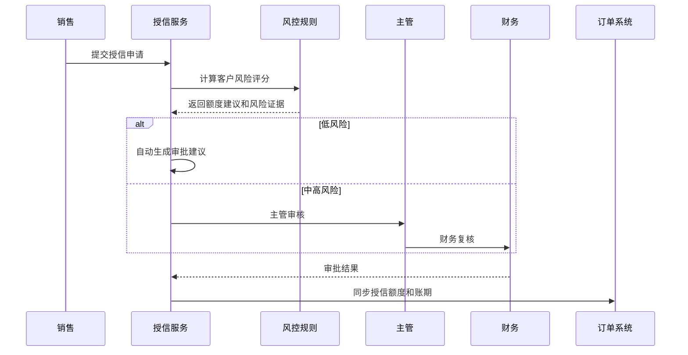
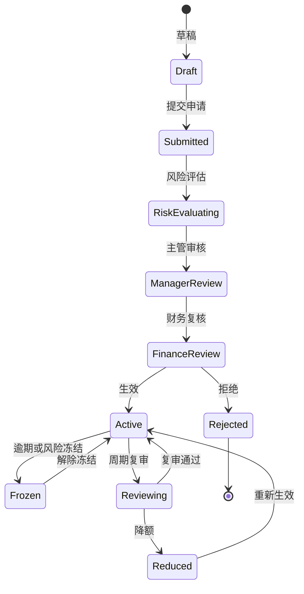
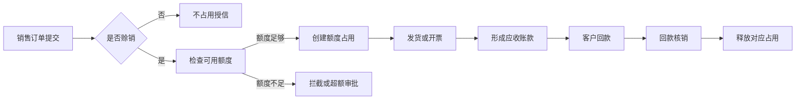

# 客户授信风控项目案例

## 适合谁看

如果你做过 CRM、订单、回款、客户账期或应收账款系统，但不清楚“客户为什么不能随便赊账”，可以先看这一篇。

客户授信风控解决的是企业对客户开放账期、额度、赊销和回款风险控制的问题。它不是银行风控系统，但同样需要规则、额度、占用、预警、冻结、审批和审计。

## 业务目标

客户授信系统要回答 6 个问题：

- 这个客户能不能赊销。
- 可以给多少额度和多长账期。
- 当前额度已经被订单、发货和应收占用了多少。
- 逾期、坏账、争议款和异常退货是否影响授信。
- 超额度或超账期时，是拦截订单、转人工审批，还是临时放行。
- 授信策略调整后，历史订单和应收账款如何追溯。

授信系统的核心不是“给客户一个额度字段”，而是让额度从申请、审批、占用、释放、冻结到复审都有明确的证据链。

## 客户授信风控链路

授信要和订单、发货、开票、应收、回款联动。只在客户资料里填一个额度，无法解决额度被重复占用或逾期未收款的问题。

## 核心概念

| 概念 | 说明 | 项目里的典型字段 |
| --- | --- | --- |
| 授信额度 | 允许客户赊销的最大金额 | credit_limit |
| 账期 | 从开票或发货到应收款到期的天数 | credit_days |
| 已占用额度 | 已下单、已发货或已开票但未回款金额 | occupied_amount |
| 可用额度 | 授信额度减去已占用额度 | available_amount |
| 风险等级 | 客户信用风险分层 | risk_level |
| 临时额度 | 短期放大的额度 | temporary_limit |
| 授信冻结 | 暂停客户赊销能力 | frozen_status |
| 复审周期 | 定期重新评估授信 | review_cycle |

新手要先区分“客户额度”和“订单占用”。额度是规则结果，占用是业务事实。

## 数据模型

`credit_occupancy` 是授信系统最关键的明细表。没有它，就只能看到客户“还剩多少额度”，但看不到额度被哪些订单和应收占用。

## 推荐表结构

| 表 | 用途 | 关键字段 |
| --- | --- | --- |
| customer_credit_profile | 客户授信档案 | customer_id、credit_limit、credit_days、risk_level、frozen_status |
| credit_application | 授信申请 | customer_id、apply_limit、apply_days、apply_reason、approval_status |
| credit_policy | 授信策略 | policy_code、policy_version、effective_date、enabled |
| credit_policy_rule | 授信规则 | policy_id、rule_type、condition_json、score、decision |
| credit_occupancy | 额度占用 | customer_id、source_type、source_no、occupied_amount、status |
| credit_review_record | 授信复审 | customer_id、review_type、review_result、risk_evidence |
| credit_audit_log | 操作审计 | customer_id、operator_id、action、before_json、after_json |

授信金额、账期、风险等级、冻结状态都属于敏感字段，变更前后的值必须保留。

## 授信审批流程

审批通过不代表永久有效。授信要有到期时间或复审周期，否则客户经营状况变化后系统仍会按旧额度放行。

## 授信状态设计

不要把“冻结”和“拒绝”混用。冻结通常是暂时限制赊销，拒绝是申请没有通过。

## 额度占用与释放

额度释放要和回款核销绑定，而不是和订单完成绑定。订单完成但客户未付款，风险仍然存在。

## 前端页面拆分

| 页面 | 主要功能 | 新手容易漏掉 |
| --- | --- | --- |
| 授信看板 | 总额度、占用、逾期、冻结客户 | 要按客户等级和业务线筛选 |
| 客户授信档案 | 额度、账期、风险等级、冻结状态 | 展示占用明细和历史变更 |
| 授信申请页 | 申请额度、账期、资料附件 | 提交前提示当前应收和逾期 |
| 授信审批页 | 风险评分、证据、审批意见 | 审批人要看到规则命中原因 |
| 额度占用页 | 订单、发货、应收占用明细 | 支持追到来源单据 |
| 授信策略页 | 规则、评分、额度建议 | 规则要有版本和模拟能力 |
| 风险预警页 | 逾期、超额、降额、冻结提醒 | 预警要能转处理任务 |

授信详情页要把“额度结果”和“风险证据”放在一起，否则审批人只能凭经验判断。

## 接口拆分建议

| 接口 | 方法 | 说明 |
| --- | --- | --- |
| /api/customer-credits | GET | 查询客户授信列表 |
| /api/customer-credits/:id | GET | 查询授信档案 |
| /api/credit-applications | POST | 创建授信申请 |
| /api/credit-applications/:id/audit | POST | 审批授信申请 |
| /api/credit-occupancies | GET | 查询额度占用 |
| /api/credit-check | POST | 订单提交前额度校验 |
| /api/credit-policies | GET/POST | 维护授信策略 |
| /api/credit-policies/simulate | POST | 模拟授信规则 |

订单系统不要自己计算授信。它应该调用授信校验接口，由授信服务返回是否放行、是否需要审批和拦截原因。

## 实际项目常见问题

### 问题 1：额度明明足够，订单却被拦截

常见原因是额度占用没有释放，或者回款已经到账但未核销。

解决方式：

- 额度占用和释放都写明细。
- 回款到账和应收核销分开显示。
- 提供占用重算或异常修复工具。
- 所有修复动作写审计日志。

### 问题 2：客户逾期后仍能继续赊销

通常是订单系统只检查额度，不检查逾期和冻结状态。

解决方式：

- 授信校验同时返回额度、账期、逾期和冻结结果。
- 逾期天数超过阈值自动冻结赊销。
- 特殊放行需要审批和有效期。
- 冻结解除必须有原因和审批记录。

### 问题 3：业务要求临时放大额度

临时额度如果不控制有效期，容易变成永久额度。

解决方式：

- 临时额度独立记录，不覆盖正式额度。
- 必须有生效和失效时间。
- 到期自动恢复原额度。
- 临时额度使用情况单独统计。

### 问题 4：授信规则调整后历史判断无法解释

规则没有版本，历史审批无法还原。

解决方式：

- 授信策略和规则保存版本。
- 授信申请保存当时命中的规则和证据。
- 历史审批结果不被新规则覆盖。
- 规则发布前支持模拟和灰度。

## 权限与审计

| 权限 | 建议 |
| --- | --- |
| 查看授信 | 销售只能看自己客户，财务可按组织范围看 |
| 发起申请 | 销售或客户经理 |
| 审批额度 | 按额度金额和风险等级分级审批 |
| 冻结客户 | 财务或风控角色，必须填写原因 |
| 修改策略 | 风控管理员，发布需要审批 |
| 导出授信 | 敏感数据导出审计和水印 |

授信数据会影响订单放行和财务风险，不能只用普通客户查看权限控制。

## 验收清单

- 客户授信额度、账期、风险等级能按版本追溯。
- 订单提交会校验额度、逾期和冻结状态。
- 每一笔额度占用都能追到来源单据。
- 回款核销后能释放对应额度。
- 临时额度有有效期，到期自动失效。
- 授信审批能看到风险证据。
- 所有额度变更和冻结动作有审计记录。

## 下一步学习

建议继续阅读：

- [客户账期项目案例](/projects/customer-credit-term-case)
- [销售回款计划项目案例](/projects/sales-collection-plan-case)
- [风控中心项目案例](/projects/risk-control-center-case)
- [数据权限审计项目案例](/projects/data-permission-audit-case)
