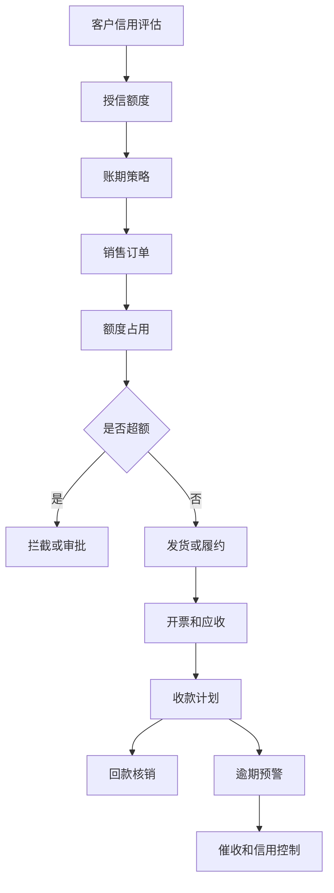
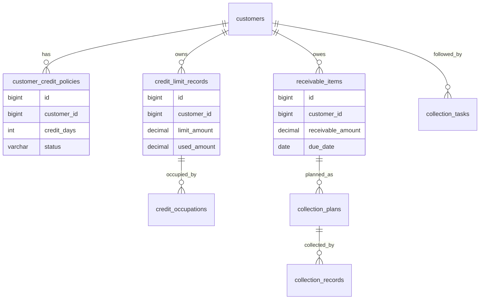
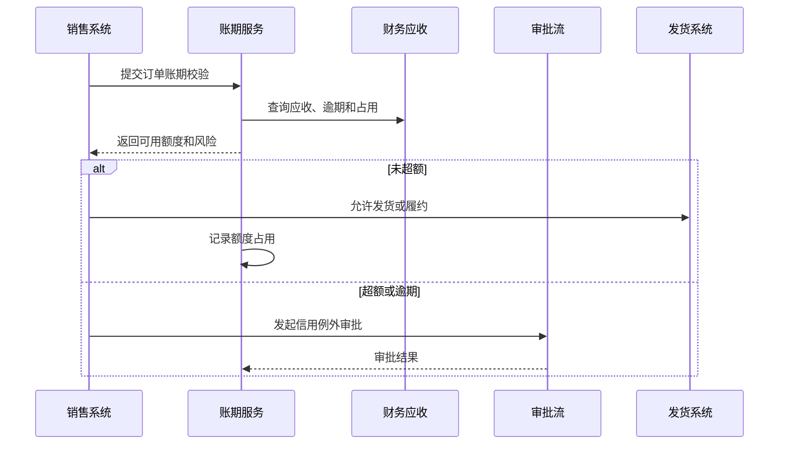

# 客户账期项目案例

## 适合谁看

适合需要做客户授信、账期额度、应收账款、逾期预警、收款计划、客户信用评估和回款风险控制的开发者。

客户账期不是“允许客户晚点付款”。真实项目里，账期会影响销售接单、合同履约、发货、开票、收款、财务应收和坏账风险。系统要能回答：这个客户还能赊多少、哪些订单占用了额度、什么时候该收款、逾期后如何控制继续发货。

## 业务目标

第一版客户账期支持：

- 维护客户信用等级和账期策略。
- 配置客户授信额度和账期天数。
- 订单、合同、发票和应收占用额度。
- 支持账期试算和超额拦截。
- 生成收款计划和到期提醒。
- 统计逾期应收和客户风险。
- 支持额度调整、冻结和恢复。
- 支持催收任务和回款记录。
- 对接客户成功、CRM、财务和订单系统。

## 客户账期链路

账期的核心是“额度占用和释放”。订单、发票、应收、回款之间必须有清晰关系，否则很容易出现客户已经超额但系统仍允许发货。

## 核心概念

| 概念 | 说明 | 示例 |
| --- | --- | --- |
| 授信额度 | 允许客户未付款占用的总金额 | 100 万 |
| 账期天数 | 从开票或发货到付款的允许天数 | 30 天、60 天 |
| 额度占用 | 未回款业务占用的额度 | 未付款订单 20 万 |
| 可用额度 | 授信额度减已占用额度 | 80 万 |
| 应收账款 | 已形成收款义务的金额 | 已开票未回款 |
| 逾期 | 超过约定日期仍未付款 | 到期 15 天未收 |
| 信用冻结 | 暂停账期或发货 | 高风险客户冻结 |

账期起算点要明确。有些企业按发货日算，有些按开票日算，有些按验收日算。这个规则必须配置化。

## 数据模型

## 推荐表结构

| 表 | 作用 | 关键字段 |
| --- | --- | --- |
| `customer_credit_policies` | 客户账期策略 | `customer_id`、`credit_days`、`start_point`、`status` |
| `credit_limit_records` | 授信额度 | `customer_id`、`limit_amount`、`used_amount`、`frozen_amount` |
| `credit_occupations` | 额度占用 | `customer_id`、`source_type`、`source_id`、`occupied_amount` |
| `receivable_items` | 应收明细 | `customer_id`、`source_no`、`receivable_amount`、`due_date` |
| `collection_plans` | 收款计划 | `receivable_id`、`plan_amount`、`plan_date`、`status` |
| `collection_records` | 回款记录 | `collection_no`、`customer_id`、`received_amount`、`received_at` |
| `collection_writeoffs` | 回款核销 | `collection_id`、`receivable_id`、`writeoff_amount` |
| `credit_adjustments` | 额度调整 | `customer_id`、`adjust_type`、`adjust_amount`、`reason` |
| `collection_tasks` | 催收任务 | `customer_id`、`receivable_id`、`owner_id`、`task_status` |
| `credit_risk_alerts` | 信用风险 | `customer_id`、`risk_type`、`risk_level`、`status` |

额度占用不能只靠实时汇总订单表。订单取消、部分回款、红冲、坏账核销都会影响额度，推荐用独立占用流水和核销流水追踪。

## 账期校验流程

账期校验要发生在关键业务节点，例如下单、发货、开票或履约确认。只在客户档案页提示风险是不够的。

## 信用控制策略

| 场景 | 控制方式 | 注意点 |
| --- | --- | --- |
| 可用额度不足 | 拦截订单或发货 | 可支持例外审批 |
| 存在严重逾期 | 冻结账期 | 允许现款订单可继续 |
| 高风险客户 | 降低额度或缩短账期 | 需要审批和通知 |
| 回款到账 | 释放额度 | 按核销金额释放 |
| 发票红冲 | 调整应收和占用 | 不能重复释放额度 |
| 坏账核销 | 释放或转风险额度 | 财务规则要确认 |

信用控制不要一刀切。现款订单、预付款订单、低风险补单和高层审批例外可以有不同策略。

## 前端页面拆分

| 页面或组件 | 作用 | 注意点 |
| --- | --- | --- |
| 账期工作台 | 查看逾期、超额和待催收 | 首屏展示风险客户 |
| 客户信用档案 | 查看额度、账期、等级和状态 | 展示可用额度和占用构成 |
| 额度调整 | 申请增加、减少、冻结额度 | 高风险调整走审批 |
| 应收明细 | 查看订单、发票和到期日 | 支持按账龄筛选 |
| 收款计划 | 查看预计回款 | 可按客户和月份汇总 |
| 回款核销 | 将回款匹配应收 | 支持部分核销 |
| 催收任务 | 分派和跟进催收 | 记录沟通结果 |
| 信用风险看板 | 分析账龄和逾期趋势 | 区分金额和客户数 |

客户信用档案页要突出“为什么不能继续赊销”。例如展示逾期金额、占用订单、冻结原因和建议动作。

## 接口拆分建议

| 接口 | 作用 | 注意点 |
| --- | --- | --- |
| `GET /credit/customers/{id}` | 查看客户信用 | 聚合额度、占用、逾期和策略 |
| `POST /credit/check` | 账期校验 | 返回通过、拦截或需审批 |
| `POST /credit/occupations` | 创建额度占用 | 使用来源单据保证幂等 |
| `POST /credit/release` | 释放额度 | 按回款核销或业务取消释放 |
| `POST /credit/adjustments` | 额度调整 | 高风险调整需要审批 |
| `GET /receivables` | 查询应收 | 支持账龄、客户、业务来源筛选 |
| `POST /collections/writeoff` | 回款核销 | 支持部分核销和多应收匹配 |
| `POST /collection-tasks` | 创建催收任务 | 绑定客户、应收和负责人 |

## 实际项目常见问题

### 问题 1：客户超额度仍然能继续发货

通常是账期校验只在下单时做，发货时没有再次校验。解决方案是在发货或履约确认前重新校验可用额度和逾期状态。

### 问题 2：回款到账后可用额度没有恢复

回款只是银行流水，必须核销到具体应收后才能释放额度。如果只收到款但未核销，系统不知道释放哪一笔占用。

### 问题 3：订单取消后额度一直被占用

额度占用要监听来源单据状态。订单取消、发货失败、发票红冲和应收冲销都要触发占用释放或调整。

### 问题 4：财务和销售看到的逾期金额不一致

要统一账期起算点、应收生成规则和核销规则。销售系统不能自己算一套逾期，财务系统再算另一套。

## 权限与审计

客户账期权限至少要区分：

- 查看客户信用。
- 执行账期校验。
- 调整授信额度。
- 冻结或恢复客户账期。
- 查看应收和回款。
- 执行回款核销。
- 创建催收任务。
- 审批信用例外。
- 导出应收报表。

额度调整、信用冻结、例外放行和回款核销都要审计。这些操作直接影响收入确认和坏账风险。

## 验收清单

- 客户有账期策略、授信额度和信用状态。
- 订单、发票、应收和回款能影响额度占用。
- 可用额度计算可解释。
- 超额、逾期和冻结能阻止关键业务节点。
- 支持信用例外审批。
- 回款核销后释放额度。
- 应收账龄和逾期预警准确。
- 催收任务可分派和跟进。
- 额度调整和冻结有审批和审计。
- 财务、销售和客户成功看到的信用数据口径一致。

## 下一步学习

继续学习 [客户主数据项目案例](/projects/customer-master-data-case)、[客户成功平台项目案例](/projects/customer-success-case)、[资金计划项目案例](/projects/cash-flow-planning-case) 和 [复杂财务对账项目案例](/projects/finance-reconciliation-case)。
