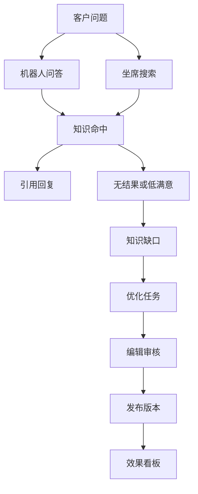
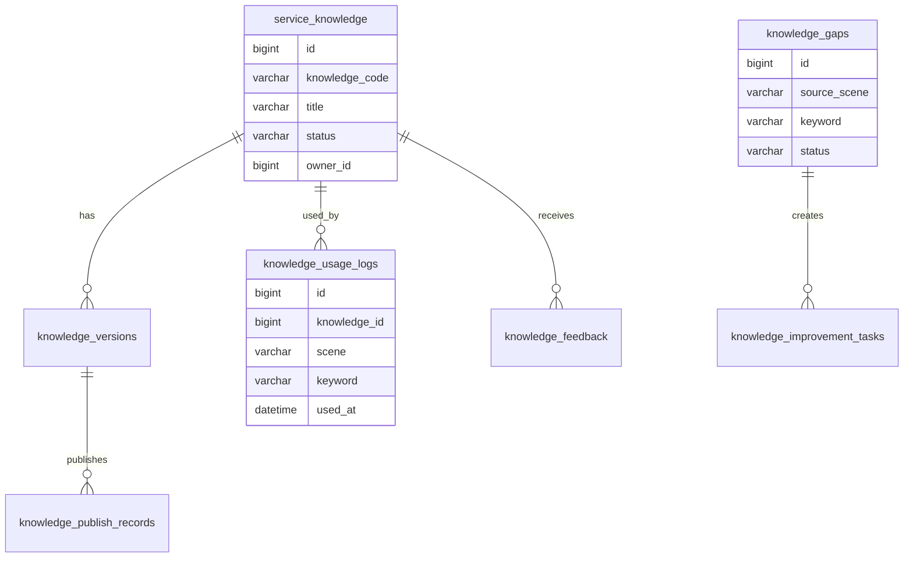
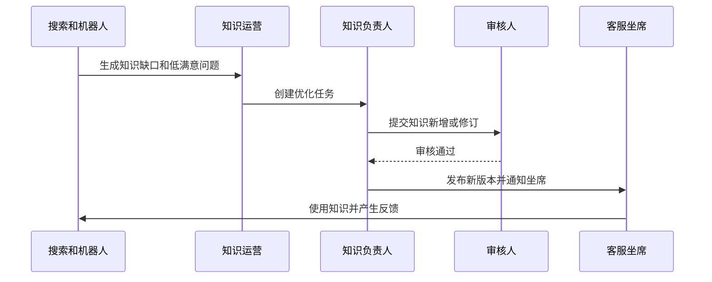

# 客服知识运营项目案例

## 适合谁看

适合需要做客服知识库、机器人问答、坐席辅助、知识命中分析、知识缺口治理、知识过期提醒和服务质量改进的开发者。

客服知识运营不是“写几篇帮助文档”。真实项目里，知识要服务在线客服、电话客服、机器人、工单回复和客户自助查询。系统不仅要存知识，还要持续分析“哪些问题没有答案、哪些答案没人点、哪些知识已经过期、哪些话术导致投诉”。没有运营闭环的知识库，很快会变成旧文档仓库。

## 业务目标

第一版客服知识运营支持：

- 维护客服知识、标准话术和处理流程。
- 支持知识审核、发布、下架和版本。
- 支持机器人问答和坐席辅助引用。
- 记录知识搜索、点击、引用和反馈。
- 识别无结果搜索、低满意答案和知识缺口。
- 支持知识优化任务和负责人闭环。
- 支持知识效果看板。

## 知识运营链路

核心原则：知识运营要从真实服务场景反推内容建设。优先补“高频、无答案、低满意、投诉相关”的知识，而不是凭经验写目录。

## 数据模型

## 推荐表结构

| 表 | 作用 | 关键字段 |
| --- | --- | --- |
| `service_knowledge` | 客服知识主表 | `knowledge_code`、`title`、`category_id`、`status`、`owner_id` |
| `knowledge_versions` | 知识版本 | `knowledge_id`、`version_no`、`content`、`effective_at` |
| `knowledge_publish_records` | 发布记录 | `knowledge_id`、`version_id`、`action`、`operator_id` |
| `knowledge_usage_logs` | 使用日志 | `knowledge_id`、`scene`、`keyword`、`agent_id`、`used_at` |
| `knowledge_feedback` | 知识反馈 | `knowledge_id`、`feedback_type`、`score`、`comment` |
| `knowledge_search_logs` | 搜索日志 | `keyword`、`result_count`、`clicked_knowledge_id` |
| `knowledge_gaps` | 知识缺口 | `source_scene`、`keyword`、`sample_question`、`status` |
| `knowledge_improvement_tasks` | 优化任务 | `gap_id`、`owner_id`、`due_at`、`status` |

知识内容和知识使用数据要分开。内容表回答“知识是什么”，使用日志回答“知识有没有被用、用得好不好”。

## 知识缺口识别

| 信号 | 说明 | 处理方式 |
| --- | --- | --- |
| 搜索无结果 | 坐席搜不到答案 | 生成缺口候选 |
| 点击后差评 | 有结果但不解决问题 | 进入优化任务 |
| 机器人转人工 | 机器人回答失败 | 聚类高频问题 |
| 工单重复出现 | 同类问题反复升级 | 补处理流程 |
| 质检扣分 | 坐席话术不一致 | 补标准话术 |

缺口不应该自动创建正式知识。先进入候选池，由运营人员合并、去重、判断优先级。

## 知识优化流程

发布后要观察效果。只把知识发出去，不看命中率和满意度，无法判断是否真的解决了问题。

## 前端页面拆分

| 页面或组件 | 作用 | 注意点 |
| --- | --- | --- |
| 知识运营首页 | 展示缺口、低满意和待优化任务 | 优先显示高影响问题 |
| 知识编辑页 | 编写答案、话术和处理流程 | 支持版本和审核 |
| 坐席知识面板 | 客服边接待边搜索知识 | 搜索结果要短、准、可引用 |
| 缺口池 | 管理无结果和低满意问题 | 支持合并、忽略、转任务 |
| 优化任务 | 跟踪知识修订进度 | 有负责人和截止时间 |
| 效果看板 | 看命中率、引用率、满意度 | 按分类、渠道、坐席分组 |
| 知识过期列表 | 识别长期未更新内容 | 到期前提醒负责人 |

坐席侧页面要强调效率。不要把完整知识后台塞给客服，坐席需要的是搜索、引用、复制话术和反馈。

## 常见问题

### 问题 1：知识库很多，但客服还是靠群里问

通常是搜索质量差、知识不可信或内容过期。需要展示更新时间、负责人、适用场景，并把无结果搜索转成缺口任务。

### 问题 2：机器人回答命中知识，但客户仍然不满意

说明命中不等于解决。要记录客户是否追问、是否转人工、是否给差评，并把这些信号反馈给知识优化。

### 问题 3：同一个问题有多篇答案互相冲突

需要知识合并和主答案机制。高频问题应该只有一个推荐答案，其他文章作为补充材料。

### 问题 4：知识发布后坐席不知道

重要知识变更要通知目标坐席，并在知识面板里展示“最近更新”。必要时结合培训任务确认已读。

## 验收清单

- 知识支持版本、审核、发布和下架。
- 搜索、机器人和坐席引用都会产生使用日志。
- 无结果搜索能进入知识缺口池。
- 低满意知识能生成优化任务。
- 知识有负责人和过期提醒。
- 坐席面板能快速搜索和引用。
- 效果看板能展示命中率、引用率和满意度。
- 知识变更能通知相关坐席。
- 冲突知识能合并或标记推荐答案。
- 运营任务有负责人、截止时间和关闭结果。

## 下一步学习

继续学习 [知识库平台项目案例](/projects/knowledge-base-case)、[客服质检项目案例](/projects/customer-service-quality-case)、[客服工单项目案例](/projects/support-ticket-case) 和 [AI 文档问答从零到项目](/ai-engineering/doc-qa-project)。
