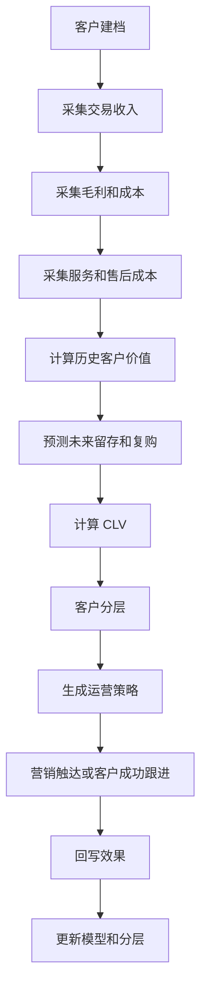
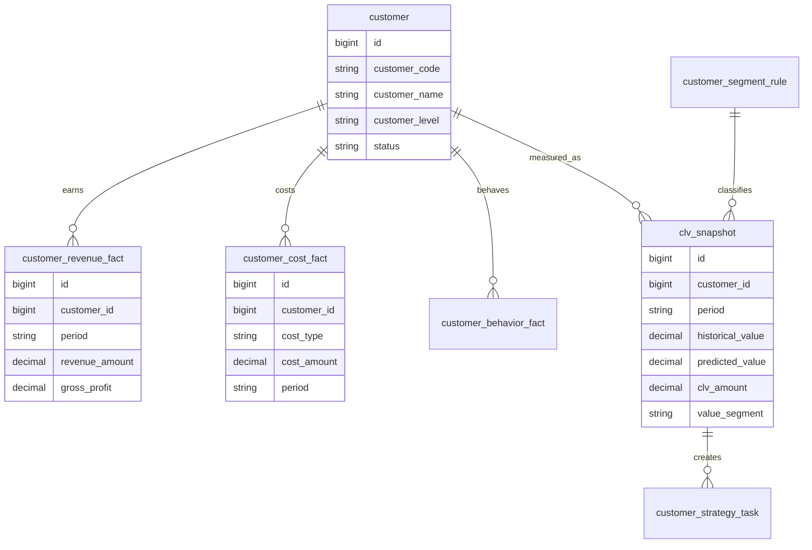
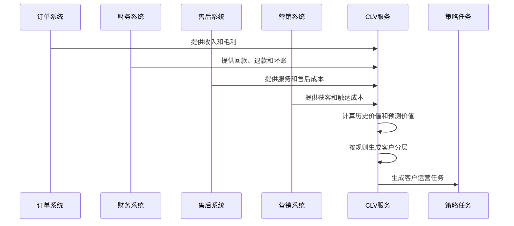
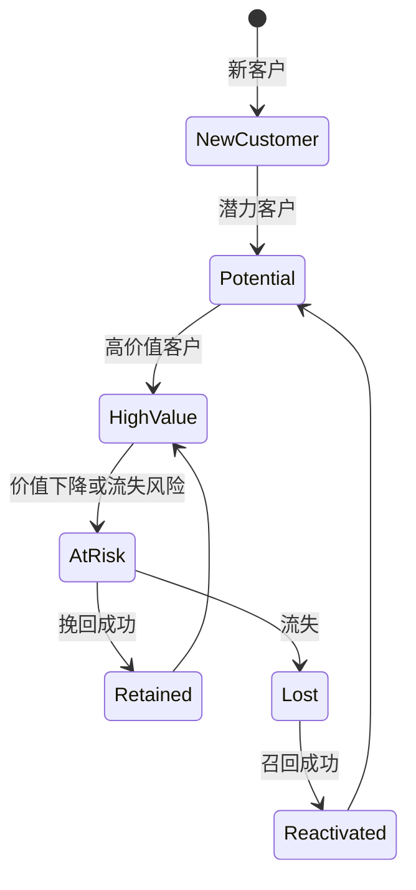
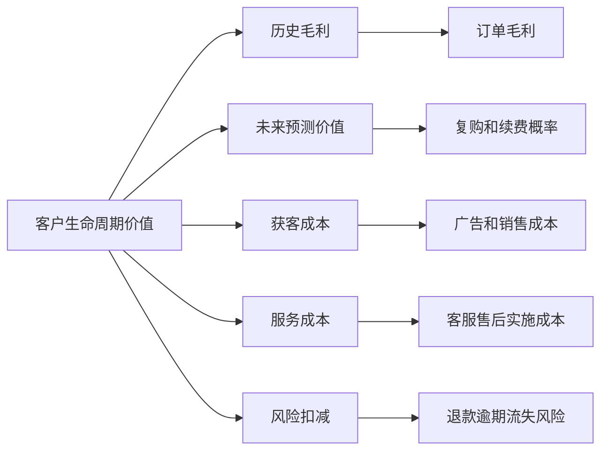

# 客户生命周期价值分析项目案例

## 适合谁看

如果你做过 CRM、会员、客户成功、销售回款或运营分析，但还不清楚“哪些客户值得长期投入”，可以先看这一篇。

客户生命周期价值分析关注的是客户从获客、成交、复购、续费、服务、流失到召回的长期价值。它不是简单的销售额排行，而是把收入、毛利、服务成本、退款、逾期、营销成本和留存概率放在一起评估。

## 业务目标

客户生命周期价值系统要回答 6 个问题：

- 一个客户从现在到未来可能贡献多少净价值。
- 高销售额客户是否真的高利润。
- 哪些客户值得继续投入销售、客服、售后和营销资源。
- 哪些客户虽然当前价值不高，但增长潜力大。
- 哪些客户正在流失，挽回成本是否划算。
- CLV 结果如何反向影响客户分层、营销预算、销售优先级和服务策略。

CLV 的重点不是生成一个神秘分数，而是把“客户长期价值为什么高或低”解释清楚。

## 客户生命周期价值链路

CLV 应该形成闭环。只算出分数但不影响策略，就只是分析报表。

## 核心概念

| 概念 | 说明 | 项目里的典型字段 |
| --- | --- | --- |
| 历史价值 | 客户过去贡献的净收入或毛利 | historical_value |
| 预测价值 | 未来可能贡献的价值 | predicted_value |
| 获客成本 | 获取客户消耗的营销和销售成本 | acquisition_cost |
| 服务成本 | 客服、售后、实施、运维成本 | service_cost |
| 留存概率 | 客户未来继续购买或续费概率 | retention_probability |
| 流失风险 | 客户流失可能性 | churn_risk |
| 客户分层 | 高价值、潜力、风险、低价值等 | value_segment |
| 策略建议 | 针对分层的运营动作 | strategy_code |

新手要先理解：CLV 更接近“长期净价值”，不是“历史销售额”。

## 数据模型

收入、成本、行为和分层要分表保存。不要把所有指标塞进客户主表，否则会让主数据变得难以维护。

## 推荐表结构

| 表 | 用途 | 关键字段 |
| --- | --- | --- |
| customer_revenue_fact | 客户收入事实 | customer_id、period、revenue_amount、gross_profit、source_no |
| customer_cost_fact | 客户成本事实 | customer_id、period、cost_type、cost_amount、source_no |
| customer_behavior_fact | 行为事实 | customer_id、behavior_type、behavior_time、behavior_value |
| clv_calculation_batch | CLV 计算批次 | batch_no、period、calculation_version、status |
| clv_snapshot | CLV 快照 | batch_id、customer_id、historical_value、predicted_value、clv_amount |
| customer_segment_rule | 分层规则 | rule_code、condition_json、segment_code、priority |
| customer_strategy_task | 策略任务 | customer_id、strategy_code、owner_id、status、result |

CLV 结果要按批次保存。客户数据会持续变化，如果没有快照，历史分层会被新数据覆盖。

## CLV 计算流程

CLV 的输入要覆盖收入和成本。只接订单系统会把“高销售额但高服务成本”的客户误判为高价值。

## 分层状态设计

客户分层不是静态标签。每次计算后都可能发生迁移，迁移原因需要记录。

## 价值拆解图

这种拆解能帮助运营和销售理解客户为什么被分到某一层，而不是只看到一个分数。

## 前端页面拆分

| 页面 | 主要功能 | 新手容易漏掉 |
| --- | --- | --- |
| CLV 总览 | 客户价值分布、分层趋势、策略效果 | 区分收入和净价值 |
| 客户价值详情 | 收入、毛利、成本、风险、预测 | 展示指标来源 |
| 分层规则页 | 分层条件、优先级、版本 | 分层变化要有历史 |
| 策略任务页 | 跟进、召回、升级服务、降本 | 任务效果要回写 |
| 流失风险页 | 风险客户、风险原因、挽回建议 | 和 CLV 联动看投入产出 |
| 价值复盘页 | 策略前后价值变化 | 不只看触达次数 |
| 指标口径页 | CLV 公式、分母分子、数据范围 | 口径必须可解释 |

CLV 页面要让业务人员看懂“为什么这个客户值得投入”，而不是只展示模型结果。

## 接口拆分建议

| 接口 | 方法 | 说明 |
| --- | --- | --- |
| /api/customer-lifetime-value/overview | GET | 查询 CLV 总览 |
| /api/customer-lifetime-value/customers/:id | GET | 查询客户价值详情 |
| /api/customer-lifetime-value/calculate | POST | 执行 CLV 计算批次 |
| /api/customer-lifetime-value/segments | GET/POST | 查询和维护分层规则 |
| /api/customer-lifetime-value/tasks | GET/POST | 查询和创建策略任务 |
| /api/customer-lifetime-value/effects | GET | 查询策略效果 |

计算接口建议异步执行。CLV 通常涉及大量历史订单、回款、成本和行为数据。

## 实际项目常见问题

### 问题 1：销售额高的客户 CLV 却低

常见原因是退款多、服务成本高、回款慢或坏账风险高。

解决方式：

- 同时展示收入、毛利、服务成本和风险扣减。
- 支持按成本类型下钻。
- 把回款和逾期纳入价值计算。
- 给出业务解释而不是只展示分数。

### 问题 2：分层结果经常被业务质疑

通常是规则和口径不透明。

解决方式：

- 分层规则版本化。
- 详情页展示命中规则。
- 支持模拟分层。
- 口径变更记录到治理文档。

### 问题 3：策略任务没有效果回写

客户被触达后没有记录转化、复购或续费。

解决方式：

- 策略任务有结果字段。
- 关联订单、回款或续费结果。
- 对比触达前后 CLV 变化。
- 低效果策略进入复盘。

### 问题 4：预测价值不稳定

数据量少或客户行为波动大，模型结果频繁跳动。

解决方式：

- 区分历史价值和预测价值。
- 对新客户使用潜力分而不是强预测。
- 计算结果保留置信度。
- 大幅变化触发人工复核。

## 权限与审计

| 权限 | 建议 |
| --- | --- |
| 查看客户价值 | 按销售组织、客户归属控制 |
| 查看成本明细 | 财务、客户成功负责人和管理层 |
| 修改分层规则 | 运营管理员，发布需要审批 |
| 执行计算 | 系统任务或数据运营 |
| 导出客户价值 | 敏感导出审计和水印 |
| 分配策略任务 | 主管或客户成功负责人 |

CLV 会影响资源分配，不能让所有人随意修改规则或导出明细。

## 验收清单

- CLV 同时考虑收入、毛利、成本、风险和预测。
- 计算结果按批次保存。
- 客户分层有规则版本和命中解释。
- 客户详情能追溯指标来源。
- 策略任务能回写效果。
- 高价值、潜力、风险、流失客户能分开运营。
- 成本和价值导出有权限审计。

## 下一步学习

建议继续阅读：

- [客户成功平台项目案例](/projects/customer-success-case)
- [CRM 销售管理项目案例](/projects/crm-sales-management-case)
- [客户账期项目案例](/projects/customer-credit-term-case)
- [销售回款计划项目案例](/projects/sales-collection-plan-case)
