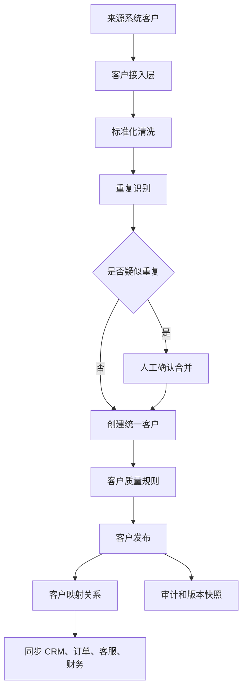
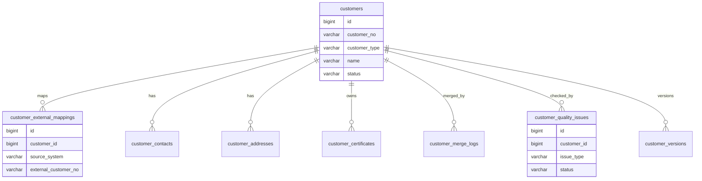
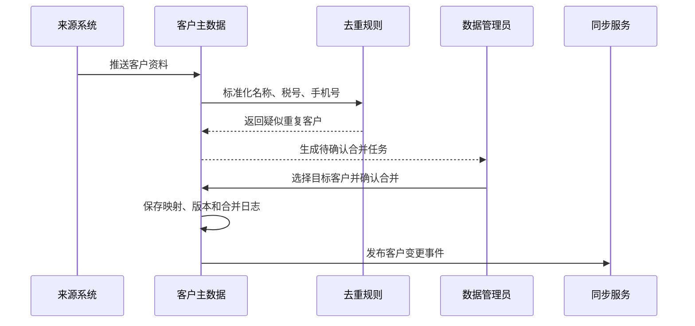

# 客户主数据项目案例

## 适合谁看

适合需要做客户档案、企业客户、个人客户、客户去重、客户合并、客户标签、客户归属、系统间客户同步和客户数据质量治理的开发者。

客户主数据不是“客户列表”。真实企业里，同一个客户可能同时存在于 CRM、订单、客服、财务、会员、售后和数据仓库中。不同系统可能有不同客户编码、不同名称写法、不同联系人和不同税号。客户主数据要解决的是：谁才是这个客户的统一身份，哪些字段可信，哪些系统可以修改，客户合并后历史业务如何继续追溯。

如果你已经看过 [主数据管理项目案例](/projects/master-data-case)，这个案例可以理解为“主数据管理在客户域的完整落地”。

## 业务目标

第一版客户主数据支持：

- 建立统一客户身份。
- 支持企业客户和个人客户。
- 维护客户基础信息、证照信息、联系人、地址和归属团队。
- 接入 CRM、订单、客服、财务等来源系统。
- 识别疑似重复客户。
- 支持客户合并、拆分和映射保留。
- 支持客户质量规则和字段可信来源。
- 向下游系统同步客户变更。
- 记录客户变更、合并和同步审计。

## 客户主数据链路

这条链路的重点是“先识别，再治理，再同步”。不要把每个来源系统传来的客户都直接变成正式客户，否则重复数据会越来越多。

## 核心概念

| 概念 | 说明 | 例子 |
| --- | --- | --- |
| 统一客户 ID | 主数据平台生成的稳定客户身份 | `customer_id = 10001` |
| 外部客户编码 | 来源系统自己的客户编号 | CRM 的 `C-8899`、订单系统的 `BUYER-23` |
| 黄金记录 | 多个来源合并后的最可信客户记录 | 税号取财务，联系人取 CRM |
| 疑似重复 | 系统认为可能是同一个客户，但还未确认 | 名称相似、税号相同 |
| 字段可信来源 | 指定某字段优先相信哪个系统 | 开票名称优先财务系统 |
| 客户归属 | 客户由哪个团队、销售或组织负责 | 华东大区、销售 A |

客户主数据的难点通常不是页面，而是规则。你要提前和业务确认：哪些字段可以自动覆盖，哪些字段必须人工审核，哪些字段只能由特定系统维护。

## 数据模型

## 推荐表结构

| 表 | 作用 | 关键字段 |
| --- | --- | --- |
| `customers` | 统一客户主表 | `customer_no`、`customer_type`、`name`、`short_name`、`status` |
| `customer_enterprise_profiles` | 企业客户扩展信息 | `customer_id`、`credit_code`、`tax_no`、`legal_person` |
| `customer_person_profiles` | 个人客户扩展信息 | `customer_id`、`mobile`、`email`、`id_no_hash` |
| `customer_contacts` | 客户联系人 | `customer_id`、`name`、`mobile`、`is_primary` |
| `customer_addresses` | 客户地址 | `customer_id`、`address_type`、`full_address`、`is_default` |
| `customer_external_mappings` | 外部系统映射 | `customer_id`、`source_system`、`external_customer_no` |
| `customer_quality_issues` | 数据质量问题 | `customer_id`、`issue_type`、`field_code`、`status` |
| `customer_merge_logs` | 客户合并记录 | `source_customer_id`、`target_customer_id`、`merge_reason` |
| `customer_versions` | 客户版本快照 | `customer_id`、`version_no`、`snapshot_json` |
| `customer_sync_logs` | 客户同步日志 | `customer_id`、`target_system`、`status`、`error_message` |

企业客户和个人客户字段差异很大。推荐用统一客户主表保存通用字段，再拆扩展表保存企业或个人专属字段。不要把所有字段都塞进一张超宽表，也不要把唯一约束字段只放在 JSON 里。

## 客户合并流程

客户合并一定要保留来源客户和目标客户的映射。历史订单、工单、发票可能仍然保存旧客户编码，系统要能通过映射找到统一客户。

## 去重规则设计

| 规则 | 适用对象 | 处理建议 |
| --- | --- | --- |
| 统一社会信用代码相同 | 企业客户 | 高置信，默认进入合并确认 |
| 税号相同 | 企业客户 | 高置信，但要排除历史错误数据 |
| 名称标准化后相同 | 企业客户 | 中置信，需要人工确认 |
| 手机号相同 | 个人客户、联系人 | 中高置信，要注意共用手机号 |
| 邮箱相同 | 个人客户、联系人 | 中置信，需要结合姓名 |
| 地址和联系人相似 | 企业客户 | 低置信，只作为提示 |

名称标准化可以做去空格、全半角转换、去公司后缀、繁简转换等处理。但标准化结果不能直接覆盖原始名称，原始值要保留，方便审计和纠错。

## 字段可信来源

| 字段 | 推荐可信来源 | 原因 |
| --- | --- | --- |
| 开票名称 | 财务或税务系统 | 发票和税务风险最高 |
| 客户简称 | CRM | 销售日常使用频率高 |
| 联系人 | CRM 或客服系统 | 最接近客户触达场景 |
| 收货地址 | 订单或物流系统 | 交易履约中更新更及时 |
| 客户状态 | 主数据平台 | 应统一控制启用、停用和黑名单 |
| 归属销售 | CRM | 销售组织维护客户归属 |

字段可信来源不是永远不变。可以先做固定规则，后续再做字段级审批和冲突处理。

## 前端页面拆分

| 页面或组件 | 作用 | 注意点 |
| --- | --- | --- |
| 客户主数据列表 | 查询统一客户 | 突出状态、质量问题、来源系统 |
| 客户详情 | 查看客户全貌 | 分区展示基础信息、联系人、地址、映射和审计 |
| 疑似重复客户 | 处理去重任务 | 必须提供字段对比和合并预览 |
| 客户合并确认 | 选择目标客户和保留字段 | 合并前展示影响的业务对象 |
| 来源映射 | 查看各系统客户编码 | 支持按来源系统筛选 |
| 数据质量看板 | 查看缺失、重复、冲突问题 | 按字段和来源系统统计 |
| 同步日志 | 查看下游同步结果 | 支持失败重试和错误原因 |
| 客户版本 | 查看历史快照 | 用于审计和争议追溯 |

客户详情页不要只做表单。真实使用时，业务更关心“这个客户来自哪里、是否可信、被哪些系统使用、最近发生了什么变化”。

## 接口拆分建议

| 接口 | 作用 | 注意点 |
| --- | --- | --- |
| `GET /customers` | 查询客户列表 | 支持来源系统、状态、质量问题筛选 |
| `GET /customers/{id}` | 查看客户详情 | 聚合联系人、地址、映射、版本 |
| `POST /customers/import` | 接入来源客户 | 要返回质量校验结果 |
| `POST /customers/{id}/publish` | 发布客户 | 发布前校验必填、唯一和冲突 |
| `POST /customers/merge` | 合并客户 | 后端校验权限和影响范围 |
| `GET /customers/duplicates` | 查询疑似重复 | 支持置信度排序 |
| `GET /customers/{id}/versions` | 查看版本 | 支持对比两个版本 |
| `POST /customers/{id}/sync/retry` | 重试同步 | 不要重复创建客户 |

## 实际项目常见问题

### 问题 1：客户合并后历史订单显示异常

通常是合并时直接修改或删除了旧客户记录，导致历史订单外键无法解释。解决方案是保留旧客户映射关系，让历史订单仍可通过旧编码找到统一客户，同时新业务统一使用目标客户 ID。

### 问题 2：CRM 修改客户名称覆盖了财务开票名称

这是字段可信来源没有定义清楚。解决方案是拆分“客户简称、工商名称、开票名称”等字段，并规定开票名称由财务或税务系统维护，CRM 只能维护销售展示名称。

### 问题 3：重复客户越来越多

不要只在新建时做精确名称查重。要把税号、手机号、邮箱、地址、联系人组合成多种规则，并定期生成疑似重复任务。去重任务要有负责人和处理状态。

### 问题 4：下游系统收到客户变更后重复建档

同步事件必须带统一客户 ID、来源映射和幂等键。下游根据映射更新已有客户，而不是每次都新增。

## 权限与审计

客户主数据权限至少要区分：

- 查看客户。
- 创建客户。
- 编辑普通字段。
- 编辑高风险字段，例如税号、开票名称、状态。
- 处理重复客户。
- 执行客户合并。
- 查看敏感字段。
- 导出客户数据。
- 重试同步。

合并、停用、敏感字段变更和导出都要有审计记录。客户数据通常涉及隐私、合同和财务，不能只靠前端按钮隐藏。

## 验收清单

- 客户有统一客户 ID 和客户编码。
- 企业客户和个人客户字段边界清晰。
- 外部系统客户编码有映射表。
- 关键字段有可信来源规则。
- 疑似重复客户可识别、可处理、可追溯。
- 合并客户不会破坏历史订单、工单和发票。
- 下游同步有幂等、防重和重试。
- 客户版本快照可查看。
- 高风险字段变更有审批或审计。
- 数据质量问题可统计并分配处理。

## 下一步学习

继续学习 [主数据管理项目案例](/projects/master-data-case)、[CRM 销售管理项目案例](/projects/crm-sales-management-case)、[客户成功平台项目案例](/projects/customer-success-case) 和 [数据治理平台项目案例](/projects/data-governance-case)。
