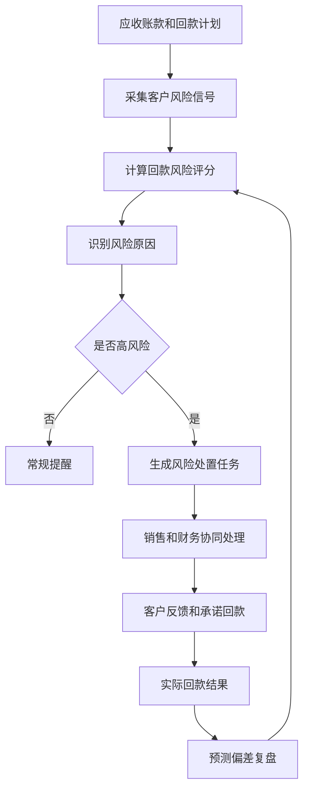
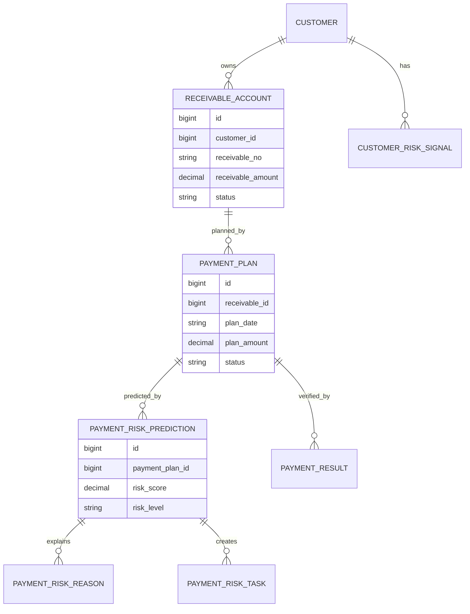
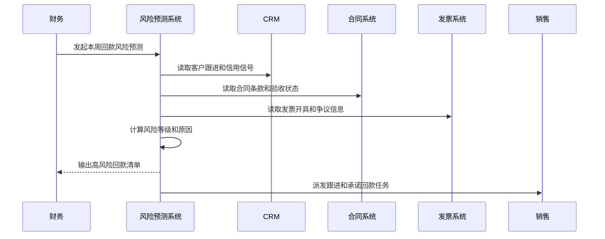
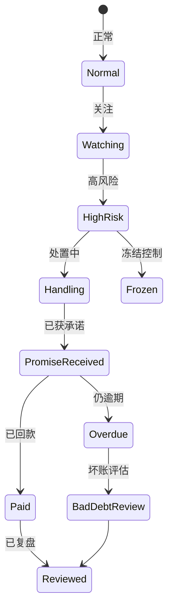
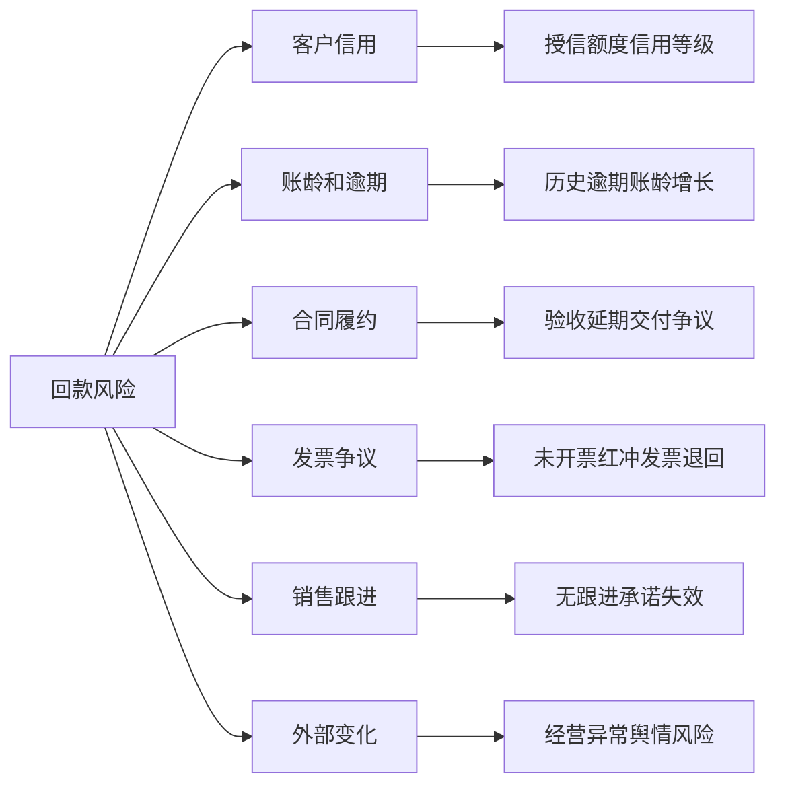

# 客户回款风险预测项目案例

## 适合谁看

如果你做过客户账期、客户授信风控、销售回款计划、合同付款、客户合同收入预测或财务对账，但还不清楚哪些客户可能延期回款、哪些应收账款需要提前催收，可以学习这个案例。

客户回款风险预测关注的是从合同、账单、发票、付款计划、历史回款、客户信用、销售跟进和外部风险中判断未来回款的不确定性。它不是简单统计“逾期了没有”，而是在逾期发生前预测风险，帮助销售、财务和客户成功提前行动。

## 业务目标

客户回款风险预测要回答 6 个问题：

- 哪些客户、合同、账单和回款计划存在延期风险。
- 风险来自客户信用、合同条款、发票问题、验收延期还是销售跟进不足。
- 不同风险等级应该触发什么催收、冻结、提醒或审批动作。
- 预测结果是否准确，错报和漏报如何复盘。
- 风险预测如何影响授信额度、账期、发货和续约策略。
- 财务、销售和客户成功如何围绕同一风险结论协作。

真实项目里，回款风险如果等到逾期后才处理，通常已经太晚。预测系统的价值是把“被动催收”变成“提前干预”。

## 客户回款风险预测链路

这条链路说明，风险预测不是只给一个分数，而是要生成可执行的处置任务和复盘数据。

## 核心概念

| 概念 | 说明 | 新手理解 |
| --- | --- | --- |
| 回款计划 | 预计客户付款的安排 | 哪天该付多少钱 |
| 应收账款 | 客户还没付的款项 | 财务视角的欠款 |
| 风险评分 | 系统计算的延期可能性 | 分数越高越危险 |
| 风险原因 | 影响回款的具体信号 | 发票、验收、信用、争议 |
| 处置任务 | 针对风险的跟进行动 | 催收、冻结、沟通、审批 |
| 承诺回款 | 客户承诺付款时间和金额 | 销售跟进的重要证据 |
| 预测偏差 | 预测和实际结果的差异 | 用来改进规则 |

回款风险预测最重要的是“原因解释”。如果系统只说高风险，业务不知道该怎么处理。

## 数据模型

预测对象建议落到回款计划，而不是只落到客户。一个客户可能有多笔账单，其中一笔高风险，另一笔正常。

## 推荐表结构

| 表 | 用途 | 关键字段 |
| --- | --- | --- |
| `receivable_account` | 应收账款 | customer_id、contract_id、receivable_amount、due_date、status |
| `payment_plan` | 回款计划 | receivable_id、plan_date、plan_amount、owner_id、status |
| `customer_risk_signal` | 客户风险信号 | customer_id、signal_type、signal_value、source、occurred_at |
| `payment_risk_prediction` | 回款风险预测 | payment_plan_id、risk_score、risk_level、model_version、predicted_at |
| `payment_risk_reason` | 风险原因 | prediction_id、reason_type、reason_text、impact_score |
| `payment_risk_task` | 风险处置任务 | prediction_id、task_type、owner_id、due_date、status |
| `payment_result` | 实际回款结果 | payment_plan_id、actual_amount、actual_date、deviation_reason |

预测表要保存模型或规则版本。否则规则调整后，无法解释历史预测为什么这样判断。

## 风险预测流程

预测流程要定期自动跑，也要支持单个客户手动重算。客户状态变化后，风险可能立刻变化。

## 风险状态设计

回款风险状态和应收账款状态不是一回事。未逾期也可能高风险，已逾期也可能已经有承诺回款。

## 风险因素拆解

风险因素要能映射到动作。发票问题找财务，验收问题找交付，承诺失效找销售。

## 前端页面拆分

| 页面 | 核心内容 | 设计建议 |
| --- | --- | --- |
| 回款风险工作台 | 高风险客户、金额、到期日、负责人 | 高金额高风险置顶 |
| 风险详情页 | 风险评分、原因、证据、历史变化 | 解释为什么高风险 |
| 客户应收页 | 应收账款、账龄、回款计划、实际回款 | 支持按合同下钻 |
| 处置任务页 | 催收、冻结、协商、审批任务 | 明确责任人和截止时间 |
| 承诺回款页 | 承诺金额、日期、客户联系人 | 承诺失效要预警 |
| 偏差复盘页 | 预测命中、漏报、错报原因 | 优化规则和模型 |
| 风险规则页 | 风险因子、权重、阈值、版本 | 调整要有审批 |

页面设计重点是“风险金额 + 风险原因 + 下一步动作”。只展示分数，对业务帮助不大。

## 接口拆分建议

| 接口 | 方法 | 说明 |
| --- | --- | --- |
| `/api/payment-risk/predictions` | GET/POST | 查询和生成回款风险预测 |
| `/api/payment-risk/plans` | GET | 查询回款计划风险清单 |
| `/api/payment-risk/predictions/:id/reasons` | GET | 查询风险原因 |
| `/api/payment-risk/predictions/:id/tasks` | GET/POST | 查询和创建处置任务 |
| `/api/payment-risk/promises` | GET/POST | 查询和记录承诺回款 |
| `/api/payment-risk/rules` | GET/PUT | 查询和维护风险规则 |
| `/api/payment-risk/deviations` | GET | 查询预测偏差复盘 |

接口要支持按风险等级、客户、负责人、到期时间和金额范围筛选。回款风险工作台通常需要很强的筛选能力。

## 实际项目常见问题

### 1. 只看是否逾期，不做提前预测

系统只能告诉用户“已经逾期”，不能提前干预。

解决方式：

- 把预测对象放到未来回款计划。
- 纳入客户信用、验收、发票、跟进等前置信号。
- 到期前生成关注和高风险等级。
- 高风险自动创建处置任务。

### 2. 高风险没有原因解释

销售不认可系统判断，认为只是财务拍脑袋。

解决方式：

- 保存风险原因和影响分。
- 页面展示证据来源。
- 允许业务补充反馈。
- 反馈进入偏差复盘。

### 3. 承诺回款没有跟踪

客户口头承诺付款，但后续没人跟进。

解决方式：

- 承诺回款结构化记录。
- 到承诺日期自动提醒。
- 承诺失效提升风险等级。
- 多次失效影响客户信用。

### 4. 销售和财务各看一套数据

销售看 CRM，财务看应收，结论不一致。

解决方式：

- 回款风险工作台统一展示 CRM 和财务数据。
- 应收、计划、跟进、承诺都关联同一客户和合同。
- 关键字段定义数据来源。
- 数据差异进入对账任务。

### 5. 风险规则频繁改动导致口径混乱

这周高风险，下周规则变了又变正常。

解决方式：

- 风险规则版本化。
- 规则变更需要审批和生效时间。
- 历史预测保留规则版本。
- 复盘时按当时版本解释。

## 权限与审计

| 权限点 | 控制原因 |
| --- | --- |
| 查看回款风险 | 涉及客户信用和财务数据 |
| 调整风险规则 | 会影响催收和授信策略 |
| 创建冻结控制 | 可能影响发货和服务 |
| 记录承诺回款 | 会影响风险判断 |
| 导出风险清单 | 涉及大额应收数据 |
| 查看偏差复盘 | 包含团队跟进质量 |

回款风险既是财务数据，也是客户关系数据。不同角色看到的字段范围要不同。

## 验收清单

- 能按回款计划生成风险等级。
- 风险结果包含原因、证据和影响分。
- 高风险可以自动创建处置任务。
- 承诺回款可以跟踪和失效预警。
- 实际回款能回写预测偏差。
- 风险规则和模型版本可以追溯。
- 导出、冻结和规则调整有审计记录。

## 下一步学习

学完这个案例后，可以继续看：

- [客户账期项目案例](/projects/customer-credit-term-case)
- [客户授信风控项目案例](/projects/customer-credit-risk-control-case)
- [销售回款计划项目案例](/projects/sales-collection-plan-case)
- [客户合同收入预测项目案例](/projects/customer-contract-revenue-forecast-case)

