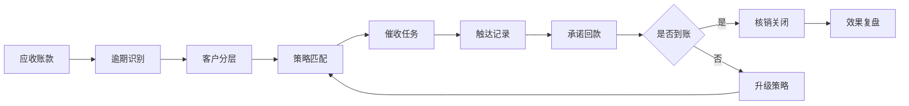
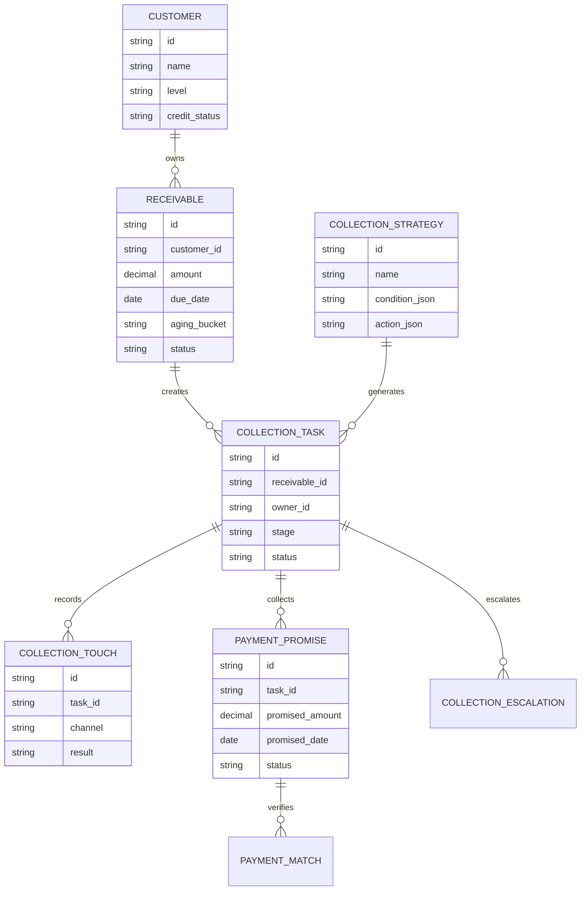
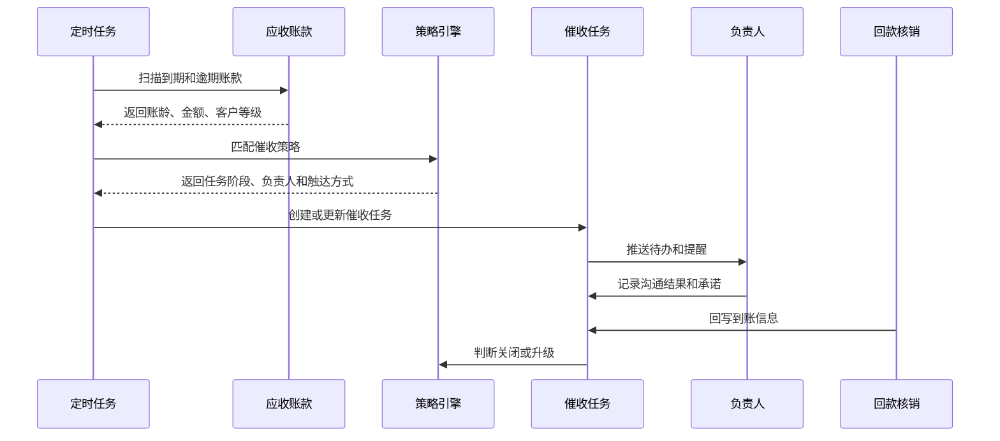
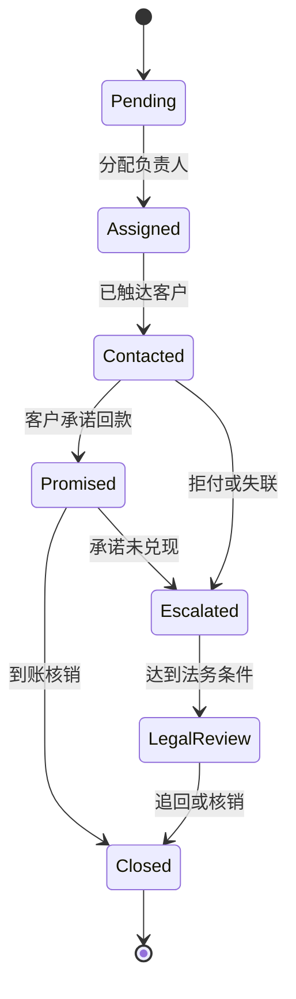
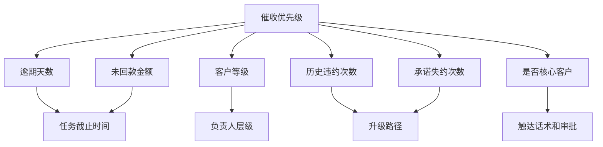

# 客户应收催收自动化项目案例

## 适合谁看

- 想理解应收账款、逾期、催收和回款核销关系的前端开发者。
- 正在做 CRM、财务应收、客户成功或风控后台的团队。
- 希望把“人工催一下”升级为“系统自动分层、提醒、跟进和复盘”的项目负责人。

## 业务目标

客户应收催收自动化不是简单发短信。它要把应收账款按照风险、金额、逾期天数、客户等级和历史承诺拆成不同策略，并把任务分配给销售、财务、客服或法务。

一个可落地的系统通常要解决 5 个问题：

1. 哪些账款需要催收。
2. 先催谁、由谁催、用什么方式催。
3. 客户承诺了什么时间回款。
4. 承诺是否兑现，没有兑现如何升级。
5. 催收动作是否有效，是否影响客户关系和信用策略。

## 催收自动化链路

初学者可以把它理解成“应收账款的待办系统”。区别是普通待办只提醒人做事，催收自动化还要根据结果改变下一步动作。

## 核心概念

| 概念 | 说明 | 容易误解的点 |
| --- | --- | --- |
| 应收账款 | 已开票或已确认收入但还没有收到的钱 | 不是订单金额，也不是合同金额 |
| 账龄 | 从应收到期日到当前日期的时间跨度 | 常见分段是 1-30、31-60、61-90、90+ |
| 催收策略 | 面向某类账款的动作组合 | 不是单一短信模板，而是任务、频率、升级和冻结规则 |
| 催收任务 | 分配给人的具体跟进行为 | 要有负责人、截止时间、结果和证据 |
| 承诺回款 | 客户承诺的付款金额和日期 | 必须记录来源和可信度 |
| 策略升级 | 催收失败后的下一层动作 | 可能升级到主管、财务冻结、法务函件 |

## 数据模型

## 推荐表结构

| 表 | 关键字段 | 作用 |
| --- | --- | --- |
| `receivable` | `customer_id`、`amount`、`due_date`、`paid_amount`、`status` | 记录每一笔应收 |
| `collection_strategy` | `condition_json`、`action_json`、`priority`、`enabled` | 管理自动催收规则 |
| `collection_task` | `receivable_id`、`owner_id`、`stage`、`deadline_at`、`status` | 承载催收待办 |
| `collection_touch` | `task_id`、`channel`、`content`、`result`、`evidence_url` | 保存触达证据 |
| `payment_promise` | `promised_amount`、`promised_date`、`source`、`status` | 管理客户承诺 |
| `collection_escalation` | `task_id`、`from_stage`、`to_stage`、`reason` | 记录升级路径 |

## 自动催收流程

## 催收状态设计

状态要尽量少，但每个状态必须能回答“下一步谁处理”。如果状态只描述情绪，比如“比较危险”，它就不适合做系统状态。

## 策略因素拆解

不要一开始就追求复杂评分模型。第一版可以用清晰规则，例如：

- 逾期 1-7 天：销售提醒。
- 逾期 8-30 天：财务协同催收。
- 逾期 31-60 天：主管介入并冻结临时额度。
- 逾期 60 天以上：法务预警和坏账评估。

## 前端页面拆分

| 页面 | 主要内容 | 设计重点 |
| --- | --- | --- |
| 应收催收看板 | 逾期金额、账龄分布、任务完成率、承诺兑现率 | 让管理者先看到风险规模 |
| 催收任务列表 | 客户、金额、逾期天数、负责人、阶段、截止时间 | 支持按负责人和风险等级筛选 |
| 催收任务详情 | 应收明细、历史触达、承诺记录、附件证据 | 信息要按时间线组织 |
| 策略配置 | 条件、动作、负责人、提醒频率、升级条件 | 规则要支持草稿和启停 |
| 承诺回款复盘 | 承诺金额、承诺日期、实际到账、偏差原因 | 用来优化策略 |

## 接口拆分建议

| 接口 | 方法 | 说明 |
| --- | --- | --- |
| `/api/receivables/overdue` | GET | 查询逾期应收 |
| `/api/collection/tasks` | GET | 查询催收任务 |
| `/api/collection/tasks/:id/touches` | POST | 新增触达记录 |
| `/api/collection/tasks/:id/promises` | POST | 登记承诺回款 |
| `/api/collection/tasks/:id/escalate` | POST | 手动升级任务 |
| `/api/collection/strategies` | POST | 保存催收策略 |
| `/api/collection/jobs/run` | POST | 手动触发策略试算 |

## 实际项目常见问题

### 1. 催收任务重复生成

原因通常是定时任务没有幂等键。推荐用 `receivable_id + strategy_id + stage` 作为生成任务的业务唯一键。

如果同一笔应收已经有未关闭任务，不要再生成新任务，只更新风险等级、截止时间或提醒次数。

### 2. 销售和财务都在催，客户体验很差

需要设置“当前主负责人”。同一阶段只允许一个主负责人对外触达，其他角色提供协同意见。

页面上可以展示协同人，但外呼、短信、邮件等动作必须归属到主负责人。

### 3. 客户承诺回款但系统不知道是否兑现

承诺回款要和实际收款流水或核销单关联。不要只靠人工点击“已回款”。

如果没有自动银行流水，可以先让财务做收款认领，再把认领结果回写到承诺记录。

### 4. 催收规则越配越乱

策略配置必须有优先级和命中说明。任务详情里要显示“为什么生成这个任务”。

推荐在策略上线前提供试算功能：选择账期日期，系统展示会命中哪些客户、产生多少任务。

### 5. 主管看不到催收效果

只统计完成任务数量意义不大。更重要的是：

- 逾期金额下降了多少。
- 承诺兑现率是多少。
- 平均回款周期是否缩短。
- 哪些策略触达后回款效果更好。

## 权限与审计

| 动作 | 权限建议 | 审计内容 |
| --- | --- | --- |
| 查看应收金额 | 财务、销售主管、客户负责人 | 查询范围和客户 ID |
| 创建催收记录 | 催收负责人 | 沟通内容、渠道、附件 |
| 修改承诺回款 | 催收负责人或财务 | 修改前后金额和日期 |
| 升级法务 | 销售主管或财务主管 | 升级原因和审批人 |
| 关闭任务 | 财务确认或系统自动核销 | 关闭依据 |

## 验收清单

- 能按账龄、金额、客户等级生成催收任务。
- 同一笔应收不会重复生成同阶段任务。
- 每次触达都有渠道、结果、时间和负责人。
- 承诺回款可以和实际到账做兑现校验。
- 策略命中原因可以在任务详情中解释。
- 管理者可以看到逾期金额、任务完成率和承诺兑现率。

## 下一步学习

完成这个案例后，可以继续学习：

- [客户账期项目案例](/projects/customer-credit-term-case)
- [客户回款风险预测项目案例](/projects/customer-payment-risk-prediction-case)
- [客户坏账处置策略项目案例](/projects/customer-bad-debt-disposal-case)

