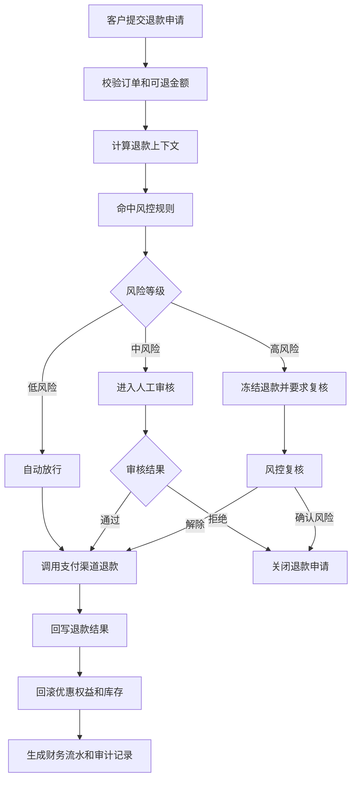
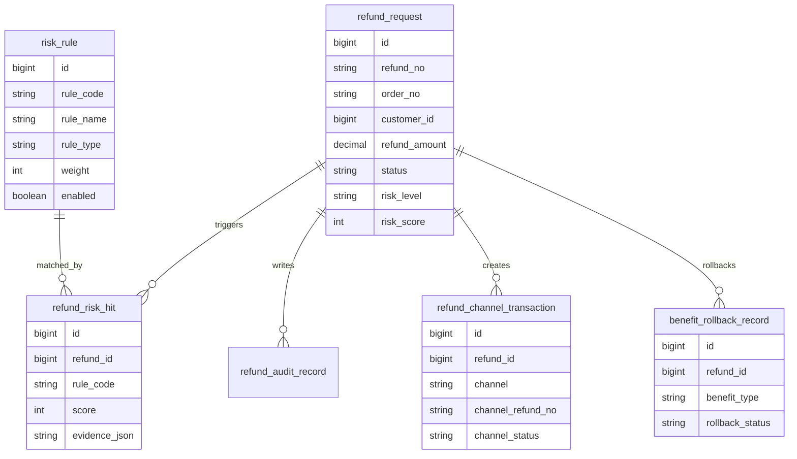
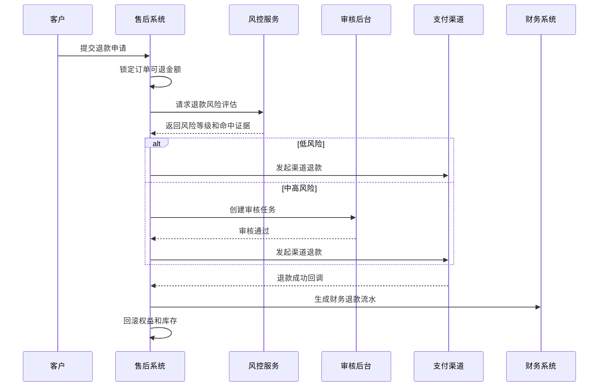
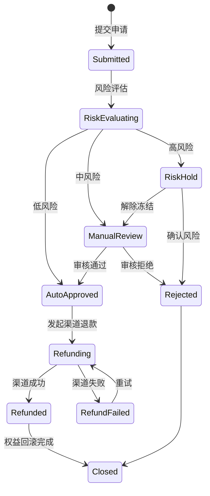

# 客户退款风控项目案例

## 适合谁看

如果你做过订单、售后、支付或财务系统，但对“退款为什么不能直接点通过”没有概念，可以先看这一篇。

退款风控不是单纯拦截用户，而是在不伤害正常客户体验的前提下，识别异常退款、重复退款、薅羊毛、撞库盗号、虚假物流和内部操作风险。

## 业务目标

客户提交退款后，系统要同时回答 5 个问题：

- 这笔退款是否真实对应一笔可退订单。
- 金额、渠道、商品、优惠券和积分是否能正确回退。
- 用户最近是否存在异常退款行为。
- 当前退款是否需要人工审核或二次确认。
- 退款放行后，财务、库存、售后和客户权益是否能保持一致。

最容易出问题的地方不是“调用支付退款接口”，而是退款前的规则判断、退款中的状态锁定、退款后的权益回滚和异常补偿。

## 客户退款风控链路

这条链路里，风控规则不应该散落在页面按钮、后端接口和支付回调里。真实项目更推荐把它抽成独立的“退款决策”步骤，所有退款都先经过同一套规则和审计。

## 核心概念

| 概念 | 说明 | 项目里的典型字段 |
| --- | --- | --- |
| 可退金额 | 当前订单还能退多少钱 | refundable_amount |
| 风险规则 | 判断退款是否异常的条件 | rule_code、rule_version |
| 风险分 | 多条规则命中后的综合评分 | risk_score |
| 风险等级 | 低、中、高或拒绝 | risk_level |
| 冻结状态 | 暂停退款执行，等待复核 | hold_status |
| 退款幂等号 | 防止同一笔退款重复提交 | refund_request_no |
| 权益回滚 | 优惠券、积分、会员成长值回退 | benefit_rollback_status |

初学者要先记住一句话：退款风控的核心不是“拦住所有风险”，而是“让每一笔退款为什么通过、为什么拦截都有证据”。

## 数据模型

这个模型里最重要的是 `refund_risk_hit`。不要只在退款单上保存一个 `risk_score`，否则后续客服、财务和审计人员无法知道风险分从哪里来。

## 推荐表结构

| 表 | 用途 | 关键字段 |
| --- | --- | --- |
| refund_request | 退款主单 | refund_no、order_no、customer_id、refund_amount、status、risk_level |
| risk_rule | 退款风控规则 | rule_code、rule_name、rule_type、weight、enabled、version |
| refund_risk_hit | 规则命中明细 | refund_id、rule_code、score、evidence_json、rule_version |
| refund_audit_record | 人工审核记录 | refund_id、auditor_id、audit_result、comment、created_at |
| refund_channel_transaction | 支付渠道退款流水 | refund_id、channel、channel_refund_no、channel_status、error_message |
| benefit_rollback_record | 权益回滚记录 | refund_id、benefit_type、rollback_status、retry_count |

`evidence_json` 里可以保存“近 30 天退款次数”“同设备多账号退款”“收货后 2 小时内极速退款”等证据。不要只保存一句“命中高风险规则”，那对排查没有帮助。

## 退款决策流程

注意顺序：先锁定可退金额，再做风险评估。否则用户或系统重试可能造成同一笔金额被多个退款申请同时占用。

## 风控规则示例

| 规则 | 判断方式 | 处理建议 |
| --- | --- | --- |
| 近 30 天退款次数过高 | customer_id 维度统计退款次数 | 中风险，人工审核 |
| 同设备多账号退款 | device_id 关联多个客户退款 | 高风险，冻结复核 |
| 高额订单极速退款 | 收货后极短时间内申请大额退款 | 中风险，补充凭证 |
| 优惠券套利 | 优惠券使用后多次部分退款 | 高风险，复核权益回滚 |
| 黑名单命中 | 手机号、银行卡、地址命中黑名单 | 高风险，禁止自动退款 |
| 内部操作异常 | 客服绕过审核直接退款 | 高风险，审计告警 |

规则要支持版本号。因为风控规则会不断调整，如果没有版本，后面复盘时无法还原当时为什么会命中。

## 退款状态设计

不要把“审核通过”和“退款成功”混成一个状态。审核通过只是允许退款，真正到账还取决于支付渠道。

## 前端页面拆分

| 页面 | 主要功能 | 新手容易漏掉 |
| --- | --- | --- |
| 退款申请列表 | 查看申请、状态、风险等级、退款金额 | 风险等级筛选和异常标识 |
| 退款详情页 | 展示订单、商品、支付、权益和风控证据 | 命中规则要能展开看证据 |
| 人工审核页 | 审核通过、拒绝、补充说明 | 审核前要提示金额和权益影响 |
| 风控规则页 | 配置规则、权重、启停、版本 | 规则发布要有灰度和审计 |
| 渠道流水页 | 查看支付退款请求和回调 | 渠道失败要能重试或人工处理 |
| 退款看板 | 统计退款率、拦截率、误杀率 | 只看退款金额不够，要看风险原因 |

页面设计上，详情页应该把“用户说什么”“订单是什么”“系统判断什么”“人工做了什么”放在同一页里，否则客服处理会频繁跳转。

## 接口拆分建议

| 接口 | 方法 | 说明 |
| --- | --- | --- |
| /api/refunds | POST | 创建退款申请 |
| /api/refunds | GET | 查询退款列表 |
| /api/refunds/:id | GET | 查询退款详情 |
| /api/refunds/:id/risk | POST | 重新执行风险评估 |
| /api/refunds/:id/audit | POST | 提交人工审核结果 |
| /api/refunds/:id/retry | POST | 渠道失败后重试退款 |
| /api/risk-rules | GET/POST | 查询和维护风控规则 |

风控评估接口最好只由后端内部调用，不要让前端直接传“风险分”。前端能展示证据，但不能决定风险等级。

## 实际项目常见问题

### 问题 1：用户重复点击导致多次退款

原因通常是前端按钮防抖不足、后端缺少幂等号、订单可退金额没有锁定。

解决方式：

- 前端提交后禁用按钮，只显示当前申请状态。
- 后端使用 `refund_request_no` 做幂等。
- 创建退款申请时锁定可退金额。
- 渠道退款请求也要保存幂等号，避免回调重复入账。

### 问题 2：支付退款成功，但权益没有回滚

退款和权益回滚通常跨系统，不能放在一个数据库事务里。

解决方式：

- 退款成功后写入权益回滚任务。
- 回滚任务支持重试和人工补偿。
- 权益回滚记录要能看到失败原因。
- 财务报表要区分“渠道已退”和“权益已回滚”。

### 问题 3：风控误杀导致正常客户体验差

风控规则太粗会把高价值客户也拦住。

解决方式：

- 风险等级分层，不要一刀切拒绝。
- 高价值客户可进入快速人工审核。
- 每条规则统计命中率、通过率和申诉成功率。
- 规则调整必须保留版本和发布记录。

### 问题 4：客服绕过风控直接退款

这是权限和审计问题，不是页面问题。

解决方式：

- 高风险退款按钮按角色和金额控制。
- 所有人工通过都写入审核记录。
- 超额退款需要二次审批。
- 审计中心定期检查异常操作。

## 权限与审计

| 权限 | 建议 |
| --- | --- |
| 查看退款 | 按组织、店铺、客户归属控制数据范围 |
| 审核退款 | 按风险等级、金额和业务线授权 |
| 强制放行 | 只给少数风控负责人，必须二次确认 |
| 修改规则 | 需要审批、版本和发布记录 |
| 导出退款数据 | 记录导出条件、导出人和文件水印 |

退款数据涉及客户、支付和财务信息，导出权限不能和普通列表查看权限混在一起。

## 验收清单

- 同一订单不能超额退款。
- 同一退款申请重复提交不会生成多笔渠道退款。
- 风险命中能看到规则、版本和证据。
- 中高风险退款必须经过审核或复核。
- 支付回调重复到达不会重复入账。
- 权益、库存、财务流水能最终一致。
- 所有人工操作都有审计记录。

## 下一步学习

建议继续阅读：

- [风控中心项目案例](/projects/risk-control-center-case)
- [售后结算项目案例](/projects/after-sales-settlement-case)
- [客户退换货质检项目案例](/projects/customer-return-quality-inspection-case)
- [数据权限审计项目案例](/projects/data-permission-audit-case)
