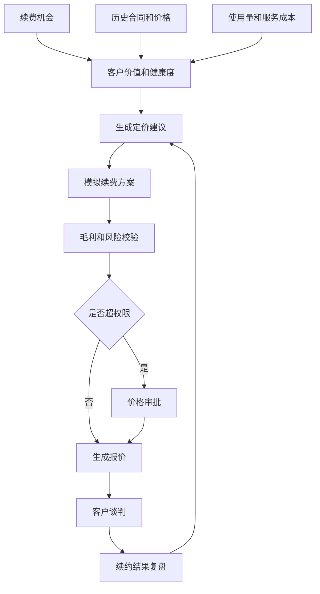
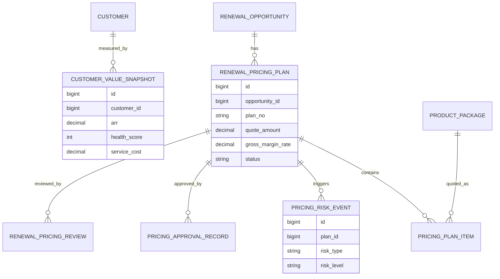
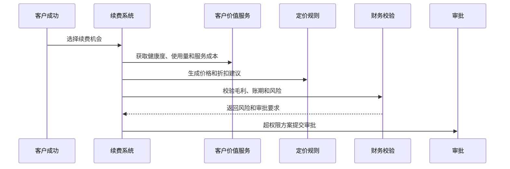
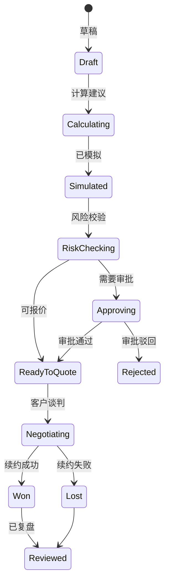
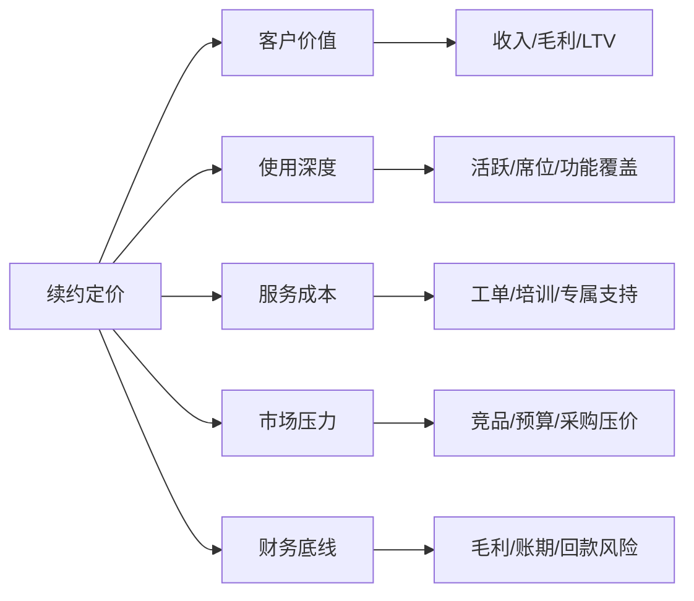

# 客户续约定价策略项目案例

## 适合谁看

如果你做过客户续费挽回、合同续签、客户生命周期价值分析或会员订阅，但还不清楚续约时价格应该怎么定、折扣怎么控、方案怎么审批，可以学习这个案例。

客户续约定价策略关注的是到期客户在续约阶段的报价、折扣、套餐、权益、账期、毛利和风险控制。它不是简单给老客户打折，而是用客户价值、使用深度、续费风险、服务成本和历史价格来生成可解释、可审批、可复盘的续约报价。

## 业务目标

客户续约定价策略要回答 6 个问题：

- 客户续约时应该维持原价、涨价、降价、套餐调整还是增加权益。
- 折扣依据来自客户价值、使用情况、风险等级、竞争压力还是服务成本。
- 续约报价是否低于毛利底线、价格政策和审批权限。
- 多个续约方案之间的收入、毛利、续费概率和现金流差异如何。
- 价格策略是否真正提升续费率和长期价值。
- 价格例外如何沉淀为政策优化，而不是每次都靠人工拍板。

真实项目里，续约定价最容易失控：销售为了保客户给大折扣，财务只看毛利，客户成功只看续费率。系统要把这些目标放到同一张决策表里。

## 客户续约定价链路

这条链路说明，定价不是报价页面的一行金额，而是从客户价值、成本、风险到审批和复盘的完整链路。

## 核心概念

| 概念 | 说明 | 新手理解 |
| --- | --- | --- |
| 续约方案 | 一次续约报价组合 | 套餐、价格、折扣、账期 |
| 定价建议 | 系统推荐的价格策略 | 保价、涨价、降价、加权益 |
| 价格底线 | 不允许低于的价格或毛利 | 防止亏损续费 |
| 折扣权限 | 不同角色可给的折扣范围 | 销售、主管、财务审批 |
| 服务成本 | 为客户提供服务的成本 | 工单、培训、专属支持 |
| 续费概率 | 客户接受方案的可能性 | 用来对比不同方案 |
| 价格例外 | 超出标准政策的报价 | 需要审批和复盘 |

续约定价最重要的是“解释性”。系统要能告诉审批人为什么推荐这个价格。

## 数据模型

续约方案要独立建模。一个续费机会可能同时准备标准价、折扣价、加权益价三个方案。

## 推荐表结构

| 表 | 用途 | 关键字段 |
| --- | --- | --- |
| `renewal_pricing_plan` | 续约定价方案 | opportunity_id、plan_no、quote_amount、discount_rate、status |
| `pricing_plan_item` | 方案明细 | plan_id、package_code、quantity、unit_price、discount_amount |
| `customer_value_snapshot` | 客户价值快照 | customer_id、arr、health_score、service_cost、ltv_score |
| `pricing_policy_rule` | 定价政策 | rule_code、scope_json、min_margin_rate、max_discount_rate |
| `pricing_risk_event` | 定价风险 | plan_id、risk_type、impact_amount、risk_level |
| `pricing_approval_record` | 价格审批 | plan_id、approver_id、approval_result、comment |
| `renewal_pricing_review` | 价格复盘 | plan_id、renewal_result、actual_amount、loss_reason |

客户价值快照要保存定价当时的数据。后续客户使用量或服务成本变化后，仍然能解释当时为什么这样报价。

## 定价建议流程

定价流程要支持人工调整，但调整后的差异必须记录，方便复盘哪些人工判断有效。

## 续约方案状态设计

不要让销售直接改最终金额。更可靠的方式是调整方案参数，再由系统重新计算毛利和风险。

## 定价因素拆解

这些因素要同时看。高价值客户不一定适合大折扣，如果服务成本很高，可能更适合套餐升级或服务边界调整。

## 前端页面拆分

| 页面 | 核心内容 | 设计建议 |
| --- | --- | --- |
| 续约定价工作台 | 到期客户、预计金额、推荐策略 | 先看高金额高风险机会 |
| 客户价值页 | ARR、健康度、使用量、服务成本 | 解释价格建议 |
| 方案配置页 | 套餐、价格、折扣、账期、权益 | 支持多方案并排 |
| 风险校验页 | 毛利底线、折扣权限、回款风险 | 风险要有证据 |
| 价格审批页 | 调整原因、方案对比、财务影响 | 审批人看摘要 |
| 报价记录页 | 报价版本、客户反馈、谈判记录 | 保留版本轨迹 |
| 定价复盘页 | 续费率、折扣、毛利、流失原因 | 优化定价规则 |

页面设计重点是“方案对比”。用户需要看标准价、折扣价、加权益价之间的收入和毛利差异。

## 接口拆分建议

| 接口 | 方法 | 说明 |
| --- | --- | --- |
| `/api/renewal-pricing/plans` | GET/POST | 查询和创建续约定价方案 |
| `/api/renewal-pricing/plans/:id/calculate` | POST | 计算定价建议 |
| `/api/renewal-pricing/plans/:id/items` | GET/POST | 查询和维护方案明细 |
| `/api/renewal-pricing/plans/:id/risk-check` | POST | 校验毛利和折扣风险 |
| `/api/renewal-pricing/plans/:id/submit-approval` | POST | 提交价格审批 |
| `/api/renewal-pricing/plans/:id/quote` | POST | 生成报价版本 |
| `/api/renewal-pricing/review` | GET | 查询定价复盘 |

定价接口要返回计算明细，不要只返回最终价格。否则前端无法解释金额来源。

## 实际项目常见问题

### 1. 老客户续约默认大折扣

销售担心客户流失，习惯用低价换续费。

解决方式：

- 折扣必须关联风险信号和客户价值。
- 高折扣自动触发毛利校验和审批。
- 优先考虑套餐调整、服务升级和付款方案。
- 复盘折扣和续费率、毛利的关系。

### 2. 报价版本混乱

客户谈判多轮后，不知道哪个报价是最终版本。

解决方式：

- 每次报价生成版本号。
- 报价版本关联方案和审批记录。
- 过期报价自动失效。
- 合同只能引用已批准报价。

### 3. 毛利测算不准

只看软件收入，忽略服务成本和支持成本。

解决方式：

- 客户价值快照纳入服务成本。
- 专属支持、培训、实施都计入成本。
- 财务确认成本版本。
- 实际续约后做偏差复盘。

### 4. 审批人不知道为什么要降价

审批材料只有折扣，没有业务证据。

解决方式：

- 审批页展示风险信号、竞品压力和方案对比。
- 调价原因结构化。
- 高金额例外需要主管和财务会签。
- 审批结论回写定价复盘。

### 5. 定价规则无法迭代

每次都是人工经验，无法沉淀。

解决方式：

- 保存方案、报价、审批和续约结果。
- 统计不同策略的续费率和毛利。
- 低效折扣策略定期下线。
- 规则调整要版本化。

## 权限与审计

| 权限点 | 控制原因 |
| --- | --- |
| 查看客户价值 | 涉及收入、毛利和使用数据 |
| 创建定价方案 | 会影响报价和合同 |
| 调整折扣 | 影响收入和毛利 |
| 审批价格例外 | 决定是否允许突破政策 |
| 生成报价 | 对客户产生商务承诺 |
| 导出定价数据 | 涉及商业敏感信息 |

审计日志要记录方案创建、参数调整、风险校验、审批意见、报价生成、客户反馈和复盘结论。

## 验收清单

- 能基于续费机会创建多个定价方案。
- 能计算客户价值、服务成本、毛利和风险。
- 能生成可解释的定价建议。
- 能校验折扣权限和毛利底线。
- 能生成报价版本并关联审批。
- 能复盘续费率、折扣、收入和毛利。

## 下一步学习

建议继续阅读：

- [客户续费挽回项目案例](/projects/customer-renewal-recovery-case)
- [合同续签项目案例](/projects/contract-renewal-case)
- [客户生命周期价值分析项目案例](/projects/customer-lifetime-value-analysis-case)
- [会员订阅项目案例](/projects/subscription-billing-case)
