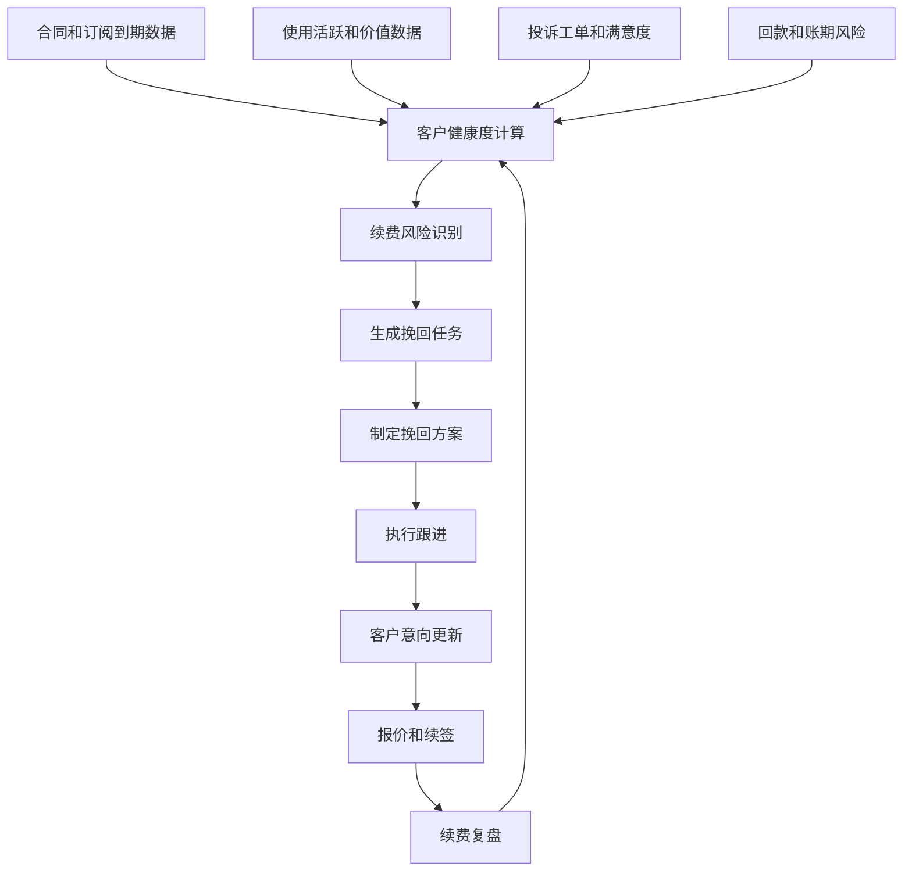
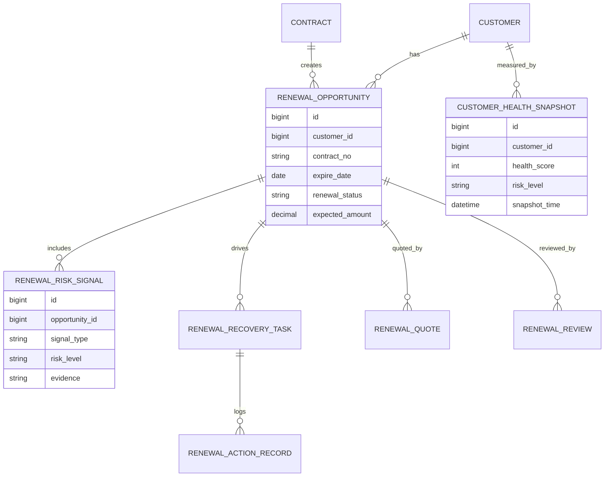
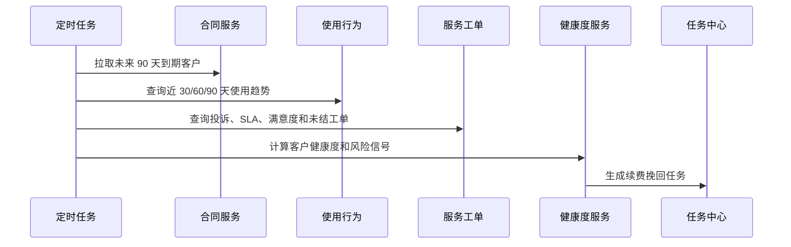
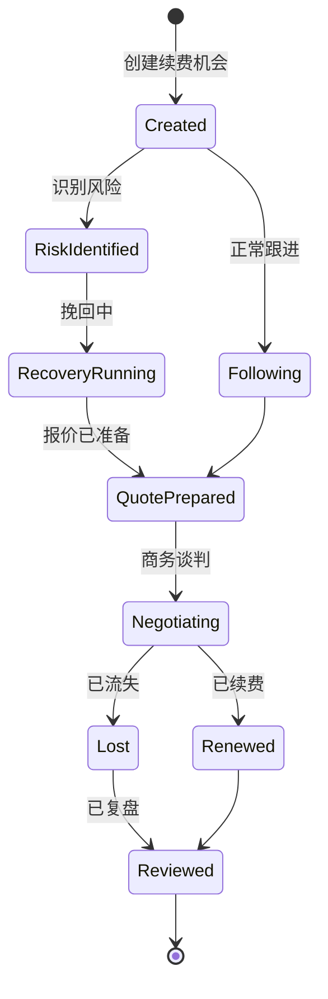
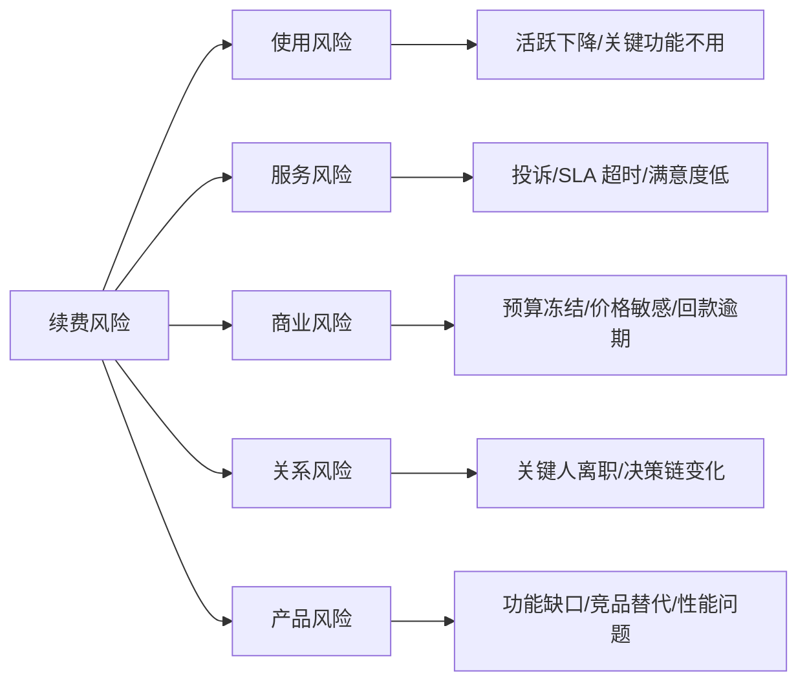

# 客户续费挽回项目案例

## 适合谁看

如果你做过客户成功、客户流失预警、客户生命周期价值分析或合同续签，但还不清楚如何把“快到期客户”变成可跟进、可挽回、可复盘的业务流程，可以学习这个案例。

客户续费挽回的重点不是到期前发一条提醒，而是把合同到期、使用活跃、客户健康度、满意度、回款风险、报价方案、跟进任务和续费结果串起来，让客户成功团队知道先救谁、怎么救、救完有没有效果。

## 业务目标

客户续费挽回要回答 6 个问题：

- 哪些客户即将到期，哪些客户最有流失风险。
- 流失风险来自使用下降、投诉、价格、预算、竞品、服务质量还是决策人变化。
- 应该由客户成功、销售、客服、技术支持还是管理层介入。
- 挽回方案是培训、服务升级、优惠、合同调整、产品改进还是高层拜访。
- 跟进动作是否及时，客户是否重新表达续费意向。
- 挽回后真实续费率、收入、毛利和客户健康度是否改善。

在真实项目中，续费失败往往不是最后一周才发生，而是在几个月前使用下降、投诉增多、关键人离职、预算冻结时就已经出现信号。系统要把这些信号提前变成任务。

## 客户续费挽回链路

这条链路说明，续费挽回不是单独的销售流程，而是客户健康度、客户成功、合同续签和收入复盘的组合。

## 核心概念

| 概念 | 说明 | 新手理解 |
| --- | --- | --- |
| 续费池 | 即将到期或需要续签的客户集合 | 未来 90 天要处理的客户 |
| 健康度 | 客户是否健康的综合评分 | 使用、投诉、回款、价值综合判断 |
| 风险信号 | 可能导致不续费的异常 | 活跃下降、投诉增多、预算冻结 |
| 挽回任务 | 针对风险客户的跟进行动 | 打电话、培训、拜访、方案调整 |
| 挽回策略 | 任务背后的处理方案 | 折扣、服务升级、产品改进 |
| 续费意向 | 客户当前续费可能性 | 强意向、观望、风险、流失 |
| 复盘结果 | 挽回是否有效 | 续费率、金额、毛利、周期 |

续费挽回最重要的是“提前”。如果系统只在合同到期当天提醒，基本已经错过最佳窗口。

## 数据模型

`RENEWAL_OPPORTUNITY` 是续费挽回的主对象。不要直接把续费字段堆在合同表上，否则到期、报价、任务、风险信号和复盘会混在一起。

## 推荐表结构

| 表 | 用途 | 关键字段 |
| --- | --- | --- |
| `renewal_opportunity` | 续费机会 | customer_id、contract_no、expire_date、expected_amount、renewal_status |
| `customer_health_snapshot` | 客户健康快照 | customer_id、health_score、risk_level、score_detail_json、snapshot_time |
| `renewal_risk_signal` | 风险信号 | opportunity_id、signal_type、risk_level、evidence、detected_at |
| `renewal_recovery_task` | 挽回任务 | opportunity_id、owner_id、task_type、due_date、status |
| `renewal_action_record` | 跟进记录 | task_id、action_type、contact_person、result、next_step |
| `renewal_strategy` | 挽回策略 | opportunity_id、strategy_type、discount_rate、service_commitment、approval_status |
| `renewal_quote` | 续费报价 | opportunity_id、quote_no、amount、discount_amount、valid_until |
| `renewal_review` | 复盘结果 | opportunity_id、renewed_amount、loss_reason、review_comment |

健康度快照要保存当时的分数明细。续费结束后复盘时，需要解释为什么当时判断为高风险。

## 风险识别流程

续费风险建议每日计算。到期日、健康度和跟进结果都会变化，任务优先级也要随之更新。

## 续费机会状态设计

续费机会要能区分“正常续费”和“风险挽回”。这样复盘时才能知道挽回策略是否有效。

## 风险信号拆解

风险信号要能落到行动。使用风险适合培训和场景辅导，服务风险适合服务升级，商业风险适合价格和付款方案。

## 前端页面拆分

| 页面 | 核心内容 | 设计建议 |
| --- | --- | --- |
| 续费总览 | 到期金额、风险金额、续费率、流失原因 | 管理层先看收入风险 |
| 续费池 | 客户、到期日、健康度、负责人、状态 | 支持按 30/60/90 天筛选 |
| 客户健康详情 | 使用、投诉、回款、满意度、风险信号 | 用证据解释风险分 |
| 挽回任务 | 任务类型、负责人、截止时间、结果 | 逾期任务要醒目 |
| 挽回策略 | 培训、优惠、服务承诺、审批 | 策略要能追踪成本 |
| 报价续签 | 报价、折扣、合同、审批 | 关联续费机会 |
| 续费复盘 | 续费率、金额、毛利、流失原因 | 用来优化下一轮策略 |

续费页面要围绕“机会”组织，而不是只展示客户列表。每个机会都要有风险、任务、报价和结果。

## 接口拆分建议

| 接口 | 方法 | 说明 |
| --- | --- | --- |
| `/api/renewals/opportunities` | GET/POST | 查询和创建续费机会 |
| `/api/renewals/opportunities/:id` | GET | 查询续费详情 |
| `/api/renewals/opportunities/:id/risk-signals` | GET | 查询风险信号 |
| `/api/renewals/opportunities/:id/tasks` | GET/POST | 查询和创建挽回任务 |
| `/api/renewals/tasks/:id/actions` | POST | 提交跟进记录 |
| `/api/renewals/opportunities/:id/strategies` | POST | 提交挽回策略 |
| `/api/renewals/opportunities/:id/quotes` | POST | 创建续费报价 |
| `/api/renewals/review` | GET | 查询续费复盘数据 |

续费机会查询要支持权限过滤。客户成功只能看自己负责客户，管理层可以看区域或团队汇总。

## 实际项目常见问题

### 1. 快到期客户太多，不知道先跟谁

只按到期时间排序，会忽略高金额、高风险客户。

解决方式：

- 用到期时间、预计金额、健康度、风险等级综合排序。
- 高金额高风险客户自动升级。
- 低风险客户走自动提醒，高风险客户生成专人任务。
- 看板展示风险金额，而不只是客户数量。

### 2. 健康度分数没人信

业务不知道分数怎么算，无法采取行动。

解决方式：

- 健康度拆成使用、服务、商业、关系、产品几个维度。
- 每个风险信号都展示证据。
- 支持人工备注和风险确认。
- 复盘时看高风险客户是否真的流失，持续校准权重。

### 3. 销售和客户成功重复跟进

缺少统一机会和任务，客户被多方打扰。

解决方式：

- 续费机会统一归口。
- 任务分配明确负责人和协作人。
- 跟进记录共享。
- 同一客户短期内限制重复触达。

### 4. 挽回靠打折，毛利下降

没有区分产品问题、服务问题和价格问题。

解决方式：

- 挽回策略必须绑定风险原因。
- 折扣需要审批和毛利测算。
- 服务升级、培训和产品方案优先于直接降价。
- 复盘同时看续费金额和毛利。

### 5. 流失原因写得很随意

复盘时大量“客户原因”“不需要了”，无法改进。

解决方式：

- 建立标准流失原因字典。
- 允许多原因和主原因。
- 高金额流失必须主管复核。
- 高频原因进入产品或服务改进任务。

## 权限与审计

| 权限点 | 控制原因 |
| --- | --- |
| 查看续费池 | 涉及客户收入和合同信息 |
| 修改健康度备注 | 会影响风险判断 |
| 分派挽回任务 | 影响客户跟进节奏 |
| 提交折扣策略 | 会影响收入和毛利 |
| 创建续费报价 | 涉及商务条款 |
| 导出续费明细 | 涉及商业敏感数据 |

审计日志要记录风险信号生成、人工风险调整、任务分派、策略审批、报价变更、续费结果和流失原因修改。

## 验收清单

- 能自动生成未来 30/60/90 天续费机会。
- 能计算客户健康度并展示风险证据。
- 能按风险金额、到期时间和健康度排序续费池。
- 能为风险客户生成挽回任务并记录跟进。
- 能配置挽回策略并关联报价和审批。
- 能区分续费成功、流失和待复盘状态。
- 能复盘续费率、挽回率、收入、毛利和流失原因。

## 下一步学习

建议继续阅读：

- [客户成功平台项目案例](/projects/customer-success-case)
- [客户流失预警项目案例](/projects/customer-churn-warning-case)
- [合同续签项目案例](/projects/contract-renewal-case)
- [客户生命周期价值分析项目案例](/projects/customer-lifetime-value-analysis-case)
