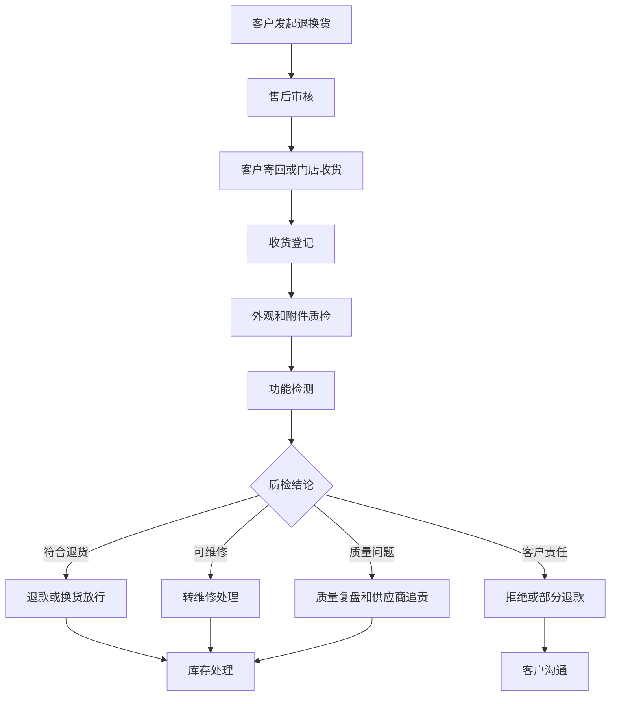
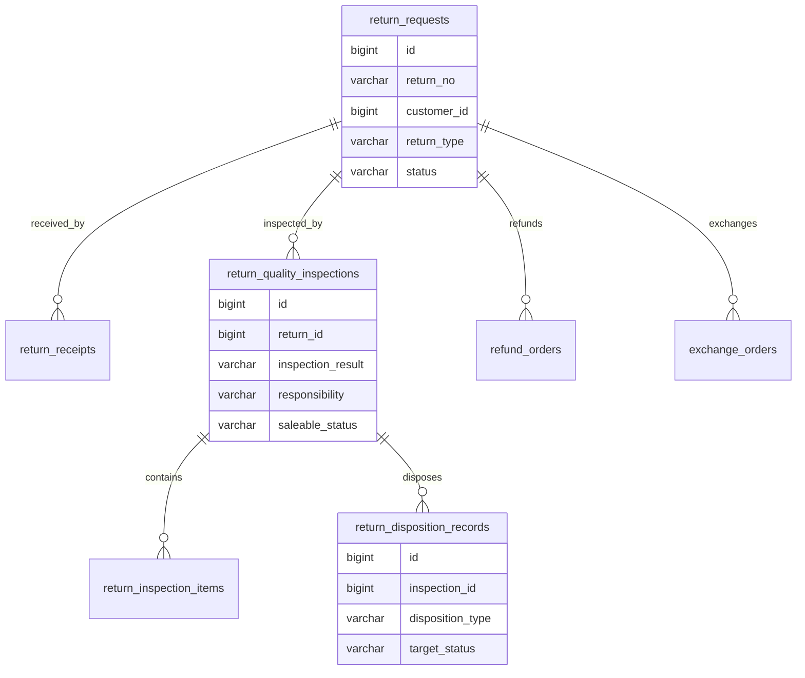
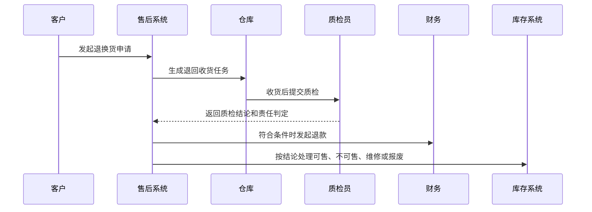

# 客户退换货质检项目案例

## 适合谁看

适合需要做客户退货、换货、售后质检、退货入库、责任判定、退款换货、质量复盘和二次销售控制的开发者。

客户退换货质检不是“收到退货后点一下通过”。真实项目里，退回商品可能来自电商订单、门店销售、企业客户合同、售后维修和客户投诉。系统要能回答：客户退回了什么、是否符合退换规则、商品状态如何、责任属于客户还是企业、是否能二次销售、退款或换货是否可以放行、质量问题是否需要复盘。

## 业务目标

第一版客户退换货质检支持：

- 从售后服务、客服工单、订单或客户门户发起退换货。
- 支持退货、换货、维修转退、拒收退回等类型。
- 支持收货登记、外观质检、功能质检、附件核对和责任判定。
- 支持质检结果驱动退款、换货、维修、拒绝退货和二次销售。
- 支持退货入库、不可售库存、报废和翻新处理。
- 支持客户责任、物流责任、供应商质量和企业责任区分。
- 支持异常升级、客户争议、赔付和投诉联动。
- 支持质检原因分析、产品质量复盘和退换率看板。

## 客户退换货质检链路

退换货质检的关键是“质检结论驱动后续动作”。如果质检只是一段备注，退款、换货、库存和质量复盘就无法自动联动。

## 核心概念

| 概念 | 说明 | 示例 |
| --- | --- | --- |
| 退换货申请 | 客户发起退货或换货诉求 | 7 天无理由退货 |
| 收货登记 | 仓库或门店确认收到退回商品 | 扫码收货 |
| 外观质检 | 检查包装、外观、磨损和破损 | 屏幕划伤 |
| 功能质检 | 检查商品功能是否正常 | 开机失败 |
| 附件核对 | 检查配件、赠品、说明书是否齐全 | 缺少充电器 |
| 责任判定 | 判断问题责任方 | 客户人为损坏 |
| 可售状态 | 判断退回商品能否再次销售 | 全新、良品、不可售 |
| 质检复盘 | 对质量问题做原因分析 | 同批次故障率高 |

退换货质检要把客户诉求和质检事实分开。客户说“质量问题”不代表质检结论一定是质量问题。

## 数据模型

## 推荐表结构

| 表 | 作用 | 关键字段 |
| --- | --- | --- |
| `return_requests` | 退换货申请 | `return_no`、`customer_id`、`order_id`、`return_type`、`reason_code`、`status` |
| `return_receipts` | 收货登记 | `return_id`、`received_qty`、`received_at`、`receiver_id`、`logistics_no` |
| `return_quality_inspections` | 质检主表 | `return_id`、`inspection_result`、`responsibility`、`saleable_status`、`inspector_id` |
| `return_inspection_items` | 质检项 | `inspection_id`、`item_code`、`standard`、`actual_result`、`passed` |
| `return_disposition_records` | 处理去向 | `inspection_id`、`disposition_type`、`target_stock_status`、`handled_qty` |
| `return_evidence_files` | 质检证据 | `return_id`、`file_id`、`evidence_type`、`uploaded_by` |
| `return_dispute_records` | 争议记录 | `return_id`、`dispute_reason`、`resolution`、`status` |
| `return_quality_analysis` | 质量复盘 | `product_id`、`batch_no`、`defect_type`、`return_rate`、`action_status` |

质检证据要保存图片、视频、检测报告和包装状态。退换货争议非常依赖证据链。

## 质检放行流程

退款和换货不能只看售后审核结果。对于需要回寄质检的商品，应在质检结论完成后再放行。

## 质检状态设计

| 状态 | 含义 | 注意点 |
| --- | --- | --- |
| 待寄回 | 客户尚未寄回 | 可超时关闭 |
| 待收货 | 已寄出等待仓库收货 | 关联物流 |
| 待质检 | 仓库已收货未质检 | 计算 SLA |
| 质检中 | 正在检测 | 可补充证据 |
| 待复核 | 高风险结论需要复核 | 避免误判 |
| 已通过 | 符合退款或换货条件 | 触发后续动作 |
| 部分通过 | 部分商品或金额通过 | 支持部分退款 |
| 已拒绝 | 不符合退换规则 | 需要客户沟通 |
| 已关闭 | 处理动作完成 | 只读归档 |

“已通过”不一定代表商品可售。退款通过和可售状态是两个维度。

## 前端页面拆分

| 页面或组件 | 作用 | 注意点 |
| --- | --- | --- |
| 退换货工作台 | 查看待收货、待质检、待复核、争议件 | 按 SLA 和金额排序 |
| 收货登记 | 扫码登记退回商品、数量和物流 | 支持差异收货 |
| 质检录入 | 按质检项录入结果、照片和结论 | 移动端友好 |
| 责任判定 | 选择客户、物流、企业、供应商责任 | 影响退款和索赔 |
| 处理去向 | 设置可售、不可售、维修、报废、翻新 | 联动库存 |
| 退款换货放行 | 根据质检结论发起动作 | 防止重复退款 |
| 争议处理 | 客户不认可时复核和沟通 | 保留证据 |
| 退换质检看板 | 分析退货率、缺陷、责任和产品批次 | 支持质量复盘 |

质检录入页要避免自由文本为主。建议用结构化质检项加证据附件，最后再允许补充说明。

## 接口拆分建议

| 接口 | 作用 | 注意点 |
| --- | --- | --- |
| `POST /returns` | 创建退换货申请 | 校验订单和规则 |
| `POST /returns/{id}/receive` | 收货登记 | 支持差异数量 |
| `POST /returns/{id}/inspections` | 提交质检 | 保存质检项和证据 |
| `POST /returns/{id}/review` | 质检复核 | 高风险结论使用 |
| `POST /returns/{id}/disposition` | 设置处理去向 | 联动库存状态 |
| `POST /returns/{id}/refund-release` | 退款放行 | 幂等防重 |
| `POST /returns/{id}/exchange-release` | 换货放行 | 检查库存 |
| `GET /returns/quality-analysis` | 查询质检分析 | 产品、批次、责任维度 |

## 实际项目常见问题

### 问题 1：客服审核通过后立刻退款，结果退回商品损坏

需要区分售前规则审核和实物质检。对于高价值商品，应质检通过后再退款。

### 问题 2：仓库收到的商品和申请不一致

收货登记要支持差异收货，例如数量不一致、型号不一致、附件缺失，并触发复核。

### 问题 3：退回商品进入可售库存后被二次投诉

可售状态要由质检结论决定。外观瑕疵、附件缺失、功能异常的商品不能直接进入可售库存。

### 问题 4：客户对拒绝退货不认可

拒绝退货必须有证据、规则依据和复核记录。否则客服只能靠口头解释。

## 权限与审计

客户退换货质检权限至少要区分：

- 创建退换货申请。
- 收货登记。
- 录入质检结果。
- 复核质检结论。
- 放行退款和换货。
- 设置库存处理去向。
- 处理客户争议。
- 导出质检分析。

质检结论、责任判定、退款放行、库存去向、复核意见和争议关闭都要审计。退换货直接影响客户权益、库存价值和财务退款。

## 验收清单

- 支持退货、换货、维修转退和拒收退回。
- 收货登记和质检流程分离。
- 质检项、质检证据和质检结论完整。
- 支持责任判定和可售状态判定。
- 质检结论能驱动退款、换货、维修、报废和入库。
- 支持客户争议和质检复核。
- 退回商品库存状态清晰。
- 质量问题可进入产品和批次复盘。
- 高价值或异常退货有审批。
- 关键动作有审计记录。

## 下一步学习

继续学习 [售后服务项目案例](/projects/after-sales-service-case)、[客户投诉闭环项目案例](/projects/customer-complaint-closed-loop-case)、[库存管理项目案例](/projects/inventory-management-case) 和 [质量追溯项目案例](/projects/quality-traceability-case)。
