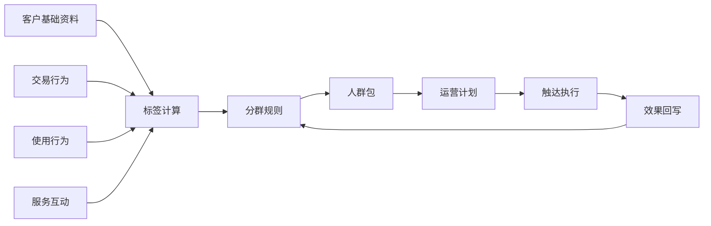
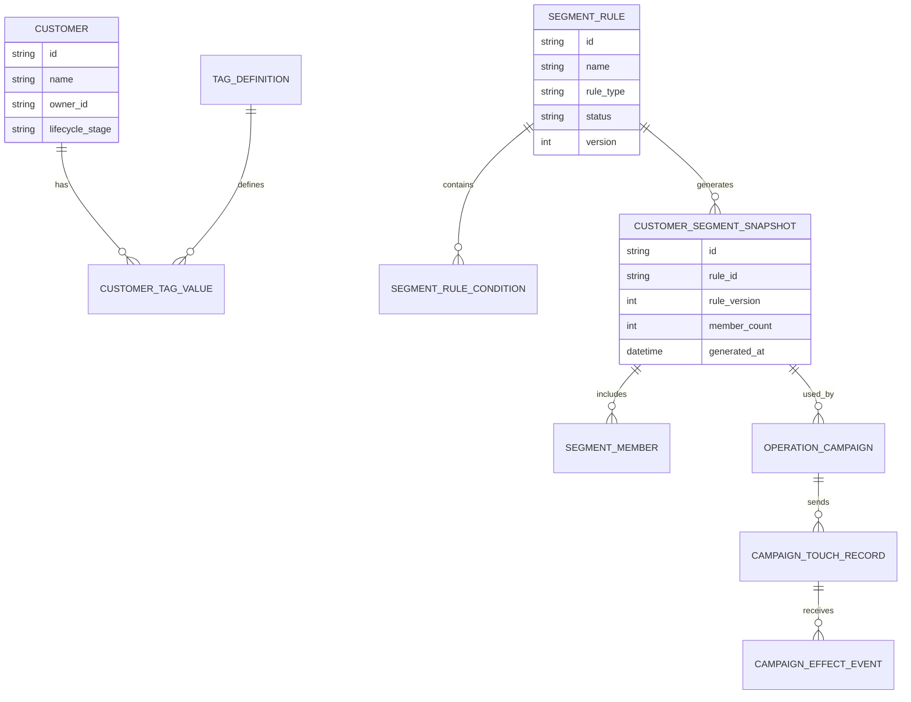
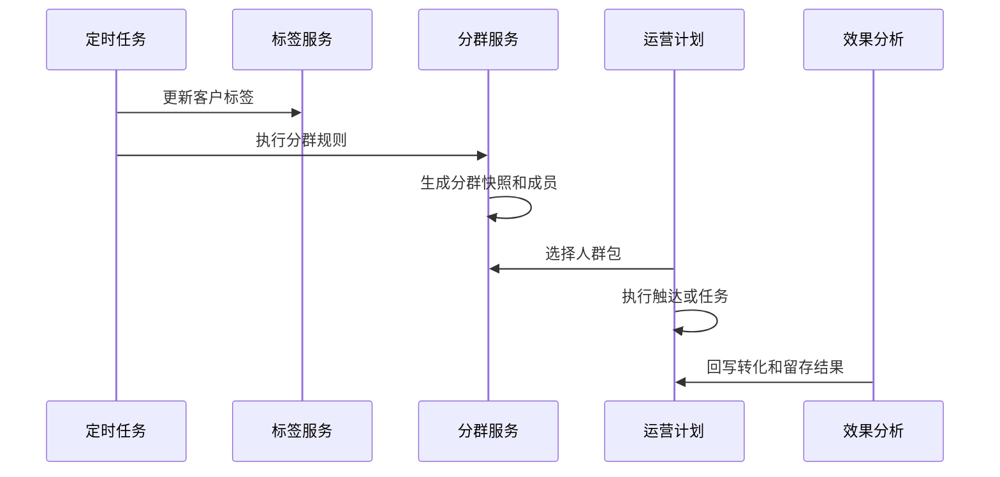
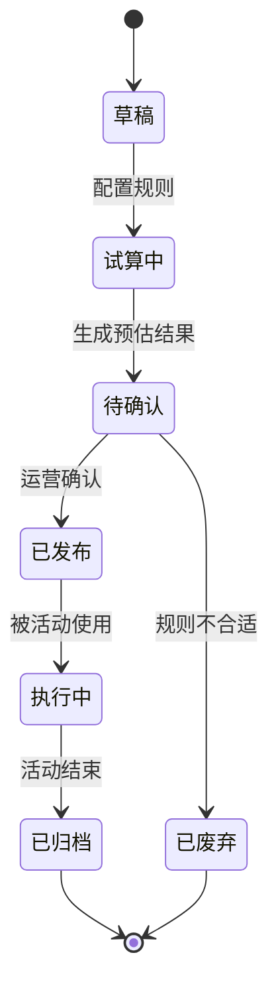
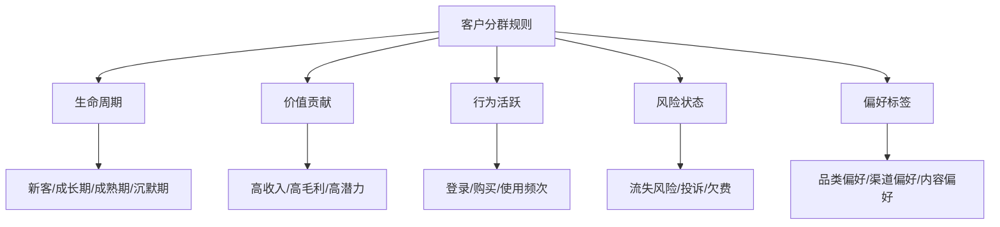

# 客户分群运营项目案例

## 适合谁看

如果你已经做过 CRM、客户成功、会员营销或客户流失预警，但不知道如何把客户分成不同人群并做差异化运营，可以学习这个案例。

客户分群运营的重点不是“给客户贴标签”，而是把标签、规则、人群包、触达计划、权益策略和效果复盘串起来，让运营动作可以重复执行、可以衡量、可以持续优化。

## 业务目标

客户分群运营要回答五个问题：

1. 客户应该按什么标准分群？
2. 分群结果是否能解释业务差异？
3. 每个群体应该采取什么运营动作？
4. 运营动作是否真正提升转化、复购、续费或留存？
5. 分群规则变化后，历史活动还能不能复盘？

在真实项目中，客户分群常见失败原因是：标签很多但没人用，人群包生成后不可追溯，触达后没有效果回写。一个可落地的分群系统，必须从“客户数据”走到“运营动作”和“效果复盘”。

## 客户分群运营链路

这条链路说明，分群不是运营动作的终点，而是运营动作的起点。真正有价值的是“这个群体适合什么策略，以及策略是否有效”。

## 核心概念

| 概念 | 含义 | 初学者理解 |
| --- | --- | --- |
| 客户标签 | 描述客户特征的字段 | 例如高价值、近 30 天活跃、快到期 |
| 分群规则 | 用标签和条件组合客户 | 例如高价值且近 14 天未登录 |
| 人群包 | 某次规则计算出来的客户集合 | 一批可以被运营的人 |
| 运营计划 | 针对人群包制定的动作 | 发券、拜访、培训、续费提醒 |
| 触达记录 | 实际发送或执行的动作记录 | 给谁发了什么，什么时候发 |
| 效果回写 | 把转化、复购、续费等结果写回 | 判断这次运营是否有效 |

## 数据模型

分群项目里最重要的是“快照”。如果只实时查询规则结果，活动结束后就无法解释当时到底运营了哪些客户。

## 推荐表结构

| 表 | 作用 | 关键字段 |
| --- | --- | --- |
| `customer` | 客户主档 | 客户名称、负责人、生命周期阶段、客户等级 |
| `tag_definition` | 标签定义 | 标签编码、标签类型、更新频率、业务含义 |
| `customer_tag_value` | 客户标签值 | 客户、标签、标签值、计算时间 |
| `segment_rule` | 分群规则 | 规则名称、版本、状态、创建人 |
| `segment_rule_condition` | 规则条件 | 标签、操作符、条件值、组合关系 |
| `customer_segment_snapshot` | 分群快照 | 规则版本、生成时间、客户数量 |
| `segment_member` | 人群成员 | 快照、客户、入群原因 |
| `operation_campaign` | 运营计划 | 人群包、渠道、权益、目标指标 |
| `campaign_touch_record` | 触达记录 | 客户、渠道、内容、发送状态 |
| `campaign_effect_event` | 效果事件 | 点击、购买、续费、留存、回款 |

## 分群生成流程

初期可以每天跑一次分群。对实时性要求高的场景，比如用户刚完成某个关键行为后立即触达，可以单独做事件触发型分群。

## 人群包状态设计

人群包不要一配置就直接发布。试算阶段可以让运营人员检查人数、样本和规则是否符合预期。

## 分群规则拆解

规则设计建议从少量高价值标签开始。标签越多，运营越难理解，也越容易出现互相矛盾的分群。

## 前端页面拆分

| 页面 | 核心内容 | 设计建议 |
| --- | --- | --- |
| 分群看板 | 人群数量、分群变化、转化率、活跃度 | 帮运营看哪些人群值得持续运营 |
| 标签管理 | 标签定义、口径、更新频率、责任人 | 标签必须说明业务含义 |
| 分群规则 | 条件配置、试算人数、样本预览 | 规则编辑要支持保存草稿和版本 |
| 人群包详情 | 成员列表、入群原因、标签分布 | 让运营知道为什么这些客户入群 |
| 运营计划 | 人群包、触达渠道、内容、权益、目标 | 和分群结果直接关联 |
| 效果复盘 | 触达率、点击率、转化率、留存、收入 | 用来判断分群是否有价值 |

## 接口拆分建议

| 接口 | 说明 |
| --- | --- |
| `GET /api/customer-tags` | 查询标签定义 |
| `GET /api/customer-segments/rules` | 查询分群规则 |
| `POST /api/customer-segments/rules` | 创建分群规则 |
| `POST /api/customer-segments/rules/:id/preview` | 试算分群人数和样本 |
| `POST /api/customer-segments/rules/:id/generate` | 生成正式人群包 |
| `GET /api/customer-segments/snapshots/:id` | 查询人群包详情 |
| `POST /api/operation-campaigns` | 基于人群包创建运营计划 |
| `GET /api/operation-campaigns/:id/effects` | 查询运营效果 |

## 实际项目常见问题

### 1. 标签太多，运营不知道怎么用

标签数量快速膨胀后，业务人员反而找不到可用标签。

解决方式：

- 标签按生命周期、价值、行为、风险、偏好分组。
- 每个标签必须有业务解释、更新频率和负责人。
- 低使用率标签定期下线。
- 分群模板只暴露高频标签，复杂标签放到高级配置。

### 2. 活动结束后无法复盘当时的人群

这是没有保存人群快照。规则后续变化后，实时查询已经不是当时的人群。

解决方式：

- 每次正式执行运营活动前生成快照。
- 快照保存规则版本、成员和入群原因。
- 效果事件关联人群快照，而不是只关联规则。
- 人群包归档后禁止修改成员，只允许备注。

### 3. 人群重叠导致重复触达

同一个客户可能同时属于高价值、快流失、沉默召回等多个人群。

解决方式：

- 运营计划设置触达优先级。
- 同一客户在短时间内限制触达次数。
- 触达前做排重和互斥规则。
- 页面展示人群重叠率，帮助运营调整规则。

### 4. 分群规则计算很慢

如果每次试算都实时扫大表，页面会很卡。

解决方式：

- 标签值预计算，分群只查标签宽表或索引表。
- 试算只返回人数和少量样本。
- 大人群包异步生成。
- 对常用分群规则做缓存。

### 5. 效果提升无法证明来自分群

如果没有对照组，活动效果可能只是自然增长。

解决方式：

- 为重要活动设置对照组。
- 对照组不触达或使用普通策略。
- 复盘时对比触达组和对照组。
- 效果指标提前定义，不要事后挑数据。

## 权限与审计

| 权限点 | 控制原因 |
| --- | --- |
| 查看客户标签 | 可能包含敏感客户画像 |
| 创建分群规则 | 会影响运营人群 |
| 导出人群包 | 涉及客户数据安全 |
| 创建触达计划 | 会对客户产生外部触达 |
| 修改标签口径 | 会影响历史分群解释 |
| 查看效果数据 | 涉及收入、转化和客户行为 |

审计日志要记录标签口径变更、规则发布、人群包导出、运营计划创建、触达执行和效果数据导出。

## 验收清单

- 能维护标签定义，并说明业务口径。
- 能用标签组合分群规则。
- 分群支持试算、发布、快照和归档。
- 人群包能展示成员和入群原因。
- 运营计划能绑定人群包并记录触达。
- 效果数据能回写到人群快照。
- 支持人群排重、触达频控和审计。

## 下一步学习

- [客户成功平台项目案例](/projects/customer-success-case)
- [客户流失预警项目案例](/projects/customer-churn-warning-case)
- [客户生命周期价值分析项目案例](/projects/customer-lifetime-value-analysis-case)
- [会员营销项目案例](/projects/member-marketing-case)
