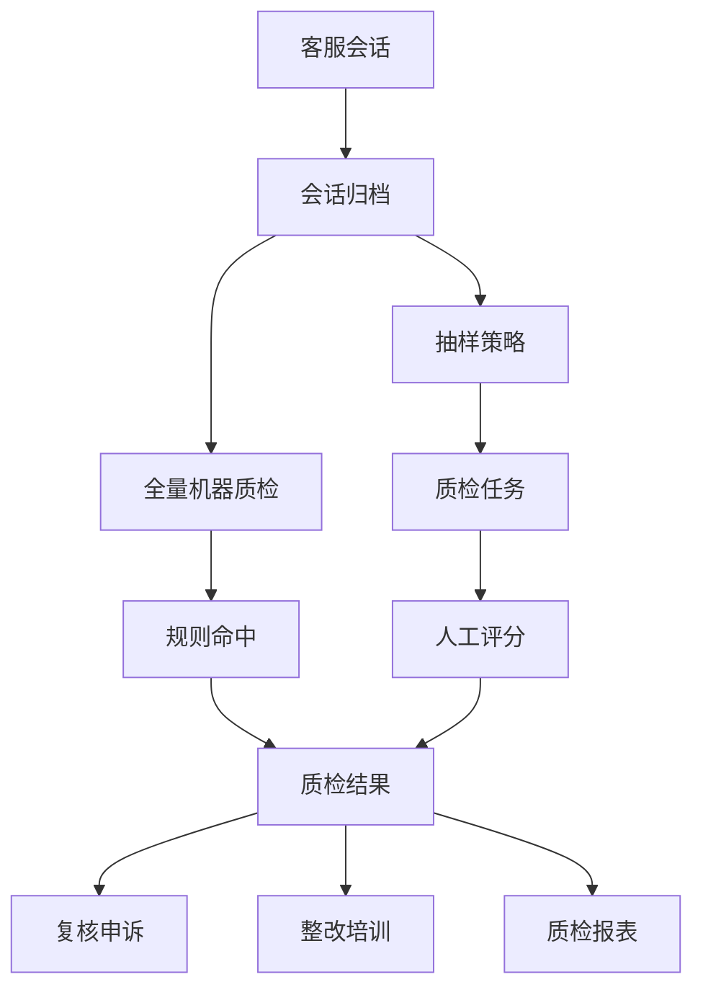
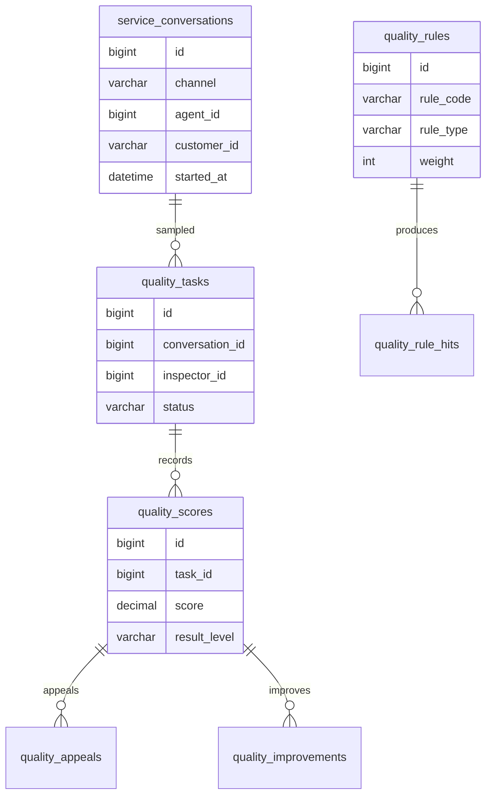
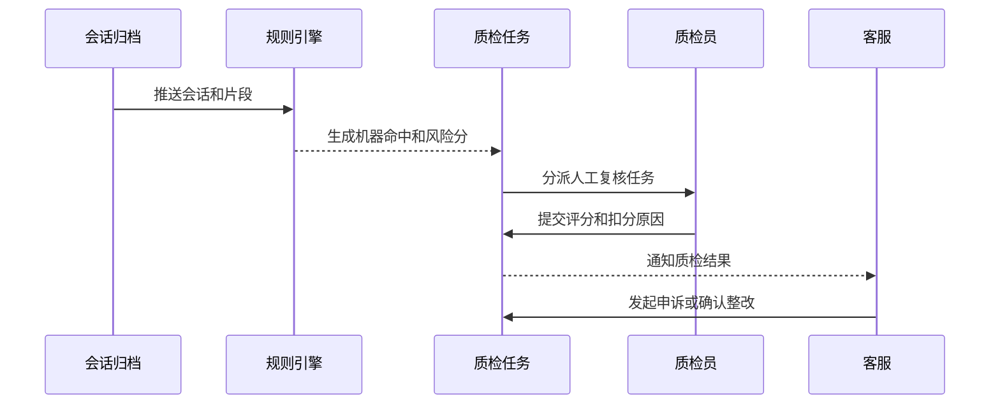

# 客服质检项目案例

## 适合谁看

适合需要做客服会话质检、录音质检、规则评分、人工复核、抽检任务、申诉流程、质检报表和服务改进闭环的开发者。

客服质检不是“给聊天记录打分”。真实项目里，会话来源很多，质检规则会变，人工复核会推翻机器评分，客服还可能申诉。系统必须能解释扣分原因、保留证据、追踪复核过程，并把问题反向推动到培训、知识库和服务流程优化。

## 业务目标

第一版客服质检支持：

- 接入在线聊天、电话录音、邮件和工单会话。
- 对会话进行抽检或全量质检。
- 支持规则评分、关键词命中、时效检查和人工评分。
- 支持质检任务分派、复核和申诉。
- 支持扣分项证据定位。
- 支持客服、团队、规则维度报表。
- 支持质检问题整改和培训闭环。

## 质检业务链路

关键原则：质检结果必须可解释。只给一个总分没有意义，必须能看到扣分规则、命中证据、会话片段和处理过程。

## 数据模型

## 推荐表结构

| 表 | 作用 | 关键字段 |
| --- | --- | --- |
| `service_conversations` | 客服会话归档 | `channel`、`agent_id`、`customer_id`、`started_at`、`ended_at` |
| `conversation_segments` | 会话片段 | `conversation_id`、`speaker`、`content`、`offset_seconds` |
| `quality_rules` | 质检规则 | `rule_code`、`rule_type`、`score_delta`、`evidence_required` |
| `quality_sampling_policies` | 抽样策略 | `team_id`、`sample_rate`、`priority_condition` |
| `quality_tasks` | 质检任务 | `conversation_id`、`inspector_id`、`status`、`deadline_at` |
| `quality_rule_hits` | 规则命中记录 | `conversation_id`、`rule_id`、`evidence_ref`、`confidence` |
| `quality_scores` | 质检评分 | `task_id`、`score`、`result_level`、`summary` |
| `quality_appeals` | 申诉记录 | `score_id`、`agent_id`、`reason`、`status` |
| `quality_improvements` | 整改事项 | `score_id`、`owner_id`、`action_plan`、`status` |

会话正文、录音转写和证据片段要分开存储。评分表只保存结果，证据表保存“为什么扣分”。

## 质检规则设计

| 规则类型 | 示例 | 处理方式 |
| --- | --- | --- |
| 关键词命中 | 出现禁用话术 | 记录命中片段并扣分 |
| 流程完整性 | 没有核实用户身份 | 人工确认或机器辅助 |
| 响应时效 | 首响超过 60 秒 | 根据时间戳计算 |
| 服务态度 | 多次打断或消极表达 | 机器初筛，人工复核 |
| 解决结果 | 未给出明确方案 | 结合工单状态判断 |

规则要有版本。历史质检结果必须保留当时的规则口径，否则后续规则调整后，旧报表会解释不清。

## 质检流程

机器质检适合发现线索，人工复核负责最终责任。高风险规则可以自动进入人工复核队列。

## 前端页面拆分

| 页面或组件 | 作用 | 注意点 |
| --- | --- | --- |
| 会话列表 | 查看待质检会话 | 支持渠道、团队、客服、风险分筛选 |
| 会话详情 | 查看聊天记录或录音转写 | 高亮规则命中片段 |
| 质检工作台 | 质检员评分 | 左侧证据，右侧评分项 |
| 规则管理 | 配置扣分规则 | 规则版本和试运行必不可少 |
| 抽样策略 | 配置抽检比例 | 区分随机抽样和风险抽样 |
| 申诉复核 | 处理客服申诉 | 展示原评分、申诉理由和复核结论 |
| 质检报表 | 看团队质量趋势 | 分数、扣分项、整改率一起看 |
| 整改任务 | 跟踪培训和改进 | 关闭时要填写结果 |

质检工作台要减少来回切换。评分项、证据片段、会话内容和历史结果应该在一个页面完成。

## 常见问题

### 问题 1：客服认为机器质检不公平

机器规则必须显示证据和置信度，高风险规则进入人工复核。不要直接用机器结果作为最终处罚依据。

### 问题 2：同一类会话不同质检员评分差异很大

评分标准不够结构化。要把评分项拆成可判断的规则，并提供样例库、质检员校准和复核抽查。

### 问题 3：质检报表分数下降，但不知道怎么改

报表不能只展示总分。要按规则、团队、业务线、会话类型拆解，并沉淀到培训和知识库改进任务。

### 问题 4：规则调整后历史数据对不上

评分必须绑定规则版本。历史结果使用历史规则解释，新规则只影响新任务或重新评分任务。

## 验收清单

- 会话归档包含渠道、客服、客户和时间信息。
- 聊天片段或录音转写可定位证据。
- 质检规则支持版本。
- 抽样策略可按团队和风险配置。
- 机器命中有证据和置信度。
- 人工评分有扣分原因。
- 客服可申诉，复核结果可追踪。
- 质检结果能生成整改任务。
- 报表能按客服、团队、规则和时间筛选。
- 规则调整不影响历史结果解释。

## 下一步学习

继续学习 [客服工单项目案例](/projects/support-ticket-case)、[工单自动化项目案例](/projects/ticket-automation-case)、[知识库平台项目案例](/projects/knowledge-base-case) 和 [规则引擎项目案例](/projects/rule-engine-case)。
