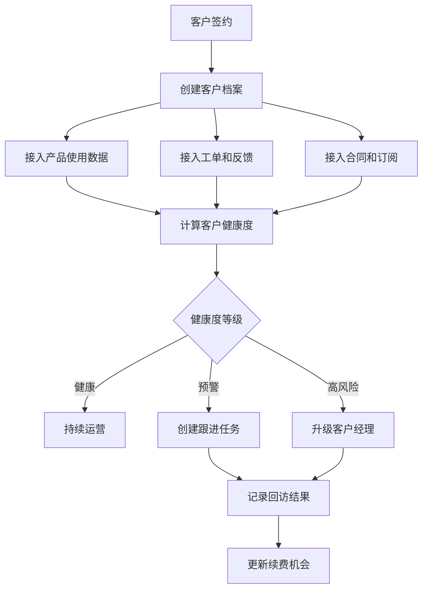
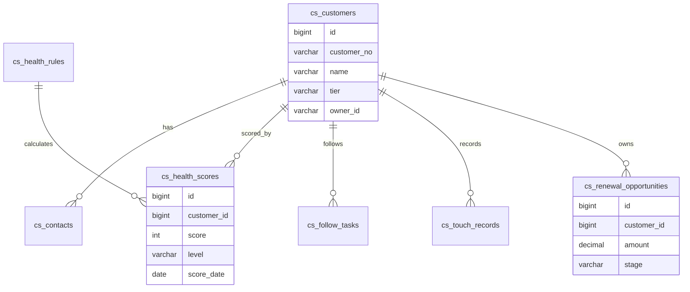
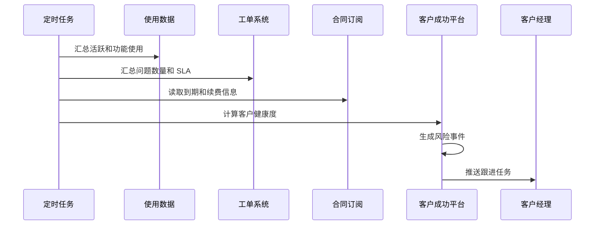

# 客户成功平台项目案例

## 适合谁看

适合需要做 SaaS 客户运营、客户健康度、续费跟进、使用行为分析、客户分层、客户触达和流失预警的开发者。

客户成功平台不是“客户列表加备注”。真实项目里，它会连接合同、订阅、工单、产品使用日志、回访记录和续费机会。它的目标是让团队提前发现风险客户，持续提升客户价值，而不是等客户要流失时才临时补救。

## 业务目标

第一版客户成功平台支持：

- 建立客户档案。
- 计算客户健康度。
- 记录客户联系人和关键人。
- 跟踪使用行为和活跃度。
- 管理续费机会。
- 创建客户跟进任务。
- 记录沟通和回访。
- 识别流失风险。
- 展示客户成功看板。

## 客户成功链路

这条链路要抓住一个重点：客户成功不是单点功能，而是把“客户使用情况”和“团队跟进行为”放到同一个视角里。

## 数据模型

## 推荐表结构

| 表 | 作用 | 关键字段 |
| --- | --- | --- |
| `cs_customers` | 客户档案 | `customer_no`、`name`、`tier`、`owner_id`、`status` |
| `cs_contacts` | 客户联系人 | `customer_id`、`name`、`role`、`phone`、`email` |
| `cs_health_rules` | 健康度规则 | `metric_code`、`weight`、`threshold_config`、`enabled` |
| `cs_health_scores` | 健康度快照 | `customer_id`、`score`、`level`、`reason_snapshot` |
| `cs_follow_tasks` | 跟进任务 | `customer_id`、`task_type`、`due_at`、`status` |
| `cs_touch_records` | 触达记录 | `customer_id`、`channel`、`summary`、`next_action` |
| `cs_renewal_opportunities` | 续费机会 | `customer_id`、`amount`、`stage`、`expected_close_at` |
| `cs_risk_events` | 风险事件 | `customer_id`、`risk_type`、`severity`、`status` |

健康度要保存原因快照。否则分数变化后，客户经理不知道是活跃下降、工单增多、续费临近还是关键人变动导致风险升高。

## 健康度计算流程

健康度不要只看登录次数。一个客户可能登录很频繁，但一直在报错或提交高优先级工单，这类客户仍然有流失风险。

## 健康度指标

| 指标 | 示例 | 解释 |
| --- | --- | --- |
| 活跃度 | 近 14 天登录人数下降 | 判断产品是否被持续使用 |
| 功能深度 | 核心功能使用率低 | 判断客户是否获得价值 |
| 工单压力 | 高优先级工单增加 | 判断客户体验是否变差 |
| 续费距离 | 合同 60 天内到期 | 判断是否需要提前跟进 |
| 关键人变化 | 管理员长期未登录 | 判断客户内部推动力 |
| 欠费风险 | 账单逾期未支付 | 判断商业风险 |

指标要按业务逐步增加。第一版可以先做活跃、工单、续费三个维度，后续再引入更复杂的评分模型。

## 前端页面拆分

| 页面 | 作用 | 注意点 |
| --- | --- | --- |
| 客户列表 | 查看客户、等级和负责人 | 健康度和到期时间要醒目 |
| 客户详情 | 汇总档案、联系人、合同、工单和使用数据 | 避免信息散在多个系统 |
| 健康度详情 | 展示分数、趋势和原因 | 解释分数来源 |
| 跟进任务 | 管理客户经理待办 | 支持逾期提醒 |
| 触达记录 | 记录电话、会议和邮件 | 能沉淀下一步动作 |
| 续费机会 | 管理续费阶段和金额 | 关注预计签约时间 |
| 风险看板 | 展示风险客户和续费预测 | 按等级、行业和负责人筛选 |

## 实际项目常见问题

### 问题 1：客户健康度分数没人相信

通常是规则不透明。健康度详情必须展示评分原因，例如“核心功能使用下降 30%”“高优先级工单 3 个未关闭”。

### 问题 2：客户经理忘记跟进高风险客户

风险识别后必须自动创建跟进任务，并设置负责人和截止时间。只在看板上标红不够。

### 问题 3：续费预测和财务数据对不上

续费机会是销售预测，合同和账单是财务事实。两个数据要关联，但不能混成一个字段。

## 验收清单

- 客户档案有负责人和客户等级。
- 客户联系人和关键人可维护。
- 客户健康度有规则、分数和原因快照。
- 能接入产品使用、工单和订阅数据。
- 高风险客户会生成风险事件。
- 风险事件能转为跟进任务。
- 触达记录能沉淀下一步动作。
- 续费机会和合同账单边界清晰。
- 看板能按客户经理、等级和风险筛选。
- 客户关键操作有审计记录。

## 下一步学习

继续学习 [会员订阅项目案例](/projects/subscription-billing-case)、[客服工单项目案例](/projects/support-ticket-case) 和 [数据看板项目案例](/projects/analytics-dashboard-case)。
