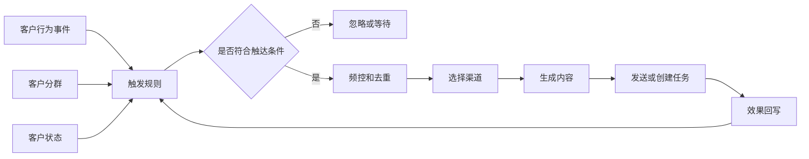
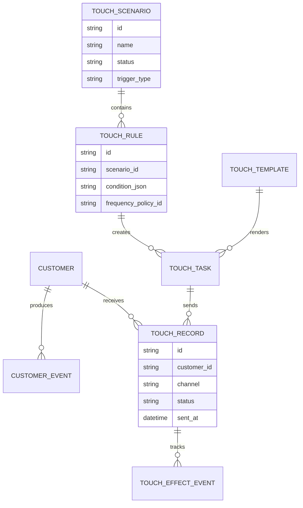
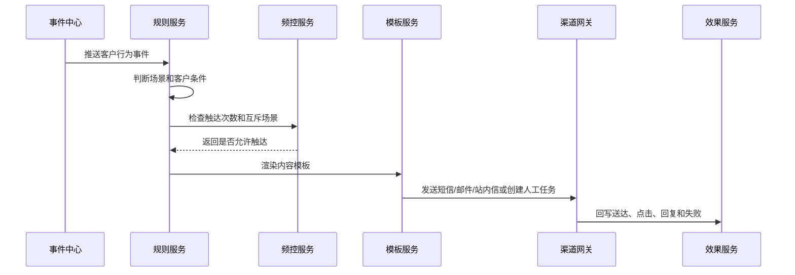
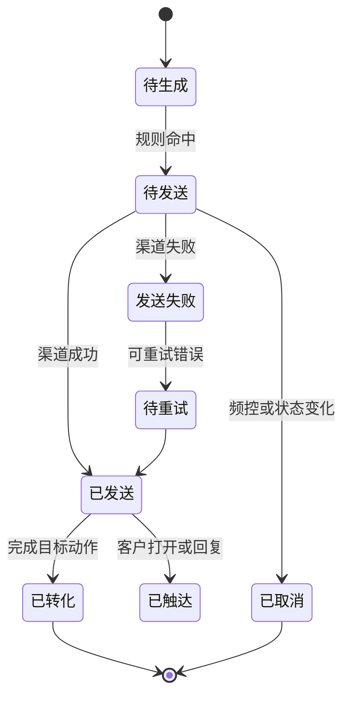
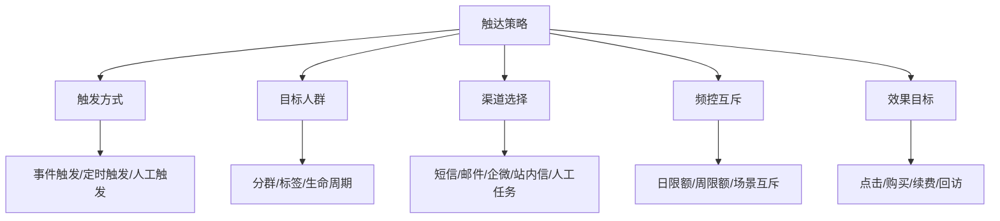

# 客户触达自动化项目案例

## 适合谁看

如果你已经做过客户分群、会员营销、客户成功或 CRM，但不知道如何把“该联系谁、什么时候联系、发什么内容、如何避免打扰”自动化，可以学习这个案例。

客户触达自动化不是简单群发短信或邮件，而是把客户行为、分群结果、触达渠道、频控规则、内容模板、任务流转和效果回写连接起来，形成一套可运营、可审计、可复盘的自动化体系。

## 业务目标

客户触达自动化要回答：

1. 什么事件会触发触达？
2. 触达对象是否符合规则？
3. 通过哪个渠道触达最合适？
4. 触达内容是否个性化？
5. 触达后是否产生转化、续费、回访或投诉？

真实项目里，触达系统最容易出问题的地方是频控和闭环：同一个客户被多个活动重复打扰，或者消息发出去后没人知道是否有效。

## 客户触达自动化链路

这条链路说明，自动触达不是“事件来了就发消息”，而是要经过规则判断、频控、渠道选择和效果回写。

## 核心概念

| 概念 | 含义 | 初学者理解 |
| --- | --- | --- |
| 触发事件 | 引发触达的业务事件 | 注册、下单、沉默、即将到期 |
| 触达规则 | 判断是否应该触达 | 满足什么条件才发消息 |
| 频控 | 限制触达次数和间隔 | 防止客户被频繁打扰 |
| 渠道策略 | 选择短信、邮件、站内信、企业微信、人工任务 | 不同客户适合不同方式 |
| 内容模板 | 触达内容和变量 | 比如客户名、优惠券、到期时间 |
| 效果回写 | 记录触达后的行为 | 点击、回复、购买、续费、投诉 |

## 数据模型

触达系统要区分“任务”和“记录”。任务代表待执行动作，记录代表实际发送或执行结果。

## 推荐表结构

| 表 | 作用 | 关键字段 |
| --- | --- | --- |
| `customer_event` | 客户行为事件 | 客户、事件类型、事件时间、事件属性 |
| `touch_scenario` | 触达场景 | 场景名称、触发类型、状态、负责人 |
| `touch_rule` | 触达规则 | 条件、目标人群、频控、优先级 |
| `frequency_policy` | 频控策略 | 周期、最大次数、互斥场景、冷却时间 |
| `touch_template` | 内容模板 | 渠道、标题、正文、变量、版本 |
| `touch_task` | 待触达任务 | 客户、场景、渠道、计划发送时间、状态 |
| `touch_record` | 触达记录 | 发送状态、失败原因、回执、发送时间 |
| `touch_effect_event` | 效果事件 | 点击、回复、购买、续费、投诉 |

## 触达执行流程

自动触达建议用异步任务执行。发送渠道经常会超时、限流或失败，不能把它放在核心交易链路里。

## 触达任务状态设计

不要只记录“发送成功”。对运营来说，送达、打开、点击、回复和转化是不同层次的效果。

## 触达策略拆解

触达策略拆清楚后，产品页面和后端接口边界会更明确。规则配置、模板配置、频控配置不要混成一个大表单。

## 前端页面拆分

| 页面 | 核心内容 | 设计建议 |
| --- | --- | --- |
| 触达看板 | 触达人数、送达率、点击率、转化率、投诉率 | 同时看效果和打扰风险 |
| 触达场景 | 场景列表、触发方式、状态、负责人 | 场景是运营管理的主对象 |
| 规则配置 | 目标人群、触发条件、频控、优先级 | 规则支持试算和版本 |
| 模板管理 | 渠道模板、变量、预览、审核 | 防止错误内容直接发送 |
| 触达记录 | 客户、渠道、状态、失败原因、效果 | 用于排查和审计 |
| 效果复盘 | 转化漏斗、对照组、收益、退订投诉 | 判断触达是否值得继续 |

## 接口拆分建议

| 接口 | 说明 |
| --- | --- |
| `GET /api/touch/dashboard` | 查询触达总览 |
| `GET /api/touch/scenarios` | 查询触达场景 |
| `POST /api/touch/scenarios` | 创建触达场景 |
| `POST /api/touch/rules/:id/preview` | 规则试算 |
| `POST /api/touch/tasks/generate` | 生成触达任务 |
| `POST /api/touch/tasks/:id/cancel` | 取消触达任务 |
| `GET /api/touch/records` | 查询触达记录 |
| `GET /api/touch/scenarios/:id/effects` | 查询场景效果 |

## 实际项目常见问题

### 1. 客户一天收到多条消息

通常是多个场景同时命中，但没有统一频控。

解决方式：

- 建立全局频控，而不是每个活动单独控制。
- 设置场景优先级和互斥关系。
- 触达前查询近期触达记录。
- 对重要客户设置更严格的打扰保护。

### 2. 发送成功但没有效果数据

渠道回执只说明消息发出，不说明客户行为。

解决方式：

- 短链、按钮、表单和优惠券都要带追踪参数。
- 效果事件关联触达记录。
- 关键目标提前定义转化窗口。
- 复盘时区分送达率、点击率和转化率。

### 3. 内容模板变量错误

变量缺失会导致客户收到错误内容。

解决方式：

- 模板发布前做变量校验。
- 提供样例客户预览。
- 缺失变量时走兜底文案或取消发送。
- 模板修改走审核和版本。

### 4. 自动触达影响人工跟进

客户成功或销售正在沟通时，系统又自动发消息，体验很差。

解决方式：

- 触达规则读取客户当前跟进状态。
- 人工跟进期设置免打扰。
- 自动触达可以生成任务给负责人确认。
- 高价值客户优先使用人工触达。

### 5. 退订和投诉没有进入规则

如果客户已经退订还继续发送，会造成合规风险。

解决方式：

- 退订状态作为频控前置条件。
- 不同渠道维护独立订阅状态。
- 投诉客户进入冷却期。
- 敏感渠道操作保留审计。

## 权限与审计

| 权限点 | 控制原因 |
| --- | --- |
| 创建触达场景 | 会影响客户体验 |
| 发布模板 | 可能触达大量客户 |
| 修改频控 | 影响合规和打扰风险 |
| 导出触达记录 | 包含客户联系方式和行为 |
| 查看效果数据 | 涉及收入和转化 |

审计日志要记录场景发布、规则变更、模板审核、任务取消、人工补发、退订处理和数据导出。

## 验收清单

- 能按事件、定时和人工方式触发触达。
- 能配置目标人群、规则、模板、渠道和频控。
- 同一客户能做跨场景去重和互斥。
- 触达记录能追踪发送、送达、点击、回复和转化。
- 模板支持变量校验、预览和版本。
- 效果能按场景、人群和渠道复盘。
- 退订、投诉和敏感操作有权限和审计。

## 下一步学习

- [客户分群运营项目案例](/projects/customer-segmentation-operation-case)
- [会员营销项目案例](/projects/member-marketing-case)
- [客户成功平台项目案例](/projects/customer-success-case)
- [客户流失预警项目案例](/projects/customer-churn-warning-case)
