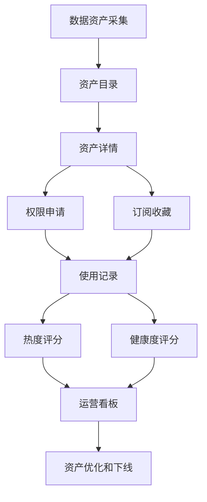
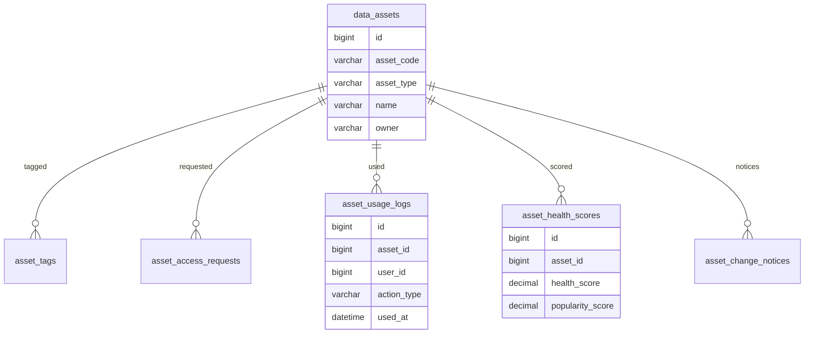
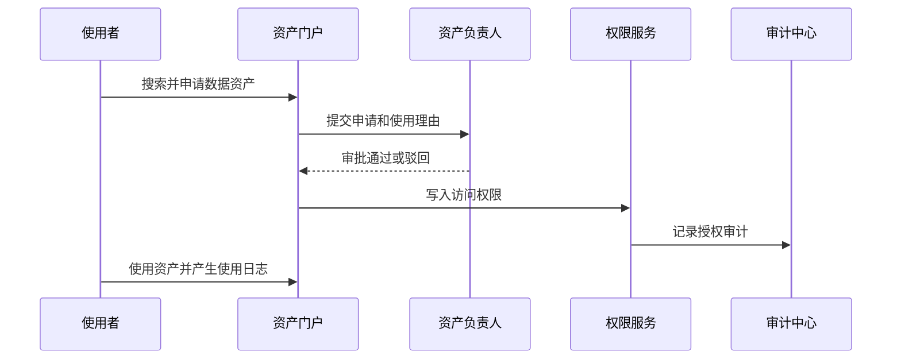

# 数据资产运营项目案例

## 适合谁看

适合需要做数据资产目录、数据产品、指标资产、数据申请、数据使用统计、资产健康度、数据服务运营和数据价值评估的开发者。

数据资产运营和数据治理不完全一样。数据治理关注“数据是否规范、安全、可追踪”，数据资产运营更关注“哪些数据被使用、谁在用、有没有价值、是否需要下线或重点维护”。如果只有数据目录，没有使用统计和运营机制，数据资产很容易变成无人维护的静态清单。

## 业务目标

第一版数据资产运营平台支持：

- 汇总数据表、指标、报表、API 和数据集。
- 维护资产负责人、标签、说明和使用范围。
- 支持数据资产搜索、收藏、申请和订阅。
- 统计访问量、调用量、导出量和失败率。
- 评估资产健康度、热度和价值等级。
- 支持资产变更通知、下线申请和影响分析。
- 支持运营看板和资产月报。

## 数据资产运营链路

核心原则：资产要同时有“说明”和“行为数据”。说明告诉用户它是什么，行为数据告诉运营人员它是否真的被使用。

## 数据模型

## 推荐表结构

| 表 | 作用 | 关键字段 |
| --- | --- | --- |
| `data_assets` | 数据资产主表 | `asset_code`、`asset_type`、`name`、`owner_id`、`status` |
| `asset_tags` | 资产标签 | `asset_id`、`tag_code`、`tag_type` |
| `asset_relations` | 资产关系 | `source_asset_id`、`target_asset_id`、`relation_type` |
| `asset_access_requests` | 数据申请 | `asset_id`、`applicant_id`、`reason`、`status` |
| `asset_usage_logs` | 使用日志 | `asset_id`、`user_id`、`action_type`、`used_at` |
| `asset_subscriptions` | 资产订阅 | `asset_id`、`user_id`、`notice_type` |
| `asset_health_scores` | 健康评分 | `asset_id`、`health_score`、`popularity_score` |
| `asset_change_notices` | 变更通知 | `asset_id`、`change_type`、`impact_scope`、`sent_at` |

资产类型建议先统一枚举，例如 `table`、`metric`、`report`、`api`、`dataset`。不要让每个团队随意创造类型。

## 资产评分模型

| 评分维度 | 说明 | 示例指标 |
| --- | --- | --- |
| 完整度 | 资产说明是否完整 | 是否有负责人、字段说明、口径、标签 |
| 热度 | 是否被频繁使用 | 访问人数、调用次数、收藏数 |
| 稳定性 | 使用是否稳定可靠 | 查询失败率、接口错误率、刷新延迟 |
| 风险 | 是否涉及敏感或高影响资产 | 敏感级别、下游依赖数量 |
| 价值 | 是否支撑关键业务 | 关联报表、业务线、决策场景 |

评分不是为了排名好看，而是为了决定运营动作：重点维护、补充说明、推动下线、通知负责人或提升服务等级。

## 资产申请流程

申请理由和使用范围要结构化。后续审计、续期和回收权限时，需要知道用户为什么获得这个资产。

## 前端页面拆分

| 页面或组件 | 作用 | 注意点 |
| --- | --- | --- |
| 资产门户首页 | 搜索和推荐资产 | 展示热门资产和最近更新 |
| 资产详情页 | 查看说明、口径、负责人、血缘 | 说明不完整要提示 |
| 权限申请页 | 申请访问资产 | 申请范围、理由、期限要明确 |
| 我的资产 | 查看收藏、订阅、申请记录 | 支持到期提醒 |
| 资产运营看板 | 查看热度、健康度、风险 | 指标口径要固定 |
| 资产负责人工作台 | 处理申请和补说明 | 展示待办优先级 |
| 变更影响页 | 下线或变更前看影响 | 展示订阅者和下游资产 |

资产详情页要让用户快速判断三个问题：这个资产能不能解决我的问题、数据口径是什么、怎么申请使用。

## 常见问题

### 问题 1：资产很多，但用户还是找不到

通常是标签、业务名称和搜索权重没有治理。资产名称要使用业务语言，搜索结果要按热度、完整度和权限可用性排序。

### 问题 2：资产负责人离职后没人维护

负责人不能只绑定个人，最好同时绑定团队。离职或组织调整时，资产负责关系要进入交接流程。

### 问题 3：没人知道某个数据 API 能不能下线

必须记录使用日志、订阅者和下游依赖。下线前先生成影响范围，通知订阅者并观察一段时间。

### 问题 4：用户申请了数据但长期不用

权限要有有效期，使用日志要能识别闲置权限。长期未使用的授权应进入回收提醒。

## 验收清单

- 数据资产有统一类型和唯一编码。
- 资产详情包含业务说明、负责人、标签和使用方式。
- 支持搜索、收藏、订阅和申请。
- 访问和导出行为可记录。
- 资产健康度和热度可计算。
- 变更或下线前能看到影响范围。
- 权限申请有理由、范围和有效期。
- 负责人变更有交接机制。
- 运营看板能识别热门资产、低质量资产和高风险资产。
- 资产下线有通知和审计。

## 下一步学习

继续学习 [数据治理平台项目案例](/projects/data-governance-case)、[主数据管理项目案例](/projects/master-data-case)、[数据交换平台项目案例](/projects/data-exchange-platform-case) 和 [数据权限审计项目案例](/projects/data-permission-audit-case)。
