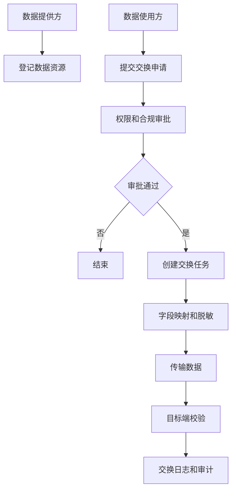
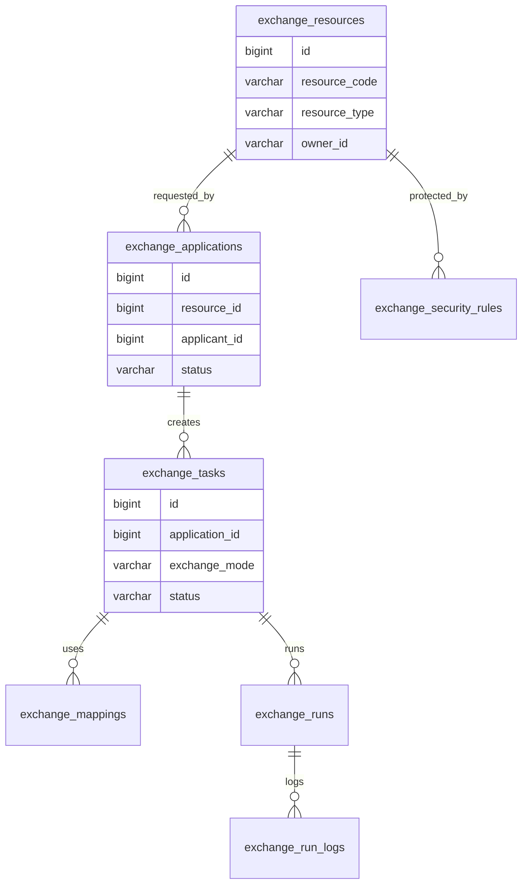
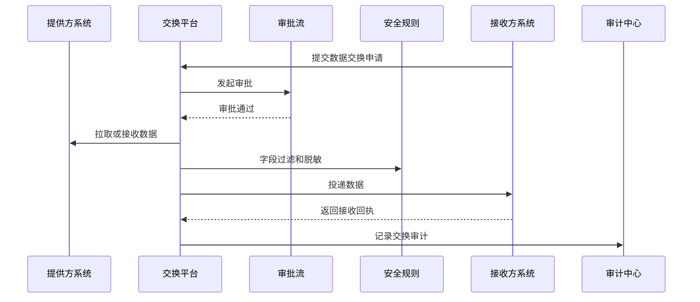

# 数据交换平台项目案例

## 适合谁看

适合需要做跨系统数据交换、文件交换、接口交换、数据订阅、字段映射、交换审批、交换监控和数据安全审计的开发者。

数据交换平台不是“传一个 Excel 文件”。真实项目里，数据会在部门、系统、租户、集团子公司和外部合作方之间流动。交换平台要解决交换目录、授权审批、字段映射、脱敏、传输、校验、监控、失败补偿和审计追踪。

## 业务目标

第一版数据交换平台支持：

- 登记数据资源。
- 配置数据交换任务。
- 支持 API、文件和消息交换。
- 支持字段映射和格式转换。
- 支持交换申请和审批。
- 支持敏感字段脱敏。
- 支持任务监控和失败重试。
- 支持交换审计。

## 数据交换链路

数据交换的关键不是“传过去”，而是能证明谁申请、谁审批、传了什么、是否脱敏、目标是否接收成功。

## 数据模型

## 推荐表结构

| 表 | 作用 | 关键字段 |
| --- | --- | --- |
| `exchange_resources` | 数据资源目录 | `resource_code`、`resource_type`、`owner_id`、`sensitivity_level` |
| `exchange_applications` | 交换申请 | `resource_id`、`applicant_id`、`purpose`、`status` |
| `exchange_tasks` | 交换任务 | `application_id`、`exchange_mode`、`schedule_rule`、`status` |
| `exchange_mappings` | 字段映射 | `task_id`、`source_field`、`target_field`、`transform_rule` |
| `exchange_security_rules` | 安全规则 | `resource_id`、`field_code`、`mask_rule`、`approval_level` |
| `exchange_runs` | 执行批次 | `task_id`、`started_at`、`finished_at`、`run_status` |
| `exchange_run_logs` | 执行日志 | `run_id`、`level`、`message`、`trace_id` |
| `exchange_receipts` | 接收回执 | `run_id`、`receiver_status`、`row_count`、`checksum` |

敏感字段必须进入交换审批和脱敏链路。只在数据目录里标记敏感，不会自动降低泄露风险。

## 交换执行流程

交换结果要有回执。没有回执就无法判断数据是真的被接收，还是只是在平台侧发送成功。

## 交换模式

| 模式 | 适合场景 | 注意点 |
| --- | --- | --- |
| API 拉取 | 小批量、实时查询 | 要做鉴权和限流 |
| API 推送 | 事件触发同步 | 对方失败要重试 |
| 文件交换 | 大批量、离线数据 | 要校验文件完整性 |
| 消息订阅 | 状态变更、准实时 | 要处理幂等 |
| 数据库同步 | 内部系统高频同步 | 权限和脱敏要严格 |

第一版建议先支持 API 和文件交换，消息订阅可以在事件体系稳定后再扩展。

## 前端页面拆分

| 页面 | 作用 | 注意点 |
| --- | --- | --- |
| 数据资源目录 | 查看可申请资源 | 展示敏感级别和负责人 |
| 交换申请 | 填写用途、范围和周期 | 高敏资源需要更多审批 |
| 交换任务 | 配置模式、频率和目标 | 区分测试和生产任务 |
| 字段映射 | 配置转换和脱敏 | 支持预览输出 |
| 执行记录 | 查看每次交换批次 | 展示行数、耗时和状态 |
| 失败补偿 | 重试失败批次 | 避免重复投递 |
| 审计记录 | 查询谁交换了什么数据 | 支持按资源和申请人筛选 |

## 实际项目常见问题

### 问题 1：目标系统说没收到数据

只看发送日志不够。交换平台要保存接收回执、目标行数、校验和和 trace id。

### 问题 2：字段变更导致交换任务失败

字段映射要有版本和校验。资源字段结构变化后，需要提示受影响的交换任务。

### 问题 3：敏感数据被交换到无权限系统

交换申请要绑定数据资源、字段范围和用途。高敏字段必须审批，并在任务执行时做字段过滤或脱敏。

## 验收清单

- 数据资源有负责人和敏感级别。
- 交换申请有用途、范围和审批记录。
- 支持 API、文件等至少一种稳定交换模式。
- 字段映射和脱敏规则可配置。
- 交换执行有批次记录。
- 接收方有回执。
- 失败批次可重试且具备幂等保护。
- 敏感数据交换有审计记录。
- 字段变更能识别影响任务。
- 交换监控能展示成功率和失败原因。

## 下一步学习

继续学习 [集团级系统集成项目案例](/projects/enterprise-integration-case)、[数据治理平台项目案例](/projects/data-governance-case) 和 [审计中心项目案例](/projects/audit-center-case)。
