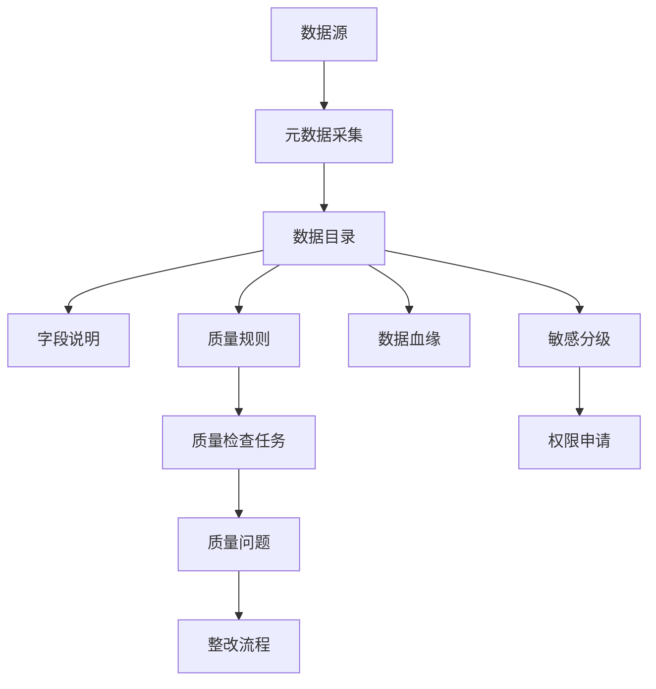
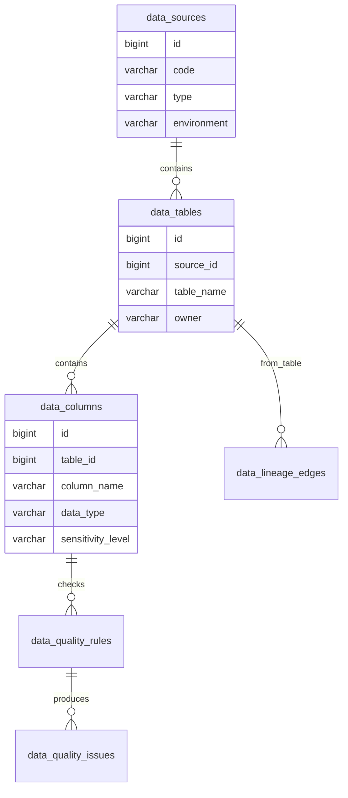
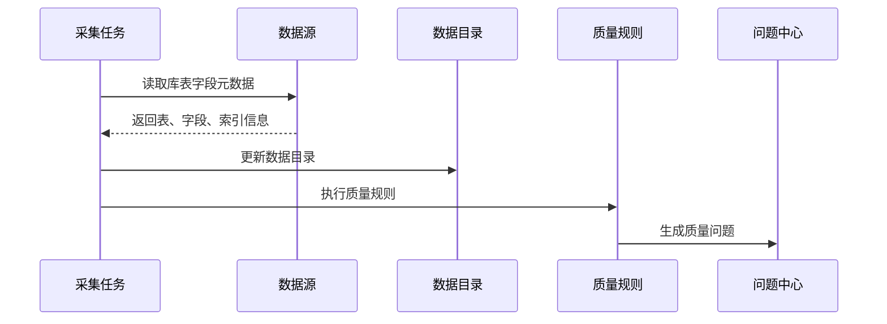

# 数据治理平台项目案例

## 适合谁看

适合需要做数据目录、数据血缘、数据质量、敏感数据分级、数据权限申请、数据资产盘点和数据问题整改的开发者。

数据治理平台不是“给数据库表写说明”。真实项目里，业务数据分散在多个系统，字段口径不统一，敏感字段难追踪，报表出了问题也不知道数据从哪里来。数据治理的目标是让数据资产可发现、可理解、可授权、可追踪、可整改。

## 业务目标

第一版数据治理平台支持：

- 采集数据表和字段元数据。
- 维护数据目录。
- 标记敏感字段。
- 记录数据血缘。
- 配置数据质量规则。
- 生成质量问题。
- 支持数据权限申请。
- 支持数据资产负责人。
- 支持治理看板。

## 治理链路图

数据治理要和实际系统连接。只维护一份静态表格，很快就会和真实数据库脱节。

## 数据模型

## 推荐表结构

| 表 | 作用 | 关键字段 |
| --- | --- | --- |
| `data_sources` | 数据源 | `code`、`type`、`environment`、`owner` |
| `data_tables` | 数据表资产 | `source_id`、`table_name`、`business_name`、`owner` |
| `data_columns` | 字段资产 | `column_name`、`data_type`、`sensitivity_level` |
| `data_lineage_edges` | 数据血缘 | `source_table_id`、`target_table_id`、`transform_type` |
| `data_quality_rules` | 质量规则 | `rule_type`、`target_column_id`、`threshold` |
| `data_quality_issues` | 质量问题 | `rule_id`、`severity`、`status`、`owner` |
| `data_access_requests` | 权限申请 | `applicant_id`、`asset_id`、`reason`、`status` |

资产负责人非常重要。没有负责人，数据质量问题就没有人处理。

## 元数据采集流程

采集任务要区分环境。生产、测试和开发环境的数据资产不能混在一起。

## 数据质量规则

| 规则类型 | 示例 | 处理方式 |
| --- | --- | --- |
| 完整性 | 用户手机号不能为空 | 生成质量问题 |
| 唯一性 | 订单号不能重复 | 高严重级别 |
| 合法性 | 状态必须在枚举范围内 | 指向字段负责人 |
| 一致性 | 订单金额等于明细合计 | 需要跨表校验 |
| 时效性 | 报表数据必须每日更新 | 任务失败告警 |

质量规则不要一开始做得过度复杂。先覆盖关键表、关键字段和高风险报表。

## 前端页面拆分

| 页面 | 作用 | 注意点 |
| --- | --- | --- |
| 数据源管理 | 管理数据库、API、文件源 | 凭证不能明文展示 |
| 数据目录 | 浏览表和字段 | 支持搜索、标签、负责人 |
| 字段详情 | 查看类型、说明、敏感级别 | 展示引用和血缘 |
| 血缘图 | 查看上下游关系 | 图过大时要分层 |
| 质量规则 | 配置规则和阈值 | 规则有负责人 |
| 质量问题 | 跟踪整改状态 | 支持指派和关闭 |
| 权限申请 | 申请查看数据资产 | 高敏字段需要审批 |

## 常见问题

### 问题 1：数据目录很快变旧

说明采集不是自动化，或者采集结果没有和变更流程结合。需要定时采集，并在数据库结构变更后触发刷新。

### 问题 2：敏感字段被随意导出

敏感级别必须进入权限、导出和审计链路。只在数据目录里标红没有实际控制作用。

### 问题 3：质量问题没人处理

每个数据资产和规则都要有 owner。问题生成后自动指派给负责人，并设置 SLA。

## 验收清单

- 数据源、表、字段可自动采集。
- 数据资产有业务名称、说明和负责人。
- 敏感字段有分级。
- 权限申请和审计能识别敏感级别。
- 关键表有质量规则。
- 质量问题可指派、可关闭、可复盘。
- 数据血缘能展示核心链路。
- 数据目录支持搜索。
- 治理看板能展示问题数量和整改率。

## 下一步学习

继续学习 [主数据管理项目案例](/projects/master-data-case)、[报表配置器项目案例](/projects/report-builder-case) 和 [审计中心项目案例](/projects/audit-center-case)。
