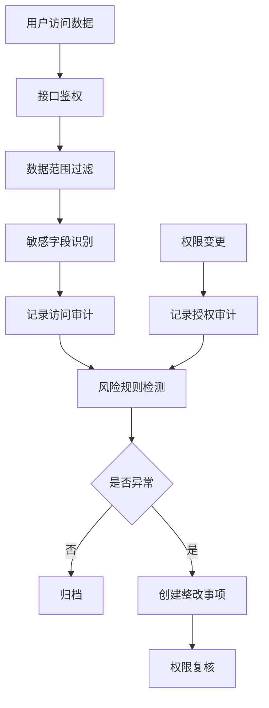
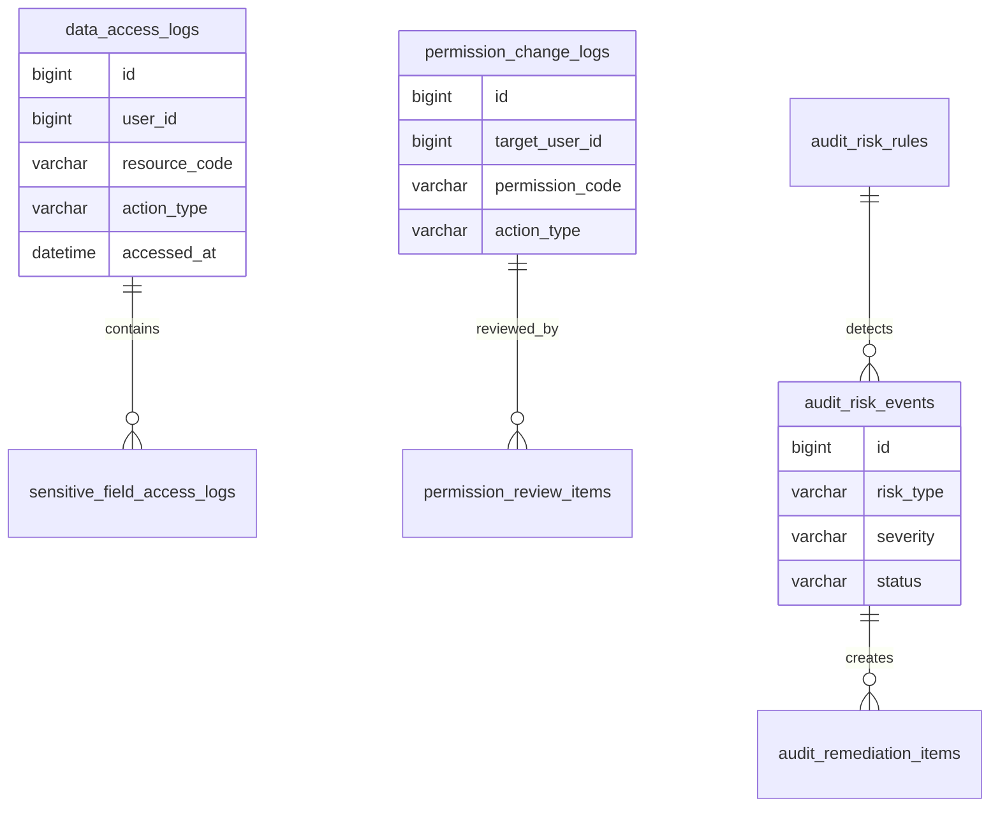
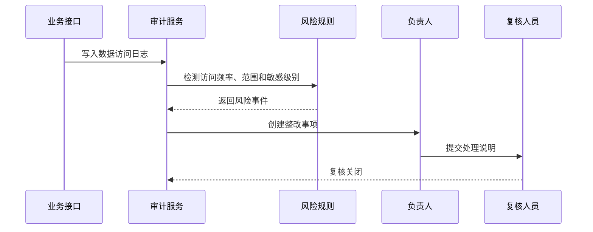

# 数据权限审计项目案例

## 适合谁看

适合需要做数据范围权限、敏感数据访问审计、权限变更审计、越权检测、导出审计和定期权限复核的开发者。

数据权限审计不是“记录谁点了页面”。真实项目里，用户能看到哪些数据、导出了哪些敏感字段、权限是谁授予的、是否超过岗位需要，都需要可追踪。它通常连接组织架构、角色权限、数据治理、审计中心和合规审计。

## 业务目标

第一版数据权限审计支持：

- 记录数据访问日志。
- 记录敏感字段访问。
- 记录数据导出行为。
- 记录权限变更历史。
- 支持越权规则检测。
- 支持定期权限复核。
- 支持审计报表导出。
- 支持整改闭环。

## 审计链路图

数据权限审计要覆盖访问和授权两条线。只记录访问，不记录权限如何来的，审计时仍然说不清责任。

## 数据模型

## 推荐表结构

| 表 | 作用 | 关键字段 |
| --- | --- | --- |
| `data_access_logs` | 数据访问日志 | `user_id`、`resource_code`、`action_type`、`accessed_at` |
| `sensitive_field_access_logs` | 敏感字段访问 | `access_log_id`、`field_code`、`sensitivity_level` |
| `data_export_logs` | 数据导出日志 | `user_id`、`resource_code`、`row_count`、`file_id` |
| `permission_change_logs` | 权限变更日志 | `target_user_id`、`permission_code`、`before_value`、`after_value` |
| `permission_review_batches` | 权限复核批次 | `scope_type`、`status`、`review_deadline` |
| `permission_review_items` | 权限复核明细 | `batch_id`、`user_id`、`permission_code`、`review_result` |
| `audit_risk_rules` | 审计风险规则 | `rule_code`、`risk_type`、`enabled`、`threshold_config` |
| `audit_remediation_items` | 整改事项 | `risk_event_id`、`owner_id`、`status`、`due_at` |

审计日志要避免保存过多明文敏感数据。通常保存字段编码、敏感级别、访问范围和脱敏后的摘要。

## 越权检测流程

风险检测要减少误报。比如财务导出账单是正常行为，但非财务角色大量导出客户手机号就是风险。

## 审计场景

| 场景 | 检查内容 | 风险信号 |
| --- | --- | --- |
| 敏感字段访问 | 手机号、身份证、银行卡 | 非岗位角色频繁查看 |
| 数据导出 | 导出行数、字段范围 | 深夜大批量导出 |
| 权限变更 | 谁给谁授权 | 自授权或越级授权 |
| 离职权限 | 离职人员账号状态 | 离职后仍有访问 |
| 跨部门数据 | 数据范围过滤 | 访问非所属部门数据 |
| 管理员操作 | 高权限操作 | 缺少审批或原因 |

## 前端页面拆分

| 页面 | 作用 | 注意点 |
| --- | --- | --- |
| 访问日志 | 查询数据访问行为 | 支持资源、用户、时间筛选 |
| 敏感访问 | 查看敏感字段访问 | 展示敏感级别和原因 |
| 导出审计 | 查看导出任务和文件 | 文件下载二次鉴权 |
| 权限变更 | 查看授权和回收历史 | 展示操作人和审批单 |
| 风险事件 | 处理越权和异常访问 | 有严重级别和负责人 |
| 权限复核 | 定期确认权限是否合理 | 支持批量确认和撤销 |
| 审计报表 | 导出审计结果 | 报表归档不可篡改 |

## 实际项目常见问题

### 问题 1：审计日志很多，但查不到谁越权

说明日志没有结构化。必须记录用户、资源、动作、数据范围、敏感字段和业务单号。

### 问题 2：权限变更后没有复核

高权限和跨部门权限要定期复核。复核结果应该能撤销权限或生成整改事项。

### 问题 3：导出审计只记录了文件名

导出审计要记录导出人、导出条件、字段范围、行数、文件 ID 和下载次数。

## 验收清单

- 数据访问、敏感字段访问和导出行为有日志。
- 权限授予、变更和回收有审计。
- 审计日志字段结构化。
- 支持风险规则检测。
- 风险事件能生成整改事项。
- 支持定期权限复核。
- 审计报表可导出和归档。
- 敏感审计日志避免明文泄露。
- 文件下载有二次鉴权。
- 高风险操作能追到责任人。

## 下一步学习

继续学习 [审计中心项目案例](/projects/audit-center-case)、[数据治理平台项目案例](/projects/data-governance-case) 和 [行业合规审计项目案例](/projects/compliance-audit-case)。
