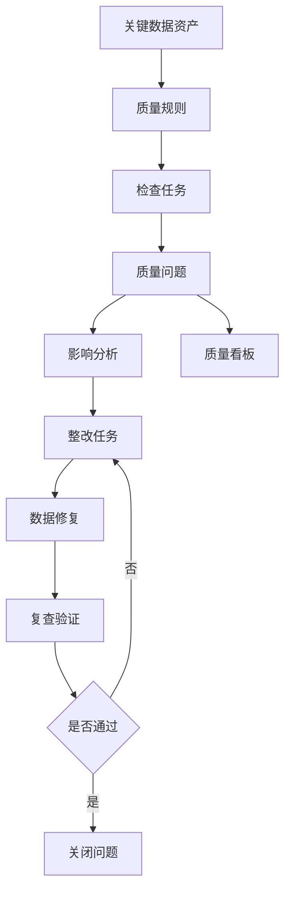
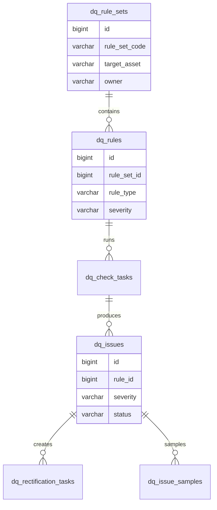
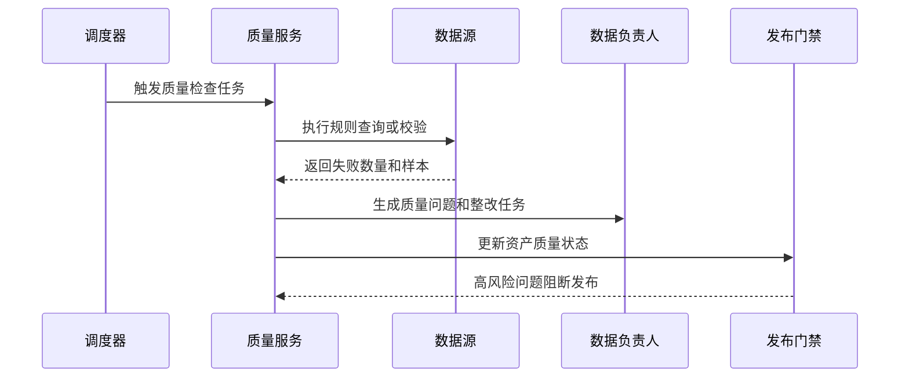

# 数据质量专项项目案例

## 适合谁看

适合需要做数据质量规则、质量检查任务、异常数据修复、质量评分、整改闭环、质量报表和数据发布门禁的开发者。

数据质量专项不是“发现脏数据后发个告警”。真实项目里，质量问题会影响报表、风控、财务、客户运营和 AI 训练。系统必须能定义规则、执行检查、定位问题数据、分派整改、复查关闭，并把高风险质量问题阻断到下游。

## 业务目标

第一版数据质量专项支持：

- 配置数据质量规则和检查范围。
- 支持完整性、唯一性、合法性、一致性、时效性规则。
- 定时或手动执行质量检查。
- 生成质量问题和影响范围。
- 支持整改任务、复查和关闭。
- 支持质量评分和趋势看板。
- 支持高风险数据发布门禁。

## 数据质量闭环

核心原则：质量问题必须有 owner、影响范围、修复动作和关闭证据。只告警不闭环，问题会反复出现。

## 数据模型

## 推荐表结构

| 表 | 作用 | 关键字段 |
| --- | --- | --- |
| `dq_rule_sets` | 规则集 | `rule_set_code`、`target_asset_id`、`owner_id`、`status` |
| `dq_rules` | 质量规则 | `rule_type`、`check_expression`、`threshold`、`severity` |
| `dq_check_tasks` | 检查任务 | `rule_set_id`、`trigger_type`、`started_at`、`status` |
| `dq_check_results` | 检查结果 | `task_id`、`total_count`、`failed_count`、`pass_rate` |
| `dq_issues` | 质量问题 | `rule_id`、`issue_title`、`severity`、`status`、`owner_id` |
| `dq_issue_samples` | 问题样本 | `issue_id`、`primary_key_value`、`field_value`、`error_reason` |
| `dq_rectification_tasks` | 整改任务 | `issue_id`、`assignee_id`、`plan`、`status` |
| `dq_gate_records` | 发布门禁记录 | `asset_id`、`gate_result`、`blocked_reason`、`checked_at` |

问题样本要保存足够定位的信息，但不能泄露敏感数据。高敏字段应脱敏展示，并把原始值留在受控环境。

## 质量规则类型

| 规则类型 | 示例 | 适用场景 |
| --- | --- | --- |
| 完整性 | 客户手机号不能为空 | 关键字段缺失 |
| 唯一性 | 订单号不能重复 | 主键、业务唯一键 |
| 合法性 | 状态必须在枚举范围内 | 枚举、日期、金额 |
| 一致性 | 订单金额等于明细合计 | 跨字段、跨表校验 |
| 时效性 | 报表分区必须每日更新 | 数仓、报表、同步任务 |
| 波动性 | 日销售额波动超过阈值 | 指标异常监控 |

第一版不要追求规则引擎过度灵活。先覆盖关键表和关键字段，保证问题能被发现和关闭。

## 质量检查流程

检查任务要记录执行 SQL 或规则快照。否则规则修改后，历史问题无法解释。

## 前端页面拆分

| 页面或组件 | 作用 | 注意点 |
| --- | --- | --- |
| 质量首页 | 展示问题数量、通过率、趋势 | 高风险问题优先展示 |
| 规则集管理 | 管理资产对应规则 | 规则要有负责人 |
| 规则编辑器 | 配置检查条件和阈值 | 提供试运行 |
| 检查任务 | 查看执行历史 | 显示耗时、失败数、样本 |
| 质量问题 | 跟踪问题状态 | 支持指派、延期、关闭 |
| 问题样本 | 定位异常数据 | 敏感字段脱敏 |
| 整改任务 | 跟踪修复过程 | 关闭时需要复查证据 |
| 发布门禁 | 查看阻断记录 | 明确阻断原因和解除条件 |

质量问题列表不应只展示技术字段。要展示业务资产、负责人、影响报表、严重级别和建议处理动作。

## 常见问题

### 问题 1：质量规则很多，但没人处理问题

规则没有 owner，问题没有 SLA。每条规则和每个资产都要有负责人，问题要能自动分派。

### 问题 2：质量任务拖慢生产数据库

质量检查尽量在数仓、只读库或离线快照执行。生产库检查要限制时间窗口、并发和扫描范围。

### 问题 3：同一个问题每天重复生成

需要问题合并策略。相同规则、相同资产、相同根因的问题应更新已有问题，而不是每天创建新问题。

### 问题 4：修复后不知道是否真的好了

关闭问题前必须复查。整改任务应保存修复说明、复查任务和通过结果。

## 验收清单

- 规则集和目标数据资产绑定。
- 规则支持完整性、唯一性、合法性、一致性和时效性。
- 检查任务保存规则快照和执行结果。
- 质量问题有严重级别、负责人和 SLA。
- 问题样本可定位，敏感字段脱敏。
- 整改任务支持复查和关闭证据。
- 重复问题有合并策略。
- 高风险质量问题能进入发布门禁。
- 质量看板能展示趋势、通过率和整改率。
- 质量规则变更有审计记录。

## 下一步学习

继续学习 [数据治理平台项目案例](/projects/data-governance-case)、[数据资产运营项目案例](/projects/data-asset-operation-case)、[智能报表与 BI 分析项目案例](/projects/smart-bi-dashboard-case) 和 [数据库与缓存问题](/projects/issues-database)。
