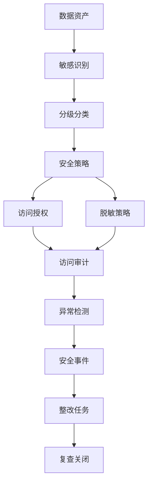
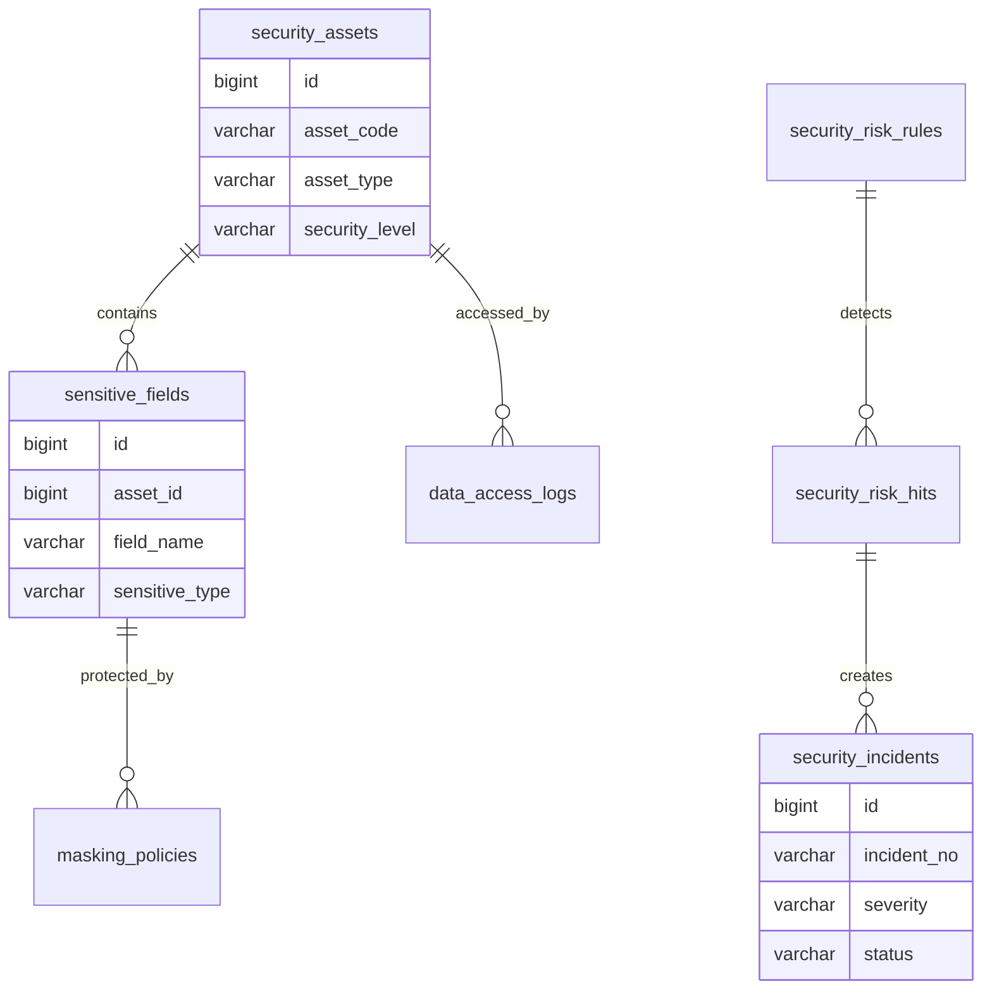
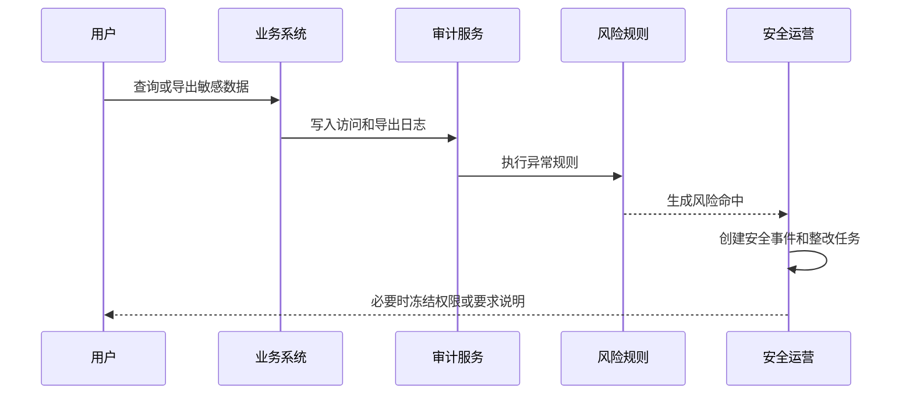

# 数据安全运营项目案例

## 适合谁看

适合需要做敏感数据识别、数据分级分类、访问授权、导出管控、脱敏策略、异常访问检测、安全审计和整改闭环的开发者。

数据安全运营不是“给字段打个敏感标签”。真实项目里，敏感数据会出现在数据库、报表、导出文件、日志、接口和 AI 知识库里。系统必须能知道敏感数据在哪里、谁能访问、谁导出了、有没有异常、发现问题后谁整改。

## 业务目标

第一版数据安全运营支持：

- 识别数据表、字段、报表和文件中的敏感数据。
- 维护数据分级分类和安全策略。
- 对访问、查询、导出和分享进行审计。
- 支持脱敏、授权、审批和有效期。
- 识别异常访问和高风险导出。
- 支持安全事件、整改任务和复查。
- 支持数据安全运营看板。

## 数据安全运营链路

核心原则：敏感标记必须进入权限、脱敏、导出和审计链路。只在目录里展示敏感级别，没有安全效果。

## 数据模型

## 推荐表结构

| 表 | 作用 | 关键字段 |
| --- | --- | --- |
| `security_assets` | 安全资产 | `asset_code`、`asset_type`、`owner_id`、`security_level` |
| `sensitive_fields` | 敏感字段 | `asset_id`、`field_name`、`sensitive_type`、`level` |
| `masking_policies` | 脱敏策略 | `sensitive_type`、`masking_type`、`scene`、`enabled` |
| `data_access_logs` | 数据访问日志 | `asset_id`、`user_id`、`action_type`、`accessed_at` |
| `data_export_logs` | 数据导出日志 | `asset_id`、`user_id`、`row_count`、`file_id` |
| `security_risk_rules` | 风险规则 | `rule_code`、`risk_level`、`condition_json` |
| `security_risk_hits` | 风险命中 | `rule_id`、`user_id`、`asset_id`、`risk_reason` |
| `security_incidents` | 安全事件 | `incident_no`、`severity`、`owner_id`、`status` |
| `security_rectification_tasks` | 整改任务 | `incident_id`、`assignee_id`、`plan`、`status` |

访问日志和导出日志要单独建模。导出通常风险更高，需要记录文件、行数、字段范围和审批来源。

## 敏感数据类型

| 类型 | 示例 | 默认策略 |
| --- | --- | --- |
| 身份信息 | 身份证号、护照号 | 默认脱敏，高权限查看 |
| 联系方式 | 手机号、邮箱、地址 | 列表脱敏，详情授权 |
| 财务信息 | 银行卡、发票、付款账户 | 强审批和审计 |
| 业务机密 | 合同金额、报价、成本 | 按角色和项目授权 |
| 行为数据 | 登录轨迹、访问日志 | 限定安全和审计角色 |

分级分类要能落到执行策略。每一种敏感类型都应该对应默认脱敏、导出审批和审计规则。

## 异常访问检测流程

风险规则可以先从简单规则做起，例如短时间大量导出、非工作时间访问、高敏字段跨部门访问、离职前批量下载。

## 前端页面拆分

| 页面或组件 | 作用 | 注意点 |
| --- | --- | --- |
| 安全资产目录 | 查看资产和敏感级别 | 支持按负责人、级别筛选 |
| 敏感字段识别 | 查看识别结果 | 支持人工确认和误报处理 |
| 脱敏策略 | 配置展示和导出脱敏 | 按场景区分列表、详情、导出 |
| 访问审计 | 查询访问和导出记录 | 支持定位用户和资源 |
| 风险命中 | 查看异常访问 | 展示规则、证据和严重级别 |
| 安全事件 | 跟踪处理过程 | 有负责人、SLA 和结论 |
| 整改任务 | 修复权限或策略问题 | 关闭前要复查 |
| 安全看板 | 查看风险趋势 | 展示高敏资产、导出量、事件数 |

安全页面要避免只给技术人员看。资产负责人也需要能理解风险原因和整改动作。

## 常见问题

### 问题 1：字段标了敏感，但接口仍然返回明文

说明敏感标记没有进入接口序列化和权限策略。需要在数据返回层统一处理脱敏，而不是让每个页面自己判断。

### 问题 2：导出文件流转后无法追踪

导出必须记录文件 ID、导出人、字段范围和审批单号。重要文件可以加水印或下载有效期。

### 问题 3：风险告警太多没人看

规则要分级和合并。低风险进入日报，高风险实时告警，相同用户和资产的重复命中要聚合。

### 问题 4：权限整改后无法证明已完成

整改任务要有复查动作，例如重新检查授权记录、脱敏策略和最近访问日志，并保存复查结果。

## 验收清单

- 数据资产有安全级别和负责人。
- 敏感字段有类型、等级和确认状态。
- 脱敏策略能按场景生效。
- 访问和导出都有审计日志。
- 高敏数据导出需要审批或强审计。
- 风险规则能识别异常访问。
- 安全事件有负责人、SLA 和处理结论。
- 整改任务关闭前有复查证据。
- 风险告警支持分级和聚合。
- 安全看板能展示敏感资产、导出、风险和整改趋势。

## 下一步学习

继续学习 [数据权限审计项目案例](/projects/data-permission-audit-case)、[数据治理平台项目案例](/projects/data-governance-case)、[权限运营项目案例](/projects/permission-operation-case) 和 [审计中心项目案例](/projects/audit-center-case)。
