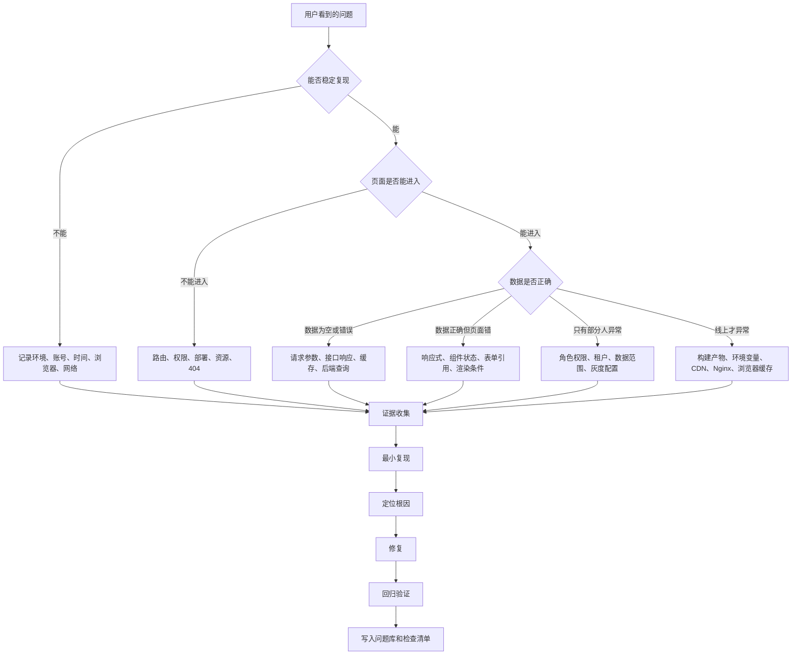
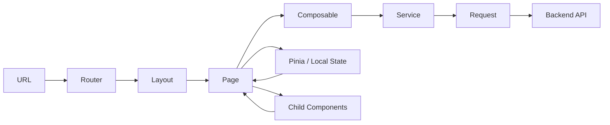
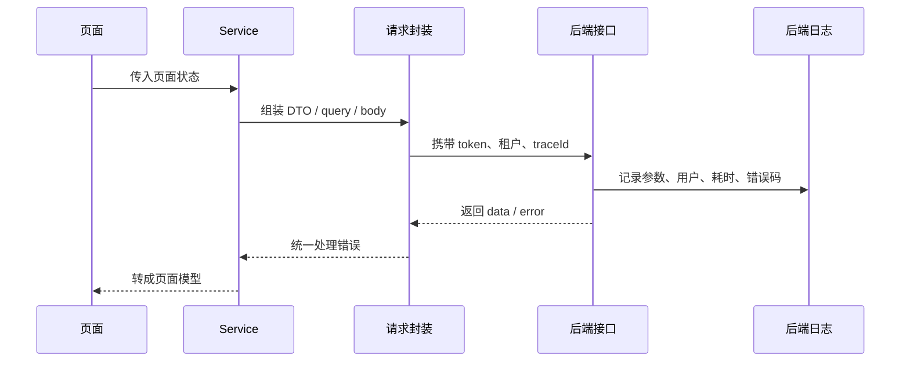
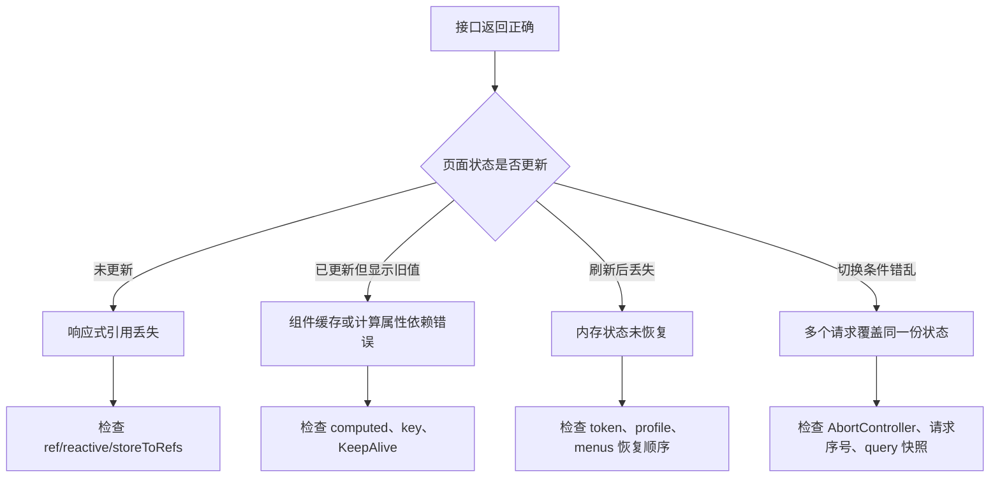
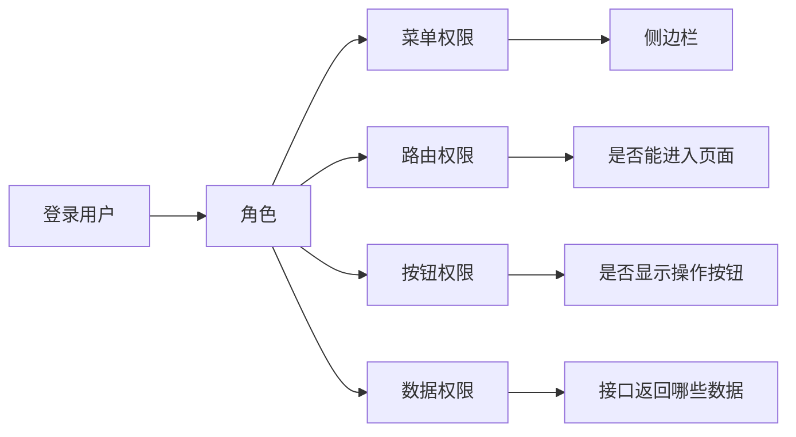
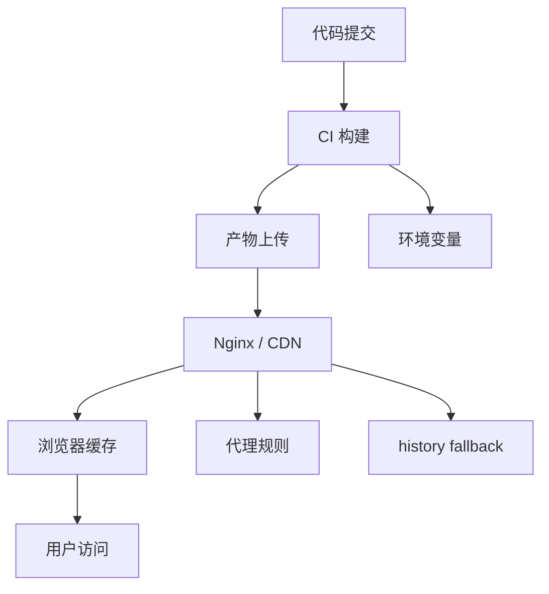

# 项目排障方法论

## 这个页面解决什么

真实项目排障最难的地方，通常不是不知道某个 API，而是不知道问题应该从哪一层开始查。

这个页面提供一套通用排障方法：先从现象判断问题层级，再用证据缩小范围，最后把修复方案沉淀成问题库条目。它适合配合 [真实项目问题库](/projects/real-world-issues)、[前端项目排障图谱](/projects/frontend-debugging-map)、[Vue 真实项目问题](/projects/issues-vue)、[前端页面与状态问题](/projects/issues-frontend) 一起使用。

读完后，你应该能回答：

- 这个问题是前端渲染、请求、状态、权限、缓存、部署还是数据问题。
- 应该先看浏览器、接口、日志、数据库、缓存还是构建产物。
- 如何写复现步骤、根因分析和预防措施。
- 如何把一次排障变成团队以后能复用的经验。

## 适合谁看

- 做 Vue Admin、React 管理台、Node API、Java/Go 后端接口的开发者。
- 遇到问题时容易凭感觉改代码，但不知道怎么证明根因的人。
- 想把项目问题沉淀成可复用文档，而不是每次靠群聊和搜索记录的人。
- 准备上线前检查、故障复盘、交付验收和技术面试项目讲解的人。

## 排障总图

先不要急着改代码。真实项目的问题通常跨越多个层级，先画出链路，才能知道从哪里下手。



这张图的关键不是流程多，而是避免两类错误：

| 错误做法 | 后果 | 正确做法 |
| --- | --- | --- |
| 看到页面错就改组件 | 可能掩盖接口或权限问题 | 先确认 Network 和接口响应 |
| 看到接口 500 就怪后端 | 可能是前端参数、token、租户头错误 | 对比请求参数和后端日志 |
| 只在自己电脑复现 | 可能忽略账号、角色、缓存、浏览器差异 | 记录复现环境和用户上下文 |
| 修完不写记录 | 下次同类问题重新排查 | 沉淀到问题库和交付检查清单 |

## 第一原则：先分类，再动手

排障的第一步不是“猜原因”，而是把问题归类。分类越准确，排查路径越短。

| 现象 | 第一怀疑层 | 先看什么 |
| --- | --- | --- |
| 页面白屏 | 构建、路由、运行时错误 | Console、Network、入口 JS、资源 404 |
| 页面能进但数据为空 | 请求、权限、接口返回 | Network、请求参数、响应体、后端日志 |
| 数据有但页面不更新 | 响应式、状态引用、组件缓存 | Vue DevTools、Pinia、组件 props、KeepAlive |
| 刷新后丢菜单 | 登录态、动态路由、权限恢复 | token、用户信息接口、路由注册顺序 |
| 本地正常线上异常 | 环境变量、base、Nginx、缓存 | 构建配置、部署路径、CDN 缓存、响应头 |
| 只有某角色异常 | 权限码、菜单、数据范围 | 用户角色、权限接口、按钮权限判断 |
| 偶发重复提交 | 防抖、幂等、按钮状态、接口幂等键 | 点击事件、loading、请求日志、幂等字段 |
| 列表出现旧数据 | 并发请求、缓存、查询条件状态 | 请求顺序、AbortController、query 快照 |

如果你不能在 3 分钟内判断属于哪一类，就先走下面的证据清单。

## 证据清单

排障时至少保留这些证据。没有证据的“根因”通常只是猜测。

| 证据 | 用来判断什么 | 怎么记录 |
| --- | --- | --- |
| 复现步骤 | 问题是否稳定 | 第几步、点哪个按钮、输入什么 |
| 用户上下文 | 是否和角色、租户、数据范围有关 | 账号、角色、组织、租户、权限码 |
| 页面地址 | 是否和路由、部署路径有关 | 完整 URL、query、hash |
| Console 错误 | 是否运行时报错 | 错误堆栈、文件名、行号 |
| Network 请求 | 是否参数或响应异常 | method、url、status、payload、response |
| 后端日志 | 是否服务端异常 | traceId、接口名、错误堆栈、耗时 |
| 数据库证据 | 是否数据或事务问题 | SQL、慢查询、事务日志、关键记录 |
| 缓存证据 | 是否读了旧值 | key、TTL、刷新时间、命中来源 |
| 构建部署证据 | 是否环境差异 | commit、版本号、构建时间、部署环境 |

建议每次排障都写成下面的格式：

```text
问题现象：
复现步骤：
影响范围：
已确认不是：
关键证据：
根因：
修复方案：
回归验证：
预防措施：
沉淀位置：
```

## 前端页面排障路径

前端问题不要只看页面。一个后台页面通常由路由、页面组件、组合式函数、服务层、请求层、状态层共同组成。



按这个顺序查：

1. URL 是否正确，路由是否命中目标页面。
2. 页面组件是否被创建，是否被 KeepAlive 缓存。
3. 页面初始化是否只执行一次，还是被重复触发。
4. 请求参数是否来自当前查询条件，而不是旧状态。
5. service 返回的数据是否被页面正确转换。
6. Pinia 或本地状态是否仍然保持响应式。
7. 子组件是否越界修改了父组件或列表行对象。

### Vue Admin 常见判断

| 问题 | 重点检查 |
| --- | --- |
| 刷新后菜单消失 | token 是否还在、用户信息是否恢复、动态路由是否重新注册 |
| 动态路由 404 | `addRoute` 的时机、父路由 name、404 捕获路由顺序 |
| Pinia 页面不更新 | 是否直接解构 store、是否使用 `storeToRefs` |
| 表单污染列表 | 编辑弹窗是否直接绑定列表行对象 |
| 查询条件切换后旧数据闪现 | 是否存在并发请求覆盖、是否用当前 query 快照发请求 |
| 权限按钮显示错 | 权限码来源是否一致、按钮判断是否和路由权限混用 |

## 请求与接口排障路径

请求问题的关键是对齐“前端以为自己发了什么”和“后端实际收到什么”。



逐项确认：

| 检查项 | 正常表现 | 异常信号 |
| --- | --- | --- |
| URL | 路径和环境一致 | 本地 `/api`，线上少了代理前缀 |
| method | 和接口约定一致 | 后端要 POST，前端发 GET |
| query/body | 字段名、类型、枚举一致 | `pageNo` 和 `page` 混用 |
| headers | token、租户、traceId 完整 | 401、403 或查到别的租户数据 |
| status | 能区分业务失败和系统失败 | 全部弹“网络错误” |
| response | 有明确 code、message、data | 空对象、结构不稳定 |
| transform | DTO 转页面模型 | 后端字段直接泄漏到表单 |

### 参数问题定位模板

```text
接口：
页面入口：
期望参数：
实际参数：
后端收到：
差异字段：
差异来源：
修复位置：
```

例子：

| 字段 | 期望 | 实际 | 根因 |
| --- | --- | --- | --- |
| `pageNo` | 1 | undefined | 页面用 `page`，service 没转换 |
| `status` | `enabled` | `true` | 表单布尔值直接传给接口 |
| `tenantId` | 当前租户 | 缺失 | 请求拦截器没有从 auth store 读取 |

## 状态与缓存排障路径

状态问题最容易被误判为接口问题。判断标准是：接口返回正确，但页面展示不对。



常见根因：

| 根因 | 典型代码味道 | 修复方向 |
| --- | --- | --- |
| 直接解构 store | `const { user } = useAuthStore()` | 用 `storeToRefs` |
| 替换 reactive 对象 | `form = newForm` | 用 `Object.assign(form, newForm)` 或 `ref` |
| 弹窗复用行对象 | `form.value = row` | `form.value = { ...row }` |
| computed 有副作用 | computed 内写状态 | 改成纯计算，副作用放 watch/action |
| 请求返回顺序错 | 慢请求覆盖新请求 | 加请求序号或取消旧请求 |
| KeepAlive 旧状态 | 返回列表不刷新 | 用 `onActivated` 或明确缓存策略 |

## 权限与路由排障路径

后台权限问题要分清四种权限：菜单权限、路由权限、按钮权限、数据权限。



不要把四种权限混在一起：

| 权限类型 | 控制对象 | 常见错误 |
| --- | --- | --- |
| 菜单权限 | 侧边栏是否显示 | 有菜单就认为接口可访问 |
| 路由权限 | 是否能进入页面 | 动态路由注册后不重新匹配 |
| 按钮权限 | 新增、编辑、删除是否显示 | 前端隐藏按钮但接口不校验 |
| 数据权限 | 能看到哪些组织、客户、订单 | 前端筛选代替后端过滤 |

排查权限问题时先问：

1. 当前用户有哪些角色。
2. 后端返回了哪些菜单、路由、按钮权限码和数据范围。
3. 前端是否用同一份权限码判断按钮。
4. 接口是否做了后端权限校验。
5. 是否有缓存导致权限变更后没有刷新。

## 线上部署排障路径

线上问题经常不是代码逻辑，而是构建、部署和缓存链路出现差异。



常见线上问题：

| 现象 | 可能原因 | 先看什么 |
| --- | --- | --- |
| 二级路由刷新 404 | Nginx 没有 history fallback | Nginx 配置、服务响应 |
| 静态资源 404 | Vite base 配错 | 构建产物路径、HTML 引用路径 |
| 登录接口请求到旧环境 | 环境变量没生效 | 构建日志、产物中的 API 地址 |
| 用户看到旧页面 | CDN 或浏览器缓存 | 响应头、资源 hash、缓存规则 |
| 本地可用线上白屏 | 构建压缩、polyfill、兼容性 | Console、sourcemap、目标浏览器 |
| 回滚后接口不兼容 | 前后端版本不匹配 | 发布顺序、接口兼容策略 |

上线问题至少记录这些信息：

```text
环境：
版本号：
提交号：
构建时间：
部署时间：
受影响用户：
是否可回滚：
是否有数据变更：
```

## 数据库与缓存排障路径

当页面和接口都看起来正常，但数据不对，重点看数据源。

| 现象 | 第一怀疑 | 证据 |
| --- | --- | --- |
| 列表缺数据 | 查询条件、数据权限、分页 | SQL、where 条件、用户数据范围 |
| 保存后查不到 | 事务、读写分离、缓存 | 事务提交日志、读库延迟、缓存 key |
| 删除后还显示 | 前端缓存、Redis 缓存、CDN | 缓存命中记录、TTL |
| 并发更新覆盖 | 乐观锁、更新时间、事务隔离 | version 字段、更新 SQL |
| 查询很慢 | 索引、N+1、模糊查询 | explain、慢查询日志 |

数据问题不要只改前端展示。必须确认：

1. 数据库真实记录是什么。
2. 接口查询条件是什么。
3. 缓存是否命中旧值。
4. 前端是否再次缓存或转换。
5. 是否存在权限过滤。

## 最小复现怎么做

最小复现不是重写一个 demo，而是把问题缩小到能说明根因的最小链路。

| 问题类型 | 最小复现方式 |
| --- | --- |
| Vue 响应式 | 一个 store、一个组件、一个按钮 |
| 请求参数 | 一个 service 函数、一份输入、一份实际 payload |
| 动态路由 | 一条静态路由、一条动态路由、一次刷新 |
| 权限按钮 | 一个权限码、一个按钮、一个用户角色 |
| 缓存旧数据 | 一个 key、一次更新、一次读取 |
| 部署 404 | 一个二级路由、一次刷新、Nginx fallback |

最小复现要满足：

- 其他人按步骤能复现。
- 去掉无关业务后问题仍然存在。
- 修复后同一复现步骤会消失。
- 能写成自动化测试或检查清单。

## 修复方案怎么写

好的修复方案不只写“改了什么”，还要说明“为什么这样改”。

| 部分 | 要写什么 |
| --- | --- |
| 修改位置 | 哪个文件、哪个模块、哪个函数 |
| 修改原因 | 哪个证据证明这里是根因 |
| 行为变化 | 修改前后用户能看到什么差异 |
| 兼容性 | 是否影响旧数据、旧路由、旧接口 |
| 回归范围 | 哪些页面、接口、角色需要复测 |
| 预防措施 | 测试、文档、检查清单、监控 |

示例：

```text
修改位置：
permission.store.ts 的 restorePermission()

修改原因：
刷新 /system/users 时 token 仍在，但 menus 为空，路由守卫直接跳登录。

行为变化：
刷新深层页面时先恢复用户权限和动态路由，再返回 to.fullPath 重新匹配。

回归范围：
登录、刷新动态路由、无权限页面、退出登录、切换角色。

预防措施：
交付检查清单增加“刷新动态菜单页面”。
```

## 回归验证清单

修复后不要只验证“刚才那个按钮好了”。至少覆盖同类路径。

| 类型 | 必测项 |
| --- | --- |
| 路由问题 | 直接访问、刷新、返回、无权限、404 |
| 请求问题 | 成功、失败、空数据、慢请求、重复点击 |
| 状态问题 | 初次进入、切换条件、刷新、返回缓存页 |
| 权限问题 | 有权限、无权限、角色变更、按钮隐藏、接口拦截 |
| 部署问题 | 首页、二级路由、静态资源、接口代理、缓存刷新 |
| 数据问题 | 新增、编辑、删除、分页、事务失败、缓存失效 |

## 如何沉淀到问题库

一次排障结束后，建议把内容拆成两层：

| 层级 | 写什么 | 放哪里 |
| --- | --- | --- |
| 通用问题 | 现象、根因、解决方案、预防方式 | 对应问题库页 |
| 项目复盘 | 时间线、影响范围、处置过程、改进项 | 故障复盘页或项目文档 |

问题库条目建议使用这个模板：

```text
## 问题：一句话描述现象

### 现象

### 影响范围

### 根因

### 解决方案

### 预防方式

### 关联文档
```

不要写成聊天记录，也不要只贴报错截图。后续维护者需要的是可复现、可判断、可验证的知识。

## 和其他文档怎么配合

| 当前目标 | 推荐入口 |
| --- | --- |
| 不知道问题在哪一层 | 当前页面 |
| Vue 页面、路由、状态问题 | [Vue 真实项目问题](/projects/issues-vue) |
| 表单、列表、组件状态问题 | [前端页面与状态问题](/projects/issues-frontend) |
| DTO、表单类型、权限码类型问题 | [TypeScript 类型边界问题](/projects/issues-typescript) |
| 接口、权限、错误码问题 | [后端接口与服务问题](/projects/issues-backend) |
| 联调参数不一致 | [前后端联调排查](/projects/integration-debugging) |
| 慢查询、事务、缓存问题 | [数据库与缓存问题](/projects/issues-database) |
| 二级路由、Nginx、CDN、环境变量 | [部署、缓存与 DevOps 问题](/projects/issues-deployment) |
| 上线事故复盘 | [故障复盘模板](/projects/incident-review) |

## 下一步学习

如果你正在做 Vue Admin，建议先完成 [Vue Admin 专项练习](/roadmap/vue-admin-practice)，然后把练习中遇到的问题按本页模板写入自己的 `TROUBLESHOOTING.md`。

如果你已经在项目中遇到真实问题，继续进入 [真实项目问题库](/projects/real-world-issues)，按分类查找具体解决方案。
