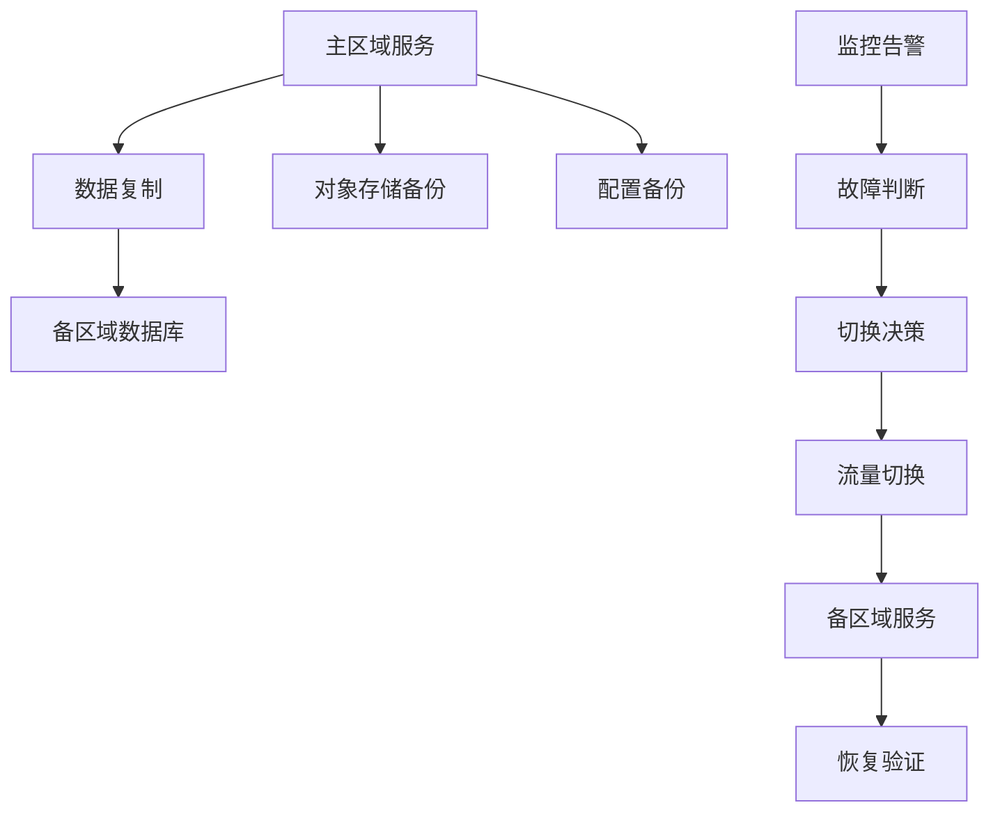
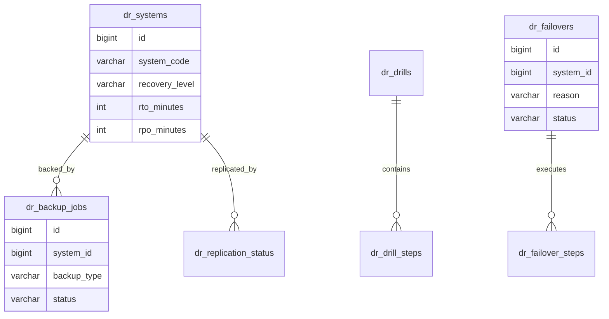
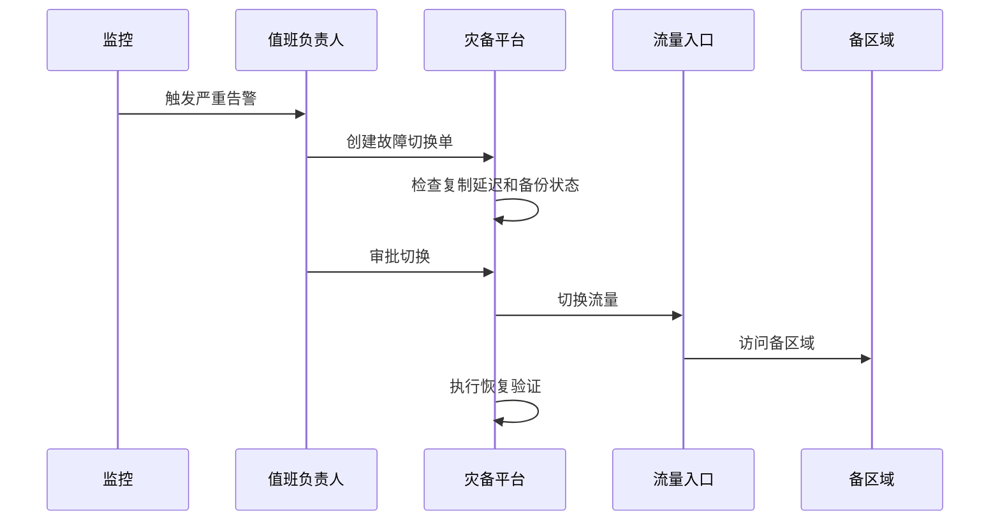

# 跨区域灾备管理项目案例

## 适合谁看

适合需要做多地域部署、异地备份、故障切换、数据恢复、容灾演练、RTO/RPO 管理和高可用治理的开发者。

跨区域灾备不是“多部署一套服务”。真实项目里，灾备要明确哪些系统必须恢复、多久恢复、最多丢多少数据、谁来决策切换、如何验证切换成功、如何切回主区域。没有演练的灾备，通常在真正故障时不可用。

## 业务目标

第一版灾备管理模块支持：

- 管理系统恢复等级。
- 配置 RTO 和 RPO。
- 记录备份任务。
- 记录数据复制状态。
- 支持灾备演练计划。
- 支持故障切换流程。
- 支持切换检查清单。
- 支持恢复报告和复盘。

## 灾备架构图

灾备管理的核心不是页面，而是流程和证据。每一次备份、演练、切换、恢复都要有记录。

## 数据模型

## 推荐表结构

| 表 | 作用 | 关键字段 |
| --- | --- | --- |
| `dr_systems` | 灾备系统清单 | `system_code`、`recovery_level`、`rto_minutes`、`rpo_minutes` |
| `dr_backup_jobs` | 备份任务 | `system_id`、`backup_type`、`status`、`finished_at` |
| `dr_replication_status` | 复制状态 | `system_id`、`lag_seconds`、`status` |
| `dr_drills` | 灾备演练 | `system_id`、`planned_at`、`result` |
| `dr_drill_steps` | 演练步骤 | `drill_id`、`step_name`、`status` |
| `dr_failovers` | 故障切换 | `system_id`、`reason`、`approved_by`、`status` |
| `dr_recovery_reports` | 恢复报告 | `failover_id`、`actual_rto`、`actual_rpo` |

RTO 是恢复时间目标，RPO 是可接受的数据丢失目标。它们必须按系统分级，不要全站一个值。

## 故障切换流程

高风险切换必须有审批和检查清单。不要让单个人在没有证据的情况下直接切流量。

## 灾备等级

| 等级 | 适合系统 | RTO | RPO |
| --- | --- | --- | --- |
| 核心 | 支付、登录、订单 | 分钟级 | 秒到分钟级 |
| 重要 | 后台管理、消息通知 | 小时级 | 分钟到小时级 |
| 一般 | 报表、离线任务 | 天级 | 小时到天级 |

不是所有系统都要做最高等级灾备。成本、复杂度和业务影响要一起评估。

## 前端页面拆分

| 页面 | 作用 | 注意点 |
| --- | --- | --- |
| 灾备系统清单 | 查看系统等级和目标 | 显示负责人 |
| 备份任务 | 查看备份成功率 | 失败要告警 |
| 复制状态 | 查看复制延迟 | 延迟超阈值告警 |
| 演练计划 | 安排和记录演练 | 演练结果要复盘 |
| 切换工作台 | 执行故障切换 | 分步骤确认 |
| 恢复报告 | 记录实际 RTO/RPO | 和目标对比 |

## 常见问题

### 问题 1：备份一直成功，但恢复失败

只验证备份成功是不够的。必须定期做恢复演练，确认备份真的能恢复出可用系统。

### 问题 2：切到备区域后数据不完整

要查看复制延迟和 RPO。切换前必须明确可能丢失的数据范围，并记录决策。

### 问题 3：没人知道故障时谁能切换

灾备流程必须明确负责人、审批人、通知方式和升级路径。

## 验收清单

- 系统有灾备等级。
- 每个系统有 RTO 和 RPO。
- 备份任务有状态和告警。
- 复制延迟可观测。
- 定期做恢复演练。
- 切换前有检查清单。
- 切换操作有审批和审计。
- 恢复后有验证步骤。
- 实际 RTO/RPO 写入恢复报告。

## 下一步学习

继续学习 [DevOps 可观测性](/devops/observability)、[备份恢复与容灾](/database/backup-recovery) 和 [项目交付检查清单](/projects/delivery-checklist)。
