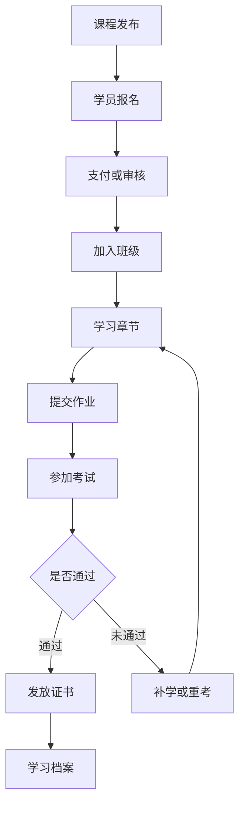
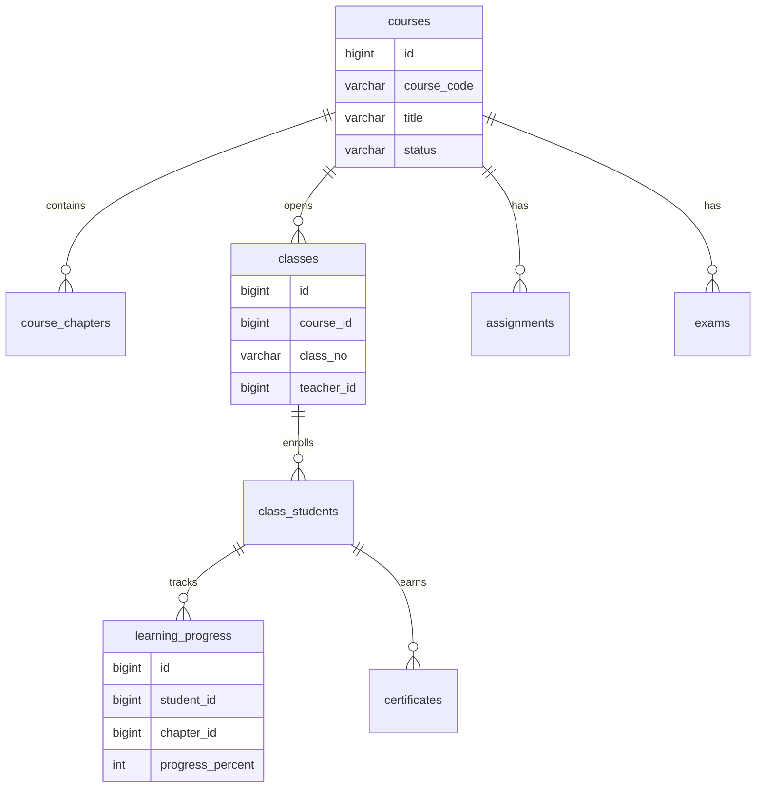
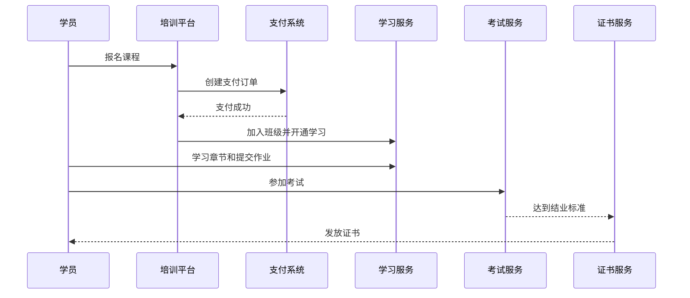

# 教育培训平台项目案例

## 适合谁看

适合需要做课程、班级、报名、学习进度、作业、考试、证书、讲师和学员运营的开发者。

教育培训平台不是“视频列表加播放”。真实项目里，课程会涉及招生报名、学习计划、课时、直播或录播、作业、考试、证书、讲师、班主任、学员服务和学习数据分析。系统要能回答“学员学到哪了、是否完成任务、是否达到结业标准”。

## 业务目标

第一版教育培训平台支持：

- 维护课程和章节。
- 管理班级和学员。
- 支持报名和支付。
- 跟踪学习进度。
- 支持作业和考试。
- 支持证书发放。
- 支持讲师和班主任管理。
- 支持学习数据看板。

## 学习业务链路

教育平台的核心是学习过程，而不是单次播放。播放记录、作业、考试和证书共同构成学习闭环。

## 数据模型

## 推荐表结构

| 表 | 作用 | 关键字段 |
| --- | --- | --- |
| `courses` | 课程 | `course_code`、`title`、`category_id`、`status` |
| `course_chapters` | 章节课时 | `course_id`、`title`、`content_type`、`sort_no` |
| `classes` | 班级 | `course_id`、`class_no`、`teacher_id`、`start_date` |
| `class_students` | 班级学员 | `class_id`、`student_id`、`enroll_status`、`joined_at` |
| `learning_progress` | 学习进度 | `student_id`、`chapter_id`、`progress_percent`、`last_learned_at` |
| `assignments` | 作业 | `course_id`、`title`、`due_at`、`score_rule` |
| `assignment_submissions` | 作业提交 | `assignment_id`、`student_id`、`score`、`status` |
| `exams` | 考试 | `course_id`、`exam_type`、`pass_score`、`status` |
| `certificates` | 证书 | `student_id`、`course_id`、`certificate_no`、`issued_at` |

学习进度要按学员和章节记录。只记录课程是否完成，无法定位学员卡在哪个章节。

## 报名学习流程

报名成功和学习开通要解耦。支付回调重复时，不能重复创建班级学员记录。

## 学习规则

| 规则 | 示例 | 注意点 |
| --- | --- | --- |
| 章节解锁 | 完成上一章才能学下一章 | 后端校验 |
| 学习进度 | 视频观看超过 90% 算完成 | 防刷进度 |
| 作业截止 | 7 天内提交 | 逾期规则明确 |
| 考试通过 | 分数大于 60 | 支持重考次数 |
| 证书发放 | 课程完成且考试通过 | 证书编号唯一 |
| 学员服务 | 长期未学习提醒 | 任务推送给班主任 |

## 前端页面拆分

| 页面 | 作用 | 注意点 |
| --- | --- | --- |
| 课程列表 | 展示课程和报名入口 | 区分公开课和班级课 |
| 课程详情 | 展示章节、讲师和价格 | 购买前信息清楚 |
| 学习中心 | 学员继续学习 | 展示进度和下一课 |
| 作业中心 | 提交和批改作业 | 支持附件和评分 |
| 考试中心 | 参加考试和看成绩 | 防止重复提交 |
| 证书中心 | 查看证书 | 证书编号可验证 |
| 班级管理 | 管理学员和学习情况 | 班主任跟进 |
| 学习看板 | 查看完成率、通过率和活跃 | 按课程、班级筛选 |

## 实际项目常见问题

### 问题 1：学员支付成功但课程未开通

要检查支付回调、报名订单和班级学员记录。支付成功后的开通流程必须幂等，并支持补偿任务。

### 问题 2：视频刷进度

学习进度不能只相信前端一次性上报 100%。可以按播放心跳、最小时长和章节规则综合判断。

### 问题 3：证书发错或重复发

证书发放要基于结业规则，并对学员、课程和证书类型做唯一约束。

## 验收清单

- 课程、章节、班级和学员边界清晰。
- 报名支付和学习开通具备幂等性。
- 学习进度按章节记录。
- 作业和考试有状态和成绩。
- 证书编号唯一且可追溯。
- 结业规则明确。
- 班主任能看到学员学习风险。
- 学习看板能展示完成率和通过率。
- 防止前端伪造学习完成。
- 课程关键变更有审计记录。

## 下一步学习

继续学习 [支付订单项目案例](/projects/payment-order-case)、[消息通知项目案例](/projects/notification-center-case) 和 [数据看板项目案例](/projects/analytics-dashboard-case)。
