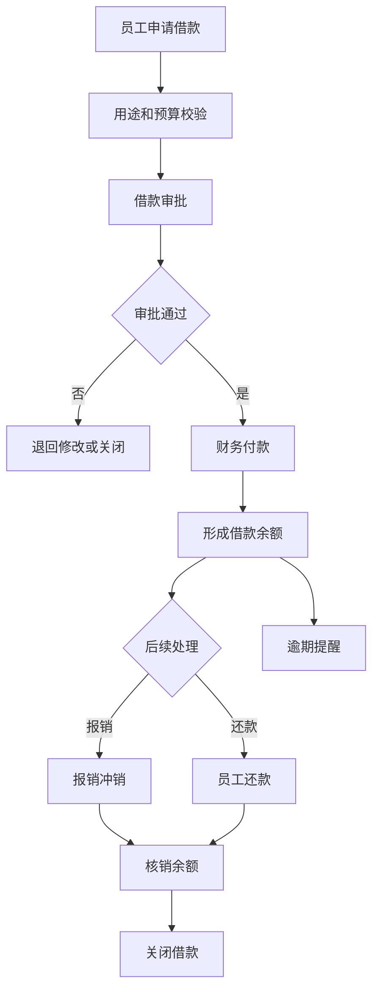
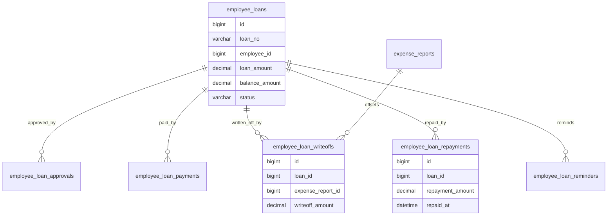
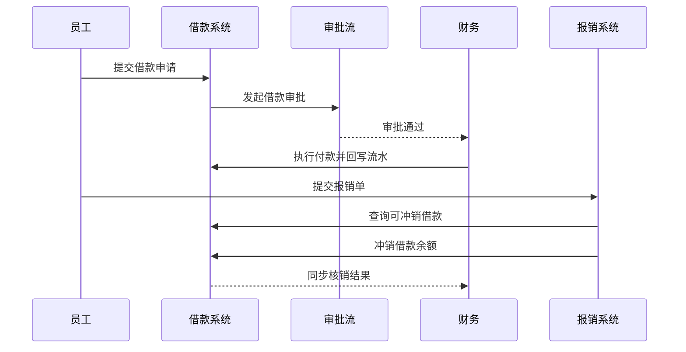

# 员工借款项目案例

## 适合谁看

适合需要做备用金、差旅借款、项目借款、借款审批、付款、报销冲销、还款、逾期提醒和财务核销的开发者。

员工借款不是“给员工打一笔钱”。真实项目里，借款会连接员工、部门、项目、预算、审批、付款、报销、还款和财务科目。系统要能回答：谁借了多少钱、用途是什么、是否已付款、多久要冲销、是否逾期、是否还有未归还余额。

## 业务目标

第一版员工借款支持：

- 创建差旅、项目、备用金等借款申请。
- 维护借款用途、预算归属和还款期限。
- 支持借款审批、退回和撤回。
- 支持借款付款和银行流水回写。
- 支持报销冲销借款。
- 支持主动还款和部分还款。
- 支持借款余额、逾期提醒和催办。
- 支持财务入账、核销和审计。

## 员工借款链路

员工借款的核心是“借款余额”。付款后形成员工欠款，后续报销或还款都应该逐步核销这个余额。

## 核心概念

| 概念 | 说明 | 示例 |
| --- | --- | --- |
| 借款申请 | 员工申请预支资金 | 出差借款 3000 |
| 借款用途 | 资金使用场景 | 差旅、采购、项目活动 |
| 借款余额 | 未冲销或未还款金额 | 还剩 800 未核销 |
| 冲销 | 用报销单抵扣借款 | 报销 2500 冲销 |
| 还款 | 员工主动退回现金或转账 | 还款 500 |
| 到期日 | 借款应完成冲销的日期 | 出差结束后 7 天 |
| 逾期 | 到期仍未核销完 | 逾期 15 天 |

借款申请、付款记录和核销记录要分离。审批通过不是付款，付款后也不代表借款已结清。

## 数据模型

## 推荐表结构

| 表 | 作用 | 关键字段 |
| --- | --- | --- |
| `employee_loans` | 员工借款 | `loan_no`、`employee_id`、`loan_amount`、`balance_amount`、`due_date`、`status` |
| `employee_loan_approvals` | 借款审批 | `loan_id`、`node_name`、`action`、`operator_id`、`comment` |
| `employee_loan_payments` | 借款付款 | `loan_id`、`paid_amount`、`paid_at`、`bank_serial_no` |
| `employee_loan_writeoffs` | 报销冲销 | `loan_id`、`expense_report_id`、`writeoff_amount` |
| `employee_loan_repayments` | 员工还款 | `loan_id`、`repayment_no`、`repayment_amount`、`repaid_at` |
| `employee_loan_reminders` | 借款提醒 | `loan_id`、`remind_type`、`remind_at`、`sent_status` |
| `employee_loan_risks` | 借款风险 | `loan_id`、`risk_type`、`risk_level`、`status` |
| `employee_loan_accounting_entries` | 财务入账 | `loan_id`、`subject_code`、`amount`、`posted_status` |

余额字段要谨慎维护。推荐通过付款、冲销、还款流水计算，并在主表保存冗余余额用于查询，所有修改必须有流水。

## 借款冲销流程

报销冲销要支持部分冲销。一次借款可能被多张报销单冲销，一张报销单也可能冲销多笔借款。

## 借款状态设计

| 状态 | 含义 | 注意点 |
| --- | --- | --- |
| 草稿 | 员工填写中 | 可编辑 |
| 审批中 | 已提交审批 | 金额冻结 |
| 已驳回 | 审批未通过 | 可修改后重提 |
| 待付款 | 审批通过未付款 | 不产生余额 |
| 已付款 | 已形成借款余额 | 开始计算到期 |
| 部分核销 | 还有余额 | 持续提醒 |
| 已结清 | 余额为 0 | 不可再冲销 |
| 已逾期 | 超过到期日未结清 | 触发催办和限制 |

逾期不是单独终态，而是风险状态。借款可以同时是“已付款”和“逾期风险”。

## 前端页面拆分

| 页面或组件 | 作用 | 注意点 |
| --- | --- | --- |
| 我的借款 | 员工查看申请和余额 | 突出到期日和未核销 |
| 借款申请 | 填写用途、金额和预算 | 显示历史未结清借款 |
| 借款审批 | 审批借款 | 展示员工历史借款和逾期 |
| 财务付款 | 执行借款付款 | 记录银行流水 |
| 借款冲销 | 在报销中选择借款抵扣 | 显示可冲销余额 |
| 员工还款 | 登记员工还款 | 支持线下收款凭证 |
| 借款台账 | 财务查看借款余额 | 支持部门、员工、账龄筛选 |
| 逾期看板 | 查看未结清和逾期借款 | 支持催办和导出 |

借款申请页要提示员工已有未结清借款。很多企业会限制员工在有逾期借款时再次借款。

## 接口拆分建议

| 接口 | 作用 | 注意点 |
| --- | --- | --- |
| `POST /employee-loans` | 创建借款 | 校验员工、预算和未结清借款 |
| `POST /employee-loans/{id}/submit` | 提交审批 | 审批中冻结金额 |
| `POST /employee-loans/{id}/pay` | 财务付款 | 付款流水幂等 |
| `GET /employee-loans/available-writeoff` | 查询可冲销借款 | 按员工和余额筛选 |
| `POST /employee-loans/writeoff` | 报销冲销 | 支持部分冲销 |
| `POST /employee-loans/{id}/repayments` | 登记还款 | 关联收款凭证 |
| `GET /employee-loans/overdue` | 查询逾期借款 | 支持部门和员工筛选 |
| `POST /employee-loans/{id}/remind` | 发送催办 | 保留催办记录 |

## 实际项目常见问题

### 问题 1：审批通过后员工以为钱已经到账

审批通过和付款执行要分开。页面要显示“待付款”和“已付款”，并在付款后记录银行流水。

### 问题 2：报销冲销后余额不准

冲销必须按流水处理，不能直接手改余额。重复提交报销或审批回调时，要用报销单号和借款 ID 保证幂等。

### 问题 3：员工离职时还有未结清借款

借款系统要提供离职检查接口。人事离职流程应检查未结清借款、报销和还款记录。

### 问题 4：借款逾期没人处理

要有到期提醒、逾期看板和催办记录。逾期严重时可以限制再次借款或触发上级审批。

## 权限与审计

员工借款权限至少要区分：

- 创建自己的借款。
- 查看自己的借款。
- 查看部门借款。
- 审批借款。
- 执行付款。
- 登记还款。
- 执行报销冲销。
- 查看逾期看板。
- 导出借款台账。

付款、还款、冲销、余额调整和逾期豁免必须审计。员工借款直接影响公司资金和个人往来账。

## 验收清单

- 借款申请、审批、付款、冲销和还款状态清晰。
- 审批通过和已付款分离。
- 付款后形成借款余额。
- 报销冲销支持部分冲销和多次冲销。
- 员工还款可登记并核销余额。
- 余额变化都有流水。
- 到期和逾期可提醒。
- 员工未结清借款可在审批和离职流程中检查。
- 财务入账和导出可追踪。
- 高风险操作有审批和审计。

## 下一步学习

继续学习 [费用报销项目案例](/projects/expense-reimbursement-case)、[资金计划项目案例](/projects/cash-flow-planning-case)、[预算管理项目案例](/projects/budget-management-case) 和 [行业合规审计项目案例](/projects/compliance-audit-case)。
