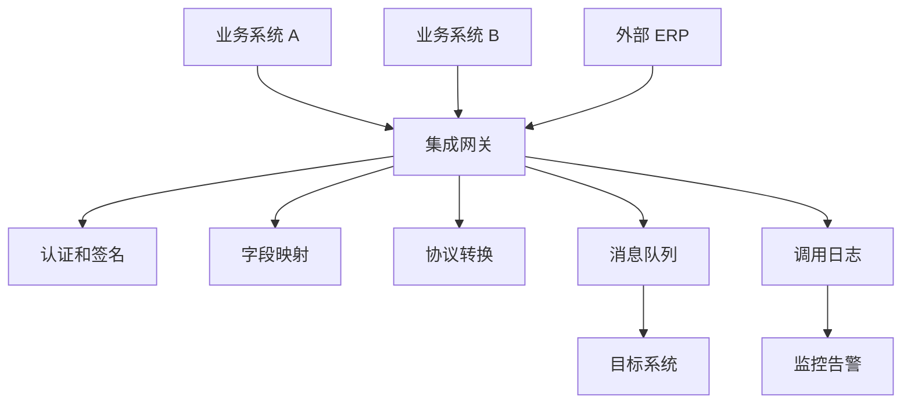
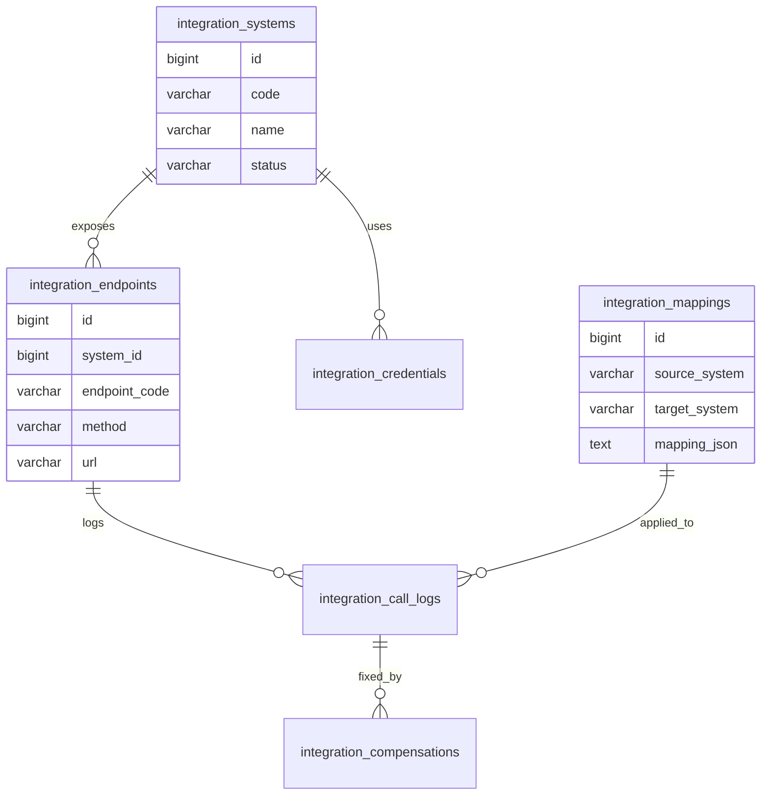
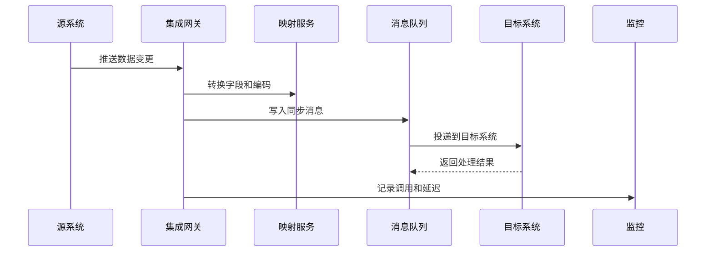

# 集团级系统集成项目案例

## 适合谁看

适合需要做集团多系统集成、ERP/CRM/OA/财务系统对接、统一身份、主数据同步、接口编排、集成监控和异常补偿的开发者。

集团级系统集成不是“调几个外部接口”。真实项目里，系统很多，数据口径不同，接口稳定性不同，组织和权限复杂。集成层要解决身份、主数据、协议转换、消息同步、错误补偿、监控告警和变更治理。

## 业务目标

第一版系统集成模块支持：

- 管理外部系统。
- 配置接口凭证和调用地址。
- 支持同步和异步集成。
- 支持主数据同步。
- 支持接口调用日志。
- 支持失败重试和人工补偿。
- 支持字段映射。
- 支持集成监控和告警。

## 集成架构图

集成层要避免让业务模块直接耦合多个外部系统。业务模块应该调用稳定的内部接口，由集成层处理外部差异。

## 数据模型

## 推荐表结构

| 表 | 作用 | 关键字段 |
| --- | --- | --- |
| `integration_systems` | 外部系统 | `code`、`name`、`status`、`owner` |
| `integration_credentials` | 凭证配置 | `system_id`、`credential_type`、`secret_ref` |
| `integration_endpoints` | 接口配置 | `system_id`、`endpoint_code`、`method`、`url` |
| `integration_mappings` | 字段映射 | `source_system`、`target_system`、`mapping_json` |
| `integration_call_logs` | 调用日志 | `endpoint_id`、`status`、`latency_ms`、`trace_id` |
| `integration_compensations` | 补偿记录 | `call_log_id`、`action_type`、`reason` |

凭证不要直接明文存在配置表里，应该放密钥管理系统或加密存储，并限制查看权限。

## 同步流程

重要业务数据建议走异步消息和补偿机制。同步接口适合查询或低风险操作，不适合长链路多系统写入。

## 集成模式

| 模式 | 适合场景 | 风险 |
| --- | --- | --- |
| 同步 API | 查询库存、校验状态 | 外部慢会拖慢主流程 |
| 异步消息 | 主数据同步、订单状态同步 | 存在短暂延迟 |
| 文件交换 | 财务账单、批量数据 | 格式和时效要治理 |
| 定时拉取 | 外部系统不支持推送 | 延迟和重复处理 |
| Webhook | 事件通知 | 对方失败要重试 |

一个项目通常会同时使用多种模式。关键是为每种模式设计日志、重试和补偿。

## 前端页面拆分

| 页面 | 作用 | 注意点 |
| --- | --- | --- |
| 系统列表 | 管理外部系统 | 显示负责人和状态 |
| 接口配置 | 配置地址、方法、超时 | 生产密钥不能明文展示 |
| 字段映射 | 配置字段转换 | 支持测试转换结果 |
| 调用日志 | 查看请求、响应、耗时 | 敏感字段脱敏 |
| 补偿处理 | 重试失败调用 | 重试前确认影响 |
| 集成监控 | 查看成功率、延迟、积压 | 支持告警 |

## 常见问题

### 问题 1：外部系统变更字段导致同步失败

字段映射要有版本和测试工具。外部接口变更必须经过联调环境验证，不能直接改生产映射。

### 问题 2：一个系统成功，另一个系统失败

跨系统无法简单依赖本地事务。要用状态机、消息队列和补偿记录处理最终一致性。

### 问题 3：排查问题时找不到一次请求的完整链路

每次集成调用必须带 `trace_id`，并贯穿网关、消息、目标系统和日志。

## 验收清单

- 外部系统有统一登记。
- 接口凭证加密或密钥化管理。
- 字段映射有版本和测试能力。
- 调用日志包含 trace id、耗时和结果。
- 失败调用支持重试和人工补偿。
- 敏感字段脱敏。
- 集成成功率和延迟可监控。
- 外部接口变更有测试和发布流程。
- 关键数据同步具备幂等能力。

## 下一步学习

继续学习 [主数据管理项目案例](/projects/master-data-case)、[第三方开放平台项目案例](/projects/open-platform-case) 和 [消息队列项目案例](/projects/message-queue-case)。
