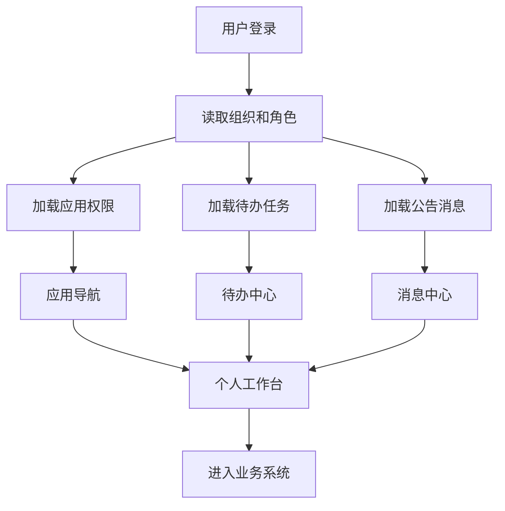
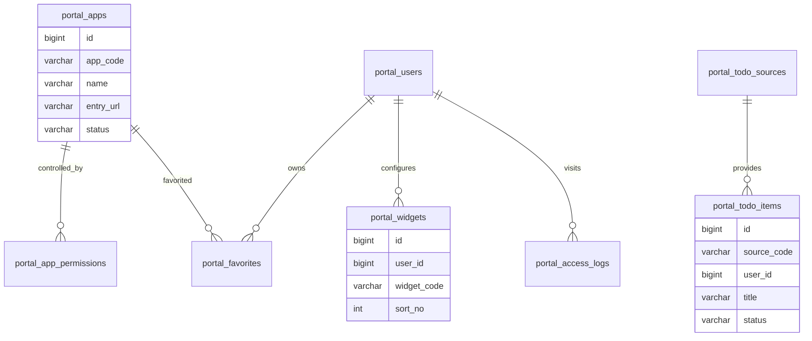
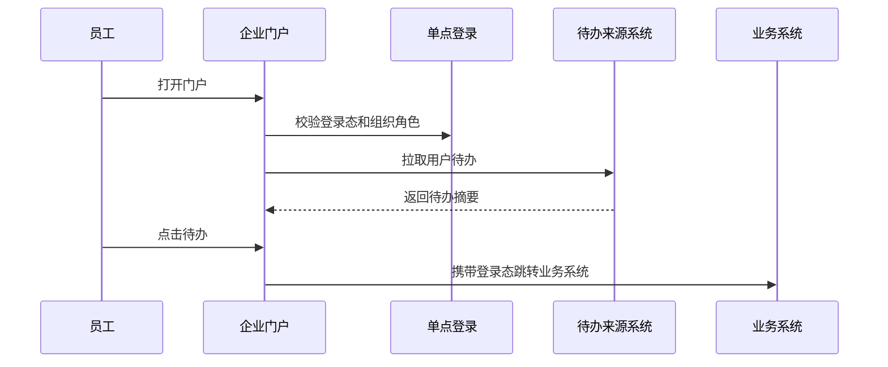

# 企业门户项目案例

## 适合谁看

适合需要做企业工作台、统一入口、应用导航、待办聚合、公告通知、个人常用、单点登录和移动端入口的开发者。

企业门户不是“把几个链接放在首页”。真实项目里，门户要把组织、权限、应用、待办、消息、搜索和个人偏好整合起来，让员工从一个入口进入日常工作。门户看起来简单，但它经常连接最多系统，最容易暴露权限和体验问题。

## 业务目标

第一版企业门户支持：

- 统一登录入口。
- 按角色展示应用导航。
- 聚合待办任务。
- 展示公告和消息。
- 支持常用应用。
- 支持全局搜索。
- 支持个人工作台配置。
- 支持移动端访问。
- 支持门户访问审计。

## 门户信息架构

门户首页要围绕“员工今天要做什么”组织，而不是把所有系统都堆在首屏。

## 数据模型

## 推荐表结构

| 表 | 作用 | 关键字段 |
| --- | --- | --- |
| `portal_apps` | 应用目录 | `app_code`、`name`、`entry_url`、`icon`、`status` |
| `portal_app_permissions` | 应用权限 | `app_id`、`target_type`、`target_id`、`permission_type` |
| `portal_favorites` | 常用应用 | `user_id`、`app_id`、`sort_no` |
| `portal_todo_sources` | 待办来源 | `source_code`、`name`、`api_url`、`status` |
| `portal_todo_items` | 待办聚合 | `source_code`、`user_id`、`title`、`target_url`、`status` |
| `portal_announcements` | 公告通知 | `title`、`content`、`target_scope`、`published_at` |
| `portal_widgets` | 工作台组件 | `user_id`、`widget_code`、`config_json`、`sort_no` |
| `portal_access_logs` | 访问日志 | `user_id`、`app_code`、`action`、`visited_at` |

应用入口必须走权限过滤。不要把无权限应用先展示出来，再依赖目标系统拦截。

## 待办聚合流程

待办聚合不要一次加载所有系统的完整详情。首页展示摘要，点击后进入业务系统处理。

## 门户模块设计

| 模块 | 作用 | 注意点 |
| --- | --- | --- |
| 应用导航 | 按权限展示系统入口 | 支持搜索和分类 |
| 待办中心 | 聚合审批、工单、任务 | 只展示用户可处理项 |
| 公告通知 | 发布组织消息 | 区分必读和普通通知 |
| 常用应用 | 用户自定义快捷入口 | 支持排序 |
| 全局搜索 | 搜应用、文档、人员 | 搜索结果要权限过滤 |
| 个人工作台 | 组件化展示个人信息 | 不要让配置过度复杂 |

企业门户的第一屏要控制复杂度。常用应用、待办和公告通常比花哨的统计图更有价值。

## 前端页面拆分

| 页面 | 作用 | 注意点 |
| --- | --- | --- |
| 门户首页 | 展示应用、待办、公告和常用入口 | 首屏优先工作任务 |
| 应用中心 | 查看全部可用应用 | 按权限过滤 |
| 待办中心 | 聚合多个系统待办 | 显示来源和截止时间 |
| 公告中心 | 查看通知和公告 | 必读公告要有确认记录 |
| 个人设置 | 配置常用应用和组件 | 移动端操作要简单 |
| 门户管理 | 管理应用、公告和组件 | 管理权限独立控制 |
| 访问审计 | 查看访问和跳转记录 | 用于排查越权和入口问题 |

## 实际项目常见问题

### 问题 1：门户显示了用户无权访问的系统

门户和业务系统要使用同一套身份和权限来源。门户不能维护一份独立的手工权限清单。

### 问题 2：首页很慢

通常是同步请求太多。待办、公告、常用应用和搜索建议可以分块加载，待办详情延迟到点击后再取。

### 问题 3：移动端首屏被导航挤满

移动端应优先展示待办、常用应用和搜索入口，复杂应用分类可以放到抽屉或二级页面。

## 验收清单

- 门户应用按角色和组织权限过滤。
- 支持单点登录或统一登录态。
- 常用应用可维护和排序。
- 待办聚合有来源和状态。
- 公告支持发布范围和确认记录。
- 全局搜索结果经过权限过滤。
- 首页数据可以分块加载。
- 移动端首屏保留核心任务。
- 访问跳转有审计记录。
- 门户管理权限和普通用户权限隔离。

## 下一步学习

继续学习 [组织架构项目案例](/projects/organization-case)、[消息通知项目案例](/projects/notification-center-case) 和 [搜索中心项目案例](/projects/search-center-case)。
