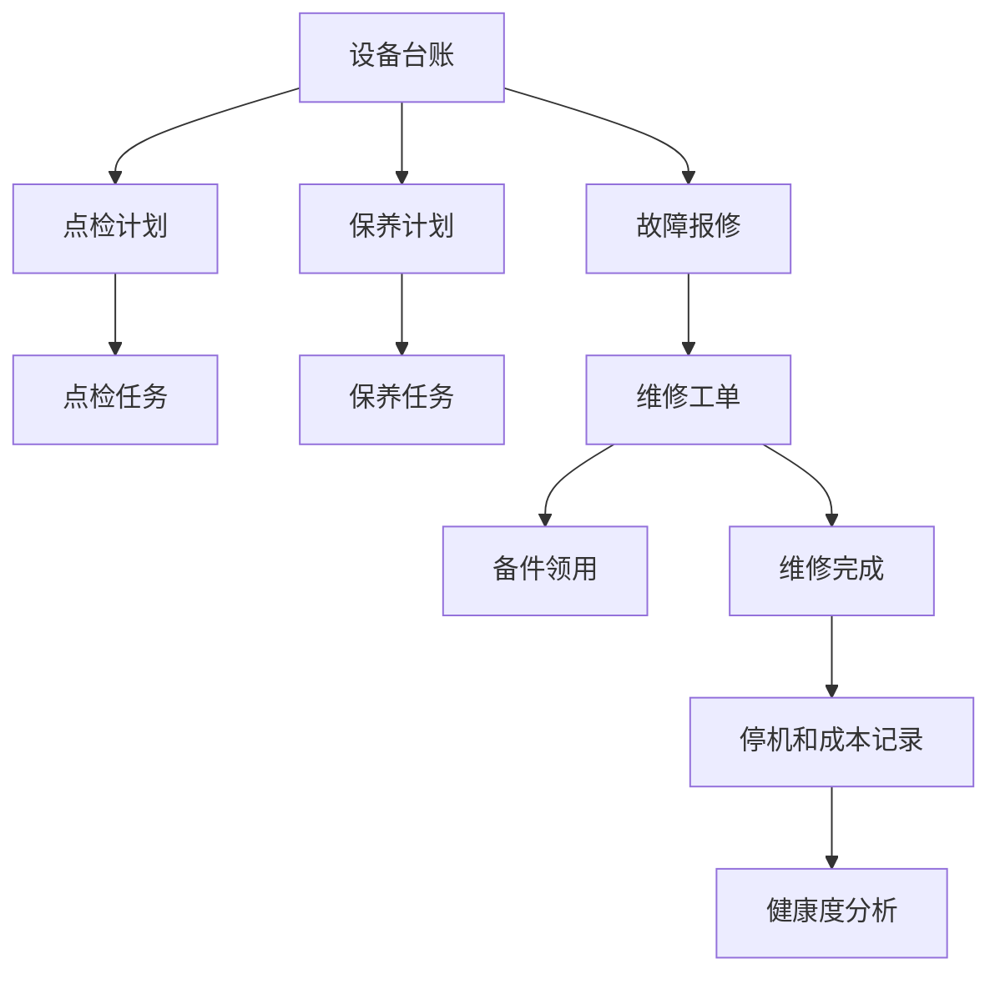
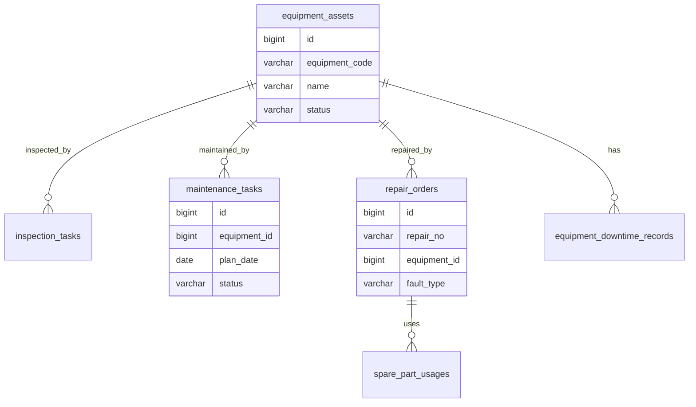
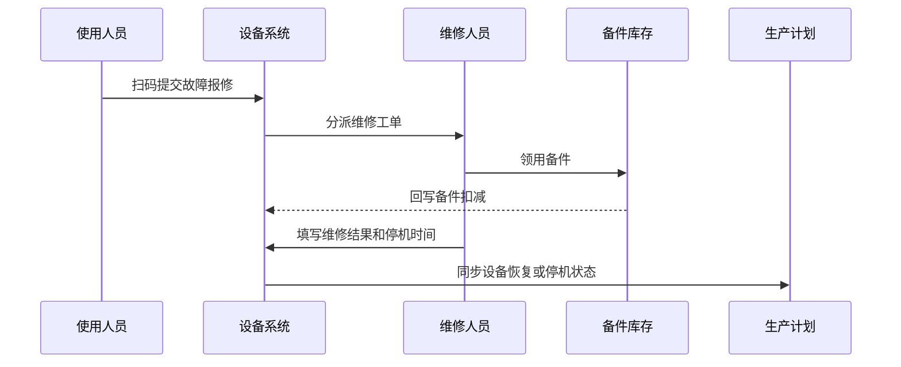

# 设备维保项目案例

## 适合谁看

适合需要做设备台账、点检计划、保养计划、维修工单、备件管理、停机记录、故障分析和设备健康度的开发者。

设备维保不是“设备坏了填一个维修单”。真实制造、仓储、门店和 IoT 项目里，设备要定期点检和保养，故障要影响生产计划，备件要有库存，停机要统计损失，长期还要分析哪些设备最容易坏、哪些保养策略有效。

## 业务目标

第一版设备维保支持：

- 维护设备台账、位置、型号、负责人和状态。
- 支持点检计划和保养计划。
- 支持维修工单、故障分类和处理过程。
- 支持备件领用和库存校验。
- 支持停机时间和影响范围记录。
- 支持设备健康度、故障率和维保成本分析。
- 支持移动端扫码报修和点检。

## 设备维保链路

核心原则：维保要从“被动维修”逐步走向“计划保养和健康度管理”。只有故障单，没有点检和保养，就很难降低故障率。

## 数据模型

## 推荐表结构

| 表 | 作用 | 关键字段 |
| --- | --- | --- |
| `equipment_assets` | 设备台账 | `equipment_code`、`name`、`model`、`location_id`、`status` |
| `inspection_plans` | 点检计划 | `equipment_id`、`cycle_type`、`check_items`、`enabled` |
| `inspection_tasks` | 点检任务 | `plan_id`、`plan_date`、`result`、`operator_id` |
| `maintenance_plans` | 保养计划 | `equipment_id`、`cycle_type`、`maintenance_items` |
| `maintenance_tasks` | 保养任务 | `plan_id`、`plan_date`、`status`、`finished_at` |
| `repair_orders` | 维修工单 | `repair_no`、`equipment_id`、`fault_type`、`status` |
| `spare_parts` | 备件档案 | `part_code`、`name`、`stock_qty`、`safe_stock` |
| `spare_part_usages` | 备件领用 | `repair_id`、`part_id`、`used_qty` |
| `equipment_downtime_records` | 停机记录 | `equipment_id`、`started_at`、`ended_at`、`impact_reason` |

设备状态要和维修、点检、保养联动。设备维修中或停机中时，生产排程和使用计划应该能感知。

## 维保任务类型

| 类型 | 触发方式 | 处理重点 |
| --- | --- | --- |
| 日常点检 | 每日、每班次 | 快速记录异常 |
| 定期保养 | 按周期或运行时长 | 标准项目和耗材 |
| 故障维修 | 人工报修或设备告警 | 响应时间和修复结果 |
| 预防性维护 | 根据健康度或趋势 | 提前降低故障风险 |
| 大修 | 年度或重大故障 | 停机计划和成本 |

第一版可以先做周期点检、周期保养和故障维修，后续再接入设备运行数据做预测性维护。

## 报修维修流程

维修工单要记录响应时间、修复时间和停机时间。它们分别用于 SLA、维修效率和生产损失分析。

## 前端页面拆分

| 页面或组件 | 作用 | 注意点 |
| --- | --- | --- |
| 设备台账 | 查看设备基础信息 | 支持二维码和位置 |
| 点检任务 | 执行日常检查 | 移动端优先 |
| 保养计划 | 配置周期保养 | 支持提前提醒 |
| 报修入口 | 扫码提交故障 | 附照片和故障描述 |
| 维修工单 | 分派和处理维修 | 展示备件和停机时间 |
| 备件管理 | 管理备件库存 | 低库存预警 |
| 停机记录 | 分析停机原因 | 关联设备和工单 |
| 设备看板 | 查看故障率、健康度、成本 | 按设备、产线、区域分析 |

移动端是设备维保的关键场景。点检和报修不能只在桌面后台完成。

## 常见问题

### 问题 1：设备坏了才发现很久没保养

保养计划要按周期自动生成任务，并在逾期时提醒负责人。长期逾期设备应进入风险看板。

### 问题 2：维修完成了，但生产排程还认为设备不可用

设备状态需要统一服务或事件同步。维修完成后要同步设备状态给生产排程或使用系统。

### 问题 3：维修时发现没有备件

常用备件要设置安全库存，维修工单领用备件时扣减库存，低库存触发采购建议。

### 问题 4：故障分析没有价值

故障类型、原因、处理方式要结构化。只写自由文本，后续很难统计高频故障。

## 验收清单

- 设备有唯一编码、位置、型号和负责人。
- 支持点检计划、保养计划和维修工单。
- 点检和报修支持移动端扫码。
- 维修工单记录响应、修复和停机时间。
- 备件领用能扣减库存。
- 低库存备件有预警。
- 设备状态能影响生产或使用系统。
- 故障原因和处理方式结构化。
- 看板能统计故障率、停机时间和维保成本。
- 逾期点检和保养能进入预警。

## 下一步学习

继续学习 [IoT 设备管理项目案例](/projects/iot-device-management-case)、[生产排程项目案例](/projects/production-scheduling-case)、[资产管理项目案例](/projects/asset-management-case) 和 [采购管理项目案例](/projects/procurement-management-case)。
