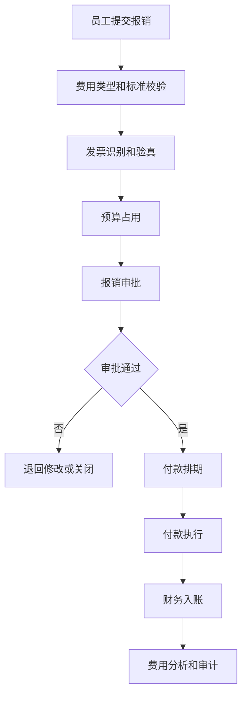
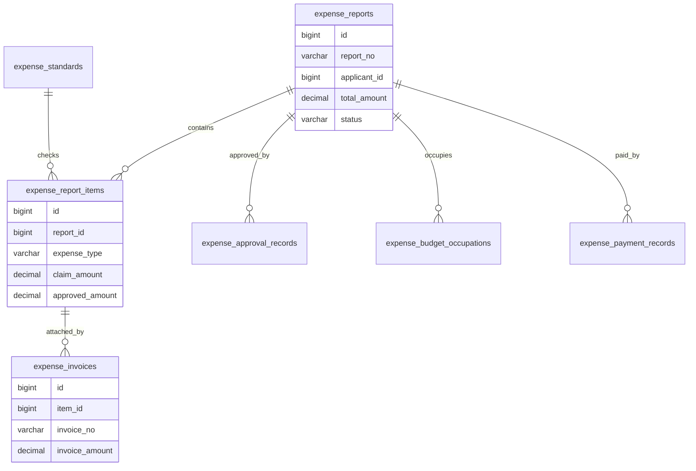
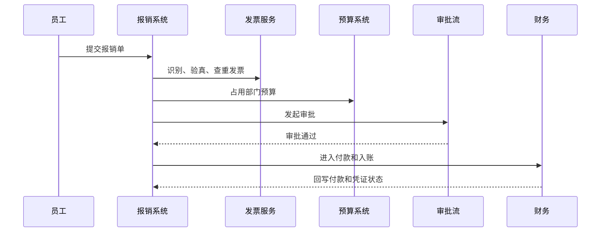

# 费用报销项目案例

## 适合谁看

适合需要做员工报销、差旅报销、费用标准、发票识别、预算占用、报销审批、付款执行和财务入账的开发者。

费用报销不是“上传发票等审批”。真实项目里，报销会连接员工、部门、预算、费用标准、发票、差旅、审批、付款、财务科目和税务合规。系统要能判断这笔费用能不能报、报多少、走哪个预算、是否重复报销、是否需要补充说明。

## 业务目标

第一版费用报销支持：

- 创建日常报销、差旅报销和借款冲销。
- 维护费用类型、报销标准和审批规则。
- 支持发票上传、识别、验真和查重。
- 支持预算占用和释放。
- 支持报销审批、退回和撤回。
- 支持付款排期和付款执行。
- 支持费用归集、科目映射和财务导出。
- 支持超标报销、无票报销和异常报销审计。

## 费用报销链路

这条链路的核心是“报销单不是付款单”。报销审批通过后，还要进入财务付款和入账流程。

## 核心概念

| 概念 | 说明 | 示例 |
| --- | --- | --- |
| 费用类型 | 报销所属类别 | 差旅、交通、招待、办公 |
| 报销标准 | 某类费用的可报规则 | 住宿每天不超过 500 |
| 发票验真 | 校验发票真伪和状态 | 查重、验真、抬头校验 |
| 预算占用 | 报销预计占用部门预算 | 市场部活动预算 |
| 超标报销 | 超过标准但允许说明 | 住宿超标 120 元 |
| 无票报销 | 没有发票的费用 | 市内交通补贴 |
| 借款冲销 | 用报销抵扣预借款 | 出差借款 3000 |

报销标准要配置化。不要把差旅城市等级、住宿标准和交通标准写死在代码里。

## 数据模型

## 推荐表结构

| 表 | 作用 | 关键字段 |
| --- | --- | --- |
| `expense_reports` | 报销单 | `report_no`、`applicant_id`、`department_id`、`total_amount`、`status` |
| `expense_report_items` | 报销明细 | `report_id`、`expense_type`、`claim_amount`、`approved_amount` |
| `expense_invoices` | 报销发票 | `item_id`、`invoice_no`、`invoice_code`、`invoice_amount`、`verify_status` |
| `expense_standards` | 报销标准 | `expense_type`、`city_level`、`limit_amount`、`effective_date` |
| `expense_budget_occupations` | 预算占用 | `report_id`、`budget_id`、`occupied_amount`、`status` |
| `expense_approval_records` | 审批记录 | `report_id`、`node_name`、`action`、`comment`、`operator_id` |
| `expense_payment_records` | 付款记录 | `report_id`、`payee_id`、`paid_amount`、`paid_at`、`bank_serial_no` |
| `expense_accounting_entries` | 财务入账 | `report_id`、`subject_code`、`amount`、`posted_status` |
| `expense_risk_alerts` | 报销风险 | `report_id`、`risk_type`、`risk_level`、`status` |

发票要独立建表并做查重。重复发票、作废发票、抬头不匹配是报销系统最常见的风险。

## 报销审批流程

预算占用要支持释放。报销被驳回、撤回或付款金额减少时，预算占用要同步调整。

## 报销规则设计

| 规则 | 示例 | 处理方式 |
| --- | --- | --- |
| 金额标准 | 一线城市住宿上限 500 | 超标提示并要求说明 |
| 发票查重 | 同一发票不能重复报 | 阻止提交或进入风控 |
| 发票抬头 | 必须匹配公司抬头 | 阻止提交 |
| 费用归属 | 部门、项目、客户必填 | 影响预算和分析 |
| 审批路径 | 金额越大审批层级越高 | 按金额和类型路由 |
| 借款冲销 | 有未核销借款先抵扣 | 生成冲销记录 |

第一版可以先做硬规则和提示规则。硬规则阻止提交，提示规则允许提交但进入审批说明。

## 前端页面拆分

| 页面或组件 | 作用 | 注意点 |
| --- | --- | --- |
| 报销工作台 | 查看我的报销、待审批、待付款 | 状态和待办要清楚 |
| 报销申请 | 填写费用明细和上传发票 | 引导选择费用类型 |
| 发票面板 | 展示识别结果和验真状态 | 重复或异常要突出 |
| 报销标准提示 | 展示当前可报标准 | 超标原因必填 |
| 审批页面 | 处理报销审批 | 展示预算、发票和风险 |
| 财务付款 | 查看待付款报销 | 支持批量排期 |
| 入账导出 | 生成财务凭证或导出 | 科目映射要清楚 |
| 报销风险看板 | 查重复、超标、无票和异常 | 支持分派处理 |

报销申请页要减少员工理解成本。员工不应该自己判断复杂科目，但系统必须能把费用映射到财务需要的字段。

## 接口拆分建议

| 接口 | 作用 | 注意点 |
| --- | --- | --- |
| `POST /expenses/reports` | 创建报销单 | 草稿状态可反复编辑 |
| `POST /expenses/reports/{id}/submit` | 提交审批 | 提交前做发票、预算和标准校验 |
| `POST /expenses/invoices/recognize` | 发票识别 | 返回结构化字段和置信度 |
| `POST /expenses/invoices/verify` | 发票验真 | 支持异步结果 |
| `POST /expenses/reports/{id}/approve` | 审批报销 | 保存意见和调整金额 |
| `POST /expenses/reports/{id}/pay` | 付款 | 付款流水幂等 |
| `POST /expenses/reports/{id}/post` | 财务入账 | 保存凭证或导出状态 |
| `GET /expenses/risks` | 查询报销风险 | 支持重复、超标、无票筛选 |

## 实际项目常见问题

### 问题 1：同一张发票被多人重复报销

发票查重要使用发票代码、发票号码、开票日期、金额等组合字段，并在提交审批前锁定发票占用，不能等财务付款时才发现。

### 问题 2：审批通过金额和付款金额不一致

报销明细要区分申请金额、审批金额和实付金额。财务付款只能基于审批金额，不能直接读取员工填写的申请金额。

### 问题 3：预算占用后报销驳回没有释放

报销撤回、驳回、关闭和审批金额调整都要释放或调整预算占用。预算占用流水要能追溯。

### 问题 4：财务科目映射混乱

费用类型、部门、项目、客户和税率会影响科目映射。推荐先做规则配置和预览，不要让财务在导出后再手工改。

## 权限与审计

费用报销权限至少要区分：

- 创建自己的报销。
- 查看部门报销。
- 审批报销。
- 调整审批金额。
- 处理发票异常。
- 执行付款。
- 导出财务凭证。
- 配置报销标准。
- 查看风险报表。

报销标准变更、审批金额调整、付款和入账都要审计。费用系统涉及员工资金和财务合规，必须可追溯。

## 验收清单

- 报销单和明细状态清晰。
- 发票能识别、验真和查重。
- 报销标准可配置且有生效时间。
- 超标和无票报销有说明和审批。
- 报销能占用和释放预算。
- 审批金额和实付金额分离。
- 付款执行有银行流水。
- 财务科目映射可追溯。
- 重复报销和异常发票有风控。
- 关键操作有审计记录。

## 下一步学习

继续学习 [预算管理项目案例](/projects/budget-management-case)、[资金计划项目案例](/projects/cash-flow-planning-case)、[税务管理项目案例](/projects/tax-management-case) 和 [行业合规审计项目案例](/projects/compliance-audit-case)。
