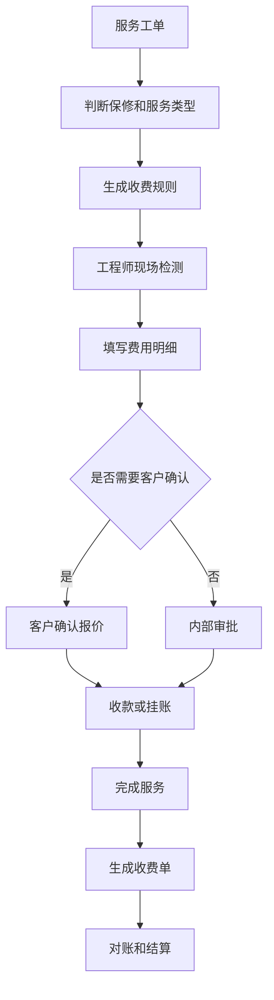
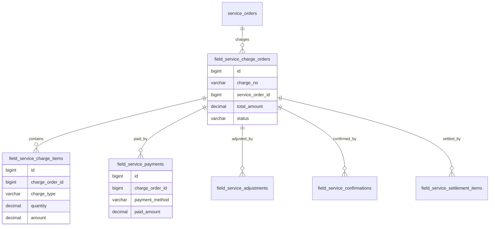
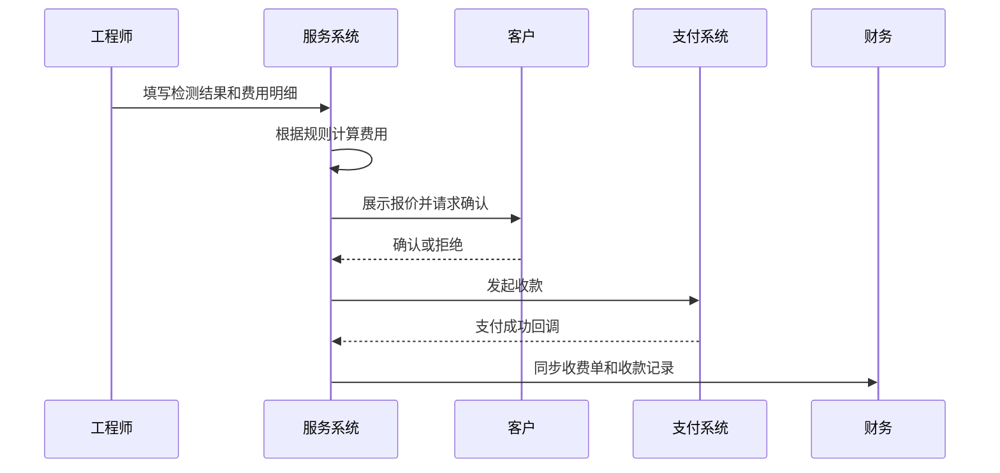

# 现场服务收费项目案例

## 适合谁看

适合需要做上门服务、工程师工时、里程费、备件费、服务报价、客户确认、收费单、退款和服务结算的开发者。

现场服务收费不是“服务完成后收一笔钱”。真实项目里，费用可能来自上门费、检测费、维修费、工时费、备件费、加急费、交通费和优惠减免。系统要能回答：为什么收费、谁确认了费用、是否在保、是否使用备件、客户是否已支付、服务商如何结算。

## 业务目标

第一版现场服务收费支持：

- 根据服务类型、保修状态和客户等级生成收费规则。
- 支持工程师现场报价和费用明细。
- 支持客户确认报价、线上支付或线下收款。
- 支持备件消耗计费、工时计费和里程计费。
- 支持免费、减免、折扣和审批。
- 支持退款、补收和费用调整。
- 支持服务商结算和财务对账。
- 支持收费凭证、客户签字和操作审计。

## 现场服务收费链路

现场服务收费的关键是“费用依据”。客户看到一笔费用时，要能看到对应的服务项、备件、工时、规则和确认记录。

## 核心概念

| 概念 | 说明 | 示例 |
| --- | --- | --- |
| 服务收费规则 | 决定是否收费和怎么收费 | 保外上门费 80 元 |
| 费用明细 | 单次服务的收费项目 | 工时、备件、交通 |
| 客户确认 | 客户确认报价或费用 | 签字、短信确认 |
| 挂账 | 先服务后统一结算 | 企业客户月结 |
| 减免 | 因保修或投诉减免费用 | 免上门费 |
| 补收 | 服务后发现费用不足 | 追加备件费 |
| 退款 | 已收费用部分退回 | 维修失败退款 |
| 服务结算 | 和工程师或服务商结算 | 按工单分成 |

收费规则要和实际收费单分离。规则会变化，但历史收费单必须保留当时使用的规则快照。

## 数据模型

## 推荐表结构

| 表 | 作用 | 关键字段 |
| --- | --- | --- |
| `field_service_charge_rules` | 收费规则 | `rule_name`、`service_type`、`warranty_scope`、`price_formula`、`enabled` |
| `field_service_charge_orders` | 收费单 | `charge_no`、`service_order_id`、`customer_id`、`total_amount`、`status` |
| `field_service_charge_items` | 收费明细 | `charge_order_id`、`charge_type`、`unit_price`、`quantity`、`amount` |
| `field_service_confirmations` | 客户确认 | `charge_order_id`、`confirm_method`、`confirmed_at`、`signature_file_id` |
| `field_service_payments` | 收款记录 | `charge_order_id`、`payment_method`、`paid_amount`、`transaction_no` |
| `field_service_adjustments` | 费用调整 | `charge_order_id`、`adjust_type`、`adjust_amount`、`reason` |
| `field_service_refunds` | 退款记录 | `charge_order_id`、`refund_amount`、`refund_status`、`reason` |
| `field_service_settlement_items` | 结算明细 | `charge_order_id`、`provider_id`、`settle_amount`、`settle_status` |

收费金额建议保存规则快照和人工调整原因。后续价格规则变化时，不能影响历史工单收费。

## 客户确认流程

客户确认记录非常重要。现场服务容易出现收费争议，没有确认记录会让售后、财务和客服都无法判断责任。

## 收费状态设计

| 状态 | 含义 | 注意点 |
| --- | --- | --- |
| 待报价 | 工程师尚未填写费用 | 可从规则预估 |
| 待确认 | 已生成费用等待客户确认 | 可设置超时 |
| 待支付 | 客户已确认未付款 | 支持线上和线下 |
| 已支付 | 收款成功 | 可继续服务或结算 |
| 挂账中 | 企业客户后付费 | 需要账期管理 |
| 已减免 | 费用被审批减免 | 保存原因 |
| 已退款 | 已发生退款 | 关联原支付 |
| 已结算 | 已和服务商结算 | 限制修改 |

免费服务也要生成记录。免费不是没有费用，而是费用被保修、权益或审批抵扣。

## 前端页面拆分

| 页面或组件 | 作用 | 注意点 |
| --- | --- | --- |
| 收费规则配置 | 配置服务类型、保修范围和价格公式 | 规则要有生效时间 |
| 工单收费面板 | 在服务工单中展示收费状态 | 工程师常用入口 |
| 费用明细编辑 | 填写工时、备件、里程、检测费 | 自动计算并允许审批调整 |
| 客户确认页 | 给客户确认报价 | 移动端优先，支持签字 |
| 收款登记 | 线上支付和线下收款 | 线下要上传凭证 |
| 费用调整审批 | 审批减免、补收和退款 | 展示原费用和原因 |
| 收费台账 | 财务查询收费单 | 按客户、工程师、服务商、期间筛选 |
| 结算明细 | 服务商或工程师结算 | 对账后锁定 |

现场场景下，客户确认页要尽量简单：费用项目、总金额、减免原因、服务说明和确认按钮要一屏内清楚。

## 接口拆分建议

| 接口 | 作用 | 注意点 |
| --- | --- | --- |
| `POST /field-service-charges/preview` | 预估费用 | 根据规则和工单上下文计算 |
| `POST /service-orders/{id}/charges` | 创建收费单 | 幂等处理重复提交 |
| `POST /field-service-charges/{id}/confirm` | 客户确认 | 保存确认方式和证据 |
| `POST /field-service-charges/{id}/pay` | 发起支付 | 使用业务流水防重 |
| `POST /field-service-charges/{id}/offline-payment` | 登记线下收款 | 上传凭证 |
| `POST /field-service-charges/{id}/adjust` | 费用调整 | 高风险调整走审批 |
| `POST /field-service-charges/{id}/refund` | 发起退款 | 关联原支付 |
| `GET /field-service-charges/ledger` | 查询收费台账 | 支持对账导出 |

## 实际项目常见问题

### 问题 1：客户认为维修免费，现场才发现要收费

工单派发前就要判断保修范围并提示可能收费。现场报价前，工程师也要能看到保修、权益和历史承诺。

### 问题 2：工程师手动改价导致对账混乱

人工改价必须有原因、权限和审批。历史收费单要保存规则快照，不能只保存最终金额。

### 问题 3：线下收款后财务不知道

线下收款要有凭证、收款人、收款时间和财务确认。没有财务确认前不应直接进入已结算。

### 问题 4：服务商结算金额和客户收费金额混在一起

客户收费和服务商结算要分开建模。客户收 200 元，不代表服务商一定结算 200 元。

## 权限与审计

现场服务收费权限至少要区分：

- 查看收费规则。
- 配置收费规则。
- 填写费用明细。
- 客户确认代录入。
- 登记线下收款。
- 发起减免、补收和退款。
- 审批费用调整。
- 查看收费台账。
- 执行服务商结算。

收费规则、人工调价、减免、退款、线下收款和结算都要审计。现场服务金额通常不大，但争议频率高。

## 验收清单

- 能根据服务类型和保修状态生成收费建议。
- 费用明细可拆成工时、备件、里程、检测和其他费用。
- 客户确认记录可追溯。
- 支持线上支付和线下收款。
- 支持免费、减免、补收和退款。
- 收费单和服务工单关联清晰。
- 客户收费和服务商结算分离。
- 历史收费单保留规则快照。
- 财务台账可查询和导出。
- 关键收费动作有审计记录。

## 下一步学习

继续学习 [售后服务项目案例](/projects/after-sales-service-case)、[售后结算项目案例](/projects/after-sales-settlement-case)、[报修派单项目案例](/projects/repair-dispatch-case) 和 [服务网点项目案例](/projects/service-outlet-case)。
