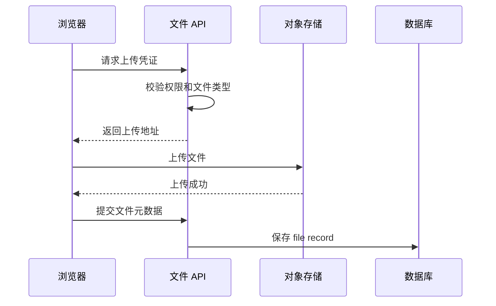
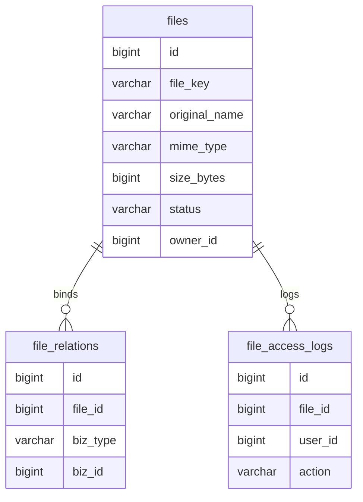
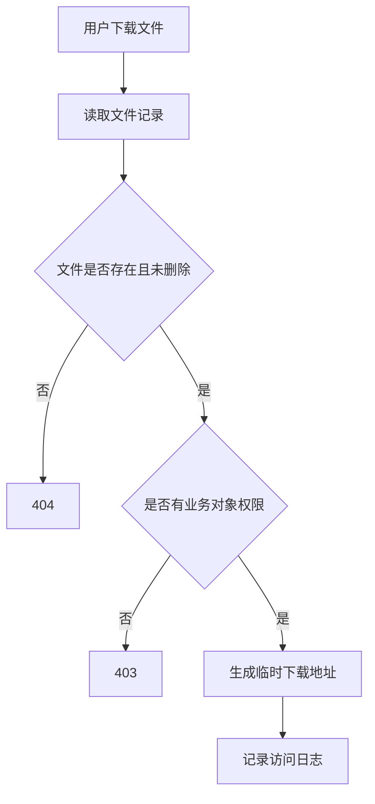

# 文件中心项目案例

## 适合谁看

适合需要做上传、下载、头像、附件、导入导出、合同文件、图片资源、对象存储和文件权限的开发者。

文件中心不是“一个上传接口”。真实项目里要处理文件大小、类型校验、权限、病毒扫描、对象存储、断点续传、下载鉴权、生命周期和审计。

## 业务目标

第一版文件中心支持：

- 文件上传。
- 文件列表。
- 文件下载。
- 业务附件绑定。
- 文件权限校验。
- 文件元数据记录。
- 对象存储接入。
- 文件删除或归档。

## 文件上传链路



小项目可以先走后端中转上传；文件大、并发高时，推荐浏览器直传对象存储，再由后端保存元数据。

## 数据模型



文件表只保存元数据，不保存文件二进制内容。

关键字段：

| 字段 | 说明 |
| --- | --- |
| `file_key` | 对象存储中的路径或 key |
| `original_name` | 用户上传时的原始文件名 |
| `mime_type` | 文件类型 |
| `size_bytes` | 文件大小 |
| `status` | uploaded、bound、deleted、quarantined |
| `owner_id` | 上传人 |

## 上传校验

必须校验：

- 文件大小。
- 文件扩展名。
- MIME 类型。
- 当前用户是否有上传权限。
- 业务对象是否存在。
- 文件数量限制。

不要只依赖前端校验。前端校验是体验，后端校验是安全。

## 权限模型



文件权限通常依赖业务对象权限。例如合同附件要看用户是否能访问合同，报销附件要看用户是否能访问报销单。

不要把对象存储 URL 永久暴露给前端。更推荐临时签名 URL。

## 前端页面拆分

```text
views/file-center/
├─ FileListPage.vue
├─ FileUploadPanel.vue
├─ FilePreviewDrawer.vue
└─ FileBindDialog.vue
```

组件职责：

| 组件 | 负责 |
| --- | --- |
| FileUploadPanel | 上传、进度、失败重试 |
| FileListPage | 查询、筛选、分页 |
| FilePreviewDrawer | 图片、PDF、文本预览 |
| FileBindDialog | 把文件绑定到业务对象 |

## 常见问题

### 问题 1：上传成功但业务单据没有附件

常见原因是文件上传成功后，没有完成业务绑定。上传文件和绑定业务对象是两件事，要有明确状态。

### 问题 2：用户复制下载链接后别人也能访问

如果下载 URL 是永久公开地址，就会越权。下载应通过后端鉴权后生成短期签名 URL。

### 问题 3：对象存储里有大量无主文件

上传后未绑定业务对象的文件要定期清理。可以用 `status = uploaded` 且超过 24 小时未绑定作为清理条件。

## 验收清单

- 上传前后端都有类型和大小校验。
- 文件元数据保存完整。
- 文件下载必须经过权限校验。
- 文件访问写审计日志。
- 上传失败有重试和错误提示。
- 未绑定文件有清理策略。
- README 写清对象存储配置和权限模型。

## 下一步学习

继续学习 [Node 权限 API 从零到项目](/node/permission-api-project)、[数据安全、审计与脱敏](/database/security-audit) 和 [部署、缓存与 DevOps 问题](/projects/issues-deployment)。
