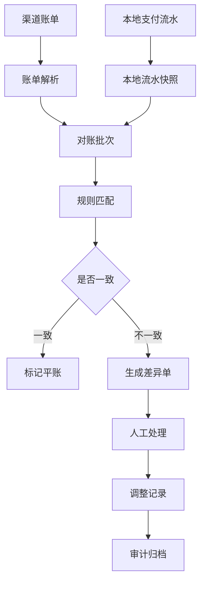
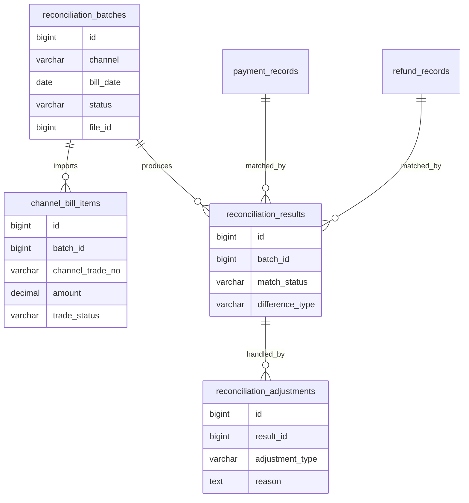
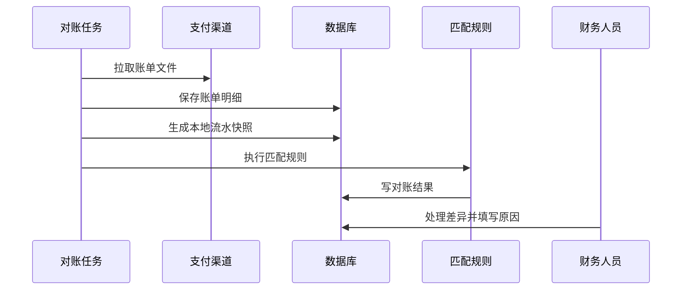

# 复杂财务对账项目案例

## 适合谁看

适合需要做支付对账、退款对账、渠道账单、收入确认、差异处理、财务导出和资金审计的开发者。

对账不是“把支付渠道账单和本地订单比一下”。真实项目里，对账要处理时间差、手续费、退款、部分退款、重复回调、跨日到账、渠道状态修正、人工调整和财务审计。对账模块的目标不是自动把所有差异改掉，而是发现差异、解释差异、处理差异并留下证据。

## 业务目标

第一版财务对账模块支持：

- 导入或拉取渠道账单。
- 匹配本地支付流水。
- 匹配退款流水。
- 识别金额差异、状态差异和缺失记录。
- 支持差异处理。
- 支持对账批次。
- 支持对账报表导出。
- 支持人工调整和审计。

## 先看差异处理台

对账结果需要固定渠道账单和本地流水快照，再把金额、缺失、跨日退款和状态差异拆开解释。

<DocFigure
  src="/images/projects/finance-reconciliation-exception.webp"
  alt="财务对账中心展示账单批次、平账比例、差异金额以及金额差异、本地缺失、跨日退款和状态差异记录"
  caption="差异单用于发现、解释和处理问题；人工调整不能覆盖原始流水，必须保留完整证据。"
  :width="1440"
  :height="900"
/>

图中每类差异都有不同下一步。跨日退款可能只需等待下一账期，金额差异则要核对手续费；把它们都做成“手动设为已平账”会破坏财务可追溯性。

## 对账链路图

对账要按批次执行。每个批次固定账期、渠道、文件和本地数据快照，避免后续数据变化导致结果无法复现。

## 数据模型

## 推荐表结构

| 表 | 作用 | 关键字段 |
| --- | --- | --- |
| `reconciliation_batches` | 对账批次 | `channel`、`bill_date`、`status`、`file_id` |
| `channel_bill_items` | 渠道账单明细 | `channel_trade_no`、`amount`、`fee_amount`、`trade_status` |
| `local_trade_snapshots` | 本地流水快照 | `payment_no`、`order_no`、`amount`、`status` |
| `reconciliation_results` | 对账结果 | `match_status`、`difference_type`、`difference_amount` |
| `reconciliation_adjustments` | 差异处理记录 | `adjustment_type`、`reason`、`handled_by` |
| `finance_exports` | 财务导出任务 | `batch_id`、`file_id`、`exported_by` |

不要直接用实时订单表反复对账。建议为批次保存本地流水快照，保证结果可追溯。

## 对账流程

对账任务可以由定时任务触发，也可以由财务人员手动上传渠道账单。

## 差异类型

| 差异类型 | 说明 | 处理方式 |
| --- | --- | --- |
| 本地有，渠道无 | 本地记录支付成功，但渠道账单没有 | 查回调、查渠道订单 |
| 渠道有，本地无 | 渠道有交易，本地无流水 | 查是否漏单或渠道补单 |
| 金额不一致 | 本地金额和渠道金额不同 | 查优惠、手续费、部分退款 |
| 状态不一致 | 本地成功，渠道失败或反向 | 进入人工确认 |
| 手续费差异 | 渠道扣费和系统计算不同 | 按渠道费率核对 |
| 退款差异 | 本地退款和渠道退款不一致 | 查退款流水和回调 |

差异不要自动静默修正。高风险资金数据必须有处理人、处理原因和审计记录。

## 前端页面拆分

| 页面 | 作用 | 注意点 |
| --- | --- | --- |
| 对账批次列表 | 查看账期、渠道、状态 | 支持重新对账 |
| 账单明细页 | 查看渠道账单 | 金额、手续费、状态清晰 |
| 对账结果页 | 查看平账和差异 | 支持按差异类型筛选 |
| 差异处理页 | 人工处理差异 | 必填处理原因 |
| 财务导出页 | 导出对账结果 | 导出本身写审计 |
| 对账规则页 | 配置匹配规则 | 修改规则要留版本 |

## 常见问题

### 问题 1：今天对账不平，明天又平了

可能是渠道账单跨日、回调延迟或退款延迟。对账结果要保留批次和快照，不能只看实时状态。

### 问题 2：财务导出的金额和页面金额不一致

通常是导出接口使用了不同口径。页面、导出和统计报表必须共享同一套对账结果数据。

### 问题 3：对账差异被处理了但找不到原因

差异处理必须强制填写原因，并记录处理前后状态。资金相关调整不能无审计。

## 验收清单

- 对账按批次执行。
- 渠道账单原始文件可追溯。
- 本地流水有批次快照。
- 支持支付和退款对账。
- 差异类型明确。
- 差异处理有原因和审计。
- 对账结果可导出。
- 对账规则变更有版本记录。
- 页面、导出和报表使用同一口径。

## 下一步学习

继续学习 [支付订单项目案例](/projects/payment-order-case)、[数据导入导出项目案例](/projects/import-export-case) 和 [审计中心项目案例](/projects/audit-center-case)。
