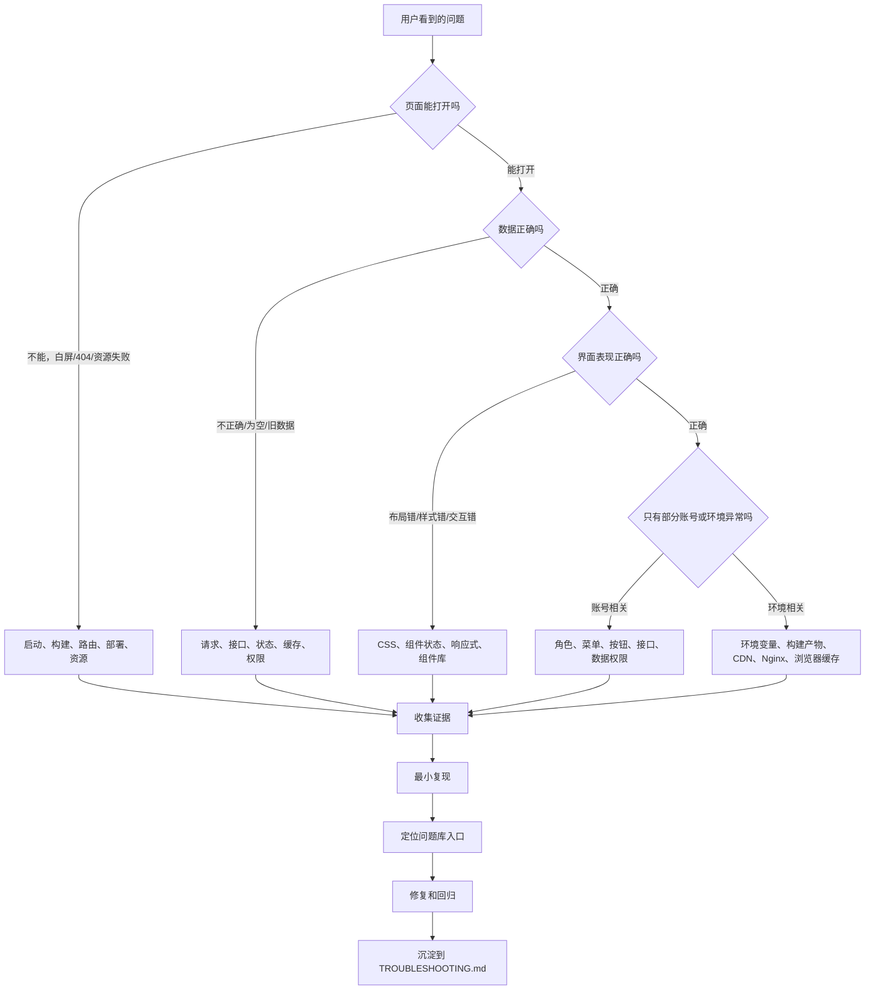
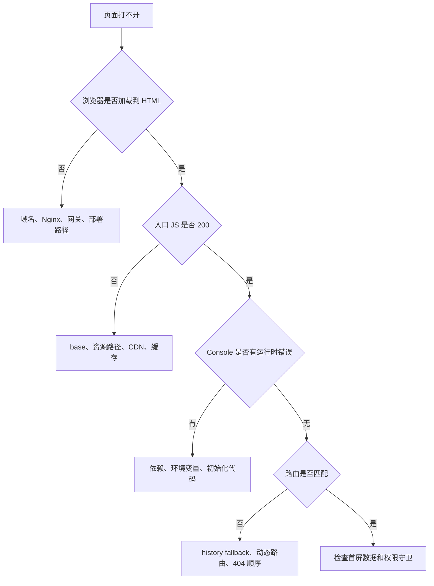
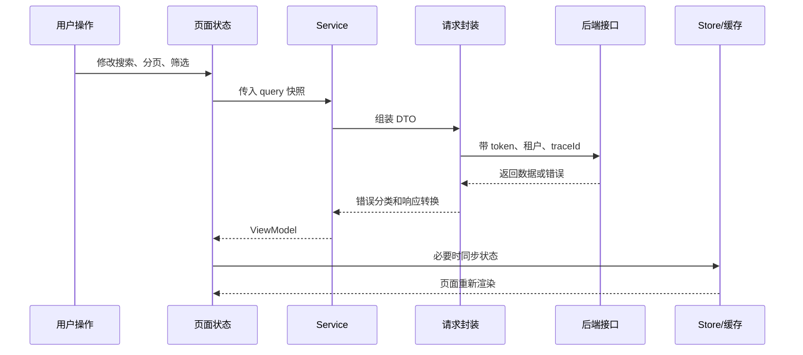
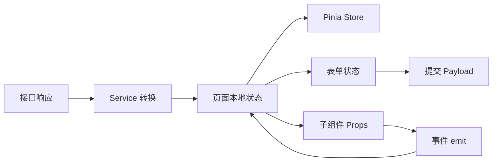
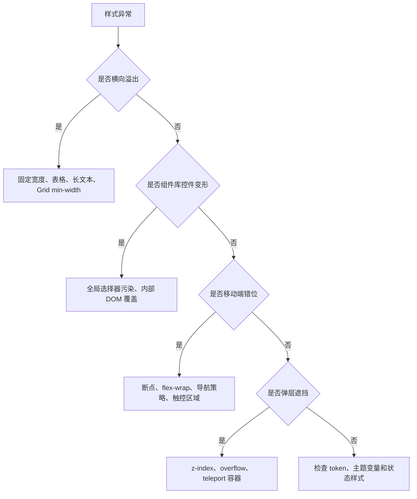
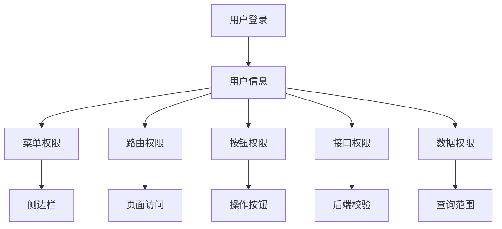

# 前端项目排障图谱

## 这个页面解决什么

真实前端项目的问题很少只属于一个知识点。一个“列表数据不对”的现象，可能来自请求参数、接口权限、Pinia 状态、旧请求覆盖、后端数据范围、浏览器缓存，也可能只是页面把字段映射错了。

这篇文档把前端项目常见问题按“现象 -> 证据 -> 排查路径 -> 对应问题库”串起来。它适合放在 [项目排障方法论](/projects/debugging-playbook) 和各类专题问题库之间使用：

- 先用本页判断问题属于哪条链路。
- 再进入 Vue、JavaScript、CSS、TypeScript、浏览器、工程化或请求权限专题。
- 最后把修复过程写回自己的 `TROUBLESHOOTING.md`。

如果你正在做 [前端综合实战练习](/roadmap/frontend-capstone-lab)，建议把本页作为每次卡住时的第一入口。

## 适合谁看

- 做 Vue Admin、React 管理台、H5 页面、组件库或前端工程化项目的人。
- 遇到问题时不知道该先查 Console、Network、状态、路由、样式还是构建的人。
- 想把项目排障过程做成学习笔记、交付证据和团队问题库的人。
- 已经读过很多单点文档，但实际项目排错时容易来回跳的人。

## 总体图谱

先不要急着改代码。前端排障最重要的是先把现象放到正确链路上。



这张图要训练一种习惯：先把问题归类，再进入细节。归类错了，后面每一步都可能是在浪费时间。

## 排障入口速查

| 现象 | 第一怀疑链路 | 必看证据 | 进入专题 |
| --- | --- | --- | --- |
| 页面白屏 | 运行时错误、资源、路由、构建产物 | Console、Network、入口 JS、资源状态码 | [前端页面与状态](/projects/issues-frontend)、[前端工程化专项](/projects/issues-engineering) |
| 页面 404 | 路由模式、部署 base、Nginx、动态路由 | URL、路由表、部署路径、Nginx 配置 | [部署、缓存与 DevOps](/projects/issues-deployment)、[Vue 项目专项](/projects/issues-vue) |
| 数据为空 | 请求参数、权限、后端返回、缓存 | Network payload、response、用户角色 | [Vue Admin 请求权限排障](/projects/issues-vue-admin-request)、[前后端联调排查](/projects/integration-debugging) |
| 数据闪回 | 并发请求、旧请求覆盖、新旧 query 混用 | 请求时间线、AbortController、query 快照 | [JavaScript 专项](/projects/issues-javascript)、[前端页面与状态](/projects/issues-frontend) |
| 页面不更新 | 响应式丢失、组件缓存、状态引用错误 | Vue DevTools、Pinia、组件 props | [Vue 项目专项](/projects/issues-vue) |
| 弹窗影响列表 | 对象引用污染、表单初始值复用 | 编辑前后对象引用、表单 reset 逻辑 | [Vue 项目专项](/projects/issues-vue)、[前端页面与状态](/projects/issues-frontend) |
| 按钮显示错 | 权限码、角色、菜单、按钮权限混用 | 用户权限列表、按钮权限判断、接口返回 | [Vue Admin 请求权限排障](/projects/issues-vue-admin-request) |
| 样式错乱 | CSS 污染、组件库覆盖、响应式边界 | Elements、Computed、布局宽度、CSS 来源 | [CSS 专项](/projects/issues-css) |
| 打包后异常 | 环境变量、base、依赖版本、构建缓存 | build log、产物路径、env、lockfile | [前端工程化专项](/projects/issues-engineering) |
| 线上才异常 | CDN、Nginx、缓存、灰度、环境差异 | 响应头、资源 hash、部署版本、账号环境 | [部署、缓存与 DevOps](/projects/issues-deployment) |

## 第一层：页面是否能打开

页面打不开时，不要先查业务代码。先确认应用是否被正确加载。



### 证据清单

| 证据 | 怎么看 | 用来判断 |
| --- | --- | --- |
| HTML 状态码 | Network 选中 document | 是否服务端或网关没返回页面 |
| 入口 JS 状态码 | Network 按 JS 过滤 | 是否资源路径、base、CDN 有问题 |
| Console 第一条错误 | Console 保留堆栈 | 是否初始化阶段崩溃 |
| 当前 URL | 地址栏完整复制 | 是否部署路径、query、hash 不一致 |
| 路由模式 | 项目配置和部署配置 | history 模式是否需要 fallback |
| 构建版本 | 页面版本号、资源 hash | 是否用户访问了旧包或混合包 |

### 常见修复方向

| 根因 | 修复 |
| --- | --- |
| history 模式刷新 404 | Nginx 增加 fallback 到 `index.html` |
| `base` 配错 | Vite `base` 和部署子路径保持一致 |
| 入口资源 404 | 检查资源发布目录、CDN 同步和缓存刷新 |
| 环境变量缺失 | 明确 `.env.*`，不要在运行时读取不存在的变量 |
| 动态路由未注册 | 等用户信息和菜单加载后再进入受保护页面 |

## 第二层：数据是否正确

页面能打开但数据不对时，要先证明“错在请求前、请求中、响应后还是渲染时”。



### 判断步骤

1. 先看 Network 是否发出请求。
2. 再看请求参数是不是当前页面状态。
3. 再看响应体是不是后端真实返回。
4. 再看 service 有没有把 DTO 转错。
5. 再看页面有没有用旧状态覆盖新结果。
6. 最后才看表格、列表或组件渲染。

### 典型场景

| 场景 | 高概率根因 | 处理方式 |
| --- | --- | --- |
| 搜索后仍显示旧结果 | 新请求比旧请求先返回，被旧请求覆盖 | 使用请求序号、AbortController 或 query 快照 |
| 切换分页后数据错 | `page`、`pageNo`、`current` 字段混用 | 建立统一分页参数转换 |
| 接口返回有数据，表格为空 | DTO 字段和表格列字段不一致 | 在 service 层做 mapper，不在模板里猜字段 |
| 某角色看不到数据 | 数据权限、租户、组织范围不同 | 对比用户权限、请求头和后端日志 |
| 刷新后数据丢失 | 页面依赖未恢复的 store | 先恢复登录态和基础字典，再发业务请求 |

## 第三层：状态和组件是否正确

状态问题通常表现为“数据有，但页面就是不对”。这类问题不要只看接口。



### 状态边界

| 状态类型 | 应该放哪里 | 不应该做什么 |
| --- | --- | --- |
| 页面搜索条件 | 页面本地 state 或 URL query | 不要长期塞进全局 store |
| 登录用户信息 | Pinia auth store | 不要散落在多个组件副本里 |
| 表单草稿 | 弹窗或页面本地 state | 不要直接引用列表行对象 |
| 字典数据 | 专门 store 或缓存 composable | 不要每个组件重复请求 |
| 权限码 | 权限 store 或用户上下文 | 不要和菜单 label 混用 |

### 必查问题

| 现象 | 检查点 |
| --- | --- |
| Pinia 更新但页面不变 | 是否直接解构 store，是否缺少 `storeToRefs` |
| 弹窗关闭后再次打开保留旧值 | 是否在打开前初始化，关闭后 reset |
| 编辑未保存但列表已变化 | 是否直接绑定行对象，应该拷贝成表单草稿 |
| 子组件修改父组件数据 | 是否直接改 props，应该 emit 事件 |
| KeepAlive 页面数据不刷新 | 是否区分 `onMounted` 和 `onActivated` |

## 第四层：样式和布局是否正确

样式问题最容易被“加一个更高优先级选择器”掩盖。先定位来源，再修。



### 浏览器检查方式

| 检查 | 操作 | 看什么 |
| --- | --- | --- |
| 横向溢出 | DevTools 切到 390px，执行 `document.documentElement.scrollWidth` | 是否大于 `clientWidth` |
| 样式来源 | Elements -> Computed | 哪个选择器覆盖了目标样式 |
| 组件库污染 | 搜索宽泛选择器 | 是否存在 `.page button`、`.content *` |
| 固定元素变形 | 选中头像、状态点、图标按钮 | 是否有稳定宽高和 `flex-shrink: 0` |
| 弹层层级 | 检查父级 `overflow` 和 `z-index` | 是否被父容器裁剪 |

### 修复原则

- 业务样式命中明确业务 class。
- 不依赖组件库内部 DOM 层级写样式。
- 表格多列时让表格容器滚动，不让整个页面横向滚动。
- 图标按钮、头像、状态点设置稳定宽高和不可压缩。
- 移动端导航使用抽屉、顶部紧凑菜单或底部导航，不把整块桌面侧边栏堆到首屏。

## 第五层：权限是否正确

权限问题不要只看按钮显示。一个后台系统至少有五层权限。



| 问题 | 先查 | 再查 |
| --- | --- | --- |
| 菜单不显示 | 菜单接口、角色菜单绑定 | 前端菜单过滤逻辑 |
| 页面能进但按钮没有 | 按钮权限码是否返回 | 页面权限判断是否用错 code |
| 按钮有但接口 403 | 前端按钮权限和后端接口权限不一致 | 后端角色接口权限绑定 |
| 只能看到部分数据 | 数据范围、组织、租户 | 查询参数和后端 SQL 条件 |
| 切换账号后权限残留 | 退出清理 store、路由、缓存 | 浏览器 storage 和动态路由重置 |

权限问题的结论必须包含账号、角色、权限码、接口、数据范围和证据截图。只说“前端判断错了”通常不够。

## 第六层：构建和发布是否正确

本地正常不代表线上正常。上线问题要把“源代码 -> 构建 -> 产物 -> 服务器 -> 浏览器缓存”串起来查。


### 发布问题速查

| 现象 | 高概率根因 | 证据 |
| --- | --- | --- |
| 线上接口地址还是测试环境 | 构建时环境变量错 | 构建日志、产物中接口地址 |
| 新页面上线后 404 | 路由 fallback 或 base 错 | Nginx 配置、访问路径 |
| 用户看到旧页面 | CDN 或浏览器缓存 | 资源 hash、响应头、强制刷新对比 |
| 某个 chunk 加载失败 | 旧 HTML 引用新旧混合资源 | HTML 和 JS hash 是否同一版本 |
| CI 通过但线上失败 | 构建环境和本地不一致 | Node 版本、lockfile、CI 日志 |

## 最小证据包模板

每个排障记录都应该能让另一个人复现、确认和回归。

```md
# 问题标题

## 现象

## 影响范围

- 环境：
- 账号/角色：
- 页面地址：
- 版本/commit：

## 复现步骤

## 证据

- Console：
- Network：
- 状态截图：
- 后端 traceId：
- 相关配置：

## 已排除

## 根因

## 修复方案

## 回归验证

## 预防措施

## 应补充到哪里
```

## 和现有问题库怎么配合

| 你现在的任务 | 先看本页哪个部分 | 下一篇 |
| --- | --- | --- |
| 不知道问题在哪一层 | 总体图谱、排障入口速查 | [项目排障方法论](/projects/debugging-playbook) |
| 做 Vue Admin 综合练习 | 数据、状态、权限、构建四层 | [前端综合实战练习](/roadmap/frontend-capstone-lab) |
| 查 Vue 响应式和路由 | 状态和组件是否正确 | [Vue 真实项目问题](/projects/issues-vue) |
| 查请求、401、403、旧请求 | 数据是否正确、权限是否正确 | [Vue Admin 请求权限排障](/projects/issues-vue-admin-request) |
| 查样式和移动端 | 样式和布局是否正确 | [CSS 真实项目问题库](/projects/issues-css) |
| 查类型边界 | 数据、状态、提交 Payload | [TypeScript 类型边界问题](/projects/issues-typescript) |
| 查构建发布 | 构建和发布是否正确 | [前端工程化真实项目问题库](/projects/issues-engineering) |

## 练习建议

排障能力不能只靠阅读。建议在自己的练习项目里刻意注入下面问题，再按本页流程修复。

| 练习 | 注入方式 | 目标 |
| --- | --- | --- |
| 旧请求覆盖 | 快速切换搜索条件，并让旧请求延迟返回 | 学会用请求序号或 AbortController |
| 表单污染列表 | 编辑弹窗直接绑定列表行对象 | 学会区分列表数据和表单草稿 |
| 动态路由刷新 404 | 刷新一个需要权限的深层页面 | 学会恢复用户信息和重新注册路由 |
| 组件库样式污染 | 写一个宽泛的 `.toolbar button` 选择器 | 学会定位 CSS 来源并收敛业务 class |
| 线上资源 404 | 模拟错误 `base` 或子路径部署 | 学会检查构建产物和部署路径 |
| 权限残留 | 切换两个角色差异很大的账号 | 学会清理 store、路由和缓存 |

完成每个练习后，把证据和修复过程写进 `TROUBLESHOOTING.md`，再回到 [项目交付检查清单](/projects/delivery-checklist) 确认是否需要补发布前检查项。
