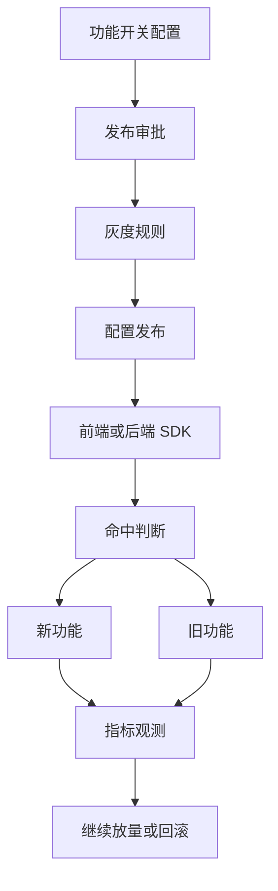
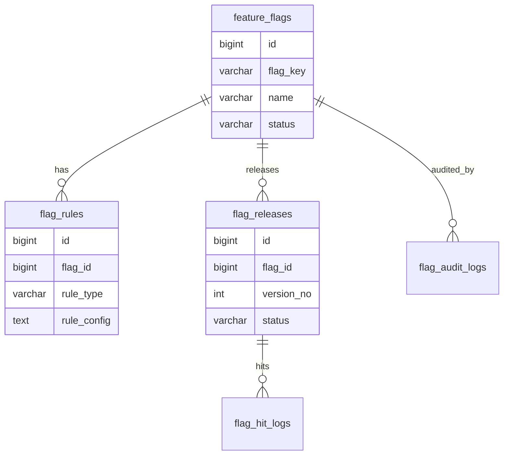
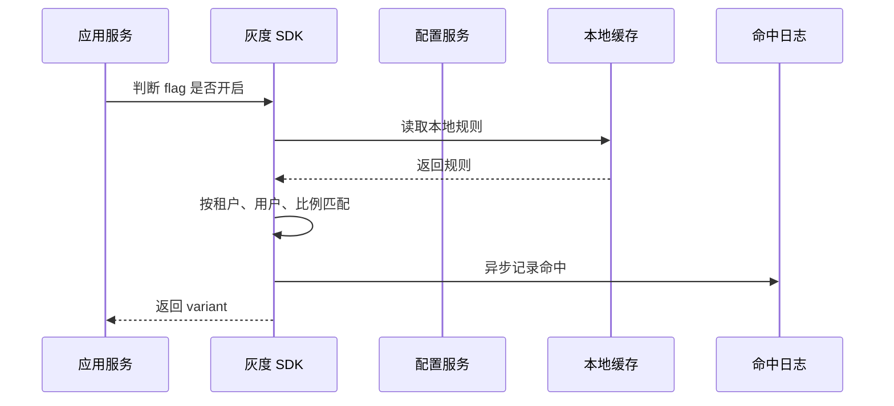

# 灰度发布后台项目案例

## 适合谁看

适合需要做功能开关、灰度发布、A/B 实验、按租户放量、按用户分流、回滚控制和发布观测的开发者。

灰度发布后台不是“加一个开关表”。真实项目里，灰度会影响前端页面、后端接口、缓存、权限、数据兼容、指标监控和事故回滚。一个开关如果没有范围、审批、观测和回滚，很容易变成线上风险源。

## 业务目标

第一版灰度发布后台支持：

- 创建功能开关。
- 配置灰度范围。
- 支持按租户、用户、角色、百分比分流。
- 支持开关审批。
- 支持发布观测指标。
- 支持快速回滚。
- 支持命中日志。
- 支持配置变更审计。

## 灰度链路图

灰度后台要服务“安全发布”，不是只服务“动态配置”。

## 数据模型

## 推荐表结构

| 表 | 作用 | 关键字段 |
| --- | --- | --- |
| `feature_flags` | 功能开关 | `flag_key`、`name`、`status`、`owner` |
| `flag_rules` | 灰度规则 | `rule_type`、`rule_config`、`priority` |
| `flag_releases` | 发布版本 | `flag_id`、`version_no`、`status`、`published_at` |
| `flag_hit_logs` | 命中日志 | `flag_key`、`target_id`、`matched_rule`、`variant` |
| `flag_audit_logs` | 审计日志 | `flag_id`、`action`、`before_data`、`after_data` |
| `flag_metrics` | 观测指标 | `flag_id`、`metric_code`、`metric_value` |

开关 key 一旦发布不要随意修改。代码里依赖的就是稳定 key。

## 判断流程

灰度判断不能每次都远程请求配置服务。SDK 要有本地缓存和降级默认值。

## 灰度规则

| 规则 | 示例 | 注意点 |
| --- | --- | --- |
| 租户名单 | 只给 A、B 租户开启 | 适合 B 端客户试点 |
| 用户名单 | 只给内部员工开启 | 适合预发布验证 |
| 百分比 | 5% 用户开启 | 要使用稳定哈希 |
| 角色 | 管理员可见 | 和权限系统边界要清楚 |
| 地区 | 只给某地区开启 | 依赖地区数据准确 |

百分比分流必须稳定。不能用户刷新一次就变一次分组。

## 前端页面拆分

| 页面 | 作用 | 注意点 |
| --- | --- | --- |
| 开关列表 | 查看所有功能开关 | 显示负责人和状态 |
| 开关详情 | 配置规则和默认值 | 展示代码接入 key |
| 发布审批 | 审核灰度配置 | 高风险开关必审 |
| 命中日志 | 查看谁命中了新功能 | 注意脱敏 |
| 指标观测 | 查看错误率和转化 | 支持回滚判断 |
| 回滚记录 | 查看历史回滚 | 记录原因 |

## 常见问题

### 问题 1：开关关闭后用户还能看到新功能

可能是前端缓存、后端本地缓存或 CDN 缓存没有更新。开关发布要有版本号和缓存失效机制。

### 问题 2：百分比灰度用户不稳定

分流不能使用随机数。应使用 `flag_key + target_id` 做稳定哈希。

### 问题 3：新功能导致错误率升高但没人发现

灰度发布必须绑定观测指标，例如接口错误率、前端异常、转化率和投诉量。

## 验收清单

- 功能开关有稳定 key。
- 灰度规则支持租户、用户、角色、百分比。
- 百分比分流稳定。
- SDK 有本地缓存和默认值。
- 开关发布有版本和审计。
- 高风险开关有审批。
- 命中日志可查询。
- 指标异常能触发回滚。
- 回滚操作有原因和记录。

## 下一步学习

继续学习 [DevOps 发布、回滚与环境治理](/devops/deployment-strategy)、[前端工程化构建与部署](/engineering/build-deploy) 和 [真实项目问题库](/projects/real-world-issues)。
