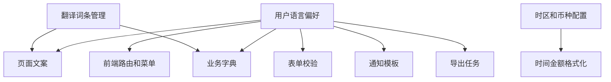
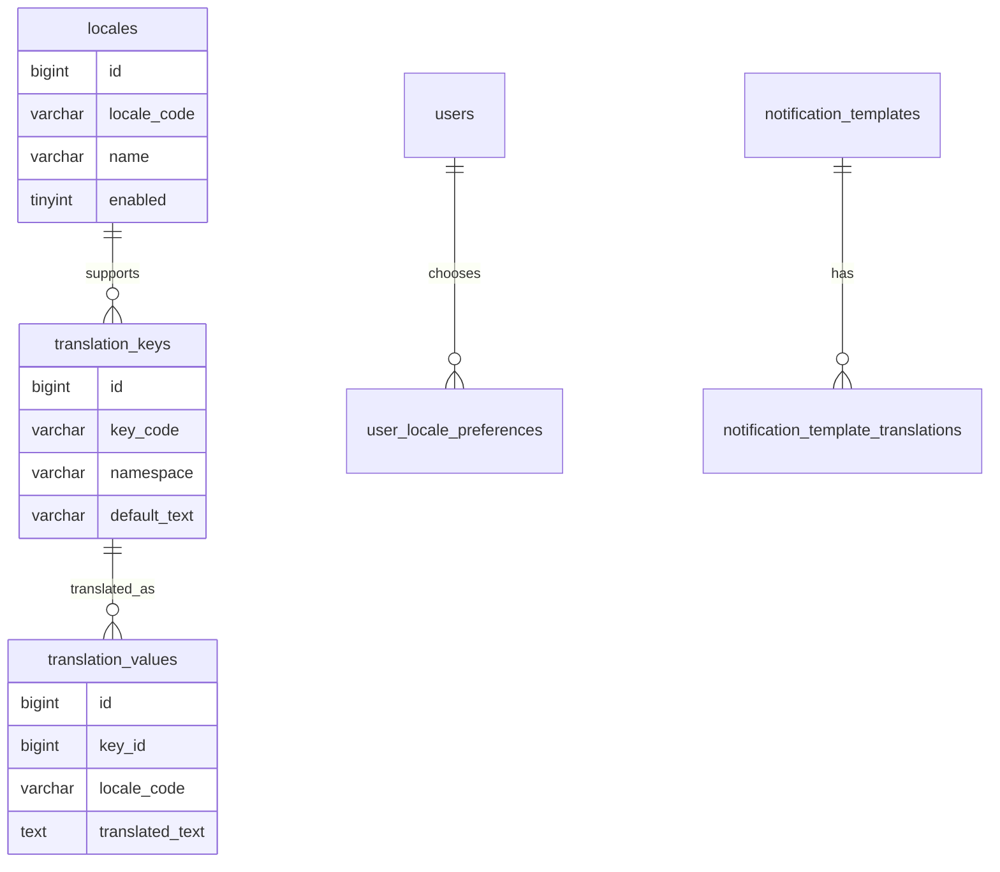
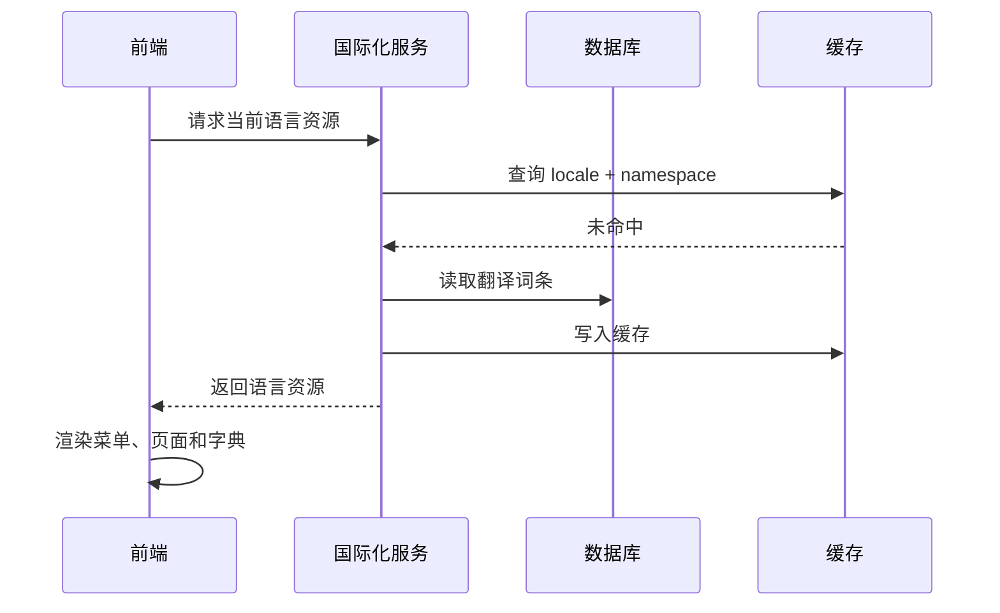

# 国际化后台项目案例

## 适合谁看

适合需要做多语言后台、多地区运营、多时区、多币种、翻译管理和国际化配置的开发者。

国际化后台不是“把文案放进语言包”。真实项目里，它会影响路由、菜单、表单校验、枚举、时间、金额、搜索、导出、权限、通知模板和运营配置。只处理页面显示文案，后续一定会在导出、消息、报表和第三方集成里反复踩坑。

## 业务目标

第一版国际化后台支持：

- 多语言菜单和页面文案。
- 多语言业务字典和枚举。
- 翻译词条管理。
- 用户语言偏好。
- 多时区时间展示。
- 多币种金额展示。
- 通知模板多语言。
- 导出文件多语言表头。
- 缺失翻译检测。

## 国际化链路图

国际化要覆盖“用户看到的所有业务信息”，而不只是 Vue 组件里的静态文案。

## 数据模型

## 推荐表结构

| 表 | 作用 | 关键字段 |
| --- | --- | --- |
| `locales` | 语言配置 | `locale_code`、`name`、`enabled`、`fallback_locale` |
| `translation_keys` | 翻译 key | `namespace`、`key_code`、`default_text` |
| `translation_values` | 翻译值 | `key_id`、`locale_code`、`translated_text` |
| `user_locale_preferences` | 用户偏好 | `user_id`、`locale_code`、`timezone`、`currency` |
| `notification_template_translations` | 通知模板翻译 | `template_id`、`locale_code`、`title`、`content` |
| `i18n_missing_logs` | 缺失翻译日志 | `key_code`、`locale_code`、`page_path` |

翻译 key 要稳定，不要直接拿中文文案当 key。文案会变，key 应该表达语义位置。

## 加载流程

语言资源可以按 namespace 拆分，例如 `common`、`menu`、`form`、`notification`，避免一次加载过大。

## 常见国际化对象

| 对象 | 示例 | 注意点 |
| --- | --- | --- |
| 菜单 | 用户管理、角色权限 | 动态菜单也要翻译 |
| 枚举 | 启用、禁用、待审核 | 后端返回 code，前端翻译 |
| 校验提示 | 手机号格式错误 | 前后端提示要一致 |
| 通知模板 | 审批提醒、支付成功 | 根据接收人语言生成 |
| 导出表头 | 订单号、支付金额 | 导出任务要保存语言快照 |
| 时间金额 | 2026-07-02、¥100 | 按时区和币种格式化 |

## 前端页面拆分

| 页面 | 作用 | 注意点 |
| --- | --- | --- |
| 语言配置 | 管理启用语言 | 支持默认语言和回退语言 |
| 翻译词条 | 管理 key 和翻译值 | 支持按 namespace 筛选 |
| 缺失翻译 | 查看运行时缺失 key | 支持补录和重新发布 |
| 用户偏好 | 用户选择语言和时区 | 登录后立即生效 |
| 模板翻译 | 维护通知和邮件模板 | 支持变量预览 |
| 国际化检查 | 扫描未翻译菜单和枚举 | 发布前检查 |

## 常见问题

### 问题 1：页面是英文，但导出文件还是中文

导出任务没有传语言上下文。导出要保存 `locale`、`timezone` 和 `currency` 快照，异步生成时不能丢。

### 问题 2：后端错误提示无法翻译

后端不要只返回中文错误文案。更好的方式是返回稳定错误码和参数，由前端或国际化服务映射文案。

### 问题 3：切换语言后菜单没变

动态菜单缓存没有按语言区分。菜单缓存 key 要包含用户、租户、语言和权限版本。

## 验收清单

- 静态文案、菜单、字典、校验提示都有翻译策略。
- 翻译 key 稳定，不使用中文文案当 key。
- 缺失翻译有日志。
- 支持默认语言和回退语言。
- 导出、通知、异步任务携带语言上下文。
- 时间和金额按用户偏好格式化。
- 动态菜单和权限缓存包含语言维度。
- 翻译变更有发布和回滚方式。
- 翻译管理操作写审计日志。

## 下一步学习

继续学习 [多租户权限项目案例](/projects/multi-tenant-permission-case)、[消息通知项目案例](/projects/notification-center-case) 和 [数据导入导出项目案例](/projects/import-export-case)。
