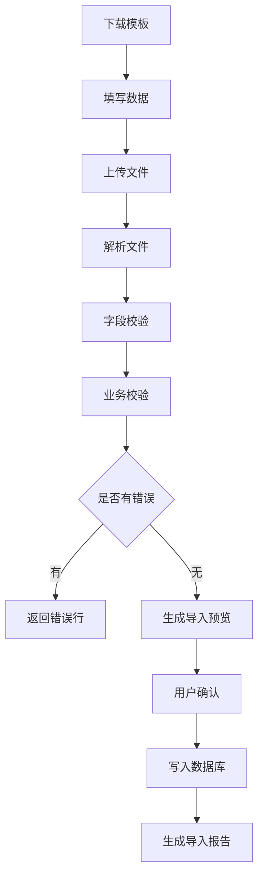
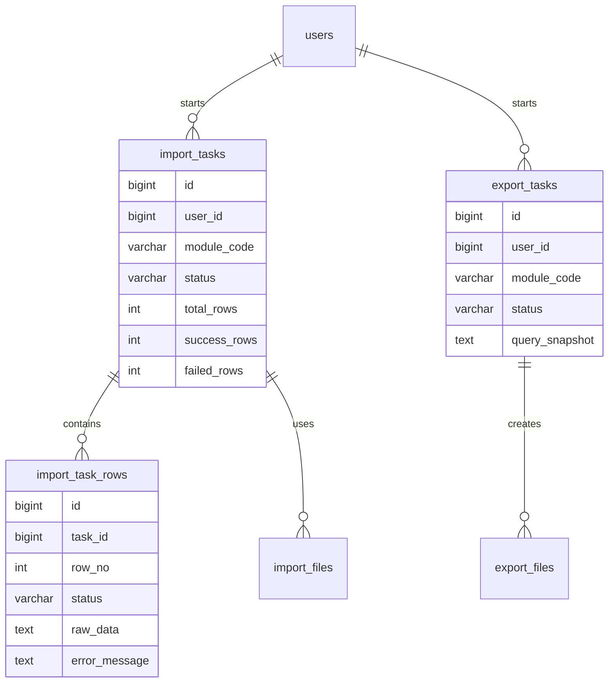
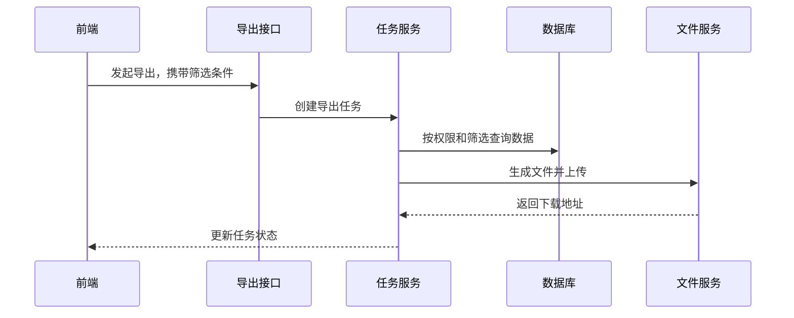

# 数据导入导出项目案例

## 适合谁看

适合需要做 Excel 导入、批量创建、数据迁移、报表导出、模板下载、错误行回传和异步任务处理的开发者。

导入导出不是“前端上传一个文件，后端循环插入数据库”。真实项目里，最容易出问题的是字段映射、数据校验、重复数据、事务边界、大文件超时、权限过滤和错误提示。

## 业务目标

第一版导入导出模块支持：

- 下载导入模板。
- 上传 Excel 或 CSV。
- 校验字段、格式和业务规则。
- 返回错误行和错误原因。
- 支持预览后确认导入。
- 大文件走异步任务。
- 导出时遵守当前筛选条件和权限范围。
- 导入导出任务可追踪、可下载结果。

## 导入流程图

导入要分成“解析校验”和“确认写入”两个阶段。这样用户可以先看到影响范围，避免一上传就污染正式数据。

## 数据模型

## 推荐表结构

| 表 | 作用 | 关键字段 |
| --- | --- | --- |
| `import_tasks` | 导入任务 | `module_code`、`status`、`total_rows`、`failed_rows` |
| `import_task_rows` | 导入行明细 | `row_no`、`raw_data`、`parsed_data`、`error_message` |
| `import_files` | 原始文件记录 | `file_id`、`task_id`、`checksum` |
| `export_tasks` | 导出任务 | `query_snapshot`、`status`、`file_id` |
| `export_files` | 导出文件记录 | `file_id`、`expired_at` |

导入任务一定要保存原始文件或原始行数据，方便复盘“用户当时到底传了什么”。

## 字段映射设计

| Excel 列名 | 系统字段 | 校验规则 | 错误提示示例 |
| --- | --- | --- | --- |
| 员工姓名 | `name` | 必填，长度 2 到 30 | 第 3 行：员工姓名不能为空 |
| 手机号 | `mobile` | 手机号格式，租户内唯一 | 第 5 行：手机号已存在 |
| 部门编码 | `department_code` | 必须存在且启用 | 第 8 行：部门编码不存在 |
| 入职日期 | `joined_at` | 日期格式 | 第 9 行：入职日期格式错误 |

错误提示要面向业务用户，不要直接返回 `invalid mobile` 或数据库唯一约束错误。

## 导出流程图

导出必须保存 `query_snapshot`。用户后续下载时，看到的应该是发起导出时的条件，而不是当前页面最新条件。

## 前端页面拆分

| 页面或组件 | 作用 | 注意点 |
| --- | --- | --- |
| 模板下载按钮 | 下载标准模板 | 模板版本要和后端字段同步 |
| 导入弹窗 | 上传文件、展示说明 | 告知最大行数和字段规则 |
| 校验结果页 | 展示成功、失败、错误行 | 支持下载错误文件 |
| 导入确认页 | 用户确认写入 | 明确新增、更新、跳过数量 |
| 导出任务列表 | 查看导出进度 | 生成完成后提供下载 |
| 历史任务页 | 追踪历史操作 | 支持按模块、状态、发起人筛选 |

## 事务边界

导入写入时有两种策略：

| 策略 | 行为 | 适合场景 |
| --- | --- | --- |
| 全部成功才提交 | 有一行失败就全部回滚 | 财务、订单、强一致数据 |
| 部分成功 | 成功行提交，失败行记录错误 | 员工、商品、客户等批量维护 |

第一版要在页面上明确告诉用户采用哪种策略。否则用户会误以为“导入成功”代表所有行都成功。

## 常见问题

### 问题 1：导入接口本地正常，线上经常超时

线上文件更大、数据库更慢、网关有超时限制。超过几千行的导入建议走异步任务，接口只返回任务 ID。

### 问题 2：导出结果包含用户看不到的数据

导出接口不能绕过列表查询权限。它必须复用同一套权限过滤逻辑，并把筛选条件和权限上下文一起保存。

### 问题 3：用户修改了模板列名，系统解析失败

模板要有版本号，后端要校验必需列是否存在。错误提示要明确“缺少列：部门编码”，不要只说“解析失败”。

## 验收清单

- 模板可以下载，并说明字段规则。
- 导入前能校验字段、格式和业务规则。
- 错误行能定位到行号和字段。
- 大文件导入不会阻塞接口。
- 导入写入策略明确。
- 导出遵守筛选条件和权限范围。
- 导出任务有状态、文件过期时间和下载记录。
- 导入导出操作写入审计日志。

## 下一步学习

继续学习 [文件中心项目案例](/projects/file-center-case)、[数据库事务](/database/transactions) 和 [前后端联调排查](/projects/integration-debugging)。
