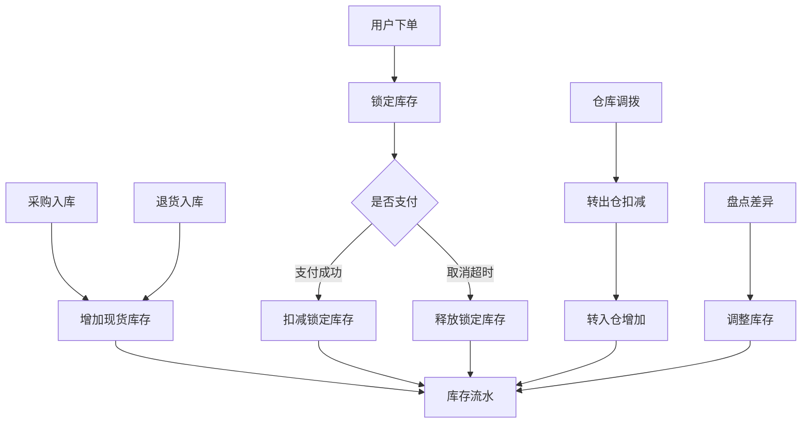
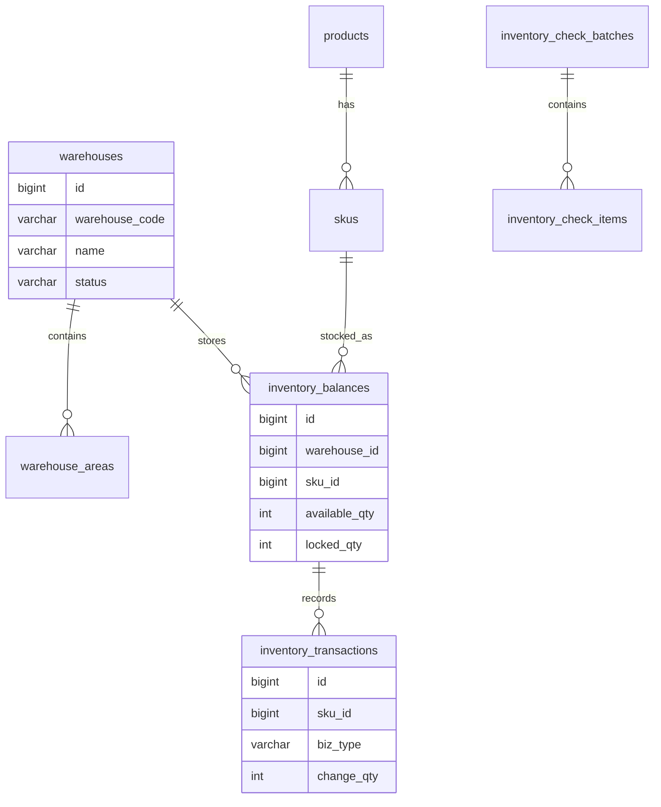
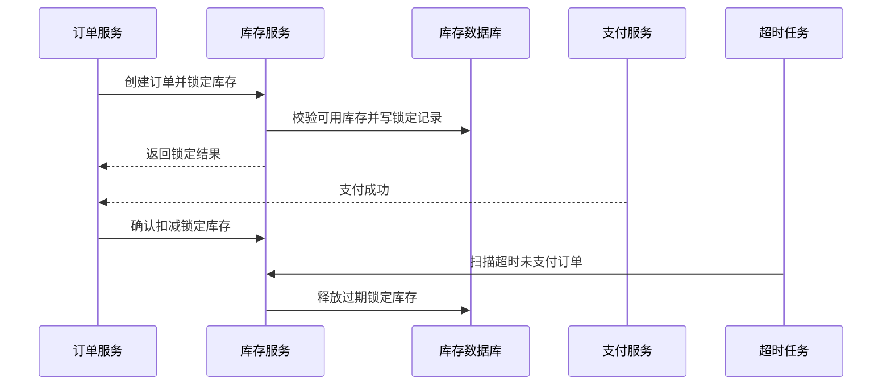

# 库存管理项目案例

## 适合谁看

适合需要做商品库存、可用库存、锁定库存、入库、出库、调拨、盘点、库存预警和库存流水的开发者。

库存管理不是“商品表里放一个数量字段”。真实项目里，库存会被采购、销售、退货、调拨、盘点、预占和取消等动作同时影响。库存系统最容易出问题的地方是超卖、重复扣减、库存流水缺失和账实不一致。

## 业务目标

第一版库存管理支持：

- 维护仓库和库区。
- 维护 SKU 库存。
- 支持入库和出库。
- 支持库存锁定和释放。
- 支持库存调拨。
- 支持库存盘点和差异处理。
- 支持库存预警。
- 支持库存流水追踪。

## 库存核心链路

库存要区分“现货库存、可用库存、锁定库存”。订单创建后通常先锁定库存，支付成功后再确认扣减。

## 数据模型

## 推荐表结构

| 表 | 作用 | 关键字段 |
| --- | --- | --- |
| `warehouses` | 仓库 | `warehouse_code`、`name`、`status`、`owner_id` |
| `warehouse_areas` | 库区库位 | `warehouse_id`、`area_code`、`location_code` |
| `inventory_balances` | 库存余额 | `warehouse_id`、`sku_id`、`available_qty`、`locked_qty` |
| `inventory_locks` | 库存锁定 | `sku_id`、`biz_no`、`locked_qty`、`expired_at` |
| `inventory_transactions` | 库存流水 | `sku_id`、`biz_type`、`biz_no`、`before_qty`、`after_qty` |
| `inventory_transfers` | 调拨单 | `from_warehouse_id`、`to_warehouse_id`、`status` |
| `inventory_check_batches` | 盘点批次 | `warehouse_id`、`status`、`started_at` |
| `inventory_check_items` | 盘点明细 | `batch_id`、`sku_id`、`system_qty`、`actual_qty` |

库存流水必须保存变更前后数量。只保存当前库存，后续无法解释库存为什么变少。

## 下单锁库存流程

锁库存和释放库存都必须幂等。支付回调、取消订单和超时任务可能重复触发。

## 库存动作设计

| 动作 | 库存变化 | 注意点 |
| --- | --- | --- |
| 采购入库 | 可用库存增加 | 关联采购单和验收记录 |
| 下单锁定 | 可用减少，锁定增加 | 防止超卖 |
| 支付确认 | 锁定减少 | 不再影响可用库存 |
| 订单取消 | 锁定减少，可用增加 | 必须幂等 |
| 退货入库 | 可用增加 | 需要质检结果 |
| 仓库调拨 | 转出减少，转入增加 | 支持在途状态 |
| 盘点调整 | 按差异调整 | 高差异要审批 |

## 前端页面拆分

| 页面 | 作用 | 注意点 |
| --- | --- | --- |
| 库存总览 | 查看 SKU 在各仓库存 | 区分可用、锁定、在途 |
| 入库管理 | 采购、退货和调整入库 | 入库来源必须明确 |
| 出库管理 | 销售、调拨和报损出库 | 出库前校验库存 |
| 库存锁定 | 查看订单锁定记录 | 支持超时释放 |
| 调拨管理 | 跨仓库转移库存 | 在途库存单独展示 |
| 盘点管理 | 创建盘点批次和差异 | 差异处理有审批 |
| 库存流水 | 查询每次库存变化 | 按 SKU、仓库、业务单号查询 |
| 预警规则 | 配置低库存提醒 | 按仓库和 SKU 设置阈值 |

## 实际项目常见问题

### 问题 1：高并发下超卖

库存扣减必须在数据库或缓存层做原子校验。不能先查库存再异步扣减，否则并发订单会同时认为库存足够。

### 问题 2：订单取消后库存没有回来

取消、支付失败和超时关闭都要触发库存释放。释放逻辑要按锁定记录执行，并保证重复调用不会多加库存。

### 问题 3：库存数量对不上

先查库存流水，再查是否有人工调整、盘点差异、重复回调或漏写流水。没有流水的库存系统很难排查。

## 验收清单

- 库存区分可用、锁定和在途。
- 入库、出库、锁定、释放、调拨、盘点都有流水。
- 锁库存和释放库存具备幂等性。
- 高并发扣减不会超卖。
- 盘点差异可审批和追踪。
- 调拨支持在途状态。
- 低库存可以预警。
- 库存流水能按业务单号追踪。
- 库存调整需要原因和审计。
- 库存余额和流水可以对账。

## 下一步学习

继续学习 [仓储物流项目案例](/projects/warehouse-logistics-case)、[采购管理项目案例](/projects/procurement-management-case) 和 [消息队列项目案例](/projects/message-queue-case)。
