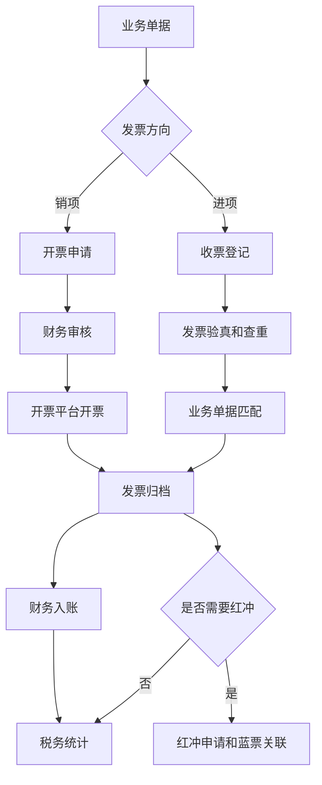
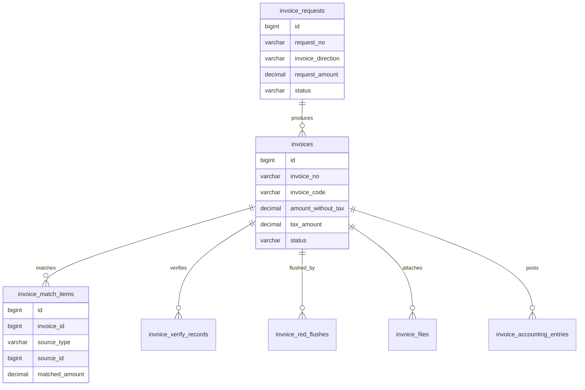
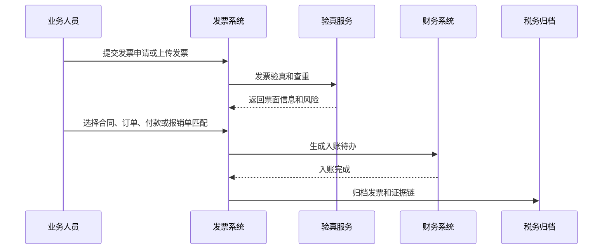

# 发票协同项目案例

## 适合谁看

适合需要做销项发票、进项发票、发票申请、发票验真、红冲、蓝票、发票匹配、税务归档和财务协同的开发者。

发票协同不是“上传一张发票图片”。真实企业项目里，发票会连接订单、合同、付款、报销、税务、客户、供应商和财务凭证。系统要解决的是：谁需要开票、按什么金额开、发票是否真实、是否已经匹配业务单据、是否发生红冲、是否已经入账和归档。

## 业务目标

第一版发票协同支持：

- 业务人员发起开票或收票登记。
- 财务人员审核发票抬头、税号、金额、税率和开票内容。
- 支持销项发票、进项发票和费用报销发票。
- 支持发票验真、查重和风险提示。
- 支持发票与合同、订单、付款、报销单匹配。
- 支持红冲、作废、重新开票和蓝票关联。
- 支持发票状态流转、附件归档和审计。
- 支持税务统计、财务入账和导出。

## 发票协同链路

发票协同的核心是“业务单据匹配”。如果发票只存在于附件中心，财务无法知道它对应哪笔合同、哪张订单、哪次付款或哪次报销。

## 核心概念

| 概念 | 说明 | 示例 |
| --- | --- | --- |
| 销项发票 | 企业向客户开出的发票 | 合同收款后开票 |
| 进项发票 | 供应商向企业开出的发票 | 采购付款收到发票 |
| 发票申请 | 业务发起的开票需求 | 申请开 10 万专票 |
| 发票验真 | 校验发票代码、号码、金额、税额 | 防止重复报销 |
| 发票匹配 | 发票关联业务单据 | 关联合同付款 |
| 红冲 | 对已开票据进行冲销 | 金额开错后红冲 |
| 蓝票 | 红冲后重新开具的正确发票 | 新蓝票关联红票 |
| 税务归档 | 发票和业务证据归档 | 发票、合同、付款记录 |

发票要区分“业务发票状态”和“税务票据状态”。业务上可能已经匹配完成，但税务上仍可能需要红冲或重开。

## 数据模型

## 推荐表结构

| 表 | 作用 | 关键字段 |
| --- | --- | --- |
| `invoice_requests` | 发票申请 | `request_no`、`invoice_direction`、`buyer_name`、`seller_name`、`request_amount`、`status` |
| `invoices` | 发票主表 | `invoice_no`、`invoice_code`、`invoice_type`、`tax_rate`、`tax_amount`、`status` |
| `invoice_match_items` | 发票匹配明细 | `invoice_id`、`source_type`、`source_id`、`matched_amount` |
| `invoice_verify_records` | 验真记录 | `invoice_id`、`verify_status`、`verified_at`、`risk_message` |
| `invoice_red_flushes` | 红冲记录 | `source_invoice_id`、`red_invoice_id`、`blue_invoice_id`、`reason` |
| `invoice_files` | 发票附件 | `invoice_id`、`file_id`、`file_type`、`ocr_status` |
| `invoice_accounting_entries` | 入账记录 | `invoice_id`、`subject_code`、`amount`、`posted_status` |
| `invoice_operation_logs` | 操作审计 | `invoice_id`、`action`、`operator_id`、`before_json`、`after_json` |

金额字段要拆成不含税金额、税额、价税合计。不要只保存一个总金额，否则后续税率调整、税务统计和财务入账都会困难。

## 发票匹配流程

发票匹配要支持部分匹配。一张发票可能对应多张订单，一张订单也可能分多次开票或收票。

## 发票状态设计

| 状态 | 含义 | 注意点 |
| --- | --- | --- |
| 草稿 | 业务正在填写 | 可编辑 |
| 待审核 | 已提交财务审核 | 冻结核心字段 |
| 待开票 | 销项发票审核通过 | 等待开票平台返回 |
| 待验真 | 进项发票已上传 | 需要校验票面 |
| 待匹配 | 发票真实但未关联业务 | 不能直接入账 |
| 已匹配 | 发票已关联业务单据 | 可进入入账 |
| 已入账 | 财务凭证已生成 | 变更需要红冲或调整 |
| 已红冲 | 原票据被冲销 | 需要关联红票和蓝票 |
| 已作废 | 发票不可继续使用 | 保留原因和证据 |

发票状态要允许风险标记。比如“已匹配”同时存在“金额差异风险”，不能因为主状态完成就忽略风险。

## 前端页面拆分

| 页面或组件 | 作用 | 注意点 |
| --- | --- | --- |
| 发票工作台 | 展示待审核、待验真、待匹配、待红冲 | 按角色展示待办 |
| 开票申请 | 填写客户抬头、金额、税率和开票内容 | 从合同或订单带出默认值 |
| 收票登记 | 上传进项票和票面信息 | 支持 OCR 和人工修正 |
| 发票验真 | 展示验真结果和风险 | 查重、金额、税号都要明确 |
| 发票匹配 | 关联合同、订单、付款、报销 | 支持多选和部分匹配 |
| 红冲重开 | 发起红冲和蓝票关联 | 展示原票、红票、蓝票关系 |
| 发票台账 | 财务查询和导出 | 支持方向、税率、状态、期间筛选 |
| 发票详情 | 查看票面、附件、匹配、入账和审计 | 证据链要集中展示 |

发票匹配页不要只做一个附件列表。它应该同时展示票面金额、可匹配业务单据、已匹配金额和差异金额。

## 接口拆分建议

| 接口 | 作用 | 注意点 |
| --- | --- | --- |
| `POST /invoice-requests` | 创建发票申请 | 校验抬头、税号、金额 |
| `POST /invoices/upload` | 上传发票 | 保存文件并触发 OCR |
| `POST /invoices/{id}/verify` | 发票验真 | 记录第三方返回和风险 |
| `POST /invoices/{id}/match` | 匹配业务单据 | 支持部分匹配和幂等 |
| `POST /invoices/{id}/unmatch` | 取消匹配 | 已入账后限制取消 |
| `POST /invoices/{id}/post` | 财务入账 | 入账前检查匹配完整性 |
| `POST /invoices/{id}/red-flush` | 发起红冲 | 关联原票和原因 |
| `GET /invoices/ledger` | 查询发票台账 | 支持税期、方向和状态筛选 |

## 实际项目常见问题

### 问题 1：同一张发票被重复报销

发票代码、号码、开票日期、金额和购买方税号要组合查重。只按附件文件名或图片哈希查重不可靠。

### 问题 2：发票金额和业务单据金额不一致

要允许合理差异，但必须记录差异原因。比如四舍五入、分期开票、部分收票、税率变化都可能造成金额不完全一致。

### 问题 3：红冲后原业务状态没有回退

红冲不是简单改发票状态。需要重新计算已开票金额、可开票金额、已入账金额和税务风险。

### 问题 4：OCR 识别错误导致入账错误

OCR 结果只能作为草稿。验真结果和人工确认结果要分开保存，入账应使用确认后的票面字段。

## 权限与审计

发票协同权限至少要区分：

- 创建开票申请。
- 上传进项发票。
- 审核发票申请。
- 发票验真。
- 发票匹配和取消匹配。
- 发票入账。
- 发起红冲和作废。
- 导出发票台账。
- 查看税务归档。

发票号码、金额、税率、红冲、入账、匹配关系和附件替换都要审计。发票是财税凭证，不能只记录最终状态。

## 验收清单

- 支持销项、进项和报销发票。
- 发票申请、票据、匹配和入账分离。
- 发票验真和查重有记录。
- 发票可匹配合同、订单、付款或报销单。
- 支持部分匹配和多单匹配。
- 红冲、作废、重开有完整链路。
- 发票附件、OCR、验真和人工确认可追溯。
- 入账前能校验匹配完整性。
- 税务期间和发票台账可查询导出。
- 关键操作有审计记录。

## 下一步学习

继续学习 [费用报销项目案例](/projects/expense-reimbursement-case)、[税务管理项目案例](/projects/tax-management-case)、[合同付款项目案例](/projects/contract-payment-case) 和 [复杂财务对账项目案例](/projects/finance-reconciliation-case)。
