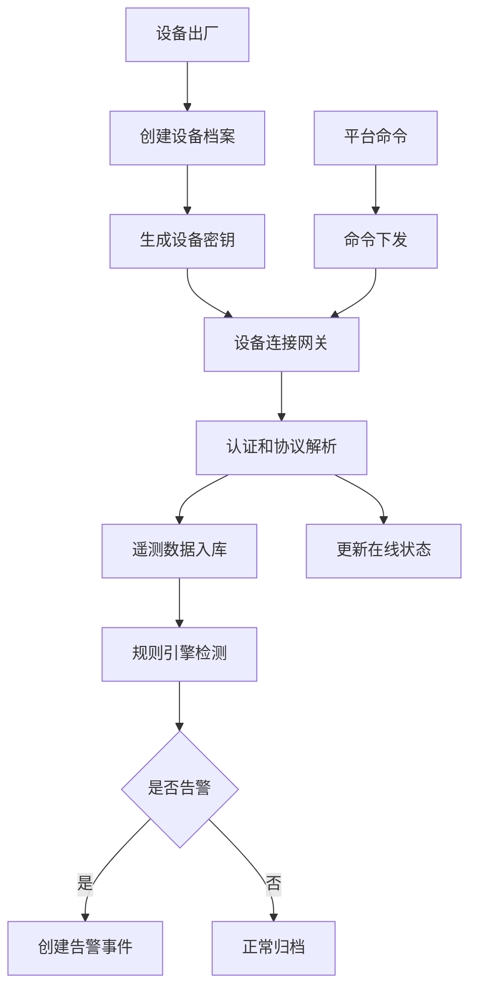
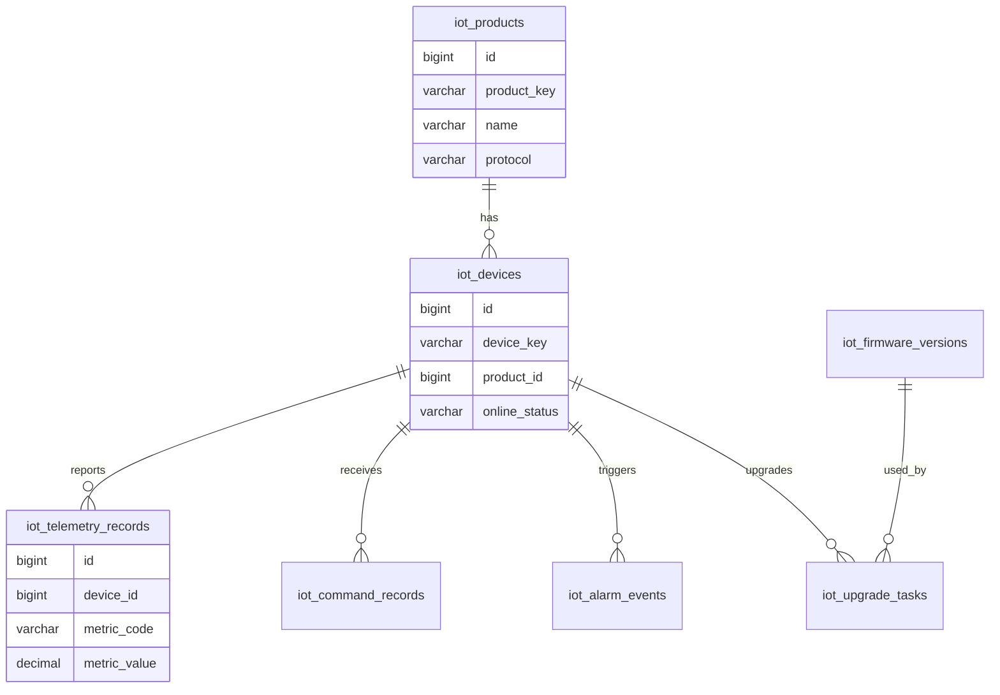
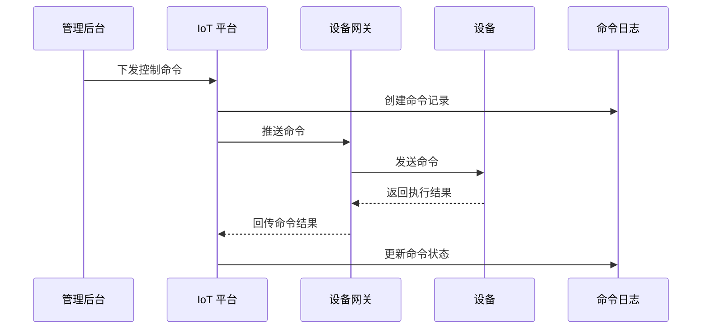

# IoT 设备管理项目案例

## 适合谁看

适合需要做设备接入、设备档案、遥测数据、命令下发、告警、固件升级、设备分组和在线状态监控的开发者。

IoT 设备管理不是“设备列表加在线状态”。真实项目里，设备会涉及接入认证、协议解析、遥测上报、影子状态、命令下发、离线判断、告警规则、固件升级和运维工单。设备数量一多，最重要的是稳定接入、可观测和可追踪。

## 业务目标

第一版 IoT 设备管理支持：

- 维护产品和设备档案。
- 支持设备注册和认证。
- 接收遥测数据。
- 维护设备在线状态。
- 支持命令下发。
- 支持告警规则。
- 支持固件升级。
- 支持设备分组和运维记录。

## 设备接入链路

设备接入要先解决身份。没有设备唯一标识和密钥，后续数据就无法信任。

## 数据模型

## 推荐表结构

| 表 | 作用 | 关键字段 |
| --- | --- | --- |
| `iot_products` | 产品模型 | `product_key`、`name`、`protocol`、`status` |
| `iot_devices` | 设备档案 | `device_key`、`product_id`、`secret_ref`、`online_status` |
| `iot_device_groups` | 设备分组 | `group_code`、`name`、`parent_id` |
| `iot_telemetry_records` | 遥测数据 | `device_id`、`metric_code`、`metric_value`、`reported_at` |
| `iot_command_records` | 命令记录 | `device_id`、`command_code`、`payload`、`status` |
| `iot_alarm_rules` | 告警规则 | `product_id`、`metric_code`、`condition_config`、`enabled` |
| `iot_alarm_events` | 告警事件 | `device_id`、`rule_id`、`severity`、`status` |
| `iot_firmware_versions` | 固件版本 | `product_id`、`version_no`、`file_id`、`status` |
| `iot_upgrade_tasks` | 升级任务 | `firmware_id`、`device_id`、`upgrade_status`、`result_message` |

遥测数据量通常很大。业务表保存核心状态，明细遥测可以进入时序库或分区表。

## 命令下发流程

命令下发要有超时和结果状态。设备离线时可以选择失败、排队或等待上线后下发。

## 设备场景

| 场景 | 关键动作 | 注意点 |
| --- | --- | --- |
| 设备注册 | 设备密钥、产品模型 | 密钥不能明文展示 |
| 遥测上报 | 温度、电量、位置、状态 | 数据要带上报时间 |
| 在线判断 | 心跳或连接状态 | 离线阈值按产品配置 |
| 命令下发 | 开关、重启、参数设置 | 需要结果回执 |
| 告警规则 | 阈值、离线、异常状态 | 告警要能关闭 |
| 固件升级 | 分批升级、失败重试 | 支持灰度和回滚 |

## 前端页面拆分

| 页面 | 作用 | 注意点 |
| --- | --- | --- |
| 产品模型 | 定义设备类型和指标 | 指标编码稳定 |
| 设备列表 | 查看设备状态和分组 | 在线状态明显 |
| 设备详情 | 查看遥测、命令、告警和日志 | 时间线组织 |
| 遥测数据 | 查询指标趋势 | 大数据量分页或聚合 |
| 命令控制 | 下发设备命令 | 高风险命令二次确认 |
| 告警中心 | 处理设备异常 | 支持认领和关闭 |
| 固件升级 | 创建升级任务 | 分批、灰度、回滚 |
| 运维记录 | 记录现场维护 | 关联设备和告警 |

## 实际项目常见问题

### 问题 1：设备显示在线但实际不可控

在线状态不能只看最后一次上报时间。控制类设备还要关注连接状态、命令回执和心跳。

### 问题 2：命令重复执行

命令要有唯一命令号，设备端和平台端都要幂等。网络重试可能导致重复投递。

### 问题 3：固件升级导致大量设备不可用

固件升级必须分批灰度，先小范围验证，再扩大范围。失败设备要能暂停、重试或回滚。

## 验收清单

- 产品模型和设备档案清晰。
- 设备有唯一标识和认证密钥。
- 遥测数据可接收、查询和聚合。
- 在线状态有明确判断规则。
- 命令下发有记录、状态和回执。
- 告警规则可配置。
- 告警事件可处理和关闭。
- 固件升级支持分批和失败处理。
- 高风险命令有审计。
- 设备详情能展示完整时间线。

## 下一步学习

继续学习 [规则引擎项目案例](/projects/rule-engine-case)、[消息队列项目案例](/projects/message-queue-case) 和 [生产制造项目案例](/projects/manufacturing-execution-case)。
