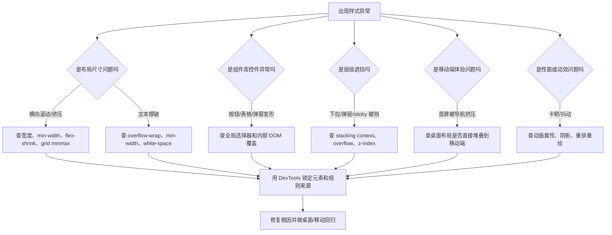
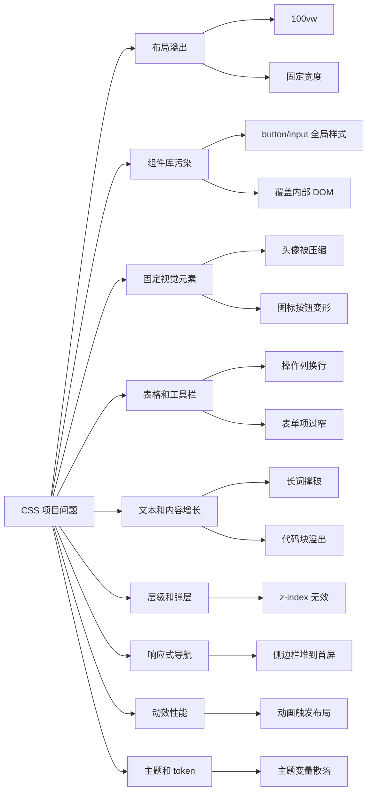
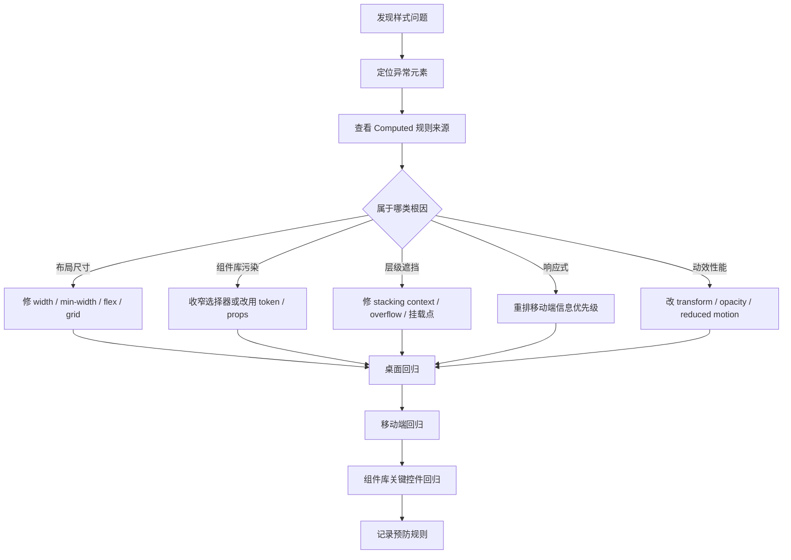

# CSS 真实项目问题库

## 这个页面解决什么

这页整理 CSS 在真实前端项目里最常见、最容易反复出现的问题。它不是属性速查，而是帮助你排查这些场景：

- 移动端出现横向滚动。
- 组件库按钮、输入框、表格突然变形。
- 头像、图标、状态点被挤成椭圆。
- 表格操作列被压缩，按钮换行或重叠。
- 文本、长英文、URL、代码撑破卡片。
- sticky 表头、弹层、下拉菜单被遮挡。
- 移动端首屏被桌面侧边栏或导航挤下去。
- 动画、阴影和布局变更导致页面卡顿。
- 深色模式、主题变量和组件库 token 不一致。

如果你刚学完 [CSS 学习导览](/css/introduction)、[响应式设计](/css/responsive)、[项目样式架构](/css/architecture) 和 [CSS 常见问题](/css/troubleshooting)，这页就是下一步的项目排错清单。

## 排查总流程

CSS 问题不要先加 `!important`。先定位影响范围，再判断是布局、尺寸、层叠、响应式、组件库边界还是浏览器渲染问题。



排查时先收集这些证据：

| 证据 | 看什么 |
| --- | --- |
| Elements | 哪个元素的尺寸、位置或样式异常 |
| Computed | 最终生效的 CSS 规则来自哪个文件 |
| Layout | flex/grid 轨道、溢出元素、sticky 容器 |
| Console | 是否有运行时注入样式或组件报错 |
| 视口 | 390px、768px、1440px 下是否表现一致 |

## 问题地图



## 问题 1：移动端出现横向滚动

### 问题现象

- 390px 宽度下页面底部出现横向滚动条。
- 页面看起来整体比屏幕宽一点。
- 某个卡片、表格、代码块、图片或工具栏撑出屏幕。
- 桌面端看不出来，移动端才明显。

### 影响范围

文档站、后台列表页、表单页、数据看板、移动端详情页、代码示例页面。

### 根因分析

横向溢出通常来自这些来源：

| 根因 | 示例 | 问题 |
| --- | --- | --- |
| `width: 100vw` | 页面容器 100vw | 可能叠加滚动条宽度 |
| 固定宽度 | `width: 1200px` | 小屏直接撑破 |
| Grid 子项不允许收缩 | `1fr` | 内容最小宽度撑破轨道 |
| 表格和代码块太宽 | 长列、长代码 | 需要局部滚动 |
| 图片或 SVG 无约束 | 原图很宽 | 超出父容器 |

### 解决方案

先定位溢出元素：

```js
function findOverflowElements() {
  return [...document.querySelectorAll('body *')].filter((el) => {
    return el.scrollWidth > el.clientWidth
  })
}

console.table(findOverflowElements().map((el) => ({
  tag: el.tagName,
  className: el.className,
  scrollWidth: el.scrollWidth,
  clientWidth: el.clientWidth
})))
```

常见修复：

```css
.page-shell {
  max-width: 100%;
  overflow-x: clip;
}

.content-grid {
  display: grid;
  grid-template-columns: repeat(3, minmax(0, 1fr));
}

.content-card {
  min-width: 0;
}

.doc-image {
  display: block;
  max-width: 100%;
  height: auto;
}

.code-panel {
  max-width: 100%;
  overflow-x: auto;
}
```

### 预防方式

- 页面主容器优先用 `width: 100%`，谨慎使用 `100vw`。
- Grid 轨道使用 `minmax(0, 1fr)`。
- flex/grid 子项需要 `min-width: 0`。
- 表格、代码块、长内容允许局部滚动，不撑破整页。
- 每次改布局后检查 390px、768px、1440px。

## 问题 2：全局样式污染组件库控件

### 问题现象

- 组件库按钮高度、宽度、边框突然不对。
- 输入框、开关、表格、分页被压缩或错位。
- 某个页面加了 CSS 后，其他页面组件也变形。
- 删除全局 CSS 后组件恢复。

### 影响范围

Element Plus、Ant Design Vue、Naive UI、Arco Design、TDesign、Vant 等组件库项目。

### 根因分析

常见原因是宽泛选择器影响了组件库内部 DOM：

```css
.page button {
  width: 100%;
}

.content div {
  display: flex;
}

.panel * {
  box-sizing: border-box;
}
```

或者直接依赖组件库内部结构：

```css
.user-page .n-data-table-td div {
  padding: 0;
}
```

组件库内部 DOM 不是你的业务 API，升级后很容易变化。

### 解决方案

把样式收敛到明确业务 class：

```css
.login-submit-button {
  width: 100%;
}

.user-toolbar {
  display: flex;
  gap: 12px;
  align-items: center;
}

.user-toolbar__actions {
  display: inline-flex;
  gap: 8px;
}
```

如果确实要调整组件库，优先使用：

- 组件 props。
- 主题 token。
- CSS 变量。
- 官方暴露 class。
- 组件库推荐的局部覆盖方式。

搜索风险选择器：

```bash
rg "(\\.\\w+\\s+(div|span|button|input|\\*)|div > div|\\.\\w+ \\*)" src
```

### 预防方式

- 禁止 `.xxx div`、`.xxx span`、`.xxx button`、`.xxx *` 这类业务样式。
- 业务样式命中明确 class。
- 不依赖组件库内部层级。
- 修改全局样式后必须检查按钮、表格、弹窗、表单、分页和开关。

## 问题 3：头像、图标按钮、状态点被挤变形

### 问题现象

- 圆形头像变成椭圆。
- 图标按钮在工具栏里被挤成窄条。
- 状态圆点不圆，或者和文字错位。
- 表格操作列里图标大小不一致。

### 影响范围

用户列表、消息通知、评论列表、表格操作列、顶部导航、工具栏、标签页。

### 根因分析

固定尺寸视觉元素放在 flex 容器里时，如果没有禁止收缩，就可能被挤压：

```css
.avatar {
  width: 32px;
  height: 32px;
  border-radius: 50%;
}
```

上面缺少 `flex-shrink: 0` 或 `flex: 0 0 32px`。

### 解决方案

固定尺寸元素必须写稳定宽高和不可压缩行为：

```css
.user-avatar {
  width: 32px;
  height: 32px;
  flex: 0 0 32px;
  border-radius: 50%;
  overflow: hidden;
}

.icon-action-button {
  width: 32px;
  height: 32px;
  flex: 0 0 32px;
  display: inline-grid;
  place-items: center;
}

.status-dot {
  width: 8px;
  height: 8px;
  flex: 0 0 8px;
  border-radius: 50%;
}
```

### 预防方式

- 头像、图标按钮、状态点、徽标都要设置稳定尺寸。
- 工具栏、表格操作列、列表项里尤其要检查 `flex-shrink`。
- 图标按钮文字过长时，不让图标本体被压缩。
- 组件截图覆盖窄屏和长文案。

## 问题 4：表格操作列被压缩或换行

### 问题现象

- “编辑 / 删除 / 更多”按钮换行。
- 操作列按钮被挤到两行，表格行高突然变大。
- 小屏下操作按钮和其他列重叠。
- 固定列阴影或边框错位。

### 影响范围

后台管理系统、订单列表、用户列表、审批列表、日志列表。

### 根因分析

表格操作列本质是“固定命令区”，不应该参与普通文本压缩。常见错误是没有给操作区稳定尺寸和不换行规则。

```css
.table-actions {
  display: flex;
}
```

如果父级宽度很窄，按钮就会被挤压或换行。

### 解决方案

操作区使用稳定布局：

```css
.table-actions {
  display: inline-flex;
  align-items: center;
  gap: 8px;
  white-space: nowrap;
}

.table-actions__button {
  flex: 0 0 auto;
}
```

如果操作太多，不要强行平铺：

```text
主要操作：编辑
高频危险操作：删除
低频操作：更多菜单
```

小屏表格可考虑：

- 把低频操作放进更多菜单。
- 切换成卡片列表。
- 只保留最关键 1 到 2 个操作。
- 使用横向滚动表格，但不要让整页滚动。

### 预防方式

- 表格列设计时先确定操作优先级。
- 不把 5 个以上按钮平铺在一列。
- 操作列按钮不可压缩。
- 移动端不要照搬桌面表格。

## 问题 5：文本、长英文、URL 撑破卡片

### 问题现象

- 用户名、邮箱、URL、错误信息、订单号撑破卡片。
- 卡片宽度被长词撑大。
- 按钮或标签被文本挤出父容器。
- 移动端标题覆盖后面的内容。

### 影响范围

消息通知、日志详情、错误面板、用户资料、订单备注、文档代码块、搜索结果。

### 根因分析

英文长词、URL、hash、traceId 没有自然断点。flex/grid 子项默认 `min-width: auto`，也可能拒绝收缩。

### 解决方案

可换行文本：

```css
.log-message {
  min-width: 0;
  overflow-wrap: anywhere;
}
```

单行省略：

```css
.user-email {
  min-width: 0;
  overflow: hidden;
  text-overflow: ellipsis;
  white-space: nowrap;
}
```

代码和日志面板：

```css
.code-output {
  max-width: 100%;
  overflow-x: auto;
  white-space: pre;
}
```

flex 子项：

```css
.message-row__content {
  min-width: 0;
  flex: 1 1 auto;
}
```

### 预防方式

- 任何展示用户输入、URL、traceId、错误栈的地方都要考虑长内容。
- 卡片标题和描述分别设置换行策略。
- flex/grid 子项用 `min-width: 0`。
- 按钮文字过长时允许换行或使用更短文案。

## 问题 6：sticky、下拉菜单、弹窗被遮挡

### 问题现象

- sticky 表头滚动时不生效。
- 下拉菜单被父容器裁掉。
- 弹窗遮罩在页面内容下面。
- 设置了很大的 `z-index` 仍然无效。

### 影响范围

表格固定表头、顶部导航、侧边栏、弹窗、抽屉、下拉菜单、tooltip、日期选择器。

### 根因分析

`z-index` 只在同一个 stacking context 内比较。下面这些属性都可能创建新的层叠上下文：

- `position` + `z-index`
- `transform`
- `filter`
- `opacity < 1`
- `isolation: isolate`
- `contain`
- `will-change`

另外，父容器 `overflow: hidden` 会裁剪子元素，下拉菜单可能被截断。

### 解决方案

先确认弹层是否应该挂到 body。如果使用组件库，优先使用官方的 teleport / append-to-body 能力。

业务 sticky：

```css
.page-toolbar {
  position: sticky;
  top: 0;
  z-index: 10;
  background: var(--app-color-surface);
}
```

避免给大容器随意加 transform：

```css
.page-shell {
  /* 不要为了微动效给整个页面加 transform */
}
```

如果需要裁剪圆角和弹层同时存在，应把弹层移出被裁剪容器。

### 预防方式

- 弹层、下拉、tooltip 优先使用组件库推荐挂载策略。
- 不用无限增大 `z-index` 掩盖层叠上下文问题。
- sticky 的祖先元素不要随意 `overflow: hidden`。
- 给项目定义少量 z-index token，例如 base、sticky、dropdown、modal。

## 问题 7：移动端首屏被桌面导航挤下去

### 问题现象

- 移动端打开后台页面，先看到完整侧边栏，主内容被挤到下面。
- 首屏看不到当前页面核心内容。
- 导航项太多，用户要滚很久才看到页面。
- 桌面端正常，移动端体验很差。

### 影响范围

后台系统、SaaS 控制台、文档站、管理台、企业门户。

### 根因分析

桌面端固定侧边栏在移动端直接改成块级堆叠，导致导航占据首屏。

```css
.app-layout {
  display: flex;
}

@media (max-width: 600px) {
  .app-layout {
    display: block;
  }
}
```

这只是把布局堆叠了，没有重新设计移动端信息优先级。

### 解决方案

移动端使用更轻的导航承载方式：

```css
.desktop-sidebar {
  display: block;
}

.mobile-topbar {
  display: none;
}

@media (max-width: 768px) {
  .desktop-sidebar {
    display: none;
  }

  .mobile-topbar {
    display: flex;
    align-items: center;
    justify-content: space-between;
    min-height: 52px;
  }

  .page-content {
    padding: 16px;
  }
}
```

移动端导航可以使用：

- 抽屉。
- 顶部菜单按钮。
- 底部导航。
- 更多菜单。
- 当前模块内的紧凑 tabs。

### 预防方式

- 桌面导航和移动导航分开设计。
- 移动端首屏优先展示当前页面标题、关键数据和主要操作。
- 不把完整桌面侧边栏直接堆叠到内容上方。
- 新增导航项后检查移动端首屏。

## 问题 8：动画导致卡顿、抖动或布局跳动

### 问题现象

- hover 卡片时页面抖动。
- 列表滚动时阴影动画卡顿。
- 展开收起动画让周围内容跳动。
- 移动端动画明显掉帧。

### 影响范围

卡片 hover、折叠面板、菜单展开、弹窗过渡、列表项进入离开、图表切换。

### 根因分析

动画属性会影响浏览器渲染成本。频繁动画 `width`、`height`、`top`、`left`、大面积 `box-shadow` 容易触发布局或重绘。

错误示例：

```css
.card:hover {
  width: 104%;
  box-shadow: 0 24px 80px rgb(0 0 0 / 30%);
}
```

### 解决方案

优先动画 `transform` 和 `opacity`：

```css
.action-card {
  transition:
    transform 160ms ease,
    opacity 160ms ease,
    box-shadow 160ms ease;
}

.action-card:hover {
  transform: translateY(-2px);
  opacity: 0.96;
}
```

尊重减少动态效果：

```css
@media (prefers-reduced-motion: reduce) {
  .action-card {
    transition: none;
  }
}
```

### 预防方式

- 动画服务状态反馈，不为了装饰过度使用。
- 避免 hover 改宽高和布局位置。
- 大列表不要给每项加重阴影动画。
- 移动端和低性能设备上验证滚动流畅度。

## 问题 9：主题变量散落，深色模式难以维护

### 问题现象

- 页面里到处写死颜色。
- 切换深色模式后文字看不清。
- 组件库主题和业务卡片主题不一致。
- 改品牌色要搜大量 CSS 文件。

### 影响范围

文档站、SaaS 控制台、后台系统、组件库、品牌站。

### 根因分析

没有把颜色、圆角、间距、阴影抽成语义 token，而是直接使用具体色值：

```css
.metric-card {
  color: #1f2937;
  background: #ffffff;
  border: 1px solid #e5e7eb;
}
```

这些色值不表达业务含义，深色模式也无法自动映射。

### 解决方案

建立语义变量：

```css
:root {
  --app-color-page: #f7faf8;
  --app-color-surface: #ffffff;
  --app-color-text: #17231f;
  --app-color-muted: #5d6f68;
  --app-color-border: #dce8e2;
  --app-radius-card: 8px;
}

[data-theme="dark"] {
  --app-color-page: #101715;
  --app-color-surface: #18211e;
  --app-color-text: #edf7f2;
  --app-color-muted: #a8bbb3;
  --app-color-border: #30423b;
}

.metric-card {
  color: var(--app-color-text);
  background: var(--app-color-surface);
  border: 1px solid var(--app-color-border);
  border-radius: var(--app-radius-card);
}
```

### 预防方式

- 新页面禁止随意散落品牌色和灰阶。
- 颜色变量按语义命名，不按视觉值命名。
- 深色模式下检查正文、按钮、边框、图表和状态标签。
- 组件库主题 token 和业务 CSS 变量要有映射关系。

## 问题 10：为了修一个样式不断加 `!important`

### 问题现象

- CSS 文件里出现大量 `!important`。
- 新增样式必须写更高优先级才能生效。
- 一个页面修好了，另一个页面坏了。
- 组件库升级后样式覆盖关系全部失控。

### 影响范围

长期维护的后台系统、多人协作项目、使用组件库的项目。

### 根因分析

`!important` 通常说明没有定位清楚层叠来源。真实根因可能是：

- 全局样式太宽。
- 选择器层级过深。
- 组件库主题没有正确配置。
- 页面样式写在错误层级。
- 加载顺序不清楚。

### 解决方案

先用 DevTools 查看 Computed 里的规则来源，再改根因。

建议样式层级：

```text
reset.css
↓
tokens.css
↓
layout.css
↓
component library theme
↓
business component class
↓
rare local override
```

业务样式保持低复杂度：

```css
.permission-switch-row {
  display: flex;
  align-items: center;
  gap: 12px;
}
```

不要写：

```css
.page .panel .content div span button {
  color: red !important;
}
```

### 预防方式

- `!important` 必须能说明原因，并尽量局部化。
- 避免深层选择器链。
- 组件库定制优先走 token 或官方 API。
- code review 检查宽泛选择器和优先级堆叠。

## 上线前检查清单

修复样式问题后，不要只看当前页面“好像正常”。建议按下面闭环做回归：



| 检查项 | 合格标准 |
| --- | --- |
| 横向溢出 | 390px、768px、1440px 下无整页横向滚动 |
| 组件库控件 | 按钮、输入框、开关、表格、分页、弹窗尺寸正常 |
| 固定视觉元素 | 头像、图标按钮、状态点设置稳定宽高和不可压缩 |
| 表格操作列 | 操作按钮不被压缩，不出现无意义换行 |
| 长文本 | URL、traceId、错误信息、长标题不会撑破容器 |
| 弹层层级 | 下拉、tooltip、弹窗、sticky 不被遮挡 |
| 移动端导航 | 首屏优先展示当前页面内容，不堆整块桌面侧边栏 |
| 动效性能 | hover、展开收起、弹窗过渡不触发布局抖动 |
| 主题变量 | 颜色、边框、圆角使用语义变量，深色模式可读 |
| 优先级 | 没有用大量 `!important` 掩盖根因 |

## 下一步学习

如果你想补基础，回到 [CSS 学习导览](/css/introduction)。  
如果你正在做 Vue Admin，继续看 [Vue Admin 阅读顺序与实战索引](/vue/admin-reading-guide) 和 [项目样式架构](/css/architecture)。  
如果你要系统排查前端页面问题，继续看 [前端页面与状态问题](/projects/issues-frontend) 和 [项目排障方法论](/projects/debugging-playbook)。
