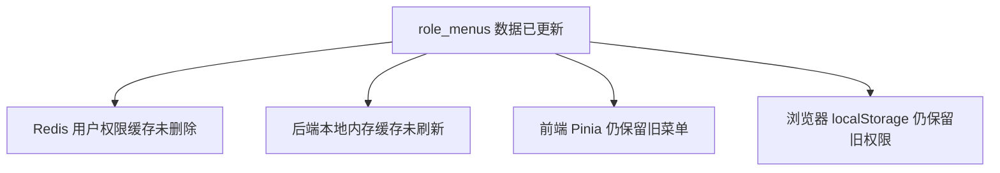
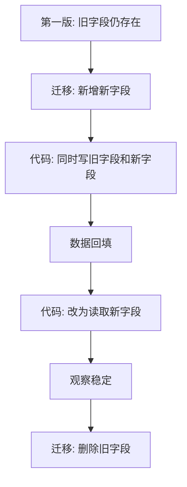

# 数据库与缓存问题

## 适合谁看

这篇适合刚开始接触 MySQL、PostgreSQL、Redis 的同学，也适合经常遇到“接口慢、数据不一致、缓存脏数据、事务失效”的前后端开发者。

数据库问题的难点是：代码看起来没有错，但数据量、并发、索引、事务边界和缓存策略会让问题在真实环境中暴露。

## 使用方式

排查数据库问题时，不要只看一条 SQL。至少同时确认：

- 表结构和索引。
- 查询条件和排序字段。
- 数据量级。
- 事务范围。
- 是否有缓存。
- 是否存在并发写入。

## 问题 1：列表查询本地很快，线上数据多后越来越慢

### 问题现象

- 本地和测试环境查询很快。
- 线上数据超过几十万后，列表打开变慢。
- 加了分页仍然慢。
- 数据库 CPU 或慢查询日志明显升高。

### 影响范围

用户列表、订单列表、日志列表、审批列表、商品列表等带搜索和排序的页面。

### 常见根因

常见原因包括：

- 查询字段没有索引。
- 排序字段没有和筛选条件组合成合适索引。
- 模糊搜索写成 `%keyword%`，普通索引无法有效使用。
- 查询返回字段太多。
- 深分页导致数据库扫描大量数据。

错误示例：

```sql
SELECT *
FROM orders
WHERE status = 'paid'
ORDER BY created_at DESC
LIMIT 20 OFFSET 200000;
```

### 解决方案

先看执行计划。

```sql
EXPLAIN
SELECT id, order_no, status, amount, created_at
FROM orders
WHERE status = 'paid'
ORDER BY created_at DESC
LIMIT 20;
```

为高频查询设计组合索引。

```sql
CREATE INDEX idx_orders_status_created
ON orders(status, created_at DESC);
```

减少返回字段。

```sql
SELECT id, order_no, status, amount, created_at
FROM orders
WHERE status = 'paid'
ORDER BY created_at DESC
LIMIT 20;
```

深分页场景改成游标分页。

```sql
SELECT id, order_no, status, amount, created_at
FROM orders
WHERE status = 'paid'
  AND created_at < '2026-07-01 10:00:00'
ORDER BY created_at DESC
LIMIT 20;
```

### 预防方式

- 设计列表接口时同步设计索引。
- 分页不是性能优化的全部，深分页仍然可能慢。
- 不要默认 `SELECT *`。
- 上线后开启慢查询采集。
- 重要列表要压测接近真实数据量。

## 问题 2：明明用了事务，数据还是出现了一半成功一半失败

### 问题现象

- 创建订单成功，但库存没有扣减。
- 主表写入成功，子表写入失败。
- 日志显示代码里有事务。

### 影响范围

所有需要多步写入保持一致的业务：

- 订单创建。
- 账户余额变更。
- 审批流转。
- 权限角色绑定。
- 导入批量数据。

### 常见根因

事务没有真正包住所有写操作：

- 某些数据库操作使用了事务外的连接。
- 异步任务在事务提交前启动。
- 捕获异常后没有回滚。
- 调用了另一个服务，跨服务事务无法自动保证。

### 解决方案

把事务边界写清楚，所有相关数据库写入都使用同一个事务上下文。

```ts
await db.transaction(async (tx) => {
  const order = await tx.order.create({ data: orderData })

  await tx.orderItem.createMany({
    data: items.map((item) => ({
      orderId: order.id,
      skuId: item.skuId,
      count: item.count
    }))
  })

  await tx.stock.updateMany({
    where: { skuId: { in: items.map((item) => item.skuId) } },
    data: { locked: { increment: 1 } }
  })
})
```

不要在事务中执行慢外部调用。

```text
推荐顺序：
1. 校验参数。
2. 调用必要的外部查询。
3. 开启事务。
4. 执行短时间数据库写入。
5. 提交事务。
6. 发送消息或异步任务。
```

### 预防方式

- 事务函数参数命名清晰，例如 `tx`，避免误用全局 `db`。
- 事务内不要做慢网络请求。
- 跨服务一致性要用状态机、消息、补偿或幂等，不要指望单库事务解决。
- 每个关键写入流程写失败路径测试。

## 问题 3：缓存里有旧数据，用户看到的和数据库不一致

### 问题现象

- 后台已经修改了配置，但前台仍显示旧值。
- 删除数据后列表里还存在。
- 有些用户看到新数据，有些用户看到旧数据。

### 影响范围

Redis 缓存、浏览器缓存、CDN 缓存、本地内存缓存都会出现类似问题。

### 常见根因

缓存更新策略不明确：

- 更新数据库后忘记删除缓存。
- 先删缓存再写数据库，并发请求又把旧数据写回缓存。
- 缓存 key 设计不规范。
- 多层缓存只清了一层。

### 解决方案

常见读写策略：旁路缓存。

```text
读：
1. 读缓存。
2. 缓存命中，直接返回。
3. 缓存未命中，读数据库。
4. 写缓存。
5. 返回数据。

写：
1. 写数据库。
2. 删除缓存。
```

缓存 key 要统一。

```ts
function userCacheKey(userId: number) {
  return `user:profile:${userId}`
}
```

更新后删除对应缓存。

```ts
await db.user.update({ where: { id: userId }, data })
await redis.del(userCacheKey(userId))
```

对强一致要求高的场景，不要依赖普通缓存直接展示最终结果。

### 预防方式

- 先明确缓存是为了性能还是为了跨请求共享状态。
- 所有缓存 key 集中管理。
- 写数据库后清缓存，不要只更新缓存。
- 缓存设置合理过期时间，避免永久脏数据。
- 多层缓存要有完整清理链路。

## 问题 4：Redis key 越来越多，内存突然被打满

### 问题现象

- Redis 内存持续上涨。
- 业务没有明显增长，但 key 数量越来越多。
- 某天开始大量请求报错或响应变慢。

### 影响范围

验证码、登录态、临时任务状态、导出进度、缓存列表、分布式锁。

### 常见根因

- 临时 key 没有设置过期时间。
- key 中包含高基数字段，导致无限增长。
- 缓存大对象或大列表。
- 把 Redis 当成永久数据库使用。

### 解决方案

临时 key 必须设置过期时间。

```ts
await redis.set(`sms:code:${mobile}`, code, 'EX', 300)
```

分布式锁必须有过期时间和唯一 value。

```ts
await redis.set(lockKey, lockValue, 'NX', 'EX', 10)
```

定期观察 key 分布。

```bash
redis-cli --bigkeys
redis-cli --scan --pattern "export:*" | head
```

对大列表做长度限制。

```ts
await redis.lpush('recent:events', JSON.stringify(event))
await redis.ltrim('recent:events', 0, 999)
```

### 预防方式

- 临时数据默认必须有 TTL。
- key 命名要能看出业务域和数据类型。
- 不把完整大对象长期塞进 Redis。
- 监控 Redis 内存、key 数量、慢命令和淘汰次数。

## 问题 5：角色权限已经修改，但用户仍看到旧菜单

### 问题现象

- 管理员已经给角色取消了某个菜单。
- 用户刷新页面后仍然能看到旧菜单。
- 有些用户正常，有些用户不正常。
- 后端数据库里的角色菜单关系已经更新。

### 影响范围

后台管理系统、权限系统、SaaS 控制台、多租户管理平台。

### 常见根因

权限数据通常会被多处缓存：



只更新数据库是不够的。权限是典型的“写少读多”数据，项目里经常会为了性能做缓存。

### 解决方案

修改角色权限后，要处理受影响用户的权限缓存。

```ts
await db.transaction(async (tx) => {
  await tx.roleMenu.deleteMany({ where: { roleId } })
  await tx.roleMenu.createMany({
    data: menuIds.map((menuId) => ({ roleId, menuId })),
    skipDuplicates: true
  })
})

const userIds = await db.userRole.findMany({
  where: { roleId },
  select: { userId: true }
})

await redis.del(...userIds.map((item) => userPermissionCacheKey(item.userId)))
```

前端收到“权限已变更”或下次刷新页面时，要重新拉取用户上下文。

```ts
await permissionStore.reset()
await permissionStore.loadUserContext()
```

如果权限对安全要求很高，接口层必须实时校验权限，不能只依赖前端菜单隐藏。

### 预防方式

- 权限缓存 key 集中管理。
- 修改角色、菜单、用户角色时统一走权限服务，不散落在各业务模块。
- 前端登录态和权限态分开管理。
- 权限变更必须写审计日志。
- 高风险接口后端必须检查权限码。

## 问题 6：数据库迁移成功，但发布后接口报字段不存在

### 问题现象

- CI/CD 显示迁移执行成功。
- 新后端启动后报 `Unknown column` 或 `column does not exist`。
- 或者部分实例正常，部分实例报错。

### 影响范围

多实例后端、灰度发布、容器滚动更新、前后端同时依赖新字段的需求。

### 常见根因

发布顺序和兼容性没有设计好：

- 迁移跑在了错误数据库。
- 新代码先上线，但迁移还没生效。
- 一部分实例还是旧代码，一部分已经是新代码。
- 新迁移删除了旧字段，旧代码仍在读取。

### 解决方案

破坏性变更拆成多次兼容发布。



上线前确认迁移目标库：

```sql
SELECT DATABASE();
SHOW COLUMNS FROM users;
```

发布日志里要打印：

- 应用版本。
- 数据库地址或数据库名。
- 当前迁移版本。
- 环境名。

### 预防方式

- 不在一次发布里同时删除字段和上线依赖新结构的代码。
- 所有迁移必须有变更说明和回滚说明。
- 灰度发布时，数据库结构要同时兼容新旧代码。
- CI/CD 中把迁移环境、应用环境和镜像版本记录下来。

## 问题 7：明明建了复合索引，查询还是很慢

### 问题现象

- 表上已经有复合索引。
- 查询仍然走全表扫描。
- `EXPLAIN` 显示 `type = ALL` 或扫描行数很高。

### 影响范围

订单列表、日志列表、审批列表、数据看板、后台筛选页面。

### 常见根因

复合索引不是“字段都在里面就一定有效”。它受字段顺序、查询条件、排序方式影响。

错误示例：

```sql
CREATE INDEX idx_orders_status_created ON orders(status, created_at);

SELECT id, order_no, status, created_at
FROM orders
WHERE created_at >= '2026-07-01'
ORDER BY created_at DESC
LIMIT 20;
```

这个查询没有使用 `status`，不一定能充分利用 `(status, created_at)`。

### 解决方案

先按真实查询场景设计索引。

```sql
EXPLAIN
SELECT id, order_no, status, created_at
FROM orders
WHERE status = 'paid'
  AND created_at >= '2026-07-01'
ORDER BY created_at DESC
LIMIT 20;
```

对应索引：

```sql
CREATE INDEX idx_orders_status_created_id
ON orders(status, created_at, id);
```

如果查询经常不带 `status`，需要另一个索引：

```sql
CREATE INDEX idx_orders_created_id
ON orders(created_at, id);
```

不要为了“可能会用”把所有字段都塞进一个超长索引。索引会增加写入成本，也会让优化器选择更复杂。

### 预防方式

- 先列出列表页真实筛选条件，再设计索引。
- 每个索引都写清楚对应接口和查询场景。
- 用 `EXPLAIN` 验证，不靠感觉。
- 数据量太小时执行计划可能不典型，压测要接近真实数据量。

## 问题 8：接口变慢，最后发现是 N+1 查询

### 问题现象

- 列表只有 20 条，但接口要查几十次数据库。
- 数据量一大接口明显变慢。
- 日志里能看到大量相似 SQL。

### 影响范围

带关联数据的列表，例如用户列表带角色、订单列表带商品、文章列表带作者。

### 常见根因

在循环里查关联数据：

```ts
const users = await db.user.findMany()

for (const user of users) {
  user.roles = await db.role.findMany({
    where: { userId: user.id }
  })
}
```

如果有 20 个用户，就会先查 1 次用户，再查 20 次角色。

### 解决方案

批量查询，再在内存中组装。

```ts
const users = await db.user.findMany({
  take: 20
})

const userIds = users.map((user) => user.id)

const userRoles = await db.userRole.findMany({
  where: { userId: { in: userIds } },
  include: { role: true }
})

const rolesByUserId = new Map<number, string[]>()

for (const item of userRoles) {
  const roles = rolesByUserId.get(item.userId) ?? []
  roles.push(item.role.name)
  rolesByUserId.set(item.userId, roles)
}
```

也可以使用 ORM 的合理关联查询，但要确认生成的 SQL 没有过度 JOIN 或返回过多字段。

### 预防方式

- 列表接口默认检查 SQL 次数。
- ORM 关联查询要看生成 SQL。
- 只返回页面需要的字段。
- 对高频接口加慢查询日志和接口耗时监控。

## 下一步学习

- [数据库学习导览](/database/introduction)
- [数据库项目落地实践](/database/project-practice)
- [索引与查询优化](/database/indexes)
- [事务、锁与并发](/database/transactions)
- [Redis 缓存与数据结构](/database/redis)
