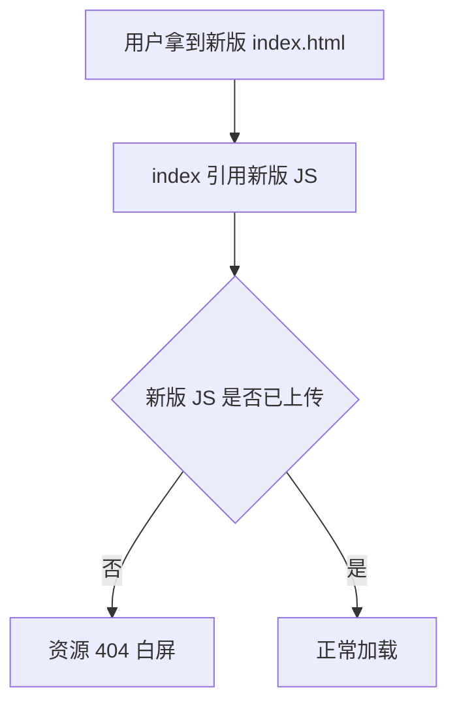
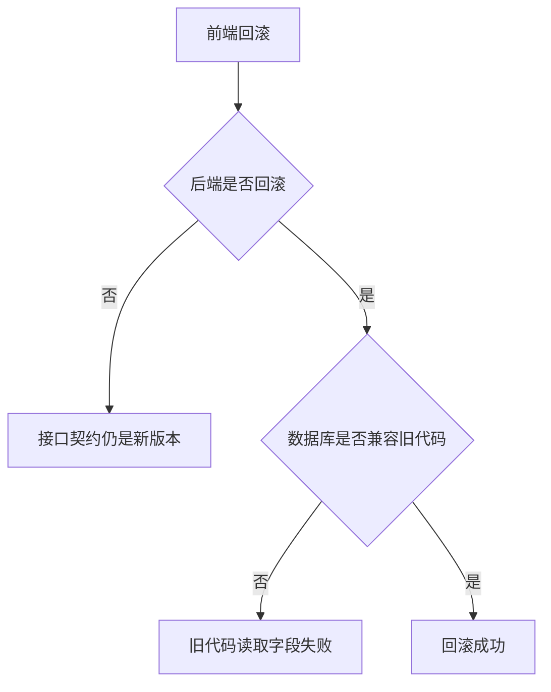

# 部署、缓存与 DevOps 问题

## 适合谁看

这篇适合已经能本地开发，但上线、部署、Nginx、Docker、CI/CD、缓存清理经常踩坑的同学。

部署问题的核心不是“能不能 build 成功”，而是“真实用户访问的路径、缓存、网关、静态资源、环境变量和回滚链路是否都正确”。

## 使用方式

部署问题排查时，优先确认链路：

```text
浏览器
CDN
Nginx 或网关
前端静态资源
后端服务
数据库或第三方服务
```

不要只看其中一层。很多白屏、404、跨域、旧代码问题都来自链路中间层。

## 问题 1：本地正常，线上刷新二级路由 404

### 问题现象

- 用户从首页点击菜单进入 `/users` 正常。
- 在 `/users` 刷新后变成 404。
- 直接复制链接给别人也打不开。

### 影响范围

所有使用前端路由 history 模式的 SPA 项目。

### 常见根因

浏览器刷新时会向服务器请求真实路径 `/users`。但服务器上没有这个文件，如果 Nginx 没有回退到 `index.html`，就会返回 404。

### 解决方案

Nginx 增加前端路由回退。

```nginx
location / {
  try_files $uri $uri/ /index.html;
}
```

如果项目部署在子路径，例如 `/admin/`，需要同时配置 Vite 的 `base` 和 Nginx 路径。

```ts
export default defineConfig({
  base: '/admin/'
})
```

```nginx
location /admin/ {
  try_files $uri $uri/ /admin/index.html;
}
```

### 预防方式

- 上线验收必须包含刷新二级路由。
- 验证复制详情页链接到新标签页。
- 子路径部署要同步检查 `base`、资源路径和路由 history。
- 前端和运维共享一份部署路径说明。

## 问题 2：上线后用户仍然看到旧页面

### 问题现象

- 新版本已经部署。
- 有些用户看到新页面，有些用户看到旧页面。
- 刷新无效，清缓存后才恢复。
- 页面引用的 JS 文件可能已经 404。

### 影响范围

所有静态资源部署，尤其是有 CDN、浏览器强缓存、Nginx 缓存的项目。

### 常见根因

`index.html` 被强缓存。它是资源入口，如果旧的 `index.html` 继续引用旧 JS 文件，就会导致白屏或旧页面。

### 解决方案

`index.html` 不应长期强缓存。

```nginx
location = /index.html {
  add_header Cache-Control "no-cache, no-store, must-revalidate";
}
```

带 hash 的静态资源可以长期缓存。

```nginx
location /assets/ {
  add_header Cache-Control "public, max-age=31536000, immutable";
}
```

发布时先上传新资源，再切换 `index.html`，避免入口文件引用不存在的资源。

```text
推荐顺序：
1. 上传 assets 静态资源。
2. 上传 index.html。
3. 清理 CDN 的 index.html。
4. 验证首页和核心路由。
```

### 预防方式

- `index.html` 和 hashed assets 使用不同缓存策略。
- 发布脚本中明确 CDN 清理对象。
- 保留至少一个旧版本静态资源，降低灰度期间 404 风险。
- 每次发布后用无痕窗口验证。

## 问题 3：环境变量配置错，构建成功但接口请求到错误地址

### 问题现象

- `npm run build` 成功。
- 页面能打开，但接口请求到本地、测试环境或错误域名。
- 换环境部署后问题复现。

### 影响范围

前端 Vite、后端服务配置、Docker 环境变量、CI/CD 发布参数。

### 常见根因

构建时变量和运行时变量混淆。

Vite 中 `import.meta.env` 是构建时注入。构建完成后，变量已经写进静态文件，部署时再改服务器环境变量不会影响这份前端产物。

### 解决方案

明确构建环境文件。

```text
.env.development
.env.staging
.env.production
```

Vite 变量必须以 `VITE_` 开头。

```text
VITE_API_BASE_URL=https://api.example.com
```

请求封装统一读取配置。

```ts
export const apiBaseUrl = import.meta.env.VITE_API_BASE_URL
```

如果需要同一份前端包部署到多个环境，可以使用运行时配置文件。

```html
<script src="/runtime-config.js"></script>
```

```js
window.__APP_CONFIG__ = {
  apiBaseUrl: 'https://api.example.com'
}
```

### 预防方式

- 构建日志输出当前环境名和 API 地址。
- CI/CD 发布参数要可追踪。
- 不在业务代码里散落接口域名。
- 区分“构建时变量”和“运行时配置”。

## 问题 4：Docker 容器启动成功，但服务访问不到

### 问题现象

- `docker ps` 显示容器在运行。
- 浏览器访问端口失败。
- 容器日志没有明显错误。

### 影响范围

Node.js、Java、Go、Nginx、数据库等容器化部署。

### 常见根因

- 服务只监听 `127.0.0.1`，没有监听 `0.0.0.0`。
- Docker 端口映射写错。
- 容器内端口和宿主机端口混淆。
- 防火墙或安全组未放行。
- 健康检查路径错误。

### 解决方案

服务监听容器内所有网卡。

```ts
app.listen(3000, '0.0.0.0')
```

检查端口映射。

```bash
docker run -p 8080:3000 my-app
```

含义是：

```text
宿主机 8080 -> 容器内 3000
```

进入容器内部验证服务。

```bash
docker exec -it my-app sh
curl http://127.0.0.1:3000/health
```

从宿主机验证端口。

```bash
curl http://127.0.0.1:8080/health
```

### 预防方式

- 每个服务提供 `/health` 健康检查。
- README 写清楚容器内端口和宿主机端口。
- Dockerfile、compose、Nginx 配置中的端口保持一致。
- 部署验证脚本先 curl 健康检查，再切流量。

## 问题 5：Nginx 代理路径多了一段或少了一段

### 问题现象

- 前端请求 `/api/users`。
- 后端日志收到 `/users` 或 `/api/api/users`。
- 本地直连后端正常，线上通过 Nginx 失败。

### 影响范围

所有通过 Nginx、网关、Ingress 代理后端接口的项目。

### 常见根因

`location` 和 `proxy_pass` 末尾是否带 `/` 会影响路径改写。

```nginx
location /api/ {
  proxy_pass http://127.0.0.1:3000/;
}
```

这通常会把 `/api/users` 转发为后端的 `/users`。

```nginx
location /api/ {
  proxy_pass http://127.0.0.1:3000;
}
```

这通常会把 `/api/users` 原样转发为后端的 `/api/users`。

### 解决方案

先确定后端真实路由：

| 后端路由 | 前端请求 | Nginx 策略 |
| --- | --- | --- |
| `/users` | `/api/users` | 代理时去掉 `/api` |
| `/api/users` | `/api/users` | 代理时保留 `/api` |

上线前用一个固定接口验证，例如：

```text
GET /api/health
```

并在后端日志里打印收到的路径。

### 预防方式

- 前后端约定统一接口前缀。
- Nginx 配置旁边写清楚是否保留 `/api`。
- 每次改代理配置后验证登录、列表、上传和导出。
- 不要前端、Nginx、后端三处都各自拼前缀。

## 问题 6：上线后 JS 文件 404，页面白屏

### 问题现象

- 首页打开白屏。
- Console 报某个 `assets/index.xxxxxx.js` 404。
- 有些用户正常，有些用户异常。

### 影响范围

所有前端静态资源发布，尤其是 CDN、灰度发布、多版本并存环境。

### 常见根因

发布顺序或缓存策略错误：



另一个常见原因是：发布新版本时删除了旧 assets，但部分用户浏览器还缓存着旧 `index.html`，旧入口继续引用旧 JS 文件。

### 解决方案

推荐发布顺序：

1. 上传新版本 assets。
2. 上传或切换 `index.html`。
3. 刷新 CDN 的 `index.html`。
4. 保留至少一个旧版本 assets。
5. 验证无痕窗口和旧页面刷新。

Nginx 缓存策略：

```nginx
location = /index.html {
  add_header Cache-Control "no-cache, no-store, must-revalidate";
}

location /assets/ {
  add_header Cache-Control "public, max-age=31536000, immutable";
}
```

### 预防方式

- `index.html` 不强缓存。
- assets 使用 hash 文件名并长期缓存。
- 发布脚本不要立即删除上一版本 assets。
- 每次发布后检查 Network 是否存在 404。

## 问题 7：CI 显示成功，但线上还是旧版本

### 问题现象

- GitHub Actions 或其他 CI 显示发布成功。
- 打开线上页面仍是旧版本。
- 后端接口版本号也没有变化。

### 影响范围

所有自动化发布流程。

### 常见根因

- 构建成功但没有部署到正确服务器。
- 上传到了新目录，但 Nginx `current` 没切换。
- Docker 镜像 tag 没变，服务器继续使用旧镜像。
- CDN 仍缓存旧入口文件。
- 多台服务器只更新了一台。

### 解决方案

发布流程必须输出“可验证信息”：

```text
commit: 8f3a2c1
buildTime: 2026-07-02 15:30:00
frontendReleaseDir: /var/www/admin/releases/2026-07-02-153000
apiImage: admin-api:2026-07-02-153000
```

前端页面可以在非敏感位置暴露版本信息，例如 `/version.json`：

```json
{
  "commit": "8f3a2c1",
  "buildTime": "2026-07-02T15:30:00+08:00"
}
```

后端提供健康检查或版本接口：

```text
GET /api/health
GET /api/version
```

### 预防方式

- 每次发布必须带唯一版本号。
- 镜像不要长期复用 `latest` 作为唯一依据。
- 发布后验证版本接口和页面版本。
- 多节点部署要确认所有节点版本一致。

## 问题 8：回滚前端后，接口仍然报错

### 问题现象

- 前端已经回滚到上一版本。
- 页面能打开，但部分接口继续报错。
- 错误集中在新增字段、枚举值或权限码上。

### 影响范围

前后端同时变更、数据库结构变更、接口字段变更、权限系统变更。

### 常见根因

只回滚了前端，没有回滚后端或数据库；或者数据库迁移是破坏性变更，旧代码已经不兼容新数据结构。



### 解决方案

上线前做兼容发布：

- 新增字段比删除字段安全。
- 后端先兼容新旧字段。
- 前端先兼容新旧枚举。
- 数据库破坏性迁移延后到稳定后执行。

回滚时按依赖顺序处理：

1. 停止继续放量。
2. 回滚前端入口。
3. 回滚后端镜像。
4. 检查数据库迁移是否需要补偿。
5. 验证核心业务流程。

### 预防方式

- 每次发布说明写清楚“是否可单独回滚前端”。
- 数据库变更默认按兼容策略设计。
- 前后端接口字段新增时保留默认值。
- 权限码、枚举值、路由路径上线后不要随意改名。

## 下一步学习

- [Vite 工程基础](/engineering/vite)
- [构建与部署](/engineering/build-deploy)
- [项目上线全流程实践](/devops/project-deployment-practice)
- [Nginx 静态部署与代理](/devops/nginx)
- [Docker 容器化](/devops/docker)
