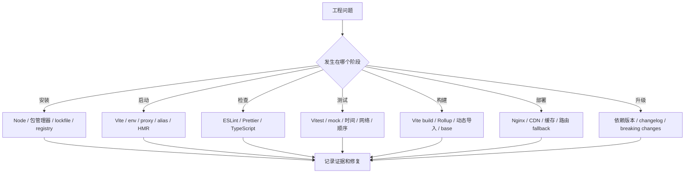
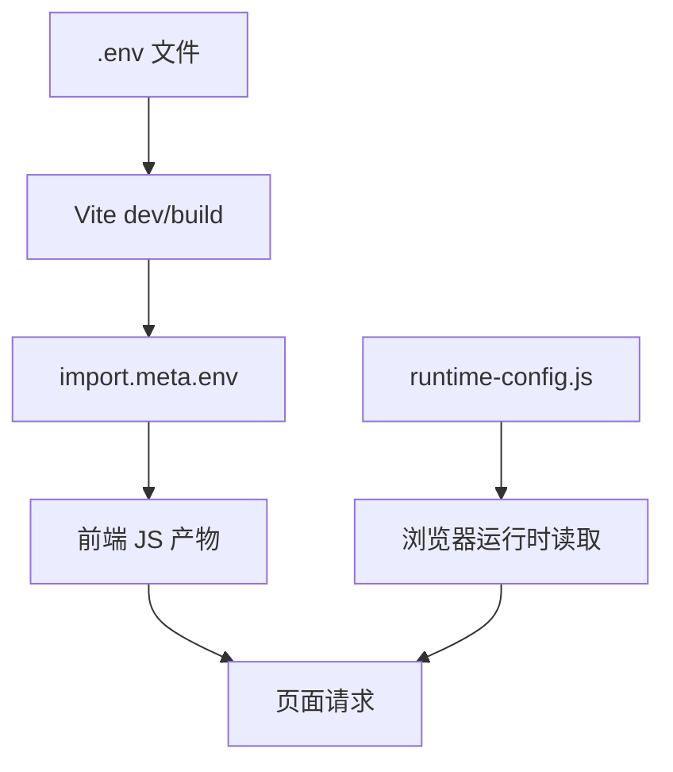
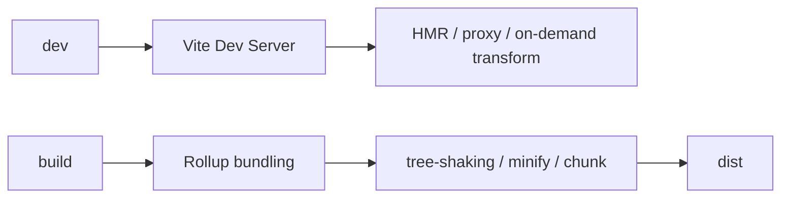
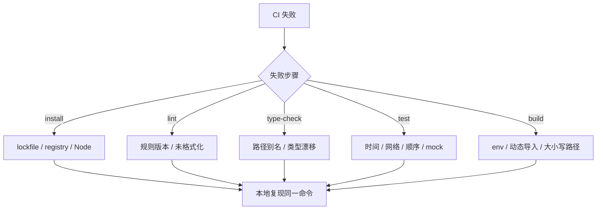
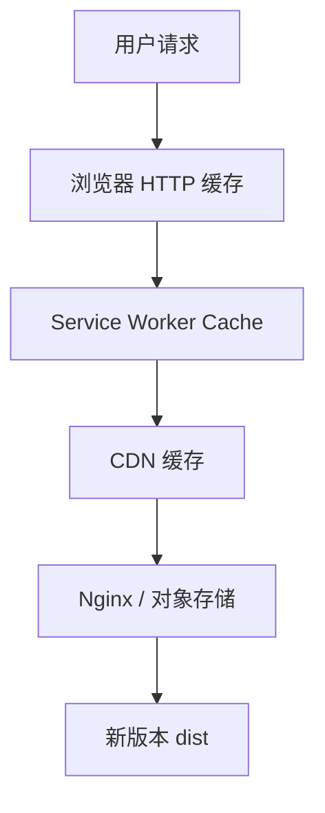
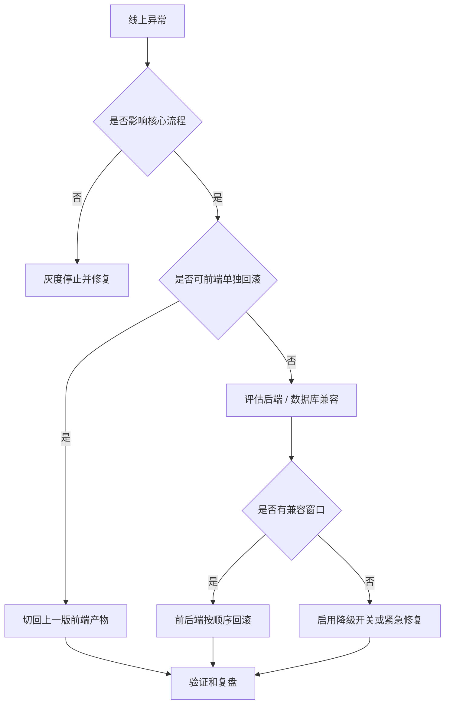

# 前端工程化真实项目问题库

## 这个页面解决什么

前端工程化问题经常不像业务 bug 那样直接出现在某个组件里。它们可能发生在依赖安装、环境变量、开发代理、类型检查、测试、构建、CI、部署缓存、CDN、Nginx、回滚和组件库升级之间。

这类问题最容易出现两个误判：

1. 把工程问题当成业务代码问题，反复改页面逻辑。
2. 把一次临时修复当成解决方案，下次换电脑、换环境、换 CI 又复现。

这一页把真实项目中高频工程化问题按“现象、影响、根因、证据、解决、预防、回归”整理成问题库。它和 [前端工程化从零到项目落地](/engineering/project-from-zero) 配合使用：前者教你建立工程链路，本页教你在链路出问题时怎么定位。

## 使用方式

先不要急着删 `node_modules`、删 lockfile 或重装所有依赖。遇到工程问题，先按下面顺序收集证据：

```text
当前命令
当前分支和 commit
Node / 包管理器版本
错误发生阶段
最近修改的配置、依赖、环境变量
本地和 CI 是否一致
```

然后进入对应问题。

## 工程问题总图



排查时先定位阶段，再定位具体工具。不要一开始就把所有配置同时改掉，否则很难知道真正的根因是什么。

## 问题 1：依赖安装失败或本地和 CI 安装结果不同

### 问题现象

- 本地 `npm install` 成功，CI `npm ci` 失败。
- 同事能安装，你的电脑安装失败。
- `pnpm install --frozen-lockfile` 报 lockfile 不一致。
- 安装后项目启动报某个包找不到。
- 一次依赖升级后，旧分支也开始安装失败。

### 影响范围

安装失败会阻断整个团队协作。比业务 bug 更麻烦的是，它可能让新人无法启动项目，也会让 CI、发布和回滚不可复现。

### 根因分析

常见根因：

| 根因 | 说明 |
| --- | --- |
| Node 版本不一致 | 本地 Node 20，CI Node 22，依赖行为不同 |
| 包管理器混用 | 项目用 pnpm，但有人提交了 `package-lock.json` |
| lockfile 没提交或过期 | CI 严格安装时失败 |
| registry 不一致 | 本地使用国内镜像，CI 使用官方源或私有源 |
| postinstall 脚本失败 | 原生依赖、二进制下载、权限问题 |
| 依赖版本范围过宽 | `^` 或 `~` 拉到新版本后行为变化 |

### 证据怎么收集

```bash
node -v
npm -v
pnpm -v
corepack --version
git status --short
git diff package.json
git diff package-lock.json pnpm-lock.yaml yarn.lock
```

同时保留 CI 失败日志中第一条真正错误。很多安装日志很长，最后一行不一定是根因。

### 解决方案

1. 统一包管理器。
2. 提交且只提交对应 lockfile。
3. 在 `package.json` 写清 `packageManager` 和 `engines`。
4. CI 使用严格安装命令。
5. 私有源或镜像源写入团队文档，不靠个人机器配置。

示例：

```json
{
  "engines": {
    "node": ">=22 <23"
  },
  "packageManager": "pnpm@9.15.0"
}
```

CI：

```bash
pnpm install --frozen-lockfile
```

### 预防方式

- README 写清 Node 版本和包管理器。
- 使用 `.nvmrc`、`.node-version` 或 Volta 固定版本。
- PR 中如果改了 `package.json`，必须同时检查 lockfile。
- 不在项目里混用 npm、pnpm、yarn、bun。

### 回归验证

- 删除本地依赖后重新安装。
- 在干净分支执行同一安装命令。
- CI 重新跑安装步骤。
- 新同事按 README 能安装成功。

## 问题 2：修改环境变量后不生效或接口地址错误

### 问题现象

- 改了 `.env.development`，页面还是旧 API 地址。
- `import.meta.env.VITE_API_BASE_URL` 是 `undefined`。
- 测试环境调用了生产接口。
- 构建后接口地址无法动态切换。

### 影响范围

环境变量错误会导致联调失败、误连生产、测试数据污染、登录态异常和发布事故。它通常不只是前端问题，还会影响 Nginx、网关和后端接口。

### 根因分析

Vite 的环境变量在开发和构建阶段注入，构建后会被写入静态产物。常见误区是把前端 `.env` 当成服务器运行时变量。



常见根因：

- 变量没有 `VITE_` 前缀。
- 改了 `.env` 但没有重启 dev server。
- 使用了错误的 build mode。
- 业务组件到处直接读 `import.meta.env`，难以统一兜底。
- 需要运行时动态配置，却用了构建时变量。

### 证据怎么收集

```bash
npm run build -- --mode test
```

页面里增加非敏感配置展示：

```ts
console.info('[app config]', {
  mode: import.meta.env.MODE,
  apiBaseUrl: import.meta.env.VITE_API_BASE_URL
})
```

检查：

- 构建命令使用的 mode。
- `.env` 文件名。
- 变量前缀。
- 产物中是否已经写死 API 地址。
- Nginx 或网关是否也做了代理。

### 解决方案

1. 所有前端环境变量统一 `VITE_` 前缀。
2. 建立 `src/config/appConfig.ts` 集中读取和校验。
3. 构建时变量和运行时配置分开。
4. README 写清不同环境的构建命令。

```ts
export const appConfig = {
  mode: import.meta.env.MODE,
  apiBaseUrl: import.meta.env.VITE_API_BASE_URL ?? '/api'
}
```

如果需要部署后不重新构建也能切换配置，用运行时配置文件：

```html
<script src="/runtime-config.js"></script>
```

### 预防方式

- `.env.example` 写全必需变量。
- 启动时校验关键配置是否为空。
- 页面或日志只输出非敏感配置。
- 禁止在组件里散落读取环境变量。

### 回归验证

- 分别用 development、test、production mode 构建。
- 预览产物并检查请求地址。
- Network 中确认请求命中预期 API。
- 测试环境不会访问生产域名。

## 问题 3：开发环境正常，生产构建失败

### 问题现象

- `npm run dev` 正常。
- `npm run build` 失败。
- CI 构建失败，本地开发没有报错。
- 报错来自 TypeScript、Rollup、Vite 插件或浏览器兼容。

### 影响范围

这种问题说明本地开发没有覆盖生产路径。它会阻断发布，也说明项目质量门禁不完整。

### 根因分析

开发服务器和生产构建不是一回事：



常见根因：

| 根因 | 说明 |
| --- | --- |
| 没跑类型检查 | dev 可以显示页面，但类型错误在 build 暴露 |
| 动态导入路径不可分析 | Rollup 无法静态打包 |
| 文件大小写不一致 | macOS 本地正常，Linux CI 失败 |
| Node-only 代码进浏览器包 | `fs`、`path`、`process` 被浏览器代码引用 |
| 环境变量缺失 | dev 有 `.env.local`，CI 没有 |
| 组件库样式或构建插件升级 | build 阶段插件行为变化 |

### 证据怎么收集

```bash
npm run type-check
npm run build
```

如果 CI 失败，记录：

- Node 版本。
- 包管理器版本。
- 构建命令。
- 第一条构建错误。
- 最近修改过的 `vite.config.ts`、`tsconfig.json`、依赖版本。

### 解决方案

- 把 `type-check` 放进 CI。
- 动态路由组件用 `import.meta.glob`。
- 文件名大小写和 import 路径保持一致。
- 浏览器业务代码不要直接引用 Node API。
- CI 提供和本地一致的环境变量。

错误示例：

```ts
const page = await import(`../views/${name}.vue`)
```

更稳定：

```ts
const modules = import.meta.glob('../views/**/*.vue')
```

### 预防方式

- 每个 PR 跑 `type-check` 和 `build`。
- 不把“本地能打开页面”当作可发布标准。
- 构建配置变更必须写清原因。
- 引入新插件后记录验证命令。

### 回归验证

- 本地和 CI 都能 build。
- 预览 dist 产物。
- 核心路由和懒加载页面都能访问。
- Console 和 Network 没有资源错误。

## 问题 4：CI 本地通过但远端失败

### 问题现象

- 本地所有命令通过，CI 失败。
- CI 偶发失败。
- 同一个测试有时通过有时失败。
- CI 的 lint、type-check、test 或 build 输出和本地不同。

### 影响范围

CI 不稳定会削弱团队对质量门禁的信任。久而久之，团队会开始跳过 CI，工程化就失去价值。

### 根因分析

常见根因：

- Node 和包管理器版本不一致。
- CI 使用 Linux，文件大小写更严格。
- 测试依赖真实时间、随机数、网络或执行顺序。
- CI 缓存了旧依赖。
- 环境变量只存在本地。
- 测试并发导致共享状态污染。

### CI 失败定位图



### 证据怎么收集

记录 CI 日志中的：

- job 名称。
- 失败 step。
- 当前 Node 版本。
- 安装命令。
- cache key。
- 第一条真正错误。

本地模拟：

```bash
npm ci
npm run format:check
npm run lint
npm run type-check
npm run test
npm run build
```

### 解决方案

- 固定 Node 版本。
- CI 使用严格安装。
- 测试 mock 时间、网络和随机数。
- 对共享状态做 `afterEach` 清理。
- CI cache key 绑定 lockfile hash。

### 预防方式

- CI 命令和 README 保持一致。
- 不允许 CI 直接静默修改代码。
- 测试失败必须能本地复现。
- 依赖升级 PR 单独提交，便于回滚。

### 回归验证

- 重新跑失败 job。
- 本地干净安装后跑同一命令。
- 临时关闭缓存验证是否缓存导致。
- 连续跑测试确认不再偶发失败。

## 问题 5：ESLint、Prettier、TypeScript 规则互相打架

### 问题现象

- 保存后格式被改，lint 又报错。
- 不同同事格式化结果不同。
- CI 的格式检查失败，本地看起来正常。
- TypeScript 报错被 `any` 快速绕过。

### 影响范围

规范冲突会让团队把时间浪费在无意义的格式争议上，也会诱导开发者关闭规则或滥用 `any`。

### 根因分析

ESLint、Prettier、TypeScript 的职责不同：

| 工具 | 职责 |
| --- | --- |
| Prettier | 代码格式 |
| ESLint | 代码质量和潜在问题 |
| TypeScript | 类型边界和编译期约束 |

常见根因：

- ESLint 同时管理太多格式规则。
- 编辑器没有读取项目 Prettier 配置。
- CI 和本地使用不同版本。
- 没有统一 `format:check` 和 `lint` 命令。
- 为了快速通过检查滥用 disable 注释。

### 证据怎么收集

```bash
npm run format:check
npm run lint
npm run type-check
```

检查：

- `eslint.config.*`
- `prettier.config.*`
- 编辑器默认 formatter。
- CI 使用的命令。
- lockfile 中 ESLint/Prettier 版本。

### 解决方案

1. Prettier 负责格式，ESLint 减少格式类规则。
2. 团队统一编辑器保存行为。
3. CI 跑 check，不做自动 write。
4. 禁止无说明的大范围 disable。

### 预防方式

- README 写清编辑器建议。
- PR 中如果调整规则，要说明影响范围。
- 规则从推荐配置开始，不一次性拉满。
- `any`、`eslint-disable` 要有原因。

### 回归验证

- 新 clone 项目后格式化结果一致。
- 本地和 CI 的 `format:check`、`lint` 输出一致。
- 修改一处示例代码能被规则正确发现。

## 问题 6：测试本地通过，CI 偶发失败

### 问题现象

- 同一个测试多跑几次结果不同。
- 本地通过，CI 失败。
- 测试和时间、异步、网络、localStorage、全局状态有关。

### 影响范围

偶发测试会让团队开始“不信测试”。一旦测试失去可信度，真正的回归问题也容易被忽略。

### 根因分析

常见根因：

- 测试依赖真实时间。
- 测试依赖真实网络。
- 多个测试共享 localStorage、Pinia、DOM 或 mock。
- 没有等待异步更新。
- 测试顺序不同导致状态污染。

### 证据怎么收集

```bash
npm run test -- --run
npm run test -- --run --sequence.shuffle
```

检查失败测试是否依赖：

- 当前日期。
- 随机数。
- 真实接口。
- 本地存储。
- 上一个测试执行结果。

### 解决方案

固定时间：

```ts
vi.setSystemTime(new Date('2026-07-01T00:00:00Z'))
```

清理状态：

```ts
afterEach(() => {
  vi.restoreAllMocks()
  localStorage.clear()
})
```

mock 网络：

```ts
vi.mock('../api/user', () => ({
  getUserList: vi.fn()
}))
```

### 预防方式

- 单元测试不访问真实网络。
- 每个测试独立初始化状态。
- 异步测试明确等待 DOM 或 Promise。
- 不把不稳定内容写进快照。

### 回归验证

- 单独跑失败测试。
- 全量跑测试。
- 打乱顺序跑测试。
- CI 连续重跑通过。

## 问题 7：构建产物上线后白屏、资源 404 或二级路由刷新 404

### 问题现象

- 本地 `npm run build` 成功。
- 线上打开白屏。
- Network 里 JS/CSS chunk 404。
- `/admin/users` 刷新后 404。
- 项目部署在子路径后资源加载错误。

### 影响范围

这类问题直接影响用户访问，是前端上线事故中最常见的一类。

### 根因分析

常见根因：

| 根因 | 说明 |
| --- | --- |
| `base` 配置错误 | 部署在 `/admin/`，产物按 `/` 找资源 |
| Nginx 没配置 fallback | history 路由刷新请求后端真实路径 |
| CDN 缓存旧 HTML | HTML 引用旧 chunk |
| 只上传了部分 assets | 某些 chunk 缺失 |
| 部署路径和路由 basename 不一致 | 页面导航和资源路径错位 |

### 证据怎么收集

浏览器 Network：

- 失败资源 URL。
- 资源状态码。
- `index.html` 内容是否新版本。
- JS/CSS 的实际路径。

服务器配置：

```nginx
location / {
  try_files $uri $uri/ /index.html;
}
```

Vite 配置：

```ts
export default defineConfig({
  base: '/admin/'
})
```

### 解决方案

- 部署到子路径时设置正确 `base`。
- Nginx 配置 SPA fallback。
- `index.html` 不长期强缓存。
- assets 带 hash 后长期缓存。
- 发布后验证所有核心路由。

### 预防方式

- 发布前必须 `build + preview`。
- 部署清单包含二级路由刷新检查。
- 每次发布记录版本号和 commit。
- 不手工漏传 dist 文件。

### 回归验证

- 打开首页。
- 刷新核心二级路由。
- 检查 Network 没有 JS/CSS 404。
- 清缓存后访问。
- CDN 环境访问。

## 问题 8：发布后用户仍然看到旧页面或旧接口行为

### 问题现象

- 新版本已发布，部分用户仍看到旧 UI。
- 控制台报旧 chunk 加载失败。
- 接口已经更新，页面仍使用旧字段。
- 用户清缓存后恢复。

### 影响范围

发布缓存问题会造成灰度不一致、前后端版本不兼容、用户看到白屏或旧逻辑。它比普通 bug 更难排，因为不同用户命中的缓存层可能不同。

### 缓存分层图



### 根因分析

常见根因：

- `index.html` 被强缓存。
- CDN 没刷新入口文件。
- Service Worker 仍返回旧缓存。
- 前端和后端非兼容发布。
- HTML 新旧版本引用 chunk 不一致。

### 证据怎么收集

- Network 查看 `index.html` 的响应头。
- 检查 JS/CSS 文件名是否带 hash。
- Application 查看 Service Worker 和 Cache Storage。
- CDN 控制台查看缓存规则。
- 对比用户页面版本号和线上最新 commit。

### 解决方案

推荐缓存策略：

```http
# index.html
Cache-Control: no-cache

# assets/app.[hash].js
Cache-Control: public, max-age=31536000, immutable
```

如果使用 Service Worker：

- 设计版本更新提示。
- 不缓存用户敏感接口。
- 发布后能触发更新或跳过等待。
- 必要时提供 unregister 方案。

### 预防方式

- 页面暴露非敏感版本号。
- 发布检查清单包含缓存头。
- 前后端接口变更保持兼容窗口。
- CDN 缓存规则写进部署文档。

### 回归验证

- 普通刷新。
- 强制刷新。
- 新浏览器无缓存访问。
- CDN 节点访问。
- Service Worker 控制页面访问。

## 问题 9：依赖升级后样式、构建或类型突然异常

### 问题现象

- 组件库升级后按钮、表格、弹窗样式错乱。
- Vite、TypeScript、Vue、React 或组件库升级后构建失败。
- 原来能通过的类型检查变红。
- lockfile 大量变化，但 PR 没有说明。

### 影响范围

依赖升级影响面通常比业务改动大。组件库升级可能影响 UI，构建工具升级可能影响产物，TypeScript 升级可能暴露类型问题。

### 根因分析

常见根因：

- major 版本 breaking change。
- 组件库主题 token 变化。
- 构建插件和 Vite 版本不兼容。
- TypeScript 更严格。
- lockfile 拉入间接依赖新版本。
- 全局 CSS 污染在升级后被放大。

### 证据怎么收集

```bash
git diff package.json
git diff pnpm-lock.yaml
npm run type-check
npm run test
npm run build
```

同时查看：

- changelog。
- migration guide。
- peerDependencies。
- 组件库主题配置。
- 构建产物 diff。

### 解决方案

1. 依赖升级单独 PR。
2. 先升级低风险 patch，再评估 minor/major。
3. 组件库升级必须做关键页面截图或浏览器检查。
4. lockfile diff 要能解释。
5. 保留回滚路径。

### 预防方式

- 固定包管理器和 lockfile。
- Renovate/Dependabot 分组策略不要过粗。
- 大版本升级写迁移记录。
- 组件库升级要跑视觉和交互检查。

### 回归验证

- 安装、lint、type-check、test、build 全通过。
- 核心页面桌面和移动端可用。
- 组件库控件尺寸、弹窗、表格、表单正常。
- 回滚依赖后能恢复。

## 问题 10：Monorepo 包引用、构建顺序或版本发布混乱

### 问题现象

- app 引用 workspace 包后本地正常，CI 构建失败。
- 修改 `packages/ui` 后 `apps/admin` 没更新。
- 发布时组件包版本和应用版本对不上。
- 循环依赖导致构建顺序异常。

### 影响范围

Monorepo 一旦治理不清，会让复用变成耦合。多应用、多包和组件库之间的问题会互相传播。

### 根因分析

常见根因：

- workspace 协议和发布版本混用。
- 包没有正确声明 `main`、`module`、`types`、`exports`。
- 构建顺序没有表达依赖关系。
- 包之间出现循环依赖。
- 共享包引入业务应用代码。

### 证据怎么收集

```bash
pnpm -r list --depth 1
pnpm -r build
```

检查每个包：

- `package.json` 的入口字段。
- `tsconfig` 引用。
- 是否依赖了不该依赖的 app。
- 构建产物是否存在。
- 类型声明是否生成。

### 解决方案

- 明确 `apps/` 和 `packages/` 边界。
- 共享包不能依赖业务 app。
- 构建任务按依赖拓扑执行。
- 包发布前生成类型声明。
- 文档写清本地 workspace 和 npm 发布的区别。

### 预防方式

- 新增包必须说明职责和消费者。
- 禁止跨层反向依赖。
- 使用依赖图检查循环依赖。
- 组件库和工具库保留 changelog。

### 回归验证

- 根目录安装。
- 单包构建。
- 全量构建。
- 应用引用构建后的包。
- 发布 dry run。

## 问题 11：包体积突然变大或 chunk 警告无法判断

### 问题现象

- build 出现 chunk size warning。
- 首屏加载变慢。
- 引入一个工具函数后包体积明显变大。
- sourcemap 分析发现某个依赖被整体打包。

### 影响范围

包体积问题影响首屏、弱网、移动端体验，也会影响缓存更新成本。

### 根因分析

常见根因：

- 引入大依赖但只用少量能力。
- 路由没有懒加载。
- 图表、编辑器、富文本、地图等重组件进入首屏包。
- 重复打包同类依赖。
- 没有拆分 vendor 或动态加载。

### 证据怎么收集

```bash
npm run build
```

如果项目有分析插件：

```bash
npm run build -- --mode analyze
```

查看：

- 最大 chunk。
- 最大依赖。
- 是否重复打包。
- 该依赖是否在首屏必需。

### 解决方案

- 路由级懒加载。
- 重组件动态 import。
- 替换过大的工具库导入方式。
- 对图表、编辑器类组件做按需加载。
- 设置合理的 manualChunks，但不要过度拆分。

### 预防方式

- PR 引入新依赖时说明用途和体积影响。
- 定期做 bundle 分析。
- 首屏避免引入非首屏组件。
- 对大依赖保留替代方案。

### 回归验证

- build 警告减少或可解释。
- 首屏路由 Network 请求合理。
- 动态页面访问时再加载重 chunk。
- 低速网络下能正常展示 loading。

## 问题 12：回滚失败或回滚后前后端不兼容

### 问题现象

- 前端回滚后接口字段不匹配。
- 后端已迁移数据库，旧前端无法使用。
- 回滚只回了静态资源，CDN 仍指向新 HTML。
- 用户在新旧版本之间跳转出现白屏。

### 影响范围

没有回滚能力的发布，不是真正可控的发布。回滚失败往往会把小事故变成大事故。

### 根因分析

常见根因：

- 前后端非兼容发布。
- 数据库迁移不可逆。
- 没有保留上一版构建产物。
- CDN 缓存没有同步回滚。
- 发布记录里没有版本、commit、构建产物路径。

### 回滚决策图



### 证据怎么收集

发布记录必须包含：

- 版本号。
- commit。
- 构建命令。
- 构建产物位置。
- API 版本。
- 数据库迁移。
- 回滚命令。

### 解决方案

- 发布前写 `RELEASE_CHECKLIST.md`。
- 保留上一版 dist。
- 前后端接口变更保留兼容窗口。
- 数据库迁移分阶段。
- CDN 回滚策略和静态资源回滚一起验证。

### 预防方式

- 发布不是只上传文件，还要记录证据。
- 高风险变更先灰度。
- 接口删除字段前先让前端兼容。
- 回滚流程定期演练。

### 回归验证

- 回滚后首页和核心路由可访问。
- Network 没有旧新 chunk 混用。
- API 字段兼容。
- 用户登录、列表、表单、权限等核心流程正常。

## 上线前工程化检查清单

| 检查项 | 通过标准 |
| --- | --- |
| 安装 | 干净环境能按 README 安装依赖 |
| Node | 本地、CI、部署构建 Node 版本一致 |
| 包管理器 | 只使用一种包管理器和对应 lockfile |
| 环境变量 | `.env.example` 完整，前端不含敏感密钥 |
| 规范 | `format:check`、`lint`、`type-check` 通过 |
| 测试 | 核心函数和关键流程测试通过 |
| 构建 | `build` 通过，无不可解释 warning |
| 预览 | `preview` 下核心路由可访问 |
| 缓存 | `index.html` 和 hash assets 缓存策略清楚 |
| 路由 | 二级路由刷新不 404 |
| 版本 | 页面或日志能定位当前版本 |
| 回滚 | 上一版产物、回滚步骤、验证路径明确 |

## 问题记录模板

```md
# 工程化问题记录

## 问题现象

## 发生阶段

- 安装 / 启动 / 检查 / 测试 / 构建 / 部署 / 回滚：

## 环境信息

- Node：
- 包管理器：
- OS：
- Commit：
- CI job：

## 复现步骤

## 错误日志

## 证据

- package diff：
- lockfile diff：
- env：
- CI step：
- Network：
- 构建产物：

## 根因

## 修复方案

## 回归验证

## 预防措施
```

## 下一步

如果你正在建立工程化项目，先看 [前端工程化从零到项目落地](/engineering/project-from-zero)。如果你已经遇到具体问题，可以继续看：

- [Vite 工程基础](/engineering/vite)
- [环境配置](/engineering/env-config)
- [依赖管理](/engineering/package-management)
- [测试策略](/engineering/testing)
- [构建与部署](/engineering/build-deploy)
- [包体积分析](/engineering/bundle-analysis)
- [部署、缓存与 DevOps 问题](/projects/issues-deployment)
