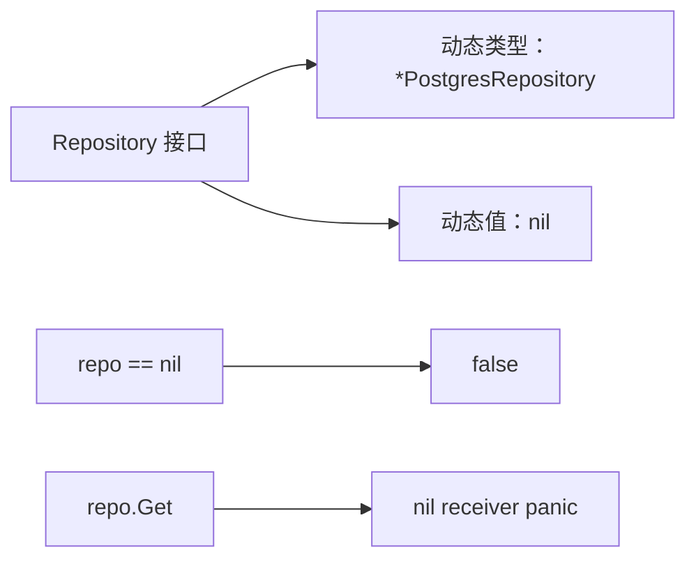
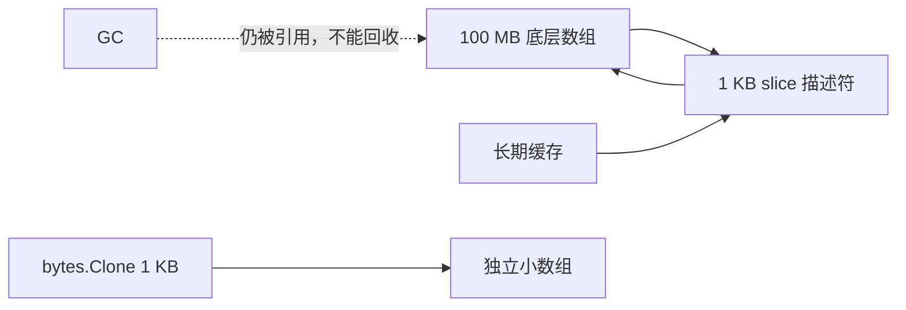
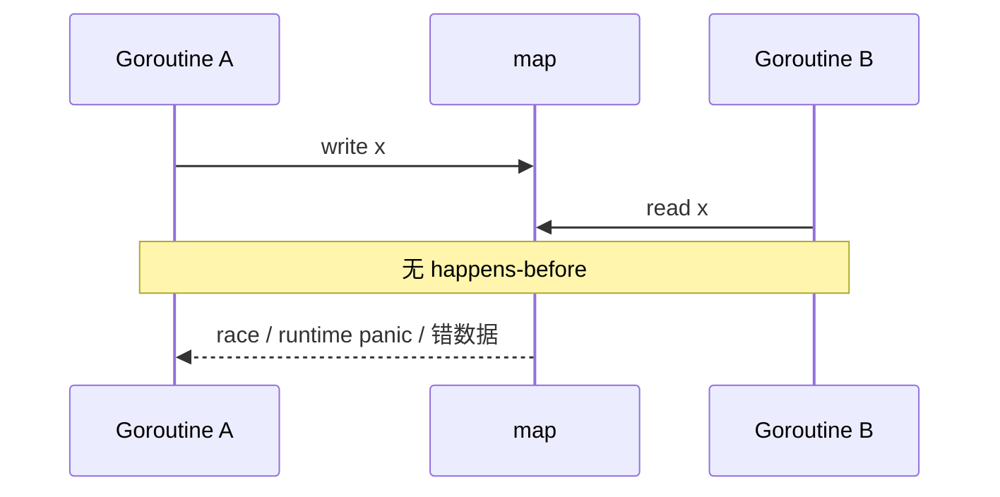
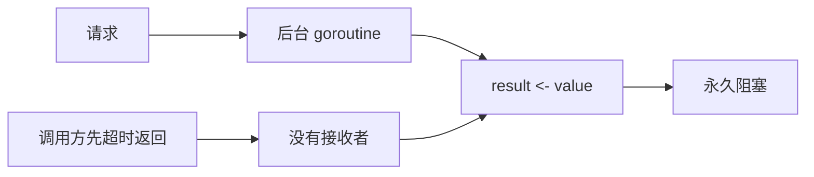
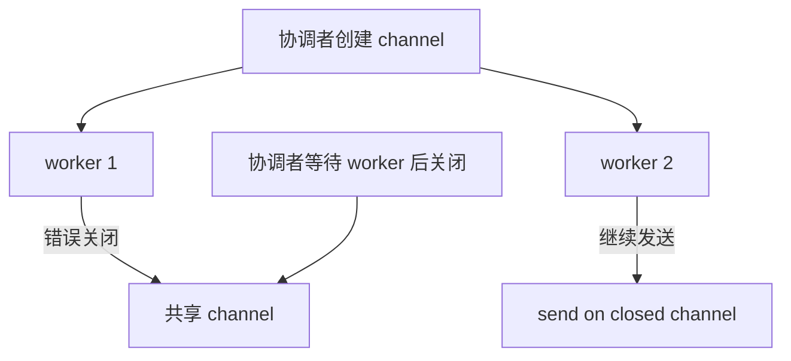
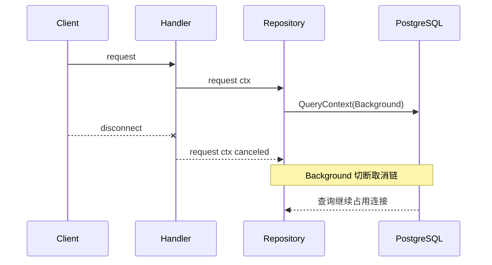
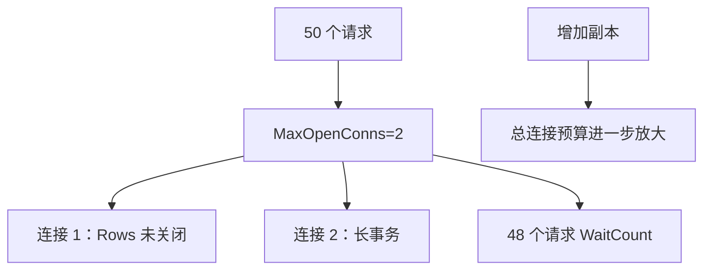
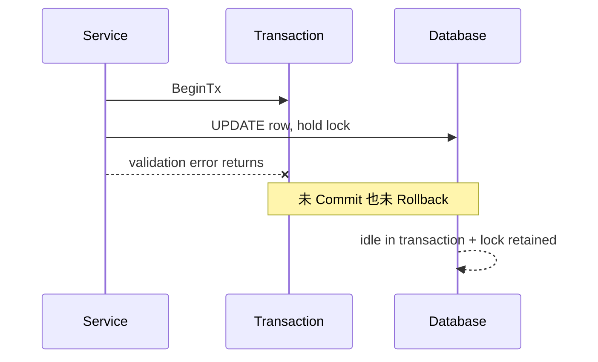
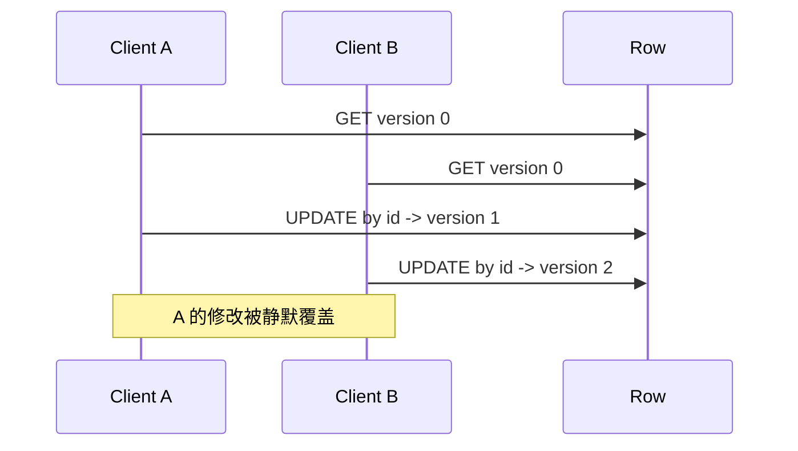
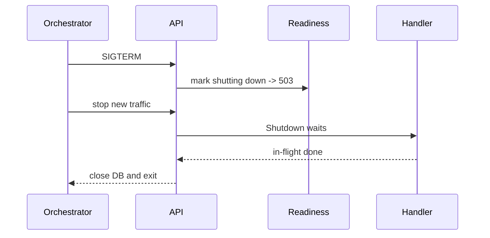

# Go 真实项目问题库

本页不是错误消息词典，而是一套从现象走到证据、根因、修复和回归的工作方法。先用 [Go 常见问题](/go/troubleshooting) 快速分流，再在这里完成可复现闭环。

## 快速定位

| 现象 | 优先问题 | 第一证据 |
| --- | --- | --- |
| 明明 nil 却进入方法后 panic | 1 | 接口动态类型和值 |
| RSS 高、heap 中大字节数组很多 | 2 | heap retained size |
| 偶发错数据或 concurrent map panic | 3 | `go test -race` |
| goroutine 数持续增长 | 4、5、14 | goroutine profile |
| 请求超时后 SQL 仍执行 | 6 | request ID + pg_stat_activity |
| CPU 不高但接口排队 | 7 | `sql.DB.Stats` + wait events |
| 锁长期不释放 | 8 | 事务 age 与阻塞链 |
| 两个编辑互相覆盖 | 9 | version 与并发时序 |
| 发布时连接被重置 | 10 | readiness 与关闭日志 |
| HTTP 客户端连接越来越多 | 11 | transport trace 与 body close |
| 客户端拼错字段仍返回成功 | 12 | 严格 JSON 回归 |
| 本地能构建，CI 下载失败 | 13 | `go env` 与模块图 |
| 定时任务越跑越多 | 14 | timer/ticker 创建栈 |
| 下游抖动后流量放大 | 15 | 重试次数与总 deadline |
| 500 响应泄露内部信息 | 16 | 响应与日志脱敏测试 |

## 证据记录模板

| 项目 | 记录内容 |
| --- | --- |
| 现象 | 时间、接口、错误比例、影响范围 |
| 运行信息 | Go 版本、提交、镜像、配置摘要 |
| 证据 | 指标、日志、profile、trace、SQL、goroutine stack |
| 假设 | 可被证伪的根因判断 |
| 修复 | 最小改动与风险 |
| 回归 | 命令、期望结果、观察窗口 |

## 问题 1：typed nil 依赖穿过接口检查

### 现象

构造时 `repo != nil`，调用 `repo.Get` 却发生 nil pointer panic。

### 最小复现

```go
var concrete *PostgresRepository
var repo Repository = concrete
fmt.Println(repo == nil) // false
```



### 错误方向

到每个调用点加 `if repo == nil`，或 Recover 后继续运行。前者检查不到 typed nil，后者只掩盖构造错误。

### 证据采集

记录 panic 堆栈、具体实现类型 `%T` 和依赖装配路径，不打印对象内部敏感字段。

### 根因

接口只有动态类型和值都为空时才等于 nil；typed nil 仍携带方法表。

### 修复

构造函数集中拒绝 nil/typed nil；实现方法对 nil receiver 返回稳定 `ErrNilRepository`，不 panic。

### 回归测试

为 nil 接口和每种 typed nil 各写一例，运行 `go test -race ./internal/... -count=30`。

### 预防清单

- [ ] 接口定义在使用方且尽量小。
- [ ] 装配测试覆盖 nil 和 typed nil。
- [ ] 不把反射 nil 检查散落到业务方法。

## 问题 2：小 slice 长期持有大数组

### 现象

业务只缓存几 KB 数据，RSS 和 heap 却保留数百 MB，GC 后不下降。

### 最小复现

```go
payload := make([]byte, 100<<20)
header := payload[:1024]
cache.Store(key, header)
```



### 错误方向

调低 GOGC 或手动 `runtime.GC()`；引用仍存在时只会增加 GC 成本。

### 证据采集

对比 heap inuse 与 allocs profile，查看大 `[]byte` 的分配栈和保留路径。

### 根因

slice 指向底层数组，只要小 slice 存活，整个数组都可达。

### 修复

长期保存前使用 `bytes.Clone` 或 `append([]byte(nil), part...)`，并限制缓存容量。

### 回归测试

写基准与 heap profile，对相同输入比较 retained heap；功能测试断言副本修改互不影响。

### 预防清单

- [ ] 明确 slice 所有权与生命周期。
- [ ] 大 buffer 截片跨请求保存前复制。
- [ ] 缓存有条目数和字节上限。

## 问题 3：并发读写 map

### 现象

线上偶发 `concurrent map read and map write`，或没有 panic 但统计值错误。

### 最小复现

```go
m := map[string]int{}
go func() { m["x"]++ }()
go func() { _ = m["x"] }()
```



### 错误方向

因为“写入很少”而忽略，或只捕获 panic。数据竞争本身就使行为不可靠。

### 证据采集

在能触发路径的测试上运行 `go test -race -count=30 -shuffle=on`，保存两个冲突访问栈。

### 根因

普通 map 在存在写操作时不支持未同步并发访问。

### 修复

用 Mutex 保护完整不变量，或让单一 goroutine 拥有 map 并通过 channel 接收命令。

### 回归测试

同时启动多个读写者，等待全部结束，断言结果并让 race detector 运行。

### 预防清单

- [ ] 共享 map 的所有权写在类型注释中。
- [ ] 锁范围覆盖读改写整体。
- [ ] 不用 `sync.Map` 掩盖不清楚的数据模型。

## 问题 4：goroutine 因结果无人接收而泄漏

### 现象

超时请求增多后 goroutine 数单调上涨，堆栈大量停在 `chan send`。

### 最小复现

```go
result := make(chan Data)
go func() { result <- slowCall() }()
return <-time.After(50 * time.Millisecond)
```



### 错误方向

增大 channel 缓冲但不定义取消；只能延后泄漏。

### 证据采集

按时间比较 goroutine profile，聚合阻塞栈；用固定负载停止后观察是否回落。

### 根因

工作 goroutine 的发送没有同时监听请求取消，调用方提前退出后失去接收者。

### 修复

优先同步调用可取消 API；确需 goroutine 时使用容量 1 结果 channel，并在发送和工作中监听 ctx。

### 回归测试

循环触发超时，等待清理窗口后检查工作完成信号；测试不得只比较全进程 goroutine 总数。

### 预防清单

- [ ] 每个 `go` 语句都有退出条件与等待者。
- [ ] 阻塞发送可响应 ctx。
- [ ] 外部调用本身支持取消。

## 问题 5：channel 关闭权不清导致死锁或 panic

### 现象

worker 偶发 `send on closed channel`、`close of closed channel`，或 WaitGroup 永远不结束。

### 最小复现

多个 worker 都在 defer 中关闭共享结果 channel。



### 错误方向

对 `close` 加 Recover 或用 Mutex 保护重复 close；仍没有解决谁能保证不再发送。

### 证据采集

保存 panic 栈或 goroutine 阻塞栈，画出所有发送者和关闭者。

### 根因

关闭权没有归属到能证明“所有发送者已结束”的协调者。

### 修复

发送方协调者拥有关闭；多生产者先 WaitGroup 等待，再由单一 goroutine close。

### 回归测试

高并发重复发送、取消和提前失败路径，运行 race 与 `-count=100`。

### 预防清单

- [ ] 类型或函数注释声明 channel 所有者。
- [ ] 接收者不关闭输入 channel。
- [ ] 不需要结束广播时不强行 close。

## 问题 6：请求取消没有传到数据库

### 现象

客户端已收到 504 或断开，PostgreSQL 中查询仍运行，连接池逐渐排队。

### 最小复现

Repository 使用 `context.Background()` 或非 Context 版本查询。



### 错误方向

只调大 HTTP timeout，或在 Handler 返回后启动清理 goroutine。

### 证据采集

用 request ID 对齐 access log 与 `pg_stat_activity`，观察客户端结束后 query age。

### 根因

某一层换成 Background、保存了旧 ctx，或驱动调用未使用 Context 方法。

### 修复

Handler、Service、Repository 全链路显式传 ctx；后台任务必须有独立所有者和关闭机制。

### 回归测试

用阻塞 fake 或真实锁制造慢查询，取消请求后断言下游收到 `context.Canceled`。

### 预防清单

- [ ] ctx 是每个 I/O 方法第一个参数。
- [ ] Service 不保存请求 ctx。
- [ ] 所有 WithTimeout 都调用 cancel。

## 问题 7：连接池等待被误判为慢 SQL

### 现象

Go CPU 和数据库 CPU 都不高，但请求 P99 接近超时；增加实例后反而更严重。

### 最小复现

把 `MaxOpenConns` 设为 2，同时发起大量会持有 Rows 的请求。



### 错误方向

只给 PostgreSQL 加索引，或盲目把每个实例连接数调到几百。

### 证据采集

记录 `sql.DB.Stats()` 的 WaitCount/WaitDuration/InUse，结合 PostgreSQL 活动连接和等待事件。

### 根因

连接被 Rows、Tx 或专用 Conn 长期占用，或池预算与副本总数不匹配。

### 修复

先关闭泄漏资源、缩短事务，再按数据库总容量和副本数计算池上限。

### 回归测试

固定并发负载比较等待时间和 P99；测试失败路径也要释放 Rows/Tx。

### 预防清单

- [ ] 每个 Rows/Tx/Conn 成对释放。
- [ ] 监控池等待而不只监控数据库连接数。
- [ ] 扩容时重新计算全局连接预算。

## 问题 8：事务提前返回后没有回滚

### 现象

数据库出现长时间 `idle in transaction`，锁住其他请求；连接池连接不归还。

### 最小复现

BeginTx 后某个校验失败直接 return，缺少 `defer tx.Rollback()`。



### 错误方向

让数据库依赖空闲事务超时兜底，却不修资源生命周期。

### 证据采集

查询事务 age、state、wait_event 和阻塞链，关联应用调用栈。

### 根因

事务不是普通局部变量，它占用专用连接和数据库状态，所有退出路径都必须终结。

### 修复

BeginTx 成功后立即 `defer tx.Rollback()`，成功路径显式 Commit；事务内只使用 tx。

### 回归测试

为每个中途错误注入点测试回滚，并断言后续连接可立即执行更新。

### 预防清单

- [ ] BeginTx 后下一行就是 defer Rollback。
- [ ] 事务内不调用慢外部 API。
- [ ] Commit 错误不会被忽略。

## 问题 9：并发更新发生丢失更新

### 现象

两个用户都看到保存成功，最终只保留后一次编辑，先前内容无冲突提示。

### 最小复现

两个请求读取 version 0，然后都执行只按 id 的 UPDATE。



### 错误方向

在 Go 进程内给 ID 加 Mutex；多副本时无法跨进程保护，还降低吞吐。

### 证据采集

保存两个请求的 expectedVersion、更新时间和 SQL affected rows，构造确定性并发测试。

### 根因

写入条件没有包含客户端读取到的版本，数据库无法识别旧快照。

### 修复

`WHERE id=$id AND version=$expected`，成功时原子 `version=version+1`，0 行映射 404 或 409。

### 回归测试

两个 goroutine 同时使用同一版本，断言恰好一个成功、一个 `ErrVersionConflict`。

### 预防清单

- [ ] 更新、状态变更和删除都带 expectedVersion。
- [ ] 客户端 409 后重新读取，不无限重试。
- [ ] 不存在与冲突分类在一致快照中完成。

## 问题 10：发布停止时在途请求被强杀

### 现象

每次部署都有少量 connection reset、502 或数据库半完成操作。

### 最小复现

收到 SIGTERM 后直接 `os.Exit(0)`，readiness 仍为 200。



### 错误方向

只把 termination grace 调很长；应用若不处理信号，仍会在期限末被强杀。

### 证据采集

保存编排事件、readiness 状态、关闭开始/完成日志和在途请求耗时。

### 根因

没有先摘流量、没有调用 Server.Shutdown，或 grace 小于应用关闭预算。

### 修复

信号 context 驱动关闭；readiness 先失败，Shutdown 有超时，超时后 Close，最后关 DB。

### 回归测试

真实启动 server，发起阻塞请求后取消应用，断言 readiness 503、请求在预算内结束、进程退出。

### 预防清单

- [ ] live 与 ready 分离。
- [ ] 关闭日志可观察且无敏感值。
- [ ] 编排 grace 大于应用 shutdown timeout。

## 问题 11：HTTP 响应体未关闭导致连接无法复用

### 现象

调用外部 API 一段时间后出现大量连接、端口耗尽或握手延迟。

### 最小复现

`client.Do` 成功后直接返回，没有 `resp.Body.Close()`；或只在 2xx 路径关闭。

### 错误方向

每次创建新 `http.Client`，会进一步失去 Transport 连接池复用。

### 证据采集

查看 goroutine/网络连接、httptrace 和 Transport 指标，对比失败状态分支。

### 根因

响应体拥有底层连接的读取生命周期，未关闭或未按协议消费会阻止复用。

### 修复

Do 成功后立即 defer Close；需要复用时按大小上限消费 body。全应用复用受控 Client/Transport。

### 回归测试

httptest server 连续返回成功和失败状态，断言 body 全部关闭并观察连接复用。

### 预防清单

- [ ] Do 成功后下一步就是 defer Close。
- [ ] body 读取有上限。
- [ ] Client 有总超时或请求 deadline。

## 问题 12：宽松 JSON 掩盖客户端字段拼写错误

### 现象

客户端发送 `expectedVerison` 拼错字段，服务端忽略后用零值继续处理。

### 最小复现

Decoder 只调用一次 Decode，没有 `DisallowUnknownFields` 和第二值检查。

### 错误方向

把所有字段改成指针并手工判空，却仍接受未知字段和多 JSON 值。

### 证据采集

保存脱敏请求结构、公开错误码和 decoder 单测；不要记录完整敏感 body。

### 根因

默认 `encoding/json` 为兼容性忽略未知字段，且一次 Decode 不检查尾随值。

### 修复

限制 body、校验 Content-Type、DisallowUnknownFields、二次 Decode 确认 EOF，并区分协议错误与领域 422。

### 回归测试

覆盖空 body、语法错、未知字段、类型错、两个值和超大 body，并运行 Fuzz。

### 预防清单

- [ ] 写接口统一走严格 decoder。
- [ ] 未知字段返回稳定 400 code。
- [ ] 未回显敏感原始输入。

## 问题 13：私有模块本地可用但 CI 失败

### 现象

开发机有 Git 凭据可下载，CI 报认证、校验或模块路径错误。

### 最小复现

本地残留 `replace => ../lib`，或 CI 未配置覆盖私有域名的 `GOPRIVATE`。

### 错误方向

把 token 写进 import URL，或全局关闭校验数据库。

### 证据采集

比较本地和 CI 的 `go env GOPROXY GOPRIVATE GONOSUMDB GOVERSION`、go.mod/go.sum 与 Git URL 重写规则，输出前脱敏。

### 根因

依赖解析环境不一致，或发布契约依赖本地路径和本机缓存。

### 修复

移除临时 replace，配置最小范围 GOPRIVATE 与只读凭据，固定工具链并从空缓存验证。

### 回归测试

CI 使用干净缓存执行 `go mod download`、`go mod verify`、`go test ./...`。

### 预防清单

- [ ] go.mod/go.sum 始终提交。
- [ ] 不在日志输出凭据和完整私有 URL。
- [ ] 定期做无缓存构建。

## 问题 14：Timer 或 Ticker 生命周期泄漏

### 现象

定时刷新功能重载后执行次数翻倍，goroutine profile 出现大量等待 ticker channel 的栈。

### 最小复现

每次配置刷新都 `time.NewTicker` 并启动 goroutine，却从不 Stop 或取消旧任务。

### 错误方向

只在进程退出时统一清理；热重载期间泄漏一直存在。

### 证据采集

记录 ticker 创建栈、任务实例 ID、goroutine profile 和每分钟执行次数。

### 根因

后台任务没有显式 owner，重建时旧 context 未取消、Ticker 未 Stop。

### 修复

组件持有 cancel 与 ticker，在 Close 中幂等停止并等待 goroutine 退出；重载先关旧再启新。

### 回归测试

重复 Start/Close 100 次，使用可控短周期断言关闭后不再执行，配合 race。

### 预防清单

- [ ] NewTicker 与 Stop 成对。
- [ ] 后台任务实现幂等 Close。
- [ ] 重载过程有所有权转移测试。

## 问题 15：重试放大下游故障

### 现象

下游开始返回 Unavailable 后，上游 QPS、goroutine 和延迟同时上升，恢复变慢。

### 最小复现

每层都重试 3 次，无退避、无总 deadline，也不区分幂等性。

### 错误方向

继续增加重试次数，认为成功率会提高。

### 证据采集

记录原始请求数、实际尝试数、状态码、退避时间和总 deadline，画出跨层重试乘法。

### 根因

重试策略分散且没有预算，把一次请求放大成多层指数尝试。

### 修复

只在一个明确边界对幂等操作重试，限制次数、指数退避和 jitter，并受原始 context 总预算约束。

### 回归测试

fake 下游按序返回失败/成功，断言尝试次数、退避和 deadline；非幂等写不自动重试。

### 预防清单

- [ ] 文档声明谁负责重试。
- [ ] 指标区分请求与 attempt。
- [ ] 熔断/限流不替代正确超时。

## 问题 16：内部错误或 panic 泄露到客户端

### 现象

500 body 含 SQL、数据库密码、文件路径或 panic 输入，日志也重复记录完整请求。

### 最小复现

`http.Error(w, err.Error(), 500)`，Recover 直接格式化 panic 值。

### 错误方向

完全不记录错误，导致安全但无法排查；正确做法是区分内部证据与公开响应。

### 证据采集

使用人工 secret 触发未知错误和 panic，检查响应、Header、结构化日志与 request ID 关联。

### 根因

错误对象同时承担内部 cause 和公开 message，没有输出边界。

### 修复

公开 envelope 只序列化 code/message/fields；cause 留在日志，panic 只记录类型与堆栈，不记录值。

### 回归测试

断言响应不含 secret、SQL、路径和堆栈，状态为 500 `INTERNAL_ERROR`，request ID 一致。

### 预防清单

- [ ] 所有错误响应经过统一 WriteError。
- [ ] 日志字段有 allowlist，不记录 body/token。
- [ ] 安全回归覆盖 panic 与数据库错误。

## 继续学习

- 用 [Go 专项练习](/roadmap/go-practice) 在可控环境复现以上问题。
- 回到 [性能分析与线上诊断](/go/performance) 学 profile 证据链。
- 用 [测试、Benchmark 与 Fuzzing](/go/testing) 把最小复现变成回归测试。
- 查看 [后端项目问题库](/projects/issues-backend) 对比 Java、Node 和通用数据库问题。
