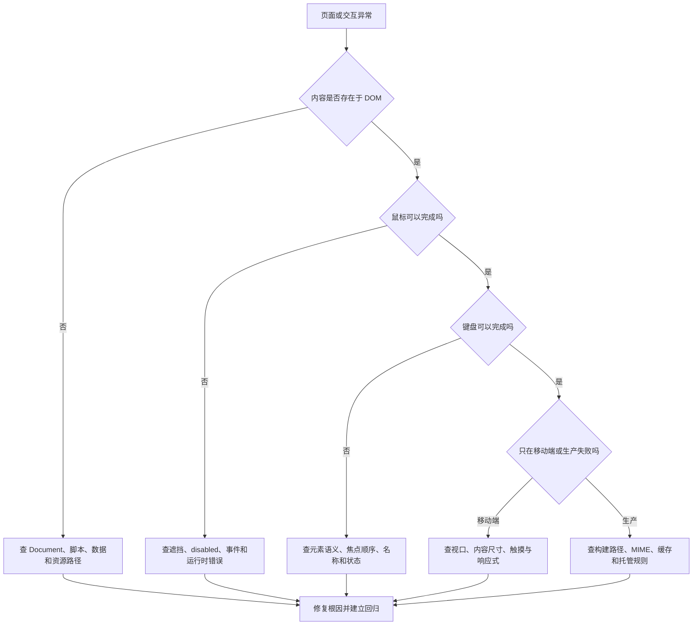
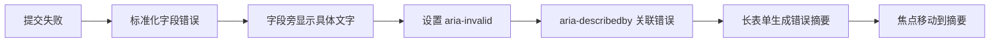
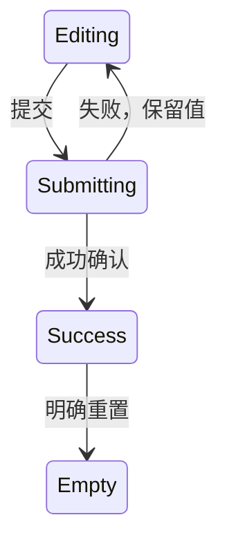
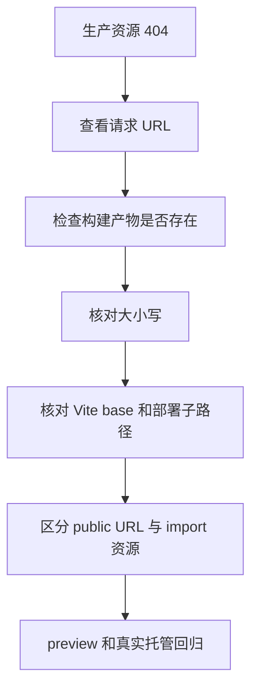
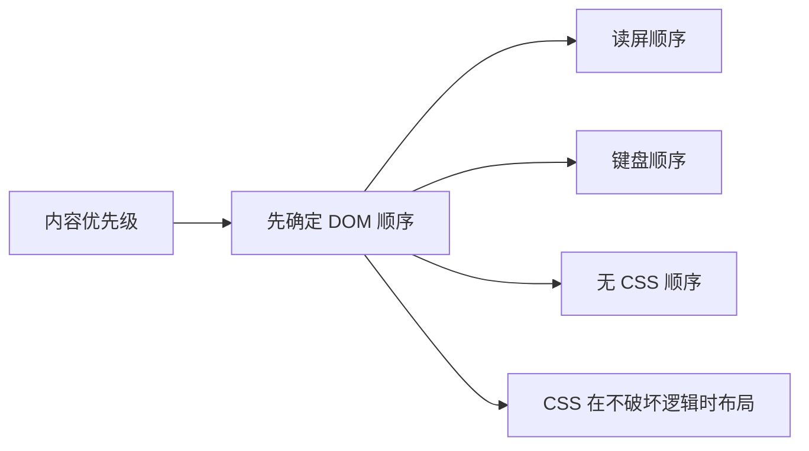

# HTML 与无障碍真实项目问题库

## 这个页面解决什么

这页整理 HTML 结构、表单、图片和键盘交互在真实项目中最常见的问题。它不按标签背诵，而是按现象排查：

- 控件鼠标能点，键盘不能操作。
- 输入框看得懂，提交后却不知道哪里错。
- 点击普通按钮意外提交整个表单。
- 图片加载后页面明显跳动或移动端流量异常。
- 开发环境资源正常，生产构建后图片或脚本 404。
- 弹窗关闭后焦点消失。
- 页面视觉顺序正常，Tab 顺序却来回跳。
- JavaScript 加载失败后页面空白。
- 站内跳转正常，直接刷新详情页 404。
- 读屏软件读不出按钮名称或页面结构。

## 统一排查总图



### 每次先收集的证据

| 证据 | 重点 |
| --- | --- |
| 复现路径 | URL、视口、缩放、输入方式、操作步骤 |
| Elements | 最终元素类型、属性、DOM 顺序 |
| Accessibility | role、name、state、description |
| Computed | 可见性、尺寸、定位、层级 |
| Network | Document、CSS、JS、图片和 API 状态码 |
| Console | 第一条错误和关联文件 |
| 键盘记录 | 焦点从哪里到哪里、在哪一步中断 |
| 失败环境 | 无 JS、图片失败、弱网、200% 缩放 |

## 问题 1：鼠标能点击，Tab 找不到控件

### 问题现象

- 卡片、图标或文字区域可以鼠标点击。
- 按 Tab 时焦点直接跳过。
- Enter 和 Space 没反应。
- 自动化测试只能用 class 或文本定位，找不到 button/link role。

### 根因

使用了 `div`、`span` 或图片绑定 click，但没有原生交互语义：

```html
<div class="action" onclick="save()">保存</div>
```

### 解决方案

根据行为换成原生元素：

```html
<button type="button" class="action">保存</button>
<a href="/courses/html" class="course-link">查看课程</a>
```

不要把 `role="button" tabindex="0"` 当作默认方案。那仍需要自己实现 Space/Enter、disabled、焦点和状态；原生按钮已经提供这些能力。

### 回归验证

```text
[ ] Tab 能聚焦
[ ] 焦点清楚可见
[ ] Enter 和 Space 能激活按钮
[ ] disabled 时不可激活且状态可感知
[ ] 辅助技术读出正确角色和名称
```

### 预防

代码评审先问“这是导航还是动作”，再看样式。测试优先用 role 和可访问名称定位。

## 问题 2：输入框只有 placeholder，没有 label

### 问题现象

- 空输入框时看起来有说明。
- 输入后字段名称消失。
- 浏览器自动填充后很难判断值属于哪个字段。
- 读屏名称不稳定，语音输入难以定位。

### 根因

把占位符当成字段标签：

```html
<input name="email" placeholder="请输入邮箱" />
```

### 解决方案

```html
<label for="email">邮箱</label>
<p id="email-hint">用于接收报名确认。</p>
<input
  id="email"
  name="email"
  type="email"
  autocomplete="email"
  aria-describedby="email-hint"
/>
```

placeholder 可用于格式示例，但不能替代持续可见的 label。

### 预防

- 表单 schema 明确 label、name、type、autocomplete、hint 和 error。
- UI 设计稿必须保留字段名称，不只画占位符。
- 在自动填充和输入完成状态下截图验收。

## 问题 3：点击“打开帮助”却提交了表单

### 问题现象

- 表单里点击非提交按钮也触发提交。
- 页面刷新、出现校验提示或请求 API。
- 按钮移到表单外后问题消失。

### 根因

表单内按钮省略 `type`：

```html
<button>打开帮助</button>
```

它可能按提交按钮处理。

### 解决方案

```html
<button type="button">打开帮助</button>
<button type="submit">确认报名</button>
```

不要只在 click 事件里 `preventDefault()` 遮盖错误语义。

### 预防

项目规范要求所有 `button` 显式声明 `type`，lint 或组件封装也可把默认值设为 `button`。

## 问题 4：表单显示红框，但用户不知道怎样修

### 问题现象

- 提交后多个字段变红。
- 页面没有错误文字，或只弹出“参数错误”。
- 色觉差异用户难以识别。
- 长表单顶部看不到下方错误。

### 根因

- 只用颜色表达状态。
- 后端只返回统一错误字符串。
- 字段错误没有与输入框关联。
- 提交失败后焦点仍停在提交按钮。

### 解决链路



```html
<label for="email">邮箱</label>
<input id="email" aria-invalid="true" aria-describedby="email-error" />
<p id="email-error">邮箱格式不正确，请输入例如 name@example.com。</p>
```

### 预防

前后端约定字段错误结构；验收同时覆盖空值、格式错误、业务冲突和服务失败。

## 问题 5：快速点击产生两条报名记录

### 问题现象

- Network 出现两个相同 POST。
- 用户收到两封确认邮件。
- 订单或报名记录重复。

### 根因

- 提交中按钮仍可点击。
- Enter 和 click 同时触发不同逻辑。
- 前端只防重复点击，服务端没有幂等或唯一约束。

### 解决方案

前端在同一个 submit 流程里控制状态：

```js
let isSubmitting = false

form.addEventListener('submit', async (event) => {
  event.preventDefault()
  if (isSubmitting) return

  isSubmitting = true
  submitButton.disabled = true

  try {
    await submitEnrollment(new FormData(form))
  } finally {
    isSubmitting = false
    submitButton.disabled = false
  }
})
```

服务端仍要使用业务唯一约束或幂等键，不能相信前端锁。

### 预防

测试鼠标双击、连续 Enter、网络重试和客户端超时后的再次提交。

## 问题 6：提交失败后用户输入全部消失

### 问题现象

- 点击提交后表单立即清空。
- API 500 或网络失败后只能重新填写。
- 页面跳转回来后没有恢复草稿。

### 根因

在请求开始前执行 `form.reset()`，或提交按钮本身触发了浏览器默认导航但脚本异常。

### 解决方案



- 成功响应确认后再清空。
- 失败时保留字段，只更新错误和状态区。
- 长表单可按隐私要求保存草稿，但不要把密码、令牌或敏感身份信息写入 localStorage。

### 预防

把“失败后输入仍在”列为表单验收标准。

## 问题 7：图片加载后页面整体向下跳

### 问题现象

- 文字先出现，图片加载后卡片突然变高。
- 用户准备点击按钮时按钮被推走。
- 性能工具显示布局偏移。

### 根因

`img` 没有宽高，浏览器在资源到达前不知道需要保留多少空间。

### 解决方案

```html

```

```css
.course-image {
  width: 100%;
  height: auto;
  aspect-ratio: 16 / 9;
  object-fit: cover;
}
```

HTML 宽高应反映资源真实宽高比。CSS 可以改变展示尺寸，但要保留稳定比例。

### 预防

内容模型把 `src`、`width`、`height`、`alt` 作为图片必填字段；上传流程自动提取尺寸。

## 问题 8：手机卡片只有 300px，却下载 4MB 原图

### 问题现象

- 桌面 Wi-Fi 感觉正常，移动网络首屏很慢。
- Network 显示所有卡片都下载超大图片。
- 图片显示尺寸远小于资源自然尺寸。

### 根因

- 只提供一张大图。
- `srcset` 有候选，但 `sizes` 与实际布局不符。
- 所有非首屏图片都立即加载。

### 解决方案

```html

```

首屏主图不要机械懒加载。用 Network 检查浏览器实际选中了哪个候选，而不是只看代码。

### 预防

- 设计和内容流程约定图片变体。
- 组件文档说明容器宽度与 `sizes`。
- 发布检查记录首屏图片总传输量。

## 问题 9：开发环境图片正常，生产构建后 404

### 问题现象

- `npm run dev` 正常。
- `npm run preview` 或部署后图片、字体、脚本 404。
- 子路径部署比根域部署更容易复现。

### 根因

| 根因 | 典型证据 |
| --- | --- |
| 写了本机绝对文件路径 | HTML 中出现 `/Users/...` |
| public 与模块资源路径混用 | 构建产物没有对应文件 |
| 文件大小写不一致 | macOS 正常，Linux 404 |
| base 路径不正确 | 请求发往域名根目录 |
| CSS 相对路径层级错误 | CSS 文件成功，背景图失败 |

### 排查链路



### 解决方案

- `public/logo.svg` 使用 `/logo.svg`，并确认 base 策略。
- 需要构建哈希处理的资源通过模块 `import` 或 `new URL(..., import.meta.url)` 引用。
- 文件名和 import 大小写完全一致。
- 在生产预览验证，不只依赖开发服务器。

### 预防

CI 在 Linux 运行构建；发布前检查 Network 中所有 4xx 资源。

## 问题 10：弹窗关闭后按 Tab，焦点不知道去了哪里

### 问题现象

- 打开弹窗后焦点仍留在背景。
- 关闭后页面没有可见焦点。
- Tab 能进入被遮挡的背景控件。
- 屏幕阅读器不知道弹窗标题。

### 根因

只切换 `display` 或 class，没有管理焦点和模态边界。

### 解决方案

```js
let dialogTrigger = null

function openDialog(trigger) {
  dialogTrigger = trigger
  dialog.showModal()
  dialog.querySelector('input, button')?.focus()
}

dialog.addEventListener('close', () => {
  dialogTrigger?.focus()
  dialogTrigger = null
})
```

使用原生 `dialog` 仍需提供可访问名称，验证 Escape、取消、提交、背景滚动和移动端行为。

### 预防

每个弹窗组件都定义：触发元素、初始焦点、焦点约束、关闭方式和焦点归还。

## 问题 11：视觉顺序正确，Tab 顺序却左右跳

### 问题现象

- CSS Grid 把主操作放到视觉第一位，Tab 却最后到达。
- 移动端视觉重排后，读屏仍按桌面 DOM 顺序朗读。
- 团队开始用大量正数 `tabindex` 修补。

### 根因

CSS `order`、Grid 定位或绝对定位只改变视觉位置，没有改变 DOM 阅读和焦点顺序。

### 解决方案



优先调整 HTML 结构；只在不影响理解时使用视觉重排。不要用正数 `tabindex` 建立第二套焦点顺序。

### 预防

响应式设计评审同时展示 DOM 顺序、桌面视觉顺序和移动端视觉顺序。

## 问题 12：JavaScript 失败后整个页面空白

### 问题现象

- HTML 响应只有 `<div id="app"></div>`。
- 脚本 404、语法错误或旧浏览器不支持时页面没有内容。
- 用户看不到导航、说明或错误恢复入口。

### 根因

所有内容都依赖客户端脚本创建，没有服务端渲染、构建生成、静态回退或错误边界。

### 解决方案

根据产品选择：

- 内容页优先静态生成或服务端渲染。
- 无框架项目把核心内容直接写入 HTML。
- SPA 至少提供可理解的 `<noscript>`、加载失败提示和静态帮助链接。
- 对脚本资源错误进行监控，并保留部署回滚能力。

```html
<main id="app">
  <h1>课程目录</h1>
  <p>页面增强功能正在加载；你仍可以查看<a href="/courses.html">全部课程</a>。</p>
</main>
<noscript>
  <p>当前浏览器未启用 JavaScript，筛选功能不可用，但课程内容仍可访问。</p>
</noscript>
```

### 预防

上线前阻止主脚本请求，确认用户看到的不是空白屏幕。

## 问题 13：站内点详情正常，刷新详情页却 404

### 问题现象

- 从首页点击 `/courses/html` 正常。
- 复制 URL、刷新或新标签打开返回托管平台 404。
- 本地开发服务器不复现。

### 根因

客户端路由接管了站内跳转，但静态服务器没有对应文件，也没有配置 SPA fallback 或框架路由产物。

### 解决方案

按项目类型选择：

| 项目 | 方案 |
| --- | --- |
| 多页静态站 | 为每个 URL 生成真实 HTML 文件 |
| SPA | 托管配置 fallback 到 `index.html`，并排除静态/API 路径 |
| SSR/元框架 | 使用平台适配器和服务端路由 |
| 静态导出元框架 | 只发布实际生成的路由并检查限制 |

验证必须从地址栏直接访问每个关键 URL，不只做站内点击。

### 预防

CI 或发布检查对关键深层 URL 执行 HTTP 请求和浏览器刷新。

## 问题 14：图标按钮被读成“button”，没有动作名称

### 问题现象

- 视觉上是搜索、关闭、删除图标。
- Accessibility 面板中 role 是 button，但 name 为空。
- 多个按钮都被读成“按钮”。

### 根因

按钮只有 SVG，SVG 没有形成稳定可访问名称，或被 `aria-hidden` 后没有其他文本。

### 解决方案

```html
<button type="button" aria-label="删除课程 HTML 基础">
  <svg aria-hidden="true"><!-- trash icon --></svg>
</button>
```

如果旁边有可见文字：

```html
<button type="button">
  <svg aria-hidden="true"><!-- filter icon --></svg>
  <span>筛选课程</span>
</button>
```

动态列表的名称要包含对象，例如“删除课程 HTML 基础”，而不是所有按钮都叫“删除”。

### 预防

组件 API 要求图标按钮必须传入可访问名称；测试 `getByRole('button', { name: ... })`。

## 问题 15：页面看起来有标题，辅助技术却没有标题结构

### 问题现象

- 标题通过大字号 `div` 实现。
- 标题导航列表为空或层级混乱。
- 页面有多个相同 `h1`，或者从 `h1` 直接跳到 `h5`。

### 根因

把视觉字号等同于标题语义，或者组件默认标题级别不受页面上下文控制。

### 解决方案

- 每页先建立一个清楚主题和 `h1`。
- 区域使用与内容层级相符的 `h2`、`h3`。
- 样式使用 class，不通过更换标题级别控制大小。
- 可复用卡片组件允许页面决定标题元素，但不要任意传入不安全标签。

### 预防

使用浏览器 Accessibility 面板或标题检查工具查看完整大纲，关闭 CSS 后再读一遍页面。

## 发布前故障注入矩阵

| 故障 | 注入方式 | 必须观察 |
| --- | --- | --- |
| 主脚本失败 | DevTools Block request | 核心内容、链接和说明 |
| 图片失败 | 阻止图片域名 | alt、布局稳定、错误图标 |
| 慢 API | 网络节流 | 提交状态、防重复、焦点 |
| 422 | Mock 字段错误 | 字段关联、摘要、修正路径 |
| 500 | Mock 服务错误 | 保留输入、重试、问题编号 |
| 长内容 | 替换长英文和多行标题 | 换行、溢出、按钮尺寸 |
| 键盘 | 不使用鼠标 | 全链路、焦点、弹窗 |
| 缩放 | 200% | 遮挡、顺序、操作保留 |
| 深层 URL | 地址栏直接打开 | 200 响应和正确页面 |
| 生产构建 | preview 环境 | 资源路径、MIME、Console |

## 问题记录模板

```md
# 问题标题

## 现象

## 用户影响

## 复现环境
- URL：
- 视口与缩放：
- 输入方式：鼠标 / 键盘 / 触摸 / 辅助技术
- 开发或生产：

## 证据
- DOM：
- Accessibility：
- Network：
- Console：

## 根因

## 修复

## 回归

## 预防
```

## 下一步学习

先完成 [前端基础从零到项目](/frontend/project-from-zero)，再用 [前端基础专项练习](/roadmap/frontend-foundation-practice) 主动制造本页问题。样式异常继续进入 [CSS 真实项目问题库](/projects/issues-css)，请求和浏览器问题进入 [浏览器与网络从零到项目](/browser/project-from-zero)。
