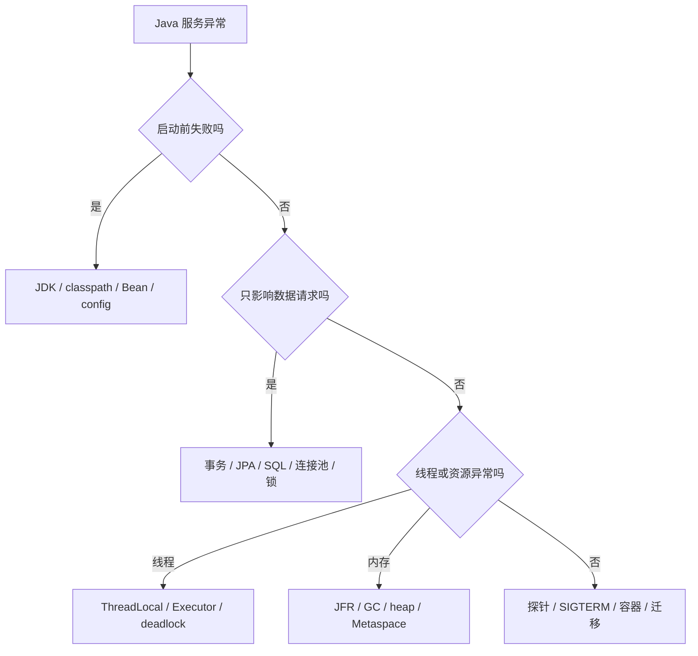
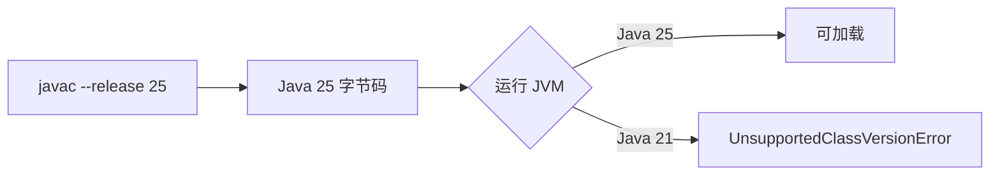
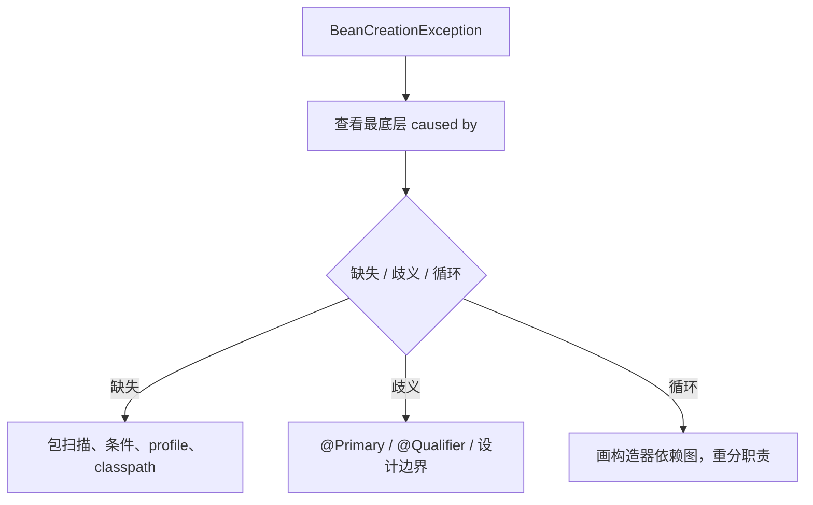
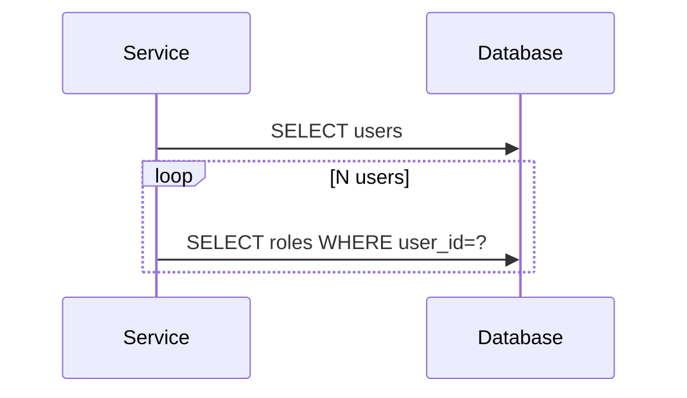
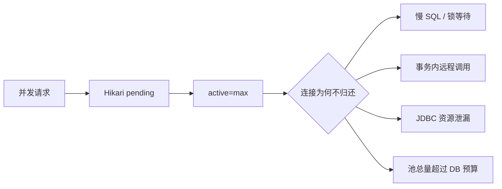
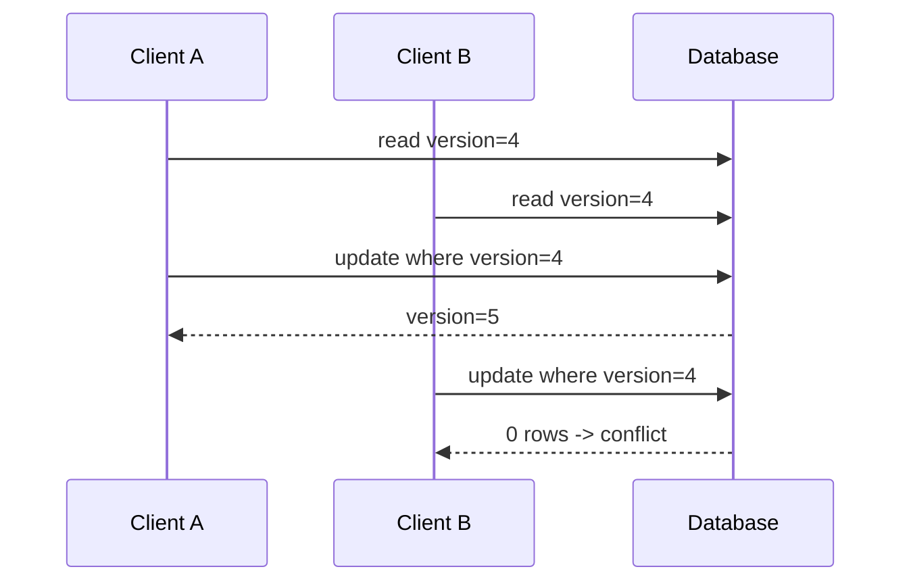
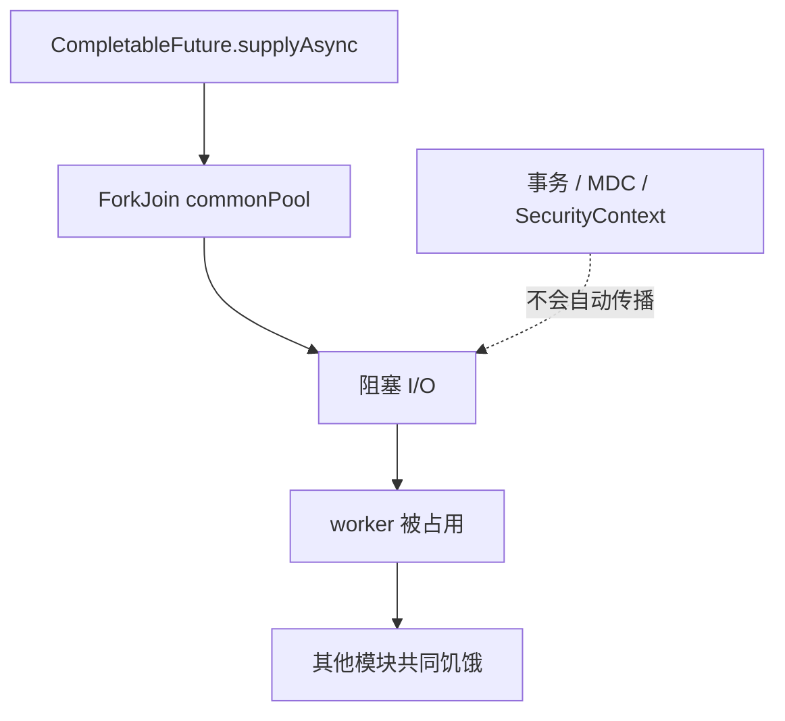
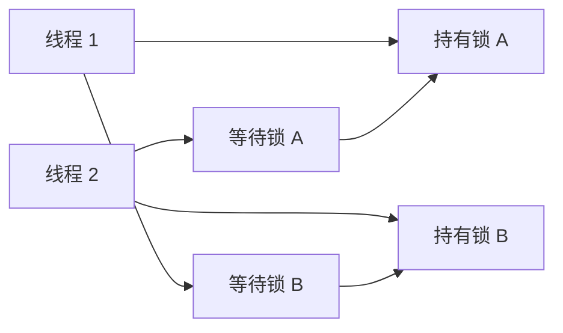
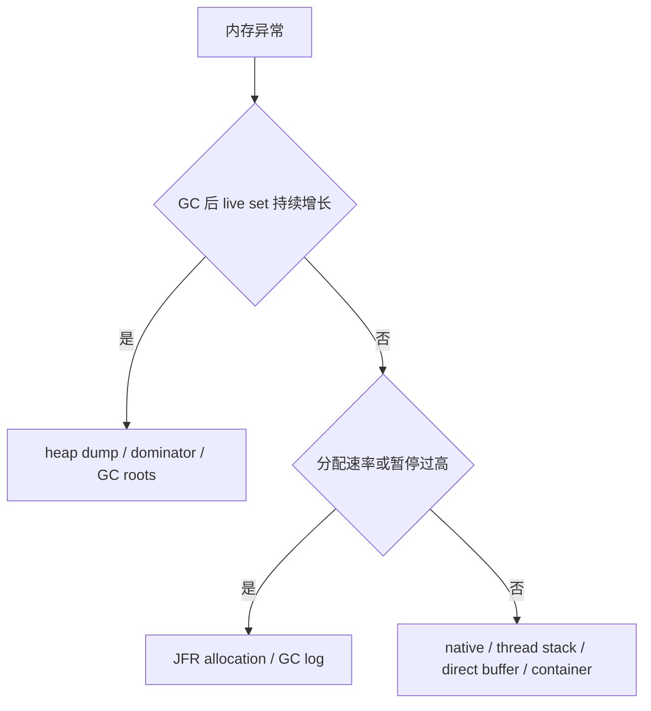
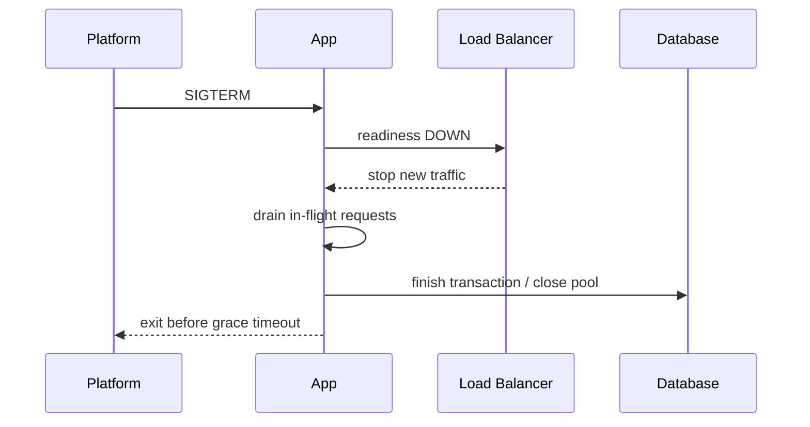

# Java 真实项目问题库

## 适合谁看

适合已经能写 Spring Boot API，但遇到 classpath、Bean、事务代理、JPA、连接池、线程、GC 或容器发布问题时仍主要靠重启和猜测的人。

本页只收录 **Java/JVM/Spring 特有问题**。接口字段、幂等、401/403、超时和通用服务治理查看 [后端接口与服务问题](/projects/issues-backend)；索引、SQL、数据库锁和备份查看 [数据库问题](/projects/issues-database)；基础命令错误先看 [Java 常见问题](/java/troubleshooting)。

## 按现象快速定位

| 现象 | 优先证据 | 对应问题 |
| --- | --- | --- |
| 本地能跑，服务器提示 class version | 编译目标与运行 JDK | 1 |
| 启动时报方法或类不存在 | Maven 依赖树、最终 jar | 2 |
| ApplicationContext 启动失败 | 最底层异常、Bean 图、条件报告 | 3 |
| 加了事务却没有生效 | 调用是否经过代理 | 4 |
| 抛异常后数据仍提交 | 异常类型、catch、事务传播 | 5 |
| 序列化时报 session closed | 事务边界、懒关联、OSIV | 6 |
| 列表数据越多 SQL 越多 | SQL 数量、fetch 计划 | 7 |
| 请求卡在获取连接 | Hikari active/pending、长事务 | 8 |
| 两人修改后数据被覆盖 | version、更新 SQL、锁策略 | 9 |
| request id 串到其他请求 | ThreadLocal/MDC 生命周期 | 10 |
| CompletableFuture 越跑越慢 | executor、阻塞、队列 | 11 |
| CPU 不高但所有线程卡住 | thread dump、锁拥有者 | 12 |
| 延迟抖动、频繁 GC 或 OOM | JFR、GC、heap/native memory | 13 |
| 热部署多次后 Metaspace OOM | ClassLoader、静态引用、线程 | 14 |
| 本地配置正确，容器连错库 | Environment 最终来源 | 15 |
| 发布时 503、丢请求或 OOMKilled | 探针、SIGTERM、内存、迁移 | 16 |

## 统一排查总图



## 证据记录模板

```text
Java / Spring Boot / Maven / OS / 镜像版本：
实例、pod、线程和 request id：
故障开始时间与最近发布：
第一条具体异常（包含 caused by）：
JVM 参数与容器 CPU/内存限制：
Hikari active/idle/pending/acquire time：
SQL 数量、事务时长和锁等待：
thread dump / JFR / GC / heap 证据：
配置键的最终来源：
根因：
修复与取舍：
同条件回归：
预防规则：
```

不要只记录最外层 `BeanCreationException`、平均 CPU 或“重启恢复”。第一条异常证据通常在异常链底部、时间线最早位置或指标开始偏离的瞬间。

## 问题 1：UnsupportedClassVersionError 或编译运行版本不一致

### 现象

- 本地编译成功，服务器启动时报 `UnsupportedClassVersionError`。
- CI 测试使用 Java 25，Docker runtime 却是 Java 21。
- 代码能编译，但旧环境调用新 JDK API 失败。

### 证据

```bash
java -version
mvn -version
javap -verbose target/classes/com/example/App.class | rg 'major version'
docker run --rm your-image java -version
```



### 根因与修复

字节码版本高于运行 JVM 能识别的版本。统一 Maven `java.version`、CI、build stage 和 runtime stage；需要兼容旧版本时使用 `--release`，并在目标 JDK 实际运行测试。

### 回归

- 从干净目录 package。
- 在最终运行镜像执行 `java -version` 和启动 smoke test。
- CI 检查 build/runtime 镜像主版本一致。

## 问题 2：NoSuchMethodError、NoClassDefFoundError 与依赖收敛失败

### 现象

- 编译通过，启动或某条请求第一次调用时才报 `NoSuchMethodError`。
- 升级一个 starter 后出现 `NoClassDefFoundError`。
- IDE 正常，打包 jar 或容器失败。

### 证据

```bash
mvn dependency:tree -Dverbose
mvn dependency:tree -Dincludes=group:artifact
jar tf target/*.jar | rg 'BOOT-INF/lib|TargetClass'
java -Xlog:class+load=info -jar target/app.jar
```

记录报错类实际从哪个 jar 加载。不要只看 pom 中直接声明的版本，冲突通常来自传递依赖、手工覆盖 BOM 或重复打包。

### 修复

- 优先使用 Spring Boot dependency management，不随意覆盖核心框架版本。
- 找到不兼容依赖的最短路径，再 exclude 或统一升级。
- 删除本地缓存只用于排除损坏下载，不是长期方案。
- 为最终 fat jar 做启动和关键路径 smoke test。

### 预防

CI 保存依赖树；重大升级运行 Maven Enforcer 的 convergence/upper bound 规则，并检查 release notes。

## 问题 3：Bean 缺失、歧义或循环依赖导致启动失败

### 现象

- `NoSuchBeanDefinitionException`。
- 同一接口有两个实现，构造器无法决定注入哪个。
- A 依赖 B、B 依赖 A，ApplicationContext 无法创建。

### 证据路径



启用 `--debug` 查看 condition evaluation report；核对入口类包位置、`@Profile`、`@ConditionalOn...` 和配置属性。

### 修复

- 缺失 Bean：修正扫描边界或显式配置，不要移动入口类后盲目扩大扫描到整个公司包。
- 多实现：在端口处明确业务选择，使用有语义的 qualifier。
- 循环依赖：提取共同服务、反转依赖或用事件解耦。

不推荐打开允许循环依赖或改成 field injection 隐藏结构问题。

### 回归

用 `@SpringBootTest` 做 context load，并分别覆盖关键 profile。

## 问题 4：@Transactional 同类内部调用不生效

### 现象

外层方法调用 `this.inner()`，inner 标注 `REQUIRES_NEW` 或 `readOnly`，实际仍在原事务中或没有事务。


### 证据

- 记录 `TransactionSynchronizationManager.isActualTransactionActive()`。
- 打开 Spring transaction debug 日志。
- 检查调用方是否持有代理，方法是否 public，以及是否在同一个对象内部调用。

### 修复

把独立事务用例移动到另一个 Bean，由外部经过代理调用。不要默认使用 self-injection 或从 ApplicationContext 取自己，它会把架构问题变成隐式依赖。

### 回归

集成测试同时断言数据库提交/回滚结果和事务传播行为，不只断言方法被调用。

## 问题 5：异常发生后事务仍提交，或意外全部回滚

### 现象

- 抛出 checked exception 后数据仍提交。
- Service catch 异常后返回 false，事务没有回滚。
- 内层事务标记 rollback-only，外层最后收到 `UnexpectedRollbackException`。

### 必采证据

- 异常实际类型和完整 cause。
- catch 发生在哪一层，是否吞掉异常。
- `@Transactional` 的 propagation、rollbackFor、noRollbackFor。
- 外部调用是否经过代理。

### 根因

Spring 默认对 RuntimeException 和 Error 回滚；checked exception 需要明确规则。异常被 catch 且不重新抛出时，事务拦截器可能认为方法正常完成。

### 修复

- 让业务异常继承 RuntimeException，或明确 `rollbackFor`。
- catch 只在能恢复、补偿或增加语义时使用。
- 不在一个本地事务里“忽略失败继续提交半成品”。
- 外部调用失败要考虑本地事务与远程副作用不能原子提交。

### 回归

为成功、业务异常、checked exception、内部异常被转换四条路径分别断言数据库最终状态。

## 问题 6：LazyInitializationException 与 Open Session in View

### 现象

- Service 返回 Entity 后，Controller 序列化角色时报 session closed。
- 开启 OSIV 后不再报错，但列表请求出现大量隐式 SQL。
- 日志显示 SQL 发生在 Controller 或 JSON 序列化阶段。

### 根因

懒关联在持久化上下文关闭后才被访问。OSIV 延长 EntityManager 生命周期虽然掩盖异常，却把查询计划推到协议层，连接占用和 N+1 更难控制。

### 修复

- 设置 `spring.jpa.open-in-view=false`。
- 在 Service 事务内组装 View/DTO。
- 详情使用 EntityGraph 或 fetch join。
- 列表使用 projection、批量查询或专门读模型。

### 回归

断言 Controller 返回 View 而不是 Entity，并统计关键接口 SQL 数量。

## 问题 7：JPA N+1 导致列表越长越慢

### 现象

查 20 个用户执行 21 条 SQL，查 100 个执行 101 条。数据库 CPU 和网络往返上涨，单条 SQL 看起来都不慢。



### 证据

- 开启 Hibernate SQL/统计或使用 datasource proxy。
- 固定页大小，记录 SQL 条数和总耗时。
- 检查是 to-one 还是 to-many，是否与分页组合。

### 修复

- 详情：EntityGraph/fetch join。
- 分页集合：主表分页 + 本页 id 批量查关联。
- 只需要少量字段：projection。
- 全局 batch fetch 只能作为补充，不替代查询设计。

### 回归

准备 1、20、100 条数据，断言 SQL 数量不会线性增长。不要只比较本机耗时。

## 问题 8：Hikari 连接池耗尽

### 现象

- 请求卡住后报 connection timeout。
- 数据库连接数达到上限。
- HTTP 线程或虚拟线程很多，但只有少数请求能进数据库。



### 证据

同时采集 active、idle、pending、acquire time、事务时长、慢 SQL、锁等待和实例数。线程转储中大量线程停在 `getConnection` 只是结果，不是根因。

### 修复

- 缩短事务，远程调用移出数据库事务。
- 修复慢 SQL 和锁等待。
- 原生 JDBC 使用 try-with-resources。
- 按数据库总连接预算分配每实例池大小。
- 设置有限 connection timeout，并对失败做可观测错误。

### 回归

同一负载下 pending 可恢复、连接归还稳定；停止下游或制造锁等待时请求不会无限堆积。

## 问题 9：丢失更新与锁策略错误

### 现象

两个管理员同时修改用户，后提交者静默覆盖先提交者。或者为了防覆盖给所有查询加悲观锁，导致吞吐下降和死锁。



### 修复

- 后台编辑优先 `@Version` 乐观锁。
- API 显式接收 expectedVersion，冲突返回 409。
- 客户端刷新并让用户合并，不自动覆盖。
- 高冲突且必须串行的短事务才考虑悲观锁。

### 回归

并发测试让两个事务从同一版本更新，断言恰好一个成功、一个冲突。

## 问题 10：ThreadLocal、MDC 在池线程或虚拟线程中泄漏

### 现象

- request id 偶尔属于上一条请求。
- 异步任务里用户上下文丢失。
- 在线程池任务中残留前一个租户或安全信息。

### 根因

ThreadLocal 与线程绑定，而池线程会复用。虚拟线程通常每任务新建，但 carrier、第三方池和上下文捕获仍有边界；把可变业务对象放进 ThreadLocal 会扩大风险。

### 修复

```java
MDC.put("requestId", requestId);
try {
    chain.doFilter(request, response);
} finally {
    MDC.remove("requestId");
}
```

- 所有 set 必须在 finally 中 remove。
- 异步边界显式传播最小上下文。
- 不在 ThreadLocal 保存 Entity、连接或大对象。
- Java 25 项目可评估 Scoped Values，但要确认框架支持和生命周期。

### 回归

并发发送带不同 ID 的请求，收集所有日志，断言没有串线；在线程池复用同一线程执行两个任务验证清理。

## 问题 11：CompletableFuture 使用 commonPool 造成阻塞与饥饿

### 现象

- `supplyAsync` 任务越来越慢。
- 阻塞数据库/HTTP 调用占满 commonPool，其他无关异步任务也排队。
- 在事务方法中开启异步任务后，事务上下文和 Entity 失效。



### 修复

- 为业务工作负载提供显式、可监控、有界 Executor。
- 阻塞 I/O 可用虚拟线程 executor，但仍限制下游并发。
- 为任务定义超时、取消和异常汇聚。
- 事务内先生成不可变任务输入，提交后再异步处理。

### 回归

在下游延迟和失败条件下检查队列、活动任务、取消和进程关闭；不要只测试成功结果。

## 问题 12：死锁或锁竞争让线程全部卡住

### 现象

CPU 不高，但请求没有进展；线程转储显示多个线程 BLOCKED，或数据库和 JVM 锁相互放大。



### 证据

```bash
jcmd PID Thread.print -l > thread-1.txt
sleep 10
jcmd PID Thread.print -l > thread-2.txt
jcmd PID JFR.start name=incident duration=60s filename=incident.jfr
```

至少取两份线程转储，区分瞬时等待和持续无进展。记录锁对象、拥有者、等待者和调用栈。

### 修复

- 统一锁获取顺序。
- 缩小 synchronized/Lock 临界区。
- 不持 JVM 锁做网络或数据库调用。
- 使用并发集合、不可变数据或消息串行化减少共享状态。

### 回归

并发测试重复运行并设置总超时；JFR 中锁等待下降，线程能够持续完成任务。

## 问题 13：堆泄漏、GC 压力与只看平均内存

### 现象

- 延迟周期性尖峰，GC 后堆仍持续抬升。
- `OutOfMemoryError: Java heap space`。
- heap 看似稳定，但 RSS 很高，最终容器被 OOMKilled。



### 证据

```bash
jcmd PID GC.heap_info
jcmd PID VM.native_memory summary
jcmd PID JFR.start name=memory duration=120s filename=memory.jfr
jcmd PID GC.heap_dump /tmp/heap.hprof
```

只有在磁盘、停顿和敏感数据风险可控时生成 heap dump。

### 修复

依据 dominator 和 GC Roots 找持有链；常见来源是无界缓存、监听器、ThreadLocal、未关闭资源和大批量结果。若是分配压力，减少临时对象、分页/流式处理并设置上限。若是 native memory，继续检查线程数、DirectBuffer 和 native library。

### 回归

同负载下比较 GC 后 live set、分配速率、暂停 P99 和 RSS，不以“没有立刻 OOM”作为通过。

## 问题 14：Metaspace 或 ClassLoader 泄漏

### 现象

- 应用热部署或动态插件多次后 `OutOfMemoryError: Metaspace`。
- 旧版本类数量不下降。
- 关闭应用上下文后，旧 ClassLoader 仍被线程、ThreadLocal 或静态字段持有。

### 证据

```bash
jcmd PID VM.classloader_stats
jcmd PID GC.class_histogram
jcmd PID VM.native_memory summary
```

在每次重载前后记录 classloader 数量和 Metaspace。堆转储中查找旧 ClassLoader 的 GC Root 路径。

### 修复

- 关闭由应用 ClassLoader 创建的线程池、Timer、驱动和日志资源。
- 清理 ThreadLocal 和全局注册表。
- 插件 API 放在稳定父加载器，插件实现使用可释放子加载器。
- 生产避免依赖无限热重载；优先不可变镜像滚动发布。

### 回归

连续加载/卸载多次后 Metaspace 和 ClassLoader 数量应进入平台，不持续线性增长。

## 问题 15：Profile、环境变量和配置优先级导致连错环境

### 现象

- 本地 YAML 写的是测试库，容器却连接另一个地址。
- 激活 profile 后配置仍被命令行或环境变量覆盖。
- Secret 更新了，但旧实例仍使用旧值。

### 证据

- 记录 active profiles。
- 使用 Actuator `env` 时严格脱敏，并限制访问权限。
- 检查部署清单、环境变量、系统属性和命令行。
- 对关键配置只记录来源和脱敏摘要，不打印密码。

### 修复

- 明确默认值、profile、环境变量和命令行的覆盖关系。
- 生产必填值启动时校验，缺失就 fail fast。
- 配置键命名统一，不同时维护三套别名。
- Secret 轮换要定义实例重启/动态刷新策略。

### 回归

为 dev/test/prod 启动最小上下文，断言数据库 host、profile 和关键开关来源正确；部署后检查最终实例而不是只看仓库文件。

## 问题 16：探针、优雅停机、迁移和容器内存组合故障

### 现象

- 数据库短暂失败导致 liveness 失败，平台不断重启。
- 发布时旧实例收到 SIGTERM 后仍接新请求，产生 502。
- 多实例同时执行破坏性迁移。
- JVM 堆上限接近容器 limit，native memory 把进程推到 OOMKilled。



### 证据

- 部署事件、probe 状态、SIGTERM 时间和退出码。
- 容器 limit、heap max、RSS、线程数和 DirectBuffer。
- Flyway history 和每个实例启动时间线。
- 旧实例摘流量到退出的完整时间。

### 修复

- liveness 只表示进程是否需要重启；readiness 包含关键依赖。
- 开启 graceful shutdown，平台终止宽限期大于应用排空上限。
- 迁移采用向前兼容的 expand/migrate/contract，必要时独立 job 串行执行。
- 给 heap、线程栈、Metaspace、code cache 和 native memory 留余量。

### 回归

在压测中滚动发布，主动停止数据库和发送 SIGTERM，验证无新流量进入、在途请求完成、readiness 语义正确且没有 OOMKilled。

## 问题边界：什么时候去其他页面

| 问题 | 更合适的页面 |
| --- | --- |
| 401 与 403、接口权限 | [后端接口与服务问题](/projects/issues-backend) |
| 重复提交与幂等键 | [后端接口与服务问题](/projects/issues-backend) |
| 索引未命中、慢 SQL | [数据库问题](/projects/issues-database) |
| 前后端字段或状态码不一致 | [前后端联调问题](/projects/integration-debugging) |
| Nginx、镜像拉取、DNS | [部署问题](/projects/issues-deployment) |
| Java 类路径、事务代理、JPA、线程、GC | 本页 |

## 最小排障命令集

```bash
java -version
mvn dependency:tree
jcmd PID VM.version
jcmd PID VM.command_line
jcmd PID Thread.print -l
jcmd PID GC.heap_info
jcmd PID VM.native_memory summary
jcmd PID JFR.start name=incident duration=60s filename=incident.jfr
```

生产执行 `jcmd`、heap dump 或高开销诊断前，要确认权限、磁盘、暂停和敏感数据风险。

## 下一步

选择与你当前项目最接近的三个问题，在 [Java 专项练习](/roadmap/java-practice) 中按相同负载完成“正常基线—故障注入—修复回归”。需要完整项目载体时使用 [Spring Boot 从零到项目](/java/spring-boot-project-from-zero)。
